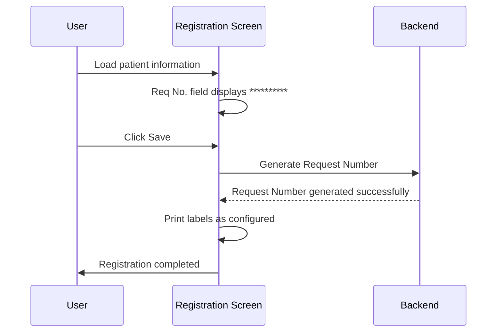
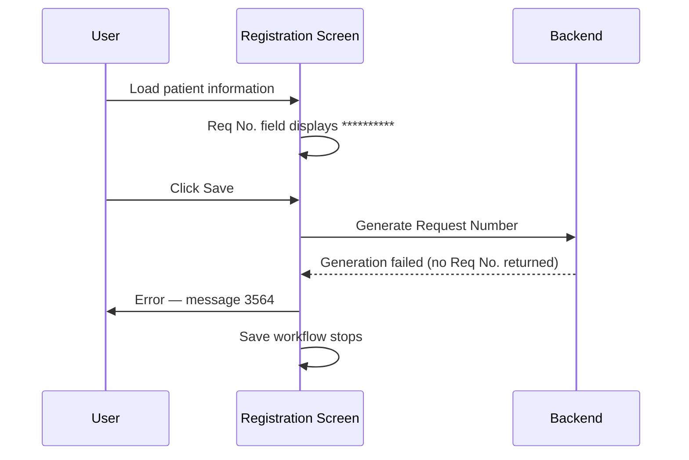

# Request No. Generation

## Overview

When the system is configured for automatic Request Number (Req No.) generation in Manual Registration, the system assigns a Request Number on behalf of the user at save time rather than requiring the user to type one manually. After patient information is loaded, the Request No. field displays a placeholder mask to indicate that the number will be generated automatically. When the user saves the registration, the system calls the backend to generate the actual Req No., prints a Request No. Label, and — if cross-check is enabled — prompts the user to scan the printed label to confirm the number before registration is completed. This feature reduces manual keying errors for Request Numbers and supports barcode label verification as a quality safeguard.

---

## Related User Stories

- **[[CRST-100]]** - Registration - Request No. Generation

**Epic:** LISP-24 [CRST][DEV] Registration - Request No.

---

## Key Concepts

### Request Number Display Mask
While the system is waiting to generate the actual Request Number at save time, the Req No. field displays `**********` (ten asterisks) as a placeholder. This mask is never sent to the backend as a real Request Number.

### Req No. Label
A printed barcode label bearing the generated Request Number. Printing occurs automatically as part of the save workflow when auto-generation is enabled.

### Cross-Check Request No. Dialogue
A confirmation panel that appears after the Req No. Label is printed. The user must scan or manually type the Request Number from the printed label into this panel. If the entered value matches the generated number, registration proceeds; if it does not match, an error is shown and registration is aborted for that request.

### Request Number Auto-Generation (isReqNumberAutoGenerated)
An internal save-time flag indicating that the Req No. for the current request was not pre-assigned by the user but is to be (or has been) generated by the backend. The system uses this flag to decide whether to call the generation service and whether to invoke the label print and cross-check steps.

---

## Trigger Point

This workflow begins after patient information has been successfully loaded into the Registration screen. The Request Number field is evaluated at that point to determine whether auto-generation mode is active. The actual generation of the number occurs when the user clicks **Save**.

---

## Workflow Scenarios

### Scenario 1: Auto-Generation Enabled — Successful Generation with Cross-Check

#### Prerequisites
- The `MANUAL_REG_AUTO_GEN_REQNO_ENABLED` option is enabled for the current lab.
- The patient has been loaded into the Registration screen (not via a 2D barcode e-form auto-fill path).
- The `ENABLE_CROSS_CHECK_REQNO` hospital setting is enabled, and USID is also enabled.

#### Process Flow

```mermaid
sequenceDiagram
    participant User
    participant Registration Screen
    participant Backend

    User->>Registration Screen: Load patient information
    Registration Screen->>Registration Screen: Req No. field displays **********
    User->>Registration Screen: Click Save
    Registration Screen->>Backend: Generate Request Number
    Backend-->>Registration Screen: Request Number generated successfully
    Registration Screen->>Registration Screen: Print Req No. Label
    Registration Screen->>User: Display Cross-Check Request No. Dialogue
    User->>Registration Screen: Scan or type Req No. from printed label
    alt Req No. matches
        Registration Screen->>Registration Screen: Mark label as printed; proceed
        Registration Screen->>User: Registration completed
    else Req No. does not match
        Registration Screen->>User: Error — "Request Number NOT match!"
        Registration Screen->>Registration Screen: Abort registration for this request
    end
```

#### Step-by-Step Details

1. The user loads a patient into the Registration screen. If auto-generation is enabled and the Req No. is not being auto-filled from a 2D barcode e-form, the **Req No.** field is set to `**********` (the display mask) and the system proceeds as if a Request Number has already been entered, skipping the normal manual entry step.

2. The user completes the rest of the registration details and clicks **Save**.

3. During the save sequence, the system detects that the Req No. is still showing the display mask and that auto-generation is needed. It calls the backend to generate a Request Number.

4. If the backend returns a Request Number successfully, the generated number is stored internally and the workflow continues.

5. The system prints the **Req No. Label** for the generated Request Number.

6. The **Cross-Check Request No. Dialogue** is displayed. This panel shows the tests being registered and contains an input field for the user to scan or type the Request Number from the printed label.

7. **If the entered value matches the generated Request Number:**
   - The label is flagged as printed and the cross-check is marked as successful.
   - Registration proceeds to completion.

8. **If the entered value does not match the generated Request Number:**
   - Error message **4103** ("Request Number NOT match!") is displayed.
   - The input field is cleared and focus is returned to it so the user can re-scan.
   - If the user cannot produce a matching scan, registration for that request is aborted.

---

### Scenario 2: Auto-Generation Enabled — Successful Generation without Cross-Check

#### Prerequisites
- The `MANUAL_REG_AUTO_GEN_REQNO_ENABLED` option is enabled for the current lab.
- The `ENABLE_CROSS_CHECK_REQNO` hospital setting is **not** enabled (or USID is not enabled).

#### Process Flow



#### Step-by-Step Details

1–4. Same as Scenario 1, steps 1–4.

5. Labels are printed as part of the standard save sequence. Because cross-check is not enabled, the Cross-Check Request No. Dialogue is not shown.

6. Registration proceeds directly to completion.

---

### Scenario 3: Auto-Generation Enabled — Generation Fails

#### Prerequisites
- The `MANUAL_REG_AUTO_GEN_REQNO_ENABLED` option is enabled for the current lab.
- The backend is unable to generate a Request Number (e.g., a sequence numbering error).

#### Process Flow



#### Step-by-Step Details

1–3. Same as Scenario 1, steps 1–3.

4. The backend returns an unsuccessful response or returns no Request Number. The Req No. field still shows the display mask.

5. Error message **3564** is displayed. The user is notified that Request Number generation has failed.

6. The save workflow does not proceed. The user must resolve the underlying issue before attempting to save again.

---

### Scenario 4: Auto-Generation Disabled

#### Prerequisites
- The `MANUAL_REG_AUTO_GEN_REQNO_ENABLED` option is **not** enabled for the current lab.

#### Step-by-Step Details

1. The user loads a patient into the Registration screen. The **Req No.** field is blank.

2. The user must manually type a valid Request Number into the Req No. field before saving.

3. The system validates the entered Request Number as part of the normal save sequence.

4. Registration proceeds when a valid Request Number is entered and all other validations pass.

---

## Summary Table

| Condition | Req No. Field on Load | Cross-Check Dialogue Shown | Label Printed |
|---|---|---|---|
| Auto-generation enabled, generation succeeds, cross-check enabled | `**********` | Yes | Yes (before cross-check) |
| Auto-generation enabled, generation succeeds, cross-check disabled | `**********` | No | Yes (as part of normal save) |
| Auto-generation enabled, generation fails | `**********` | No | No |
| Auto-generation disabled | Blank | No | As per standard label config |

---

## Error Messages

| Message | Description | Trigger | User Options |
|---|---|---|---|
| 3564 | Request Number generation failed | Backend returns no Req No. during save | Dismiss — save is aborted |
| 4103 | "Request Number NOT match!" | User's scanned/entered value does not match the generated Req No. | Re-scan or re-enter — input field is cleared and refocused |

---

## Data Sources

| Data | Source |
|---|---|
| Auto-generation setting | `LAB_OPTION` — option code `MANUAL_REG_AUTO_GEN_REQNO_ENABLED` |
| Cross-check setting | Hospital-level setting — option code `ENABLE_CROSS_CHECK_REQNO` (also requires USID to be enabled) |
| Generated Request Number | Returned by backend generation service at save time |

---

## Configuration

| Setting | Option Code | Purpose | Effect when enabled | Effect when disabled |
|---------|------------|---------|--------------------|--------------------|
| Auto-Generate Request No. in Manual Registration | `MANUAL_REG_AUTO_GEN_REQNO_ENABLED` | Controls whether the Req No. is auto-generated at save time instead of being manually entered by the user | Req No. field shows `**********` after patient load; Req No. is generated by backend on save | Req No. field is blank after patient load; user must enter a Req No. manually |
| Enable Cross-Check Request No. | `ENABLE_CROSS_CHECK_REQNO` | Controls whether the user must verify the generated Req No. by scanning the printed label | Cross-Check Request No. Dialogue is shown after label printing; mismatched input aborts registration | No cross-check is performed; registration proceeds after label printing |

> **Note:** Cross-check (`ENABLE_CROSS_CHECK_REQNO`) only takes effect when USID is also enabled in the hospital configuration. The option is stored in the `HOSP_SETTING` group, not the `REQUEST_REGISTRATION` group.

---

## Business Rules

1. The Req No. field displays the display mask (`**********`) immediately after patient information is loaded when auto-generation is enabled. This mask is never submitted to the backend as a real Request Number.
2. Request Number validation (format and existence checks) is skipped during the save sequence when auto-generation is enabled, because the field contains the display mask rather than a real number at validation time.
3. The system only attempts to generate a Request Number if the label has not already been printed for the current request (i.e., if a label was previously printed and the cross-check was successful, generation is not repeated).
4. The Req No. Label is printed before the Cross-Check Request No. Dialogue is shown. The user scans the label that has just been printed.
5. If the scanned/entered value does not match the generated Req No., the system shows an error, clears the input, and refocuses it so the user can try again. Registration does not proceed until the values match or the user abandons the workflow.
6. If generation fails (backend returns no Req No.), error 3564 is shown and the save workflow stops. The Req No. field remains showing the display mask.
7. The cross-check dialogue only applies to non-USID format Request Numbers. USID-format numbers bypass the cross-check even when `ENABLE_CROSS_CHECK_REQNO` is enabled.

---

## Related Workflows

- [[Retrieve Patient by HKID]] — Patient information must be successfully loaded before the Req No. field state is determined.
- [[Retrieve Patient by Encounter Number]] — Alternative patient load path; same Req No. auto-generation behaviour applies after patient is loaded.
- [[Default Request Info]] — Other request information defaults that are applied at the same point in the workflow as the Req No. auto-fill.
