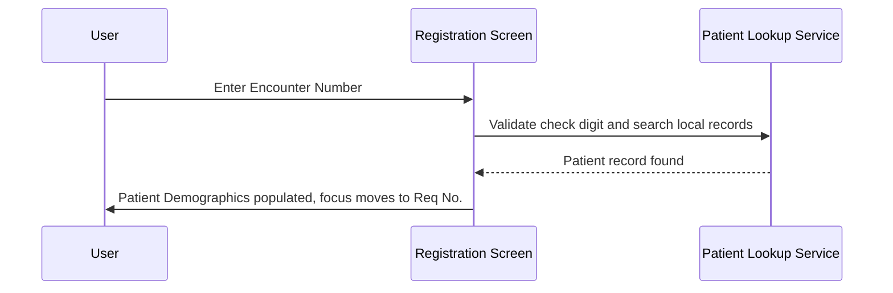
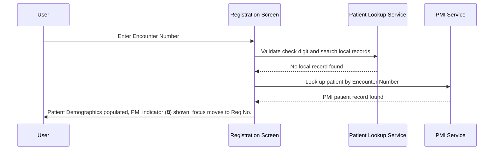
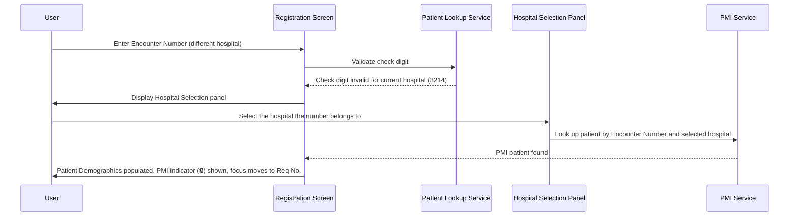
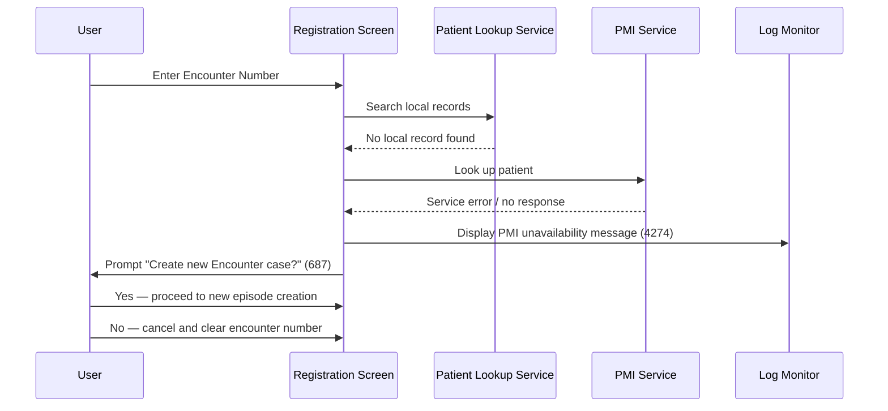

# Retrieve Patient by Encounter Number

## Overview

This workflow allows registration staff to look up an existing patient by entering their Encounter Number (Case No.) into the Registration screen. The system searches the local patient records first, and where configured, queries the Patient Master Index (PMI) service. If the patient is found, their demographic and episode information is loaded into the screen, ready for request entry. This is an alternative to HKID-based patient lookup and is particularly useful when the patient's identity card is not available.

---

## Related User Stories

- **[[CRST-96]]** - Registration - Retrieve Existing Local Patient by Case Number
- **[[CRST-97]]** - Registration - Retrieve Existing PMI Patient by Case Number

**Epic:** LISP-23 [CRST][DEV] Registration - Patient Handling

---

## Key Concepts

### Encounter Number (Case No.)
A hospital-assigned identifier that links a patient to a specific visit or admission episode. Each encounter number is hospital-specific — a number issued by one hospital is not valid at another. The system validates the format and check digit of the encounter number when it is entered.

### Hospital Matching
Because encounter numbers are hospital-specific, the system checks whether the entered number belongs to the currently active hospital context. If it does not, the user is prompted to select the hospital the number belongs to before the lookup can proceed.

### Local Patient Records
Patient records stored in the local laboratory system. The system checks these first before attempting a PMI query.

### Patient Master Index (PMI)
A hospital-wide patient registry shared across departments and facilities. Used as a fallback when a patient is not found in the local records. PMI access is optional and controlled by system configuration.

### PMI Patient Indicator
A visual lock indicator (🔒) displayed next to the HKID field whenever the patient's information was retrieved from PMI rather than local records. It is read-only and requires no user interaction.

### New Episode Creation
When no patient record can be found — either locally or via PMI — the user is offered the option to create a new episode, allowing registration to proceed by manually entering the patient's details.

---

## Trigger Point

This workflow begins when the registration staff enters an encounter number into the **Enc No.** field on the Registration screen. The system validates the number's format and check digit immediately on entry.

---

## PMI Configuration

Whether PMI features are available is controlled by a system-level configuration. This affects whether a PMI lookup is attempted when no local record is found.

| PMI Configuration State | PMI Lookup | Outcome When No Local Record |
|---|---|---|
| PMI enabled | Attempted automatically | PMI results shown, or new encounter offered if not found |
| PMI disabled or not configured | Not attempted | User offered option to create new encounter |

---

## Workflow Scenarios

### Scenario 1: Patient Found in Local Records

#### Prerequisites

- The entered encounter number has a valid check digit and belongs to the current hospital.
- A matching patient record exists in the local patient records.

#### Process Flow

#### Step-by-Step Details

1. **Encounter number entry and validation**
   The user types an encounter number into the **Enc No.** field. The system validates the check digit against the current hospital's format. If the check digit is invalid for the current hospital, the system displays error **3214** and opens the Hospital Selection panel (see [Scenario 3](#scenario-3-encounter-number-belongs-to-a-different-hospital)).

2. **Local patient record search**
   The system searches local patient records for a record matching the entered encounter number and the current hospital context.

3. **Patient HKID retrieved**
   The matching patient record is found. The patient's HKID is populated into the **HKID** field in the Patient Registration Key section.

4. **Patient demographics loaded**
   The system loads the patient's information into the **Patient Demographics** section of the Registration screen. The following fields are populated:
   - **Name**
   - **Name (Chinese)**
   - **Sex**
   - **Pay Code**
   - **Date of Birth**
   - **Age / Age Unit**
   - **Loc Hospital**
   - **Loc Specialty**
   - **Loc Ward/Clinic**
   - **Category**
   - **Bed**
   - **Admitted**
   - **MRN**
   - **Race**

5. **Field states after loading**
   All patient demographic fields become dimmed and non-editable. The user cannot modify the retrieved patient information. See [Field States After Patient Selection](#field-states-after-patient-selection) for the full table.

6. **Focus moves to Req No.**
   After all fields are populated, focus automatically moves to the **Req No.** field so the user can proceed with entering request details.

---

### Scenario 2: Patient Not in Local Records — PMI Lookup Succeeds

#### Prerequisites

- The entered encounter number has a valid check digit and belongs to the current hospital.
- No matching patient record exists in local patient records.
- PMI is enabled in system configuration and the PMI service is available.
- The patient record exists in PMI.

#### Process Flow

#### Step-by-Step Details

1. **Encounter number entry and validation**
   The user types an encounter number into the **Enc No.** field. The check digit is validated against the current hospital's format and passes.

2. **Local record search finds nothing**
   The system searches local patient records and finds no matching record for the entered encounter number at the current hospital.

3. **PMI lookup initiated**
   Because PMI is enabled and no local record was found, the system automatically queries the PMI service using the encounter number and current hospital context.

4. **PMI record found**
   The PMI service returns a complete patient record including the patient's HKID and demographics.

5. **Patient HKID populated**
   The patient's HKID retrieved from PMI is populated into the **HKID** field.

6. **Patient demographics loaded**
   The same demographic fields as Scenario 1 are populated with the PMI patient's information. All fields become dimmed and non-editable.

7. **PMI Patient Indicator displayed**
   A lock indicator (🔒) is shown next to the **HKID** field to indicate that the patient's data was retrieved from PMI, not from local records. This indicator is read-only.

8. **Focus moves to Req No.**
   Focus automatically moves to the **Req No.** field so the user can proceed.

---

### Scenario 3: Encounter Number Belongs to a Different Hospital

#### Prerequisites

- The entered encounter number has a check digit that does not validate for the current hospital.
- The encounter number is valid for a different hospital.
- PMI is enabled.

#### Process Flow

#### Step-by-Step Details

1. **Check digit validation fails for current hospital**
   The user enters an encounter number. The system determines the check digit is not valid for the current hospital. Error **3214** ("Invalid check digit for HKID/Encounter No.") is displayed.

2. **Hospital Selection panel opens**
   The system displays the **Hospital Selection** panel — a modal list of available hospitals. The user must identify which hospital the encounter number belongs to.

3. **User selects a hospital — four possible outcomes:**

   **Option A: User cancels**
   - The user clicks **Cancel** on the Hospital Selection panel.
   - The panel closes, the encounter number is cleared from the **Enc No.** field, and no patient is loaded.

   **Option B: User selects a hospital that does not match the encounter number**
   - The system re-validates the check digit against the selected hospital.
   - Validation fails. Error **3214** is displayed again.
   - The encounter number is cleared from the field.

   **Option C: User selects the correct hospital and PMI finds a record**
   - The system validates the check digit against the selected hospital — it passes.
   - The system queries the PMI service using the encounter number and the selected hospital.
   - The PMI service returns the patient record.
   - The patient's HKID and demographics are loaded as in Scenario 2 (Steps 5–8), including the PMI indicator (🔒).

   **Option D: User selects the correct hospital but patient is not in PMI**
   - The check digit passes for the selected hospital.
   - The PMI service finds no record for this encounter number.
   - The log monitor displays the PMI unavailability/not-found message (**Message 4274**).
   - Message **687** ("Create new Encounter case?") is shown to the user.
   - The user can choose **Yes** to create a new episode (see [New Episode Creation](#new-episode-creation)) or **No** to cancel and clear the encounter number.

---

### Scenario 4: PMI Service Unavailable

#### Prerequisites

- The entered encounter number passes check digit validation.
- No matching patient record exists in local patient records.
- PMI is enabled but the PMI service is unreachable or returns an error.

#### Process Flow

#### Step-by-Step Details

1. **Local record search finds nothing**
   The encounter number passes check digit validation. The system searches local patient records and finds no match.

2. **PMI service call fails**
   The system attempts to query the PMI service. The service does not respond or returns an error.

3. **Error message on log monitor**
   The system displays the following message on the log monitor:
   > "Due to the unavailability of PMI service, the system cannot retrieve patient details for entered Encounter Number at this moment."
   *(Message 4274)*

4. **User prompt**
   Message **687** ("Create new Encounter case?") is shown to the user with two options:
   - **Yes** — proceed to create a new episode (see [New Episode Creation](#new-episode-creation))
   - **No** — cancel the operation; the encounter number is cleared from the **Enc No.** field

---

## New Episode Creation

When the user confirms message **687** ("Create new Encounter case?") in any scenario, the following occurs:

1. The system displays the **Enter New Episode** panel — a modal dialogue for manual patient entry.
2. The user manually enters the patient details, including:
   - **HKID**
   - Episode date
   - Any required patient demographics
3. The system registers the patient as a new patient episode.
4. Focus moves to the **Req No.** field so registration can continue.

If the user clicks **No** on message **687**, the encounter number is cleared from the **Enc No.** field and no patient is loaded.

---

## Field States After Patient Selection

### Patient Demographics Fields

| Field | State After Selection | Editable | Notes |
|---|---|---|---|
| Name | Dimmed | No | Retrieved from patient or PMI records |
| Name (Chinese) | Dimmed | No | Retrieved from patient or PMI records |
| Sex | Dimmed | No | Retrieved from patient or PMI records |
| Date of Birth | Dimmed | No | Retrieved from patient or PMI records |
| Age | Dimmed | No | Calculated from Date of Birth |
| Age Unit | Dimmed | No | Calculated from Date of Birth |
| Loc Hospital | Dimmed | No | Retrieved from episode records |
| Loc Specialty | Dimmed | No | Retrieved from episode records |
| Loc Ward/Clinic | Dimmed | No | Retrieved from episode records |
| Bed | Dimmed | No | Retrieved from episode records |
| Admitted | Dimmed | No | Retrieved from episode records |
| Category | Dimmed | No* | See note below |
| MRN | Dimmed | No | Retrieved from patient records |
| Race | Dimmed | No | Retrieved from patient records |
| Pay Code | Dimmed | No | Retrieved from patient records |

> **Category field exception:** The Category field is editable only when all three conditions are met: the patient is new to the system, the "existing patient demographics disabled" setting is off, and the patient's category is currently unknown.

### Request Information Fields

| Field | State After Selection | Editable |
|---|---|---|
| HKID | Populated (auto-filled from record) | No |
| Encounter No. | Populated (as entered) | Yes |
| Req No. | Focused, empty | Yes |
| All other request fields | Enabled | Yes |

---

## Error and Message Reference

| Message Code | Text | Trigger | User Options |
|---|---|---|---|
| 3214 | Invalid check digit for HKID/Encounter No. | Check digit does not match current (or selected) hospital format | Re-enter number or select correct hospital |
| 4274 | PMI service unavailable message | PMI service unreachable, or patient not found in PMI | None — informational (shown on log monitor) |
| 687 | "Create new Encounter case?" | PMI not found or PMI unavailable after local lookup fails | Yes (create new episode) / No (cancel) |
| 1411 | Encounter number exceeds maximum length | Input too long | Correct and re-enter |

---

## Data Sources

| Data | Source |
|---|---|
| Patient demographics and episode data | Local patient records — queried on encounter number entry |
| PMI patient records | PMI service — queried when no local record is found (if PMI is enabled) |
| PMI availability | System configuration — checked at screen initialisation |
| Hospital list for selection panel | System-wide hospital configuration |

---

## Business Rules

1. The encounter number's check digit is validated immediately on entry. An invalid check digit for the current hospital triggers the Hospital Selection panel rather than blocking entry outright.
2. The system always checks local patient records before querying PMI. Local records take precedence.
3. Encounter numbers are hospital-specific. A number valid at one hospital is not valid at another; the check digit algorithm differs per hospital.
4. The Hospital Selection panel allows the user to specify which hospital the encounter number belongs to, enabling cross-hospital PMI lookup.
5. If the user selects a hospital from the Hospital Selection panel but the selected hospital still does not match the encounter number's check digit, error **3214** is shown and the encounter number is cleared.
6. When a patient's data is retrieved from PMI (not local records), the PMI Patient Indicator (🔒) must be displayed next to the HKID field to signal the data source to the user.
7. When PMI is unavailable or the patient is not found in PMI, the user must always be offered the option to create a new encounter (Message **687**) rather than leaving registration blocked.
8. Cancelling the Hospital Selection panel clears the encounter number from the field.
9. After a patient episode is selected or loaded, all patient demographic fields become dimmed and non-editable to preserve data integrity.
10. After patient data is loaded, focus automatically moves to the **Req No.** field to guide the user to the next step.

---

## Related Workflows

- [[Retrieve Patient by HKID]] — Alternative patient lookup using HKID instead of encounter number. Used when the patient's identity card is available.
- [[Create New Patient by HKID]] — Triggered when neither local records nor PMI contain the patient; registers a completely new patient.
- [[Patient Tag Alert]] — Evaluated after a patient is loaded, if the patient has tagged alert records.
- [[Default Patient Category]] — Describes how the Patient Category field is defaulted when a request number is assigned for the retrieved patient.
- [[Default Request Doctor]] — Describes how the Req Doctor field is defaulted when a request number is assigned; the patient's attending doctor retrieved here is the data source used by that workflow.
