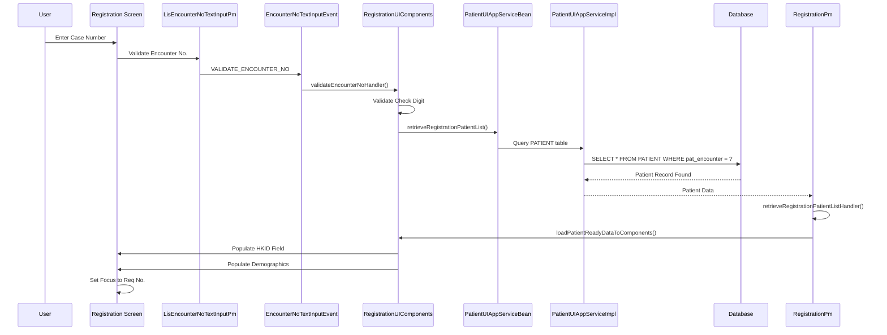
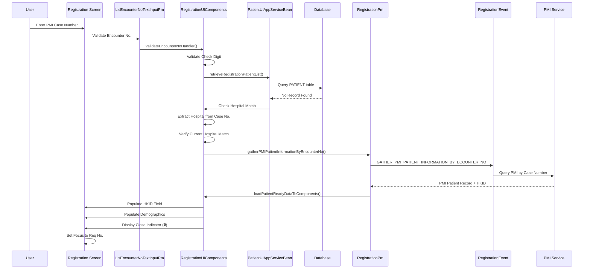
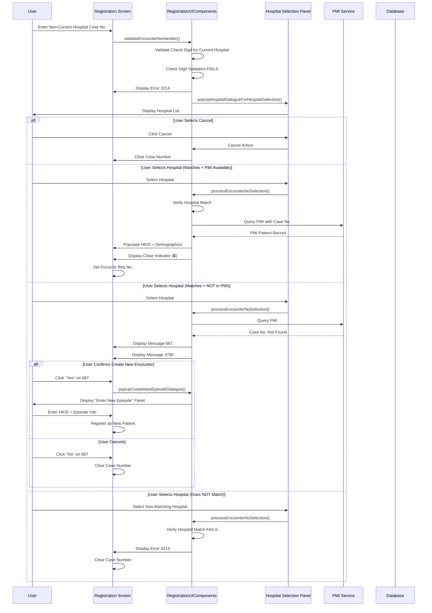
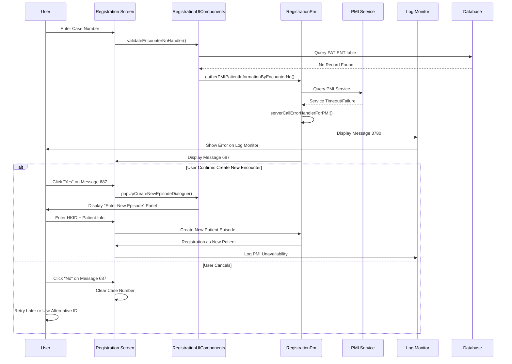

# Retrieve Patient by Encounter Number

## Overview

This workflow describes how the LIS system retrieves patient information when a user enters an Encounter Number (Case No.) in the Registration screen. The system supports retrieving both local patients (stored in the PATIENT table) and PMI (Patient Master Index) patients.

**Related User Stories:**
- [[CRST-96]] - Retrieve Existing Local Patient by Case Number
- [[CRST-97]] - Retrieve Existing PMI Patient by Case Number

**Entry Point:** Registration screen - Encounter No. (Enc No) field

**Purpose:** Enable registration staff to retrieve existing patient demographics by entering their case number, supporting both local hospital records and PMI integration.

---

## Key Concepts

### Encounter Number (Case No.)
- Hospital-specific patient identification number
- Stored in `PATIENT.pat_encounter` for local patients
- Available from PMI for patients with hospital encounters across the HA system
- Format includes check digit validation

### Local vs PMI Patients
- **Local Patient:** Patient record exists in the current hospital's PATIENT table
- **PMI Patient:** Patient record exists in the Patient Master Index but may not exist locally
- **Current Hospital:** The hospital context where the registration is being performed

### Hospital Matching
- Encounter numbers are hospital-specific
- System validates if entered case number belongs to current hospital
- Hospital panel prompts when case number doesn't match current hospital

---

## Workflow Scenarios

### Scenario 1: Retrieve Local Patient by Current Hospital Case Number

**Prerequisites:**
- Patient record exists in current hospital's PATIENT table
- Case number is valid for current hospital

**Trigger:** User enters case number in Enc No field

#### Process Flow



#### Step-by-Step Details

1. **Encounter Number Input & Validation**
   - User enters case number in Enc No field on Registration screen
   - `LisEncounterNoTextInputPm` component triggers validation
   - System dispatches `EncounterNoTextInputEvent.VALIDATE_ENCOUNTER_NO`

2. **Check Digit Validation**
   - `RegistrationUIComponents.validateEncounterNoHandler()` invoked
   - System validates check digit of case number
   - Check digit algorithm is hospital-specific
   - Validation confirms case number belongs to current hospital

3. **Local Patient Lookup**
   - System checks if case number exists in PATIENT table for current hospital
   - `PatientUIAppServiceBean.retrieveRegistrationPatientList()` called with:
     - `encNo` - The case number entered
     - `hospital` - Current hospital code
   - Query executed:
     ```sql
     SELECT * FROM PATIENT 
     WHERE pat_encounter = ? 
     AND pat_hospital = ?
     ```

4. **Retrieve Patient HKID**
   - System retrieves patient's HKID from `PATIENT.pat_pid`
   - `RegistrationPm.retrieveRegistrationPatientListHandler()` processes result
   - HKID field in Patient Registration Key is populated

5. **Load Patient Demographics**
   - `RegistrationUIComponents.loadPatientReadyDataToComponents()` executed
   - System loads patient demographics from PATIENT table:
     - **Name** = `PATIENT.pat_name`
     - **Name (in Chinese)** = `PATIENT.pat_cname`
     - **Sex** = `PATIENT.pat_sex`
     - **Pay Code** = `PATIENT.pat_type`
     - **DOB** = `PATIENT.pat_dob`
     - **Age** = `PATIENT.pat_age`
     - **Age Unit** = `PATIENT.pat_age_unit`
     - **Loc Hosp** = `PATIENT.pat_hospital`
     - **Loc Specialty** = `PATIENT.pat_unit`
     - **Loc Ward/Clinic** = `PATIENT.pat_location`
     - **Cat** = `PATIENT.pat_cat`
     - **Bed** = `PATIENT.pat_bed`
     - **Admitted** = `PATIENT.pat_adm_date`
     - **MRN** = `PATIENT.pat_mrn`
     - **Race** = `PATIENT.pat_race`

6. **Field State Management**
   - All patient demographic fields become:
     - **Visible** - displayed on screen
     - **Dimmed** - visually grayed out
     - **Non-editable** - user cannot modify

7. **Focus Management**
   - System sets focus to Request No. field
   - `RegistrationUIComponents.setDefaultFocusWhenRequestNoReadyToProceed()` called
   - User can proceed with test registration

**Result:** Patient demographics displayed, ready for test registration

---

### Scenario 2: Retrieve PMI Patient by Current Hospital Case Number

**Prerequisites:**
- Patient record does NOT exist in current hospital's PATIENT table
- Case number matches current hospital
- Patient exists in PMI List
- PMI service is available
- LAB_OPTION.PMI_ENABLED = 'Y'

**Trigger:** User enters PMI case number in Enc No field

#### Process Flow



#### Step-by-Step Details

1. **Encounter Number Input & Validation**
   - User enters case number in Enc No field
   - `LisEncounterNoTextInputPm` component triggers validation
   - System dispatches `EncounterNoTextInputEvent.VALIDATE_ENCOUNTER_NO`
   - `RegistrationUIComponents.validateEncounterNoHandler()` invoked

2. **Check Digit Validation**
   - System validates check digit of case number
   - Confirms format is valid for current hospital

3. **Local Patient Table Check**
   - System queries local PATIENT table:
     ```sql
     SELECT * FROM PATIENT 
     WHERE pat_encounter = ? 
     AND pat_hospital = ?
     ```
   - No record found in local table

4. **Hospital Code Extraction & Verification**
   - System extracts hospital code from case number format
   - Verifies case number hospital matches current hospital
   - If match fails, proceed to Scenario 3 (Hospital Selection Panel)

5. **PMI Configuration Check**
   - System checks LAB_OPTION table:
     ```sql
     SELECT option_value FROM LAB_OPTION 
     WHERE option_name = 'PMI_ENABLED' 
     AND hospital_code = ?
     ```
   - Confirms PMI is enabled (value = 'Y')

6. **Query PMI Service**
   - `RegistrationPm.gatherPMIPatientInformationByEncounterNo()` invoked
   - System dispatches `RegistrationEvent.GATHER_PMI_PATIENT_INFORMATION_BY_ECOUNTER_NO`
   - PMI service called with:
     - `encNo` - The case number
     - `hospital` - Current hospital code
   - Modified in: PMH-BBS-B-000068

7. **PMI Response Processing**
   - PMI service returns patient record including:
     - Patient HKID
     - Complete demographics
     - Episode information
   - `RegistrationPm` processes PMI response

8. **Populate HKID Field**
   - System populates HKID field in Patient Registration Key
   - HKID value retrieved from PMI patient record

9. **Load PMI Patient Demographics**
   - `RegistrationUIComponents.loadPatientReadyDataToComponents()` executed
   - System loads patient demographics from PMI:
     - **Name** = PMI patient name (English)
     - **Name (in Chinese)** = PMI patient name (Chinese)
     - **HKID** = PMI patient HKID
     - **Sex** = PMI patient sex
     - **Pay Code** = PMI patient type
     - **DOB** = PMI patient date of birth
     - **Age** = Calculated from DOB
     - **Age Unit** = Calculated age unit
     - **Loc Hosp** = Hospital from case number
     - **Loc Specialty** = PMI unit
     - **Loc Ward/Clinic** = PMI location
     - **Cat** = PMI patient category
     - **Bed** = PMI bed number
     - **Admitted** = PMI admission date
     - **MRN** = PMI medical record number
     - **Race** = PMI race code
     - **Address** = PMI address
     - **Contact information** = PMI phone/contact details

10. **Display Close Indicator**
    - System displays "Close Indicator" (🔒) next to HKID field
    - Indicates patient data retrieved from PMI (not local)
    - `RegistrationUIComponents.setCloseIndicatorForPmiPatient()` called
    - Visual indicator only - no user interaction

11. **Field State Management**
    - All patient demographic fields become:
      - **Visible** - displayed on screen
      - **Dimmed** - visually grayed out
      - **Non-editable** - user cannot modify
    - Close indicator (🔒) displayed

12. **Focus Management**
    - System sets focus to Request No. field
    - `RegistrationUIComponents.setDefaultFocusWhenRequestNoReadyToProceed()` called
    - User can proceed with test registration

**Result:** PMI patient demographics displayed with close indicator (🔒), ready for test registration

---

### Scenario 3: Non-Current Hospital Case Number - PMI Available

**Prerequisites:**
- Case number does NOT match current hospital
- User enters valid case number from another hospital
- PMI service is available

**Trigger:** User enters non-current hospital case number

#### Process Flow



#### Step-by-Step Details
#### Step-by-Step Details

1. **Encounter Number Input & Initial Validation**
   - User enters case number in Enc No field
   - `RegistrationUIComponents.validateEncounterNoHandler()` invoked
   - System validates check digit for current hospital
   - Validation fails (case number doesn't belong to current hospital)

2. **Display Error Message 3214**
   - System displays error: "Invalid check digit for HKID/Encounter No."
   - Error code: 3214
   - User is alerted that case number doesn't match current hospital

3. **Display Hospital Selection Panel**
   - `RegistrationUIComponents.popUpHospitalDialogueForHospitalSelection()` called
   - System displays modal Hospital Selection Panel
   - Panel contains:
     - List of all available hospitals
     - Hospital codes and names
     - "Cancel" button
   - Panel remains open until user action

4. **User Action: Select Hospital from Panel**

   **Option A: User Selects "Cancel"**
   - User clicks Cancel button on Hospital Panel
   - Panel closes
   - Case number cleared from Enc No field
   - User can re-enter case number or use alternative lookup

   **Option B: Selected Hospital Matches Case Number Hospital (PMI Available)**
   
   1. User selects hospital from panel that matches case number
   2. `RegistrationUIComponents.processEncounterNoSelection()` invoked with selected hospital
   3. System validates case number check digit against selected hospital
   4. Validation succeeds
   5. System checks LAB_OPTION for PMI configuration
   6. PMI is enabled
   7. System queries PMI service:
      - `RegistrationPm.gatherPMIPatientInformationByEncounterNo()` called
      - Dispatches `RegistrationEvent.GATHER_PMI_PATIENT_INFORMATION_BY_ECOUNTER_NO`
      - PMI query with case number and selected hospital
   8. PMI returns patient record with complete demographics
   9. System populates HKID field with PMI HKID
   10. System loads demographics from PMI to all patient fields
   11. System displays close indicator (🔒) next to HKID
   12. Focus moves to Request No. field
   13. User proceeds with registration
   
   **Result:** PMI patient retrieved successfully

   **Option C: Selected Hospital Matches but Case Number NOT on PMI List**
   
   1. User selects hospital from panel
   2. `RegistrationUIComponents.processEncounterNoSelection()` invoked
   3. System validates case number check digit - succeeds
   4. System queries PMI service
   5. PMI query fails - case number not found in PMI
   6. System displays **Message 687**: "Create new Encounter case?"
   7. System displays **Message 3780** on log monitor: "Due to the unavailability of PMI service, the system cannot retrieve patient details for entered HKID at this moment."
   8. User prompted for action:
      
      **Sub-Option C1: User Clicks "Yes"**
      - `RegistrationUIComponents.popUpCreateNewEpisodeDialogue()` called
      - System displays "Enter new episode" panel
      - User manually enters:
        - HKID
        - Episode date
        - Additional demographics as needed
      - `RegistrationUIComponents.createNewEncounterEpisode()` processes new episode
      - Modified in: CEO69621
      - Focus moves to Request No. field
      - Registration proceeds as new patient
      - System logs new episode creation
      
      **Sub-Option C2: User Clicks "No"**
      - User declines to create new encounter
      - Case number cleared from Enc No field
      - User returns to registration screen
      - Can retry with different case number
   
   **Result:** New patient episode created OR operation cancelled

   **Option D: Selected Hospital Does NOT Match Case Number Hospital**
   
   1. User selects hospital that doesn't match case number's hospital
   2. `RegistrationUIComponents.processEncounterNoSelection()` invoked
   3. System validates case number check digit against selected hospital
   4. Validation fails
   5. System displays **Error 3214**: "Invalid check digit for HKID/Encounter No."
   6. Case number cleared from Enc No field
   7. User must re-enter correct case number
   
   **Result:** Error displayed, case number cleared

**Result:** Varies based on user selection - PMI patient retrieved, new patient created, or entry cancelled

---

### Scenario 4: PMI Service Unavailable

**Prerequisites:**
- Case number entered
- PMI service is down or unreachable
- Case number not found in local PATIENT table

**Trigger:** User enters case number when PMI unavailable

#### Process Flow



#### Step-by-Step Details

1. **Encounter Number Input**
   - User enters case number in Enc No field
   - `RegistrationUIComponents.validateEncounterNoHandler()` invoked
   - System validates check digit

2. **Local PATIENT Table Check**
   - System queries local PATIENT table
   - Query returns no results (patient not found locally)

3. **Attempt PMI Service Query**
   - `RegistrationPm.gatherPMIPatientInformationByEncounterNo()` called
   - System dispatches `RegistrationEvent.GATHER_PMI_PATIENT_INFORMATION_BY_ECOUNTER_NO`
   - PMI service call initiated

4. **PMI Service Failure Detection**
   - PMI service fails to respond or times out
   - Network connectivity issues OR
   - PMI service is down OR
   - PMI service returns error
   - `RegistrationPm.serverCallErrorHandlerForPMI()` invoked
   - Error handler added in: PMH-BBS-B-000068

5. **Display Error Message 3780**
   - System displays **Message 3780** on log monitor:
     > "Due to the unavailability of PMI service, the system cannot retrieve patient details for entered HKID at this moment."
   - Message visible to user on log monitor panel
   - Indicates PMI service issue

6. **Prompt User for Action - Message 687**
   - System displays **Message 687** to user:
     > "Create new Encounter case?"
   - User must decide how to proceed

7. **User Action: Confirm or Cancel**

   **Option A: User Clicks "Yes" - Create New Encounter**
   
   1. User confirms creation of new encounter
   2. `RegistrationUIComponents.popUpCreateNewEpisodeDialogue()` called
   3. System displays "Enter new episode" panel
   4. Panel fields:
      - HKID (manual entry required)
      - Episode date
      - Patient demographics fields
   5. User manually enters patient information:
      - HKID
      - Name (English/Chinese)
      - Sex
      - Date of Birth
      - Other required demographics
   6. `RegistrationUIComponents.createNewEncounterEpisode()` processes entry
   7. System creates new patient record locally
   8. Registration proceeds as **new patient**
   9. System logs PMI unavailability in system log
   10. Focus moves to Request No. field
   11. User proceeds with test registration
   
   **Result:** New patient episode created, registration continues

   **Option B: User Clicks "No" - Cancel Operation**
   
   1. User declines to create new encounter
   2. Case number cleared from Enc No field
   3. Focus returns to Enc No field
   4. User options:
      - Retry case number entry later (when PMI available)
      - Use alternative patient identification (HKID lookup)
      - Wait for PMI service restoration
   
   **Result:** Operation cancelled, user can retry

**Result:** User creates new patient record or cancels operation

---

## Technical Implementation

### Frontend Components

**File:** `RegistrationUIComponents.as`

**Key Components:**
- `encNoPm: LisEncounterNoTextInputPm` - Encounter number input field
- `hkidTextInputPm: LisHkidTextInputPm` - HKID input field with close indicator
- `patientNamePm: LisTextInputPm` - Patient name field
- `patientLocationPm: LisLocationTextInputPm` - Patient location

**Key Methods:**

1. **`validateEncounterNoHandler(event:Event):void`**
   - Triggered when user enters case number
   - Validates check digit
   - Initiates patient retrieval

2. **`popUpHospitalDialogueForHospitalSelection():void`**
   - Displays Hospital Selection Panel
   - Called when case number doesn't match current hospital
   - Handles user hospital selection

3. **`processEncounterNoSelection(hospital:HospitalVo):void`**
   - Processes hospital selection from panel
   - Validates case number against selected hospital
   - Calls PMI or displays error messages

4. **`createNewEncounterEpisode():void`**
   - Handles creation of new patient episode
   - Called when user confirms creating new encounter (message 687)
   - Displays "Enter new episode" panel

5. **`popUpCreateNewEpisodeDialogue():void`**
   - Displays dialogue for entering new episode information
   - Allows manual HKID entry
   - Modified in: CEO69621

6. **`loadPatientReadyDataToComponents():void`**
   - Loads retrieved patient data into UI components
   - Sets close indicator for PMI patients
   - Sets focus to Request No. field

7. **`setCloseIndicatorForPmiPatient():void`**
   - Displays 🔒 indicator for PMI patients
   - Indicates patient data comes from PMI

### Backend Services

**File:** `PatientUIAppServiceBean.java` / `PatientUIAppServiceImpl.java`

**Key Methods:**

1. **`retrieveRegistrationPatientList(String encNo, String hospital)`**
   - Searches local PATIENT table by encounter number
   - Returns patient list if found locally

2. **`gatherPMIPatientInformationByEncounterNo(String encNo, String hospital)`**
   - Queries PMI service with encounter number
   - Returns PMI patient demographics
   - Handles PMI service failures

3. **`validateEncounterNo(String encNo, String hospital)`**
   - Validates encounter number check digit
   - Verifies hospital matching

4. **`checkPMIAvailability()`**
   - Checks if PMI service is operational
   - Returns service status

### Presentation Model

**File:** `RegistrationPm.as`

**Key Methods:**

1. **`retrieveRegistrationPatientList(String hkid, Function successCallback, Function errorCallback)`**
   - Orchestrates patient retrieval workflow
   - Handles both local and PMI lookups
   - Modified in: LIS-9975

2. **`gatherPMIPatientInformationByEncounterNo(String encNo, Function callback)`**
   - Initiates PMI query by encounter number
   - Processes PMI response
   - Modified in: PMH-BBS-B-000068

3. **`retrieveRegistrationPatientListHandler(event:ResponseObject):void`**
   - Handles patient retrieval response
   - Determines if local or PMI patient
   - Loads data to UI components
   - Modified in: LIS-9975

4. **`serverCallErrorHandlerForPMI(event:FaultEvent):void`**
   - Handles PMI service errors
   - Displays appropriate error messages
   - Modified in: PMH-BBS-B-000068

### Events Managed

**Events Dispatched:**
- `RegistrationEvent.RETRIEVE_REGISTRATION_PATIENT_LIST` - Trigger patient retrieval
- `RegistrationEvent.GATHER_PMI_PATIENT_INFORMATION_BY_ECOUNTER_NO` - Query PMI by case number
- `EncounterNoTextInputEvent.VALIDATE_ENCOUNTER_NO` - Validate encounter number

**Events Handled:**
- `EncounterNoTextInputEvent.ENCOUNTER_NO_VALIDATED` - Check digit validated
- `RegistrationEvent.PATIENT_LIST_RETRIEVED` - Patient data received

---

## Configuration Requirements

### System Parameters

**LAB_OPTION Table:**
- `PMI_ENABLED` - Controls PMI integration (Y/N)
- `PMI_SERVICE_URL` - PMI service endpoint
- `PMI_TIMEOUT` - Service timeout in seconds

**Hospital Configuration:**
- Each hospital has unique code prefix for case numbers
- Case number format defined per hospital
- Check digit algorithm configured per hospital

---

## Error Handling

### Error Code 3214: Invalid Check Digit

**Message:** "Invalid check digit for HKID/Encounter No."

**Scenarios:**
1. User enters case number with invalid check digit
2. User enters case number from non-current hospital
3. Selected hospital doesn't match case number hospital

**System Response:**
- Display error message
- Open Hospital Selection Panel (scenarios 2-3)
- Clear case number from field (after invalid hospital selection)

### Error Code 687: Create New Encounter Case

**Message:** "Create new Encounter case?"

**Scenarios:**
1. Case number not found in PMI
2. Selected hospital matches case number but no PMI record
3. PMI service unavailable

**System Response:**
- Prompt user for confirmation
- Yes: Display "Enter new episode" panel
- No: Clear case number field

### Error Code 3780: PMI Service Unavailable

**Message:** "Due to the unavailability of PMI service, the system cannot retrieve patient details for entered HKID at this moment."

**Scenarios:**
1. PMI service is down
2. PMI service timeout
3. Network connectivity issues

**System Response:**
- Display error message
- Prompt message 687 for new encounter
- Log PMI service failure

### Error Code 1411: Invalid Encounter Number Length

**Message:** Custom message for encounter number length validation

**Scenario:** User enters case number exceeding maximum length

**System Response:**
- Display error message
- Prevent further input

---

## Database Schema Reference

### PATIENT Table

**Key Columns:**
- `pat_encounter` - Encounter number (case no.)
- `pat_hkid` - Patient HKID
- `pat_hospital` - Hospital code
- `pat_eng_name` - Patient English name
- `pat_chi_name` - Patient Chinese name
- `pat_dob` - Date of birth
- `pat_sex` - Gender
- `pat_address` - Address
- `pat_phone` - Phone number

**Query Pattern:**
```sql
SELECT * FROM PATIENT 
WHERE pat_encounter = ? 
AND pat_hospital = ?
```

### LAB_OPTION Table

**Key Columns:**
- `option_name` - Configuration parameter name
- `option_value` - Configuration value
- `hospital_code` - Hospital-specific configuration

**PMI Configuration:**
```sql
SELECT option_value FROM LAB_OPTION 
WHERE option_name = 'PMI_ENABLED' 
AND hospital_code = ?
```

---

## User Interface Elements

### Encounter No. Field
- **Location:** Patient Panel (top section)
- **Type:** Text input with check digit validation
- **Format:** Hospital-specific (e.g., 12345678-9)
- **Validation:** Real-time check digit validation
- **Tab Order:** After HKID field, before Request No. field

### Hospital Selection Panel
- **Type:** Modal dialogue
- **Content:** List of available hospitals
- **Actions:** Select hospital, Cancel
- **Appears When:** Case number doesn't match current hospital

### Enter New Episode Panel
- **Type:** Modal dialogue
- **Fields:** 
  - HKID (manual entry)
  - Episode date
  - Additional demographics
- **Actions:** Confirm, Cancel
- **Appears When:** User confirms creating new encounter

### Close Indicator (🔒)
- **Location:** Next to HKID field
- **Meaning:** Patient data retrieved from PMI
- **Behavior:** Read-only indicator, no user interaction

---

## Test Scenarios

### Test 1: Valid Local Patient Retrieval
**Given:** Patient exists in current hospital PATIENT table
**When:** User enters valid case number
**Expected:** 
- Patient demographics populate
- Focus moves to Request No. field
- No error messages

### Test 2: Valid PMI Patient Retrieval (Current Hospital)
**Given:** 
- Patient NOT in local PATIENT table
- Patient exists in PMI for current hospital
- PMI service available
**When:** User enters valid PMI case number
**Expected:**
- Patient demographics populate from PMI
- Close indicator (🔒) displays
- Focus moves to Request No. field

### Test 3: Non-Current Hospital Case Number (PMI Available)
**Given:**
- Case number from different hospital
- Patient exists in PMI
**When:** 
- User enters case number
- Selects matching hospital from panel
**Expected:**
- Error 3214 displays initially
- Hospital panel opens
- After hospital selection: PMI patient retrieved
- Close indicator displays

### Test 4: Non-Current Hospital Case Number (NOT in PMI)
**Given:**
- Case number from different hospital
- Patient NOT in PMI
**When:**
- User enters case number
- Selects matching hospital
**Expected:**
- Error 3214 displays
- Hospital panel opens
- Error 687 displays
- Error 3780 displays
- Enter new episode panel available

### Test 5: Invalid Hospital Selection
**Given:**
- Case number entered
- Hospital panel displayed
**When:** User selects hospital that doesn't match case number
**Expected:**
- Error 3214 displays
- Case number cleared from field

### Test 6: Cancel Hospital Selection
**Given:** Hospital panel displayed
**When:** User clicks Cancel
**Expected:**
- Panel closes
- Case number cleared from field

### Test 7: PMI Service Unavailable
**Given:** PMI service is down
**When:** User enters PMI case number
**Expected:**
- Error 3780 displays
- Error 687 displays
- Option to create new encounter

### Test 8: Create New Encounter - Confirm
**Given:** Error 687 displayed
**When:** User clicks "Yes"
**Expected:**
- "Enter new episode" panel displays
- User can manually enter HKID
- Registration proceeds as new patient

### Test 9: Create New Encounter - Cancel
**Given:** Error 687 displayed
**When:** User clicks "No"
**Expected:**
- Case number cleared from field
- Focus returns to Enc No field

### Test 10: Invalid Check Digit
**Given:** User enters case number with invalid check digit
**When:** User tabs out of Enc No field
**Expected:**
- Error 3214 displays
- Case number cleared or validation fails

### Test 11: Empty Encounter Number
**Given:** Enc No field is empty
**When:** User tabs to next field
**Expected:**
- No error (optional field)
- Focus moves normally

### Test 12: Case Number with Extra Characters
**Given:** User enters case number exceeding max length
**When:** User continues typing
**Expected:**
- Error 1411 displays
- Input prevented beyond max length

---

## Business Rules

1. **Local Priority:** System always checks local PATIENT table before querying PMI
2. **Hospital Matching:** Case numbers are hospital-specific and must match hospital context
3. **PMI Indicator:** Close indicator (🔒) MUST display for all PMI-retrieved patients
4. **Focus Management:** After successful retrieval, focus MUST move to Request No. field
5. **New Patient Default:** When creating new encounter, system registers as new patient
6. **Error Recovery:** Users can cancel any error dialogue to retry case number entry
7. **Data Source Priority:** Local data takes precedence over PMI data when available
8. **Service Degradation:** System remains operational when PMI unavailable (manual entry)

---

## Related Documentation

- [[_Registration_Overview]] - Main Registration screen layout
- [[LisEncounterNoTextInputPm]] - Encounter number component
- [[LisHkidTextInputPm]] - HKID input component
- [[Retrieve Patient by HKID]] - Alternative patient retrieval workflow
- [[PMI Integration]] - Patient Master Index integration details
- [[Create New Episode]] - New patient episode creation workflow

---

## Modification History

| Date | Developer | Reference | Changes |
|------|-----------|-----------|---------|
| 27 Jun 2014 | Rock Yu | CEO69621 | Amended constructComponents |
| 10 Nov 2014 | Rock Yu | PMH-BBS-B-000068 | Added serverCallErrorHandlerForPMI |
| 27 May 2025 | Tony Chong | LIS-9975 | Amended retrieveRegistrationPatientListHandler |

---

## Notes

- The workflow supports both barcode scanning and manual entry of case numbers
- Hospital Selection Panel is critical for cross-hospital case number handling
- PMI integration requires LAB_OPTION configuration: PMI_ENABLED = 'Y'
- Check digit algorithm varies by hospital configuration
- Close indicator (🔒) is visual only - no user interaction required
- Error messages 687, 3214, and 3780 are key to understanding workflow failures
- System maintains audit trail of PMI queries and service failures
