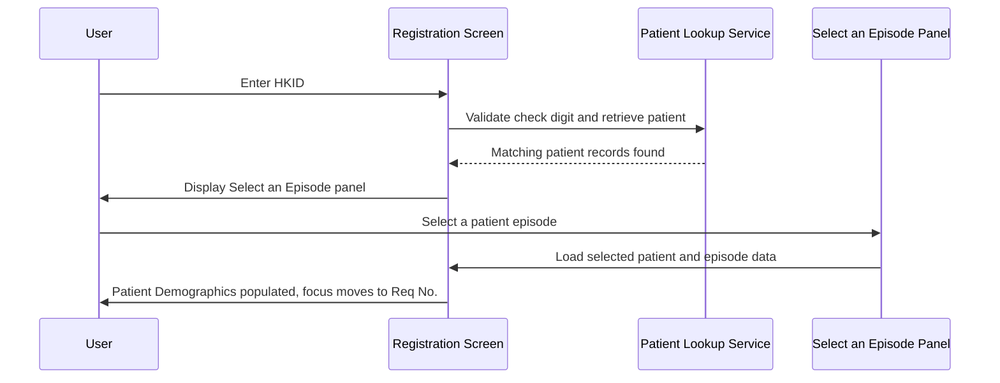
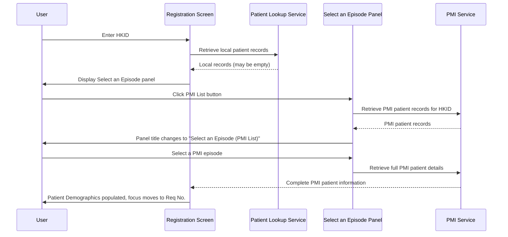
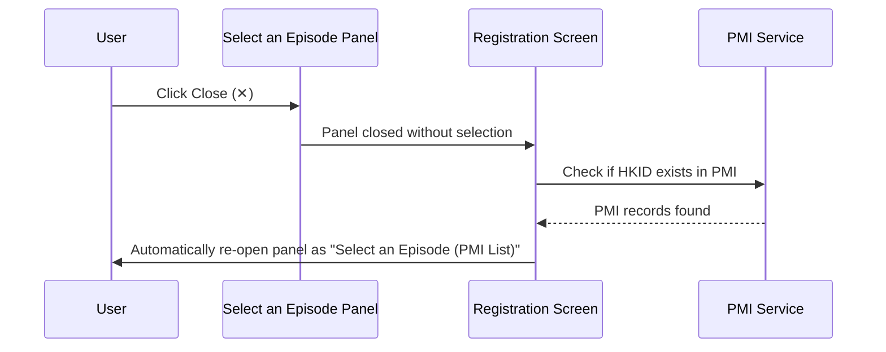
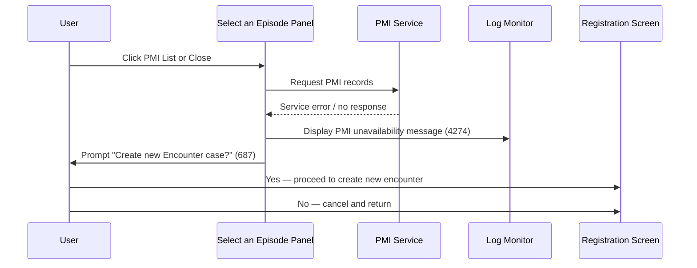

# Retrieve Patient by HKID

## Overview

This workflow allows registration staff to look up an existing patient using their Hong Kong Identity Card (HKID) number. When an HKID is entered, the system searches the local patient records and, where configured, the hospital-wide Patient Master Index (PMI). The retrieved patient's demographic and episode information is loaded into the Registration screen, ready for request entry. This workflow is the primary method for identifying an existing patient at registration time.

---

## Related User Stories

- **[[CRST-92]]** - Registration - Retrieve Existing Patient by HKID
- **[[CRST-93]]** - Registration - Retrieve PMI Patient by HKID
- **[[CRST-492]]** - Registration - Patient Selection Dialogue

**Epic:** LISP-23 [CRST][DEV] Registration - Patient Handling

---

## Key Concepts

### Patient Master Index (PMI)
A hospital-wide patient registry that holds patient records across multiple departments and facilities. PMI access is optional and controlled by system configuration. When enabled, it allows staff to retrieve patients who may not yet have a record in the local laboratory patient table.

### Episode / Encounter
A single visit or admission of a patient. One patient (identified by HKID) may have multiple episodes. Registration staff must select the correct episode before proceeding with a request.

### Local Patient Records
Patient records stored in the local laboratory system. These are the primary data source when PMI is not configured or not available.

### Generate Computer Encounter
A function that creates a new system-generated encounter number for a patient who does not have an existing active episode. Available within the Select an Episode panel.

### HKID Check Digit
The last character of a Hong Kong Identity Card number, used to verify the number was entered correctly. The system validates this automatically when the HKID is entered.

---

## Trigger Point

This workflow begins when the registration staff enters a valid HKID number into the **HKID** field on the Registration screen. The system immediately validates the check digit and initiates the patient lookup.

---

## PMI Configuration

Whether PMI features are available is controlled by a system-level configuration. This affects the visibility and availability of the **PMI List** button throughout this workflow.

| PMI Configuration State | PMI List Button | PMI Access |
|---|---|---|
| PMI enabled | Visible and enabled on Select an Episode panel | Available |
| PMI disabled or not configured | Hidden | Not available — local records only |

---

## Workflow Scenarios

### Scenario 1: Retrieve Patient from Local Records

#### Prerequisites

- The entered HKID has a valid check digit.
- At least one patient record exists in the local patient records matching the entered HKID.

#### Process Flow

#### Step-by-Step Details

1. **HKID entry and validation**
   The user types a valid HKID into the **HKID** field. The system automatically validates the check digit. If the check digit is invalid, an error message is displayed and the user cannot proceed until a valid HKID is entered.

2. **Patient record search**
   The system searches the local patient records for all records matching the entered HKID. Both the patient's demographic records and associated episode records are retrieved.

3. **Display Select an Episode panel**
   A modal panel titled **"Select an Episode"** is displayed, listing all matching patient episodes. Each row in the list shows:
   - HKID
   - Encounter No.
   - Hospital
   - Unit
   - Location
   - Name
   - Sex
   - Age / Age Unit
   - Date of Birth
   - Admission Date
   - MRN
   - Category
   - Type
   - Bed
   - Discharge Date
   - Death indicator / Death Date
   - Confidential indicator
   - Address

   The panel provides the following actions:
   - **Generate Computer Encounter** — creates a new system-generated encounter number
   - **PMI List** — visible and enabled only if PMI is configured (see [PMI Configuration](#pmi-configuration))
   - **Close** — closes the panel without selecting a patient

4. **Episode selection**
   The user selects the desired episode from the list. The **Encounter No.** field on the Registration screen is populated with the selected episode's encounter number.

5. **Patient demographics loaded**
   The system loads the selected patient's information into the **Patient Demographics** section of the Registration screen. The following fields are populated:
   - **Name**
   - **Name (Chinese)**
   - **Sex**
   - **Pay Code**
   - **Date of Birth**
   - **Age / Age Unit**
   - **Loc Hospital**
   - **Loc Specialty**
   - **Loc Ward/Clinic**
   - **Category**
   - **Bed**
   - **Admitted**
   - **MRN**
   - **Race**

6. **Field states after loading**
   All patient demographic fields become dimmed and non-editable. The user cannot modify the retrieved patient information. See [Field States After Patient Selection](#field-states-after-patient-selection) for the complete table.

7. **Focus moves to Req No.**
   After the patient data is loaded, focus automatically moves to the **Req No.** field so the user can proceed with entering request details.

---

### Scenario 2: Retrieve Patient from PMI

#### Prerequisites

- PMI is enabled in system configuration.
- The **PMI List** button is visible on the Select an Episode panel.
- The user either:
  - Enters an HKID that exists in PMI but has no local records, or
  - Wishes to retrieve PMI records for a patient who does have local records.

#### Process Flow

#### Step-by-Step Details

1. **PMI List access**
   From the **Select an Episode** panel, the user clicks the **PMI List** button. The system initiates a query to the PMI service for records matching the entered HKID.

2. **PMI records displayed**
   The panel title changes to **"Select an Episode (PMI List)"**. The list is refreshed to show PMI patient episodes. The same episode columns are shown as in Scenario 1. The panel provides:
   - **Generate Computer Encounter** — visible and enabled
   - **Cancel** — visible and enabled
   - **Close** — available

3. **PMI episode selection**
   The user selects the desired PMI episode from the list. The system retrieves the full patient details from the PMI service.

4. **Patient demographics loaded**
   The same fields are populated as in Scenario 1 (Step 5). All fields become dimmed and non-editable. Focus moves to the **Req No.** field.

---

### Scenario 3: Close Indicator Behaviour When PMI Patient Exists

#### Prerequisites

- PMI is enabled in system configuration.
- The user has the **Select an Episode** panel open (showing local records).
- The entered HKID exists in the PMI system.

#### Process Flow

#### Step-by-Step Details

1. **User closes the local episode panel**
   The user clicks the **Close** (✕) indicator on the **Select an Episode** panel without selecting a record.

2. **System checks PMI**
   The system checks whether the entered HKID has records in the PMI system.

3. **If PMI records exist**
   The system automatically retrieves the PMI episodes and re-opens the panel with the title **"Select an Episode (PMI List)"**, presenting the PMI records for the user to choose from.

4. **If PMI records do not exist**
   - A message is displayed on the log monitor indicating PMI records were not found for this HKID.
   - Message **687** ("Create new Encounter case?") is prompted to the user.
   - The user can choose to create a new encounter (see [[Create New Episode]]) or cancel.

> **Note:** Clicking the **PMI List** button has the same effect as clicking Close when PMI is enabled — it closes the local episode panel and triggers the PMI lookup through the same path.

---

### Scenario 4: PMI Service Unavailable

#### Prerequisites

- PMI is enabled in system configuration.
- The PMI service is unreachable or returns an error at the time of the request.

#### Process Flow

#### Step-by-Step Details

1. **PMI service call fails**
   When the user attempts to access PMI records (via the PMI List button or the Close indicator), the PMI service does not respond or returns an error.

2. **Error message on log monitor**
   The system displays the following message on the log monitor:
   > "Due to the unavailability of PMI service, the system cannot retrieve patient details for entered HKID at this moment."
   *(Message 4274)*

3. **User prompt**
   Message **687** ("Create new Encounter case?") is shown to the user with two options:
   - **Yes** — proceed to create a new encounter for this patient (see [[Create New Episode]])
   - **No** — cancel the operation and return to the Registration screen

4. **Fallback behaviour**
   The system falls back to local patient records only. PMI records remain inaccessible for this request.

---

## Field States After Patient Selection

### Patient Demographics Fields

| Field | State After Selection | Editable | Notes |
|---|---|---|---|
| Name | Dimmed | No | Retrieved from patient records |
| Name (Chinese) | Dimmed | No | Retrieved from patient records |
| Sex | Dimmed | No | Retrieved from patient records |
| Date of Birth | Dimmed | No | Retrieved from patient records |
| Age | Dimmed | No | Calculated from Date of Birth |
| Age Unit | Dimmed | No | Calculated from Date of Birth |
| Loc Hospital | Dimmed | No | Retrieved from episode records |
| Loc Specialty | Dimmed | No | Retrieved from episode records |
| Loc Ward/Clinic | Dimmed | No | Retrieved from episode records |
| Bed | Dimmed | No | Retrieved from episode records |
| Admitted | Dimmed | No | Retrieved from episode records |
| Category | Dimmed | No* | See note below |
| MRN | Dimmed | No | Retrieved from patient records |
| Race | Dimmed | No | Retrieved from patient records |
| Pay Code | Dimmed | No | Retrieved from patient records |

> **Category field exception:** The Category field is editable only when all three conditions are met: the patient is new to the system, the "existing patient demographics disabled" setting is off, and the patient's category is currently unknown.

### Request Information Fields

| Field | State After Selection | Editable |
|---|---|---|
| Encounter No. | Populated (auto-filled) | Yes |
| Req No. | Focused, empty | Yes |
| All other request fields | Enabled | Yes |

---

## Error and Message Reference

| Message Code | Text | Trigger | User Options |
|---|---|---|---|
| *(HKID check digit error)* | Invalid HKID check digit | Invalid check digit entered | Correct and re-enter HKID |
| 4274 | PMI service unavailable message | PMI service unreachable | None — informational |
| 687 | "Create new Encounter case?" | PMI not found or PMI unavailable | Yes / No |

---

## Data Sources

| Data | Source |
|---|---|
| Patient demographics and episode list | Local patient records — queried on HKID entry |
| PMI patient records | PMI service — queried on PMI List button click or Close indicator (when PMI is enabled) |
| PMI availability | System configuration — checked at screen initialisation |
| Merged HKID records | Local patient records — checked as part of the HKID lookup |

---

## Business Rules

1. The HKID check digit is validated before any patient lookup is performed. An invalid check digit prevents the search from proceeding.
2. A patient may have multiple episodes. The user must always select a specific episode before patient data is loaded into the Registration screen.
3. The **PMI List** button is visible and accessible only when PMI is enabled in system configuration. When PMI is disabled, only local patient records are available.
4. Clicking the Close indicator on the **Select an Episode** panel (local records) and clicking the **PMI List** button produce the same outcome when PMI is enabled: both trigger a PMI lookup for the entered HKID.
5. When PMI records are found after closing the local episode panel, the system automatically re-opens the panel in PMI mode without requiring further action from the user.
6. When PMI is unavailable, the system always prompts the user with the option to create a new encounter (Message 687) after displaying the unavailability notice (Message 4274).
7. After a patient episode is selected, all patient demographic fields become dimmed and non-editable to preserve data integrity.
8. The Category field is the only patient demographic field that may be editable after selection, and only under specific conditions (new patient, demographics editing allowed, unknown category).
9. After patient data is loaded, the system automatically moves focus to the **Req No.** field to guide the user to the next step.

---

## Related Workflows

- [[Retrieve Patient by Encounter Number]] — Alternative patient lookup using encounter/case number instead of HKID.
- [[Create New Patient by HKID]] — Triggered when the entered HKID is not found in local records or PMI; allows registration of a brand new patient.
- [[Create New Episode]] — Triggered when a patient is found but no suitable episode exists, or when PMI is unavailable and the user chooses to create a new encounter.
- [[Patient Tag Alert]] — Evaluated immediately after a patient is loaded, if the patient has tagged alert records.
- [[Default Patient Category]] — Describes how the Patient Category field is defaulted when a request number is assigned for the retrieved patient.
- [[Default Request Doctor]] — Describes how the Req Doctor field is defaulted when a request number is assigned; the patient's attending doctor retrieved here is the data source used by that workflow.
- [[Default Request Location]] — Describes how the Request Specialty and Request Location fields are defaulted at the same request number assignment event; the patient's location retrieved here is the data source used by that workflow.