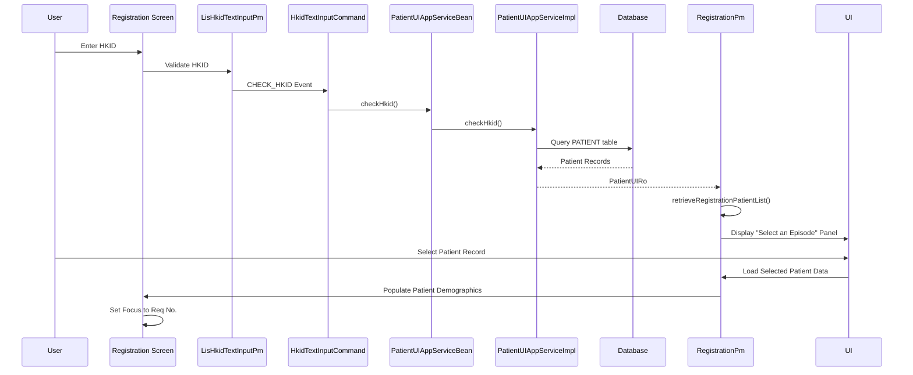
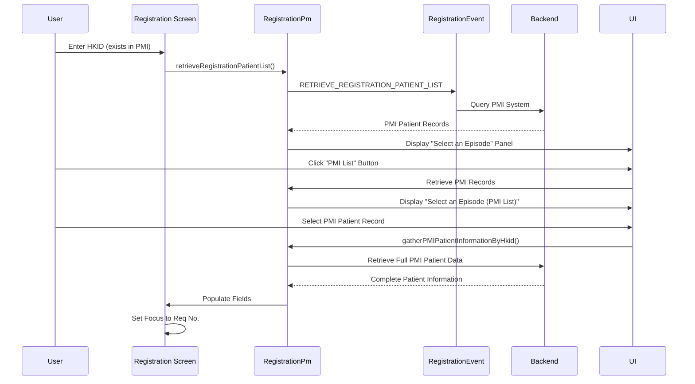

# Retrieve Patient by HKID Workflow

## Overview
This workflow allows registration staff to register laboratory requests using an existing patient's Hong Kong Identity Card (HKID) number. The system retrieves patient records from both the local PATIENT table and PMI (Patient Master Index) system.

## Related User Stories
- **[[CRST-92]]** - Registration - Retrieve Existing Patient by HKID  
- **[[CRST-93]]** - Registration - Retrieve PMI Patient by HKID  
- **[[CRST-492]]** - Registration - Patient Selection Dialogue

**Epic:** LISP-23 [CRST][DEV] Registration - Patient Handling

---

## PMI Configuration

### PMI Server Option
The availability of PMI functionality is controlled by the `LAB_OPTION` table:

**Configuration Check:**
```sql
SELECT * FROM LAB_OPTION 
WHERE option_group = 'PMI' 
  AND option_code = 'SERVER'
```

### PMI List Button Visibility

#### PMI Enabled
**Condition:** PMI option exists and is enabled in `LAB_OPTION`

**Behavior:**
- "PMI List" button is **visible** on "Select an Episode" panel
- "PMI List" button is **enabled** (clickable)
- Users can access PMI patient records

#### PMI Disabled
**Condition:** PMI option does not exist OR is disabled in `LAB_OPTION`

**Behavior:**
- "PMI List" button is **invisible** on "Select an Episode" panel
- Users cannot access PMI patient records
- Only local PATIENT table records are available

---

## Workflow Scenarios

### Scenario 1: Retrieve Patient from Local PATIENT Table

#### Trigger
User enters an HKID in the Registration screen that exists in `PATIENT.pat_pid`

#### Process Flow



#### Step-by-Step Details

1. **HKID Input & Validation**
   - User enters HKID in the HKID field
   - `LisHkidTextInputPm` validates check digit
   - Component fires `modifiedHandler` event

2. **Patient Record Retrieval**
   - System dispatches `HkidTextInputEvent.CHECK_HKID`
   - `HkidTextInputCommand.checkHkid()` calls remote service
   - `PatientUIAppServiceBean.checkHkid()` invoked with parameters:
     - `hkid` - The HKID string
     - `isCheckPatientAmendLogNeeded` - Boolean flag
     - `serviceParameter` - Service context

3. **Database Query**
   - `PatientUIAppServiceImpl.checkHkid()` queries PATIENT table:
     ```sql
     SELECT * FROM PATIENT WHERE pat_pid = ?
     ```
   - Retrieves all matching patient records
   - Checks for merged HKID records (if applicable)
   - Checks patient amendment log (if flag is true)

4. **Display Episode Selection Panel**
   - `RegistrationPm.retrieveRegistrationPatientList()` processes results
   - System displays "Select an Episode" panel with patient records
   - Each record shows:
     - **HKID** = `PATIENT.pat_pid`
     - **Encounter No** = `PATIENT.pat_encounter`
     - **Hosp** = `PATIENT.pat_hospital`
     - **Unit** = `PATIENT.pat_unit`
     - **Locn** = `PATIENT.pat_location`
     - **Name** = `PATIENT.pat_name`
     - **Sex** = `PATIENT.pat_sex`
     - **Age** = `PATIENT.pat_age`
     - **Age Unit** = `PATIENT.pat_age_unit`
     - **DOB** = `PATIENT.pat_dob`
     - **Admission Date** = `PATIENT.pat_adm_date`
     - **Exact DOB** = `PATIENT.pat_exact_dob_flag`
     - **Race** = `PATIENT.pat_race`
     - **MRN** = `PATIENT.pat_mrn`
     - **Confidential** = `PATIENT.pat_confidential`
     - **Death** = `PATIENT.pat_death`
     - **Death Date** = `PATIENT.pat_death_date`
     - **Discharge Date** = `PATIENT.pat_discharge_date`
     - **Bed** = `PATIENT.pat_bed`
     - **Category** = `PATIENT.pat_cat`
     - **Type** = `PATIENT.pat_type`
     - **Address** = `PATIENT.pat_address`

5. **Panel Features**
   - **Generate Computer Encounter** button - visible and enabled
   - **Close** indicator - user can close the panel
   - **PMI List** button - access PMI records (if available)

6. **Patient Selection**
   - User selects a specific patient record from the list
   - `RegistrationUIComponents.closePatientPopUpCallbackFunction()` is called
   - System populates Encounter No field with `PATIENT.pat_encounter`

7. **Load Patient Data to Screen**
   - `RegistrationUIComponents.loadPatientReadyDataToComponents()` executed
   - Patient Demographics Panel populated with:
     - **Name** = `PATIENT.pat_name`
     - **Name (in Chinese)** = `PATIENT.pat_cname`
     - **Sex** = `PATIENT.pat_sex`
     - **Pay Code** = `PATIENT.pat_type`
     - **DOB** = `PATIENT.pat_dob`
     - **Age** = `PATIENT.pat_age`
     - **Age Unit** = `PATIENT.pat_age_unit`
     - **Loc Hosp** = `PATIENT.pat_hospital`
     - **Loc Specialty** = `PATIENT.pat_unit`
     - **Loc Ward/Clinic** = `PATIENT.pat_location`
     - **Cat** = `PATIENT.pat_cat`
     - **Bed** = `PATIENT.pat_bed`
     - **Admitted** = `PATIENT.pat_adm_date`
     - **MRN** = `PATIENT.pat_mrn`
     - **Race** = `PATIENT.pat_race`

8. **Field State Management**
   - All patient demographic fields become:
     - **Visible** - displayed on screen
     - **Dimmed** - visually grayed out
     - **Non-editable** - user cannot modify

9. **Focus Management**
   - System automatically sets focus to **Req No.** field
   - User can proceed with request number entry

---

### Scenario 2: Retrieve Patient from PMI (Patient Master Index)

#### Prerequisites
- PMI must be enabled in `LAB_OPTION` table (`option_group='PMI'`, `option_code='SERVER'`)
- "PMI List" button must be visible on Episode Selection Panel

#### Trigger
- User enters an HKID that exists in PMI system, OR
- User clicks "PMI List" button from Episode Selection Panel, OR
- User clicks "Close" indicator on Episode Selection Panel when patient exists in PMI

#### Process Flow



#### Step-by-Step Details

1. **PMI List Access**
   - **Option A:** User clicks **PMI List** button on Episode Selection Panel
   - **Option B:** User clicks **Close** indicator on Episode Selection Panel (when HKID exists in PMI)
   - System triggers PMI record retrieval

2. **PMI Patient Retrieval**
   - `RegistrationPm.retrieveRegistrationPatientList()` called
   - Dispatches `RegistrationEvent.RETRIEVE_REGISTRATION_PATIENT_LIST`
   - Queries PMI system for patient records matching HKID

3. **Display PMI Episode Panel**
   - Panel title changes to **"Select an Episode (PMI List)"**
   - Displays PMI patient records with same fields as local records:
     - **HKID** = `PATIENT.pat_pid`
     - **Encounter No** = `PATIENT.pat_encounter`
     - **Hosp** = `PATIENT.pat_hospital`
     - **Unit** = `PATIENT.pat_unit`
     - **Locn** = `PATIENT.pat_location`
     - **Name** = `PATIENT.pat_name`
     - **Sex** = `PATIENT.pat_sex`
     - **Age** = `PATIENT.pat_age`
     - **Age Unit** = `PATIENT.pat_age_unit`
     - **DOB** = `PATIENT.pat_dob`
     - **Admission Date** = `PATIENT.pat_adm_date`
     - **Exact DOB** = `PATIENT.pat_exact_dob_flag`
     - **Race** = `PATIENT.pat_race`
     - **MRN** = `PATIENT.pat_mrn`
     - **Confidential** = `PATIENT.pat_confidential`
     - **Death** = `PATIENT.pat_death`
     - **Death Date** = `PATIENT.pat_death_date`
     - **Discharge Date** = `PATIENT.pat_discharge_date`
     - **Bed** = `PATIENT.pat_bed`
     - **Category** = `PATIENT.pat_cat`
     - **Type** = `PATIENT.pat_type`
     - **Address** = `PATIENT.pat_address`
   - **Panel Buttons:**
     - **Generate Computer Encounter** - visible and enabled
     - **Cancel** - visible and enabled
     - **Close** indicator - clickable
   - PMI-specific indicators may be shown

4. **PMI Record Selection**
   - User selects a specific PMI patient record
   - `RegistrationPm.gatherPMIPatientInformationByHkid()` invoked
   - System retrieves complete patient data from PMI
   - Event `RegistrationEvent.GATHER_PMI_PATIENT_INFORMATION_BY_HKID` dispatched

5. **Create Local Patient Episode**
   - If PMI patient doesn't exist locally, may trigger episode creation
   - `RegistrationUIComponents.popUpCreateNewEpisodeDialogue()` may be called
   - New encounter number generated if needed

6. **Load PMI Patient Data**
   - Same data loading process as Scenario 1
   - `RegistrationUIComponents.loadPatientReadyDataToComponents()` executed
   - Patient Demographics Panel populated with PMI data:
     - **Name** = `PATIENT.pat_name`
     - **Name (in Chinese)** = `PATIENT.pat_cname`
     - **Sex** = `PATIENT.pat_sex`
     - **Pay Code** = `PATIENT.pat_type`
     - **DOB** = `PATIENT.pat_dob`
     - **Age** = `PATIENT.pat_age`
     - **Age Unit** = `PATIENT.pat_age_unit`
     - **Loc Hosp** = `PATIENT.pat_hospital`
     - **Loc Specialty** = `PATIENT.pat_unit`
     - **Loc Ward/Clinic** = `PATIENT.pat_location`
     - **Cat** = `PATIENT.pat_cat`
     - **Bed** = `PATIENT.pat_bed`
     - **Admitted** = `PATIENT.pat_adm_date`
     - **MRN** = `PATIENT.pat_mrn`
     - **Race** = `PATIENT.pat_race`
   - All fields become **visible, dimmed, and non-editable**
   - Encounter No field filled with selected episode
   - Focus set to **Req No.** field

---

### Scenario 3: Close Indicator Behavior with PMI Patient

#### Trigger
User clicks "Close" indicator on "Select an Episode" panel when HKID exists in PMI

#### Behavior
1. System detects that patient HKID exists in PMI
2. Instead of closing the panel, system automatically:
   - Retrieves PMI episode records
   - Displays "Select an Episode (PMI List)" panel
   - Shows all PMI patient records matching the HKID

**Note:** This provides a shortcut for users to access PMI records without explicitly clicking "PMI List" button.

---

### Scenario 4: PMI Service Unavailability

#### Trigger
- User clicks "PMI List" button OR "Close" indicator
- PMI service is unavailable or fails to respond

#### Process Flow

1. **Service Call Failure**
   - `RegistrationPm.serverCallErrorHandlerForPMI()` invoked
   - System detects PMI service error

2. **Error Messages**
   - **Message 4274** displayed on log monitor:
     > "Due to the unavailability of PMI service, the system cannot retrieve patient details for entered HKID at this moment."
   
   - **Message 687** prompted to user:
     > "Create new Encounter case?"

3. **User Options**
   - **Yes** - Proceed to create new encounter (see [[Create New Episode]])
   - **No** - Cancel operation, return to registration screen

4. **Fallback Behavior**
   - System falls back to local PATIENT table records only
   - PMI records are not available
   - User can still work with existing local patient records

---

## Technical Implementation

### Frontend Components

#### LisHkidTextInputPm
**Location:** `lisFlexLib/flex_src/hk/org/ha/lis/common/component/basic/LisHkidTextInputPm.as`

**Key Methods:**
- `modifiedHandler()` - Handles HKID input changes
- `checkHkid(hkid, isCheckPatientAmendLogNeeded, resultHandler)` - Validates and retrieves patient
- `validateCheckDigit()` - Validates HKID check digit
- `getHkidKeyHandler()` - Processes HKID key retrieval result

**Events Dispatched:**
- `HkidTextInputEvent.CHECK_HKID` - Triggers patient lookup

---

#### RegistrationUIComponents
**Location:** `lisWeb/flex_src/hk/org/ha/lis/request/presentation/RegistrationUIComponents.as`

**Key Methods:**
- `hkidModifiedFunction()` - Handles HKID modification event
- `gatherPatientInformationByHkid()` - Retrieves patient data
- `popUpPatientEpisodeSelectionDialogue()` - Displays episode selection panel
- `popUpPatientEpisodeSelectionDialogueForSelection()` - Handles episode selection logic (updated CEO-76657, LIS-1722)
- `closePatientPopUpCallbackFunction()` - Handles patient selection (updated LIS-2604)
- `pmiPatientPopUpItemSelectedFunction()` - Handles PMI patient selection (updated CEO-78130)
- `loadPatientReadyDataToComponents()` - Populates patient data on screen
- `setDefaultFocusWhenRequestNoReadyToProceed()` - Sets focus to Req No. field
- `enableComponents()` - Manages field enable/disable states
- `constructPatientEpisodeSelectionDialgouePm()` - Constructs episode selection dialogue PM (added LIS-1722)

**Component Properties Used:**
- `hkidPm:LisHkidTextInputPm` - HKID input component
- `encNoPm:LisEncounterNoTextInputPm` - Encounter number component
- `patientNamePm:LisTextInputPm` - Patient name field
- `cNameTextInputPm:LisCnameTextInputPm` - Chinese name field
- `sexPm:LisKeywordComboBoxPm` - Sex dropdown
- `dobAndAgePm:LisDobAndAgeManipulationPm` - DOB and Age fields
- `patientLocationPm:LisLocationTextInputPm` - Location fields
- `bedPm:LisTextInputPm` - Bed number field
- `admittedPm:LisDateTimeTextInputPm` - Admission date/time field

---

#### RegistrationPm
**Location:** `lisWeb/flex_src/hk/org/ha/lis/request/presentation/RegistrationPm.as`

**Key Methods:**
- `retrieveRegistrationPatientList()` - Retrieves patient list by HKID
- `retrieveRegistrationPatientListHandler()` - Processes patient list results (updated LIS-9975)
- `gatherPatientInformation()` - Gathers complete patient information (updated CEO-78130)
- `gatherPatientInformationHandler()` - Processes patient information results (updated CEO-78130)
- `gatherPMIPatientInformationByHkid()` - Retrieves PMI patient data (added PMH-BBS-B-000068)
- `serverCallErrorHandlerForPMI()` - Handles PMI service errors (added PMH-BBS-B-000068)

**Events Managed:**
- `RegistrationEvent.RETRIEVE_REGISTRATION_PATIENT_LIST` - Retrieves patient list
- `RegistrationEvent.GATHER_PATIENT_INFORMATION` - Gathers complete patient data
- `RegistrationEvent.GATHER_PATIENT_INFORMATION_BY_HKID` - Gathers by HKID
- `RegistrationEvent.GATHER_PMI_PATIENT_INFORMATION_BY_HKID` - Gathers from PMI (added PMH-BBS-B-000068)
- `RegistrationEvent.GATHER_PMI_PATIENT_INFORMATION_BY_ECOUNTER_NO` - Gathers PMI by encounter

---

### Backend Components

#### PatientUIAppServiceBean (EJB)
**Location:** `lisEJB/src/hk/org/ha/lis/ejb/frontend/common/PatientUIAppServiceBean.java`

**Method:**
```java
public PatientUIRo checkHkid(String hkid, 
                             boolean isCheckPatientAmendLogNeeded, 
                             ServiceParameterVo serviceParameter)
```

**Parameters:**
- `hkid` - HKID string to query
- `isCheckPatientAmendLogNeeded` - Whether to check patient amendment log
- `serviceParameter` - Service context (user, hospital, function, etc.)

**Returns:**
- `PatientUIRo` - Result object containing:
  - Patient records matching HKID
  - HKID key information
  - Patient amendment log (if requested)
  - Merged HKID information (if applicable)

---

#### PatientUIAppServiceImpl
**Location:** `lisEJB/src/hk/org/ha/lis/biz/frontend/common/impl/PatientUIAppServiceImpl.java`

**Method Implementation:**
```java
public PatientUIRo checkHkid(String hkid, boolean isCheckPatientAmendLogNeeded)
```

**Business Logic:**
1. Query `PATIENT` table for records where `pat_pid = hkid`
2. Retrieve HKID key from patient service
3. If `isCheckPatientAmendLogNeeded = true`:
   - Check `PATIENT_AMEND_LOG` for amendment records
   - Retrieve merged HKID information
4. Package results into `PatientUIRo`

**Database Tables Accessed:**
- `PATIENT` - Main patient records
- `PATIENT_AMEND_LOG` - Patient amendment history
- `HKID_MERGE` - Merged HKID records (if applicable)

---

### Event Flow

#### HkidTextInputEvent
**Location:** `lisFlexLib/flex_src/hk/org/ha/lis/event/patient/HkidTextInputEvent.as`

**Event Type:** `CHECK_HKID`

**Factory Method:**
```actionscript
HkidTextInputEvent.checkHkid(hkid:String, 
                              isCheckPatientAmendLogNeeded:Boolean, 
                              callback:Function, 
                              errorHandleCallback:Function=null)
```

**Properties:**
- `hkid:String` - HKID to check
- `isCheckPatientAmendLogNeeded:Boolean` - Amendment log check flag
- `callback:Function` - Success callback
- `errorHandleCallback:Function` - Error callback

---

#### HkidTextInputCommand
**Location:** `lisFlexLib/flex_src/hk/org/ha/lis/command/patient/HkidTextInputCommand.as`

**Command Method:**
```actionscript
[Command(type="HkidTextInputEvent", scope="local", selector=CHECK_HKID)]
public function checkHkid(event:HkidTextInputEvent):AsyncToken
```

**Result Handler:**
```actionscript
[CommandResult(type="HkidTextInputEvent", scope="local", selector=CHECK_HKID)]
public function handleCheckHkidResult(result:PatientUIRo, trigger:HkidTextInputEvent):void
```

**Error Handler:**
```actionscript
[CommandError(type="HkidTextInputEvent", scope="local", selector=CHECK_HKID)]
public function handleCheckHkidError(fault:FaultEvent, trigger:HkidTextInputEvent):void
```

---

#### RegistrationEvent
**Location:** `lisFlexLib/flex_src/hk/org/ha/lis/event/request/RegistrationEvent.as`

**Related Event Types:**
- `RETRIEVE_REGISTRATION_PATIENT_LIST` - Retrieve patient list
- `GATHER_PATIENT_INFORMATION` - Gather complete patient data
- `GATHER_PATIENT_INFORMATION_BY_HKID` - Gather by HKID
- `GATHER_PMI_PATIENT_INFORMATION_BY_HKID` - Gather from PMI

---

## Patient Episode Selection Dialogue

### PatientEpisodeSelectionDialogue
**Location:** `lisFlexLib/flex_src/hk/org/ha/lis/common/component/dialog/PatientEpisodeSelectionDialogue.mxml`

**Features:**
- Displays patient records in a grid/list
- Supports multiple selection modes
- Shows local patient records by default
- Provides "PMI List" button for PMI access
- Includes "Generate Computer Encounter" button
- Close indicator for cancellation

### PatientEpisodeSelectionDialoguePm
**Presentation Model for the dialogue**

**Key Properties:**
- `patientRecords:ArrayCollection` - List of patient records
- `selectedPatient:PatientVo` - Currently selected patient
- `isPMIMode:Boolean` - Whether showing PMI records

**Methods:**
- `loadPatientRecords()` - Loads patient records into grid
- `selectPatient()` - Handles patient selection
- `switchToPMIMode()` - Switches to PMI record view

---

## Data Objects

### PatientUIRo (Result Object)
**Location:** `lisEJB/src/hk/org/ha/lis/model/vo/ro/PatientUIRo.java`

**Properties:**
- `hkidKey:Integer` - Patient HKID key
- `patientRecords:List<PatientVo>` - List of matching patients
- `patientAmendLog:List<PatientAmendLogVo>` - Amendment history
- `mergedHkidInfo:MergedHkidVo` - Merged HKID information
- `isHkidMerged:Boolean` - Whether HKID has been merged

---

### RetrieveRegistrationPatientListRo
**Result object for patient list retrieval**

**Properties:**
- `patients:List<PatientVo>` - Patient list
- `pmiPatients:List<PatientVo>` - PMI patient list
- `totalCount:Integer` - Total number of records

---

### GatherRegistrationPatientInformationRo
**Result object for complete patient information**

**Properties:**
- `patient:PatientVo` - Complete patient record
- `episodeInfo:EpisodeVo` - Episode information
- `locationInfo:LocationVo` - Location details
- `warnings:List<WarningMessageVo>` - Warning messages

---

## Field State Management

### Patient Demographics Fields - After Patient Selection

| Field | State | Editable | Reason |
|-------|-------|----------|--------|
| **Name** | Dimmed | No | Existing patient data from database |
| **Chinese Name** | Dimmed | No | Existing patient data from database |
| **Sex** | Dimmed | No | Existing patient data from database |
| **DOB** | Dimmed | No | Existing patient data from database |
| **Age** | Dimmed | No | Calculated from DOB |
| **Age Unit** | Dimmed | No | Calculated from DOB |
| **Loc Hospital** | Dimmed | No | Existing episode data |
| **Loc Specialty** | Dimmed | No | Existing episode data |
| **Loc Ward/Clinic** | Dimmed | No | Existing episode data |
| **Ward** | Dimmed | No | Existing episode data |
| **Bed** | Dimmed | No | Existing episode data |
| **Admitted** | Dimmed | No | Existing episode data |
| **Category** | Dimmed | No* | Existing patient data (See Note) |
| **MRN** | Dimmed | No | Existing patient data |
| **Race** | Dimmed | No | Existing patient data |

**Note on Category Field:**
- Editable ONLY when:
  - New patient (`isNewPatient = true`), AND
  - Existing patient demo disabled (`isExistingPatientDemoDisabled = false`), AND
  - Patient category is unknown

### Request Information Fields - After Patient Selection

| Field | State | Editable | Reason |
|-------|-------|----------|--------|
| **Enc No.** | Enabled | Yes | Auto-filled but can be changed |
| **Req No.** | Enabled | Yes | Focus set here after selection |
| **All other fields** | Enabled | Yes | User must fill in request details |

---

## Validation Rules

### HKID Validation
1. **Format Check**
   - Must be 8-9 characters
   - Format: 1-2 letters + 6 digits + 1 check digit
   - Example: `A123456(7)` or `AB123456(7)`

2. **Check Digit Validation**
   - Calculated using weighted sum algorithm
   - Check digit can be 0-9 or 'A'
   - Validation performed by `LisHkidTextInputPm.validateCheckDigit()`

3. **Existence Check**
   - Query PATIENT table for matching records
   - Query PMI system if enabled
   - Check for merged HKID records

### Patient Selection Validation
1. **Must select a patient** - Cannot proceed without selection
2. **Episode validation** - Selected episode must be valid
3. **Hospital access rights** - User must have access to patient's hospital

---

## Error Handling

### Common Error Scenarios

#### 1. HKID Not Found
**Error Code:** TBD  
**Message:** "Patient with HKID [HKID] not found"  
**Action:** User can create new patient or re-enter HKID

#### 2. Invalid HKID Check Digit
**Error Code:** `0001411`  
**Message:** "Invalid HKID check digit"  
**Action:** User must correct HKID

#### 3. Multiple Episodes Found
**Behavior:** Display Episode Selection Panel  
**Action:** User must select one episode

#### 4. PMI Service Unavailable
**Error Code:** `4274`  
**Error Handler:** `serverCallErrorHandlerForPMI()`  
**Message (Log Monitor):** "Due to the unavailability of PMI service, the system cannot retrieve patient details for entered HKID at this moment."  
**Message (User Prompt):** "Create new Encounter case?" (`687`)  
**Action:** 
- Display error message on log monitor
- Prompt user to create new encounter
- Fallback to local records only

#### 5. Merged HKID Detected
**Behavior:** System retrieves records for both old and new HKID  
**Action:** Display warning, show all related records

#### 6. PMI Patient Not Found
**Error Code:** `687`  
**Message:** "Create new Encounter case?"  
**Trigger:** User clicks "PMI List" or "Close" but HKID doesn't exist in PMI  
**Additional Message:** Message `4274` also displayed on log monitor  
**Action:** 
- Prompt user to create new encounter
- User can choose to create new encounter or cancel

---

## Configuration Parameters

### System Parameters

| Parameter | Description | Impact |
|-----------|-------------|--------|
| `LAB_OPTION.option_group='PMI'` + `option_code='SERVER'` | PMI server configuration | Controls PMI List button visibility and PMI access |
| `isExistingPatientDemoDisabled` | Whether existing patient demographics are editable | Controls field enable/disable state |
| `verifyScreenSettingForSaveRequest` | Verification dialogue requirement | May affect workflow before save |
| `hkidMergeEnabled` | Enable merged HKID checking | Controls merge HKID logic |
| `hospSpecFeatureEnabled` | Hospital-specific features | May affect field visibility/behavior |

### Dictionary Parameters

| Parameter | Description | Default |
|-----------|-------------|---------|
| `screenDefaultFocusInputObject` | Default focus component | Req No. field after patient selection |

---

## Related Workflows
- [[Retrieve Patient by Encounter No]] - Alternative patient lookup method
- [[Create New Patient]] - Workflow when HKID not found
- [[Create New Episode]] - Creating new episode for existing patient
- [[Patient Episode Selection]] - Details on episode selection dialogue

---

## Related Components
- [[LisHkidTextInputPm]] - HKID input component documentation
- [[LisEncounterNoTextInputPm]] - Encounter number component
- [[RegistrationUIComponents]] - Main registration UI components
- [[RegistrationPm]] - Registration presentation model

---

## Database Schema Reference

### LAB_OPTION Table
Controls laboratory-specific options and configurations.

**PMI Configuration:**
```sql
SELECT * FROM LAB_OPTION
WHERE option_group = 'PMI'
  AND option_code = 'SERVER'
```

**Purpose:** Determines whether PMI integration is enabled for the laboratory

**Key Columns:**
- `option_group` - Configuration group identifier
- `option_code` - Specific option code
- `option_value` - Option value/setting
- `option_desc` - Option description

---

### PATIENT Table
Primary table for patient demographics and episode information.

**Key Columns:**
- `pat_pid` - Patient HKID (Primary identifier)
- `pat_encounter` - Encounter/Case number
- `pat_hospital` - Hospital code
- `pat_unit` - Specialty/Unit code
- `pat_location` - Ward/Clinic location
- `pat_name` - Patient name (English)
- `pat_cname` - Patient name (Chinese)
- `pat_sex` - Sex
- `pat_dob` - Date of birth
- `pat_age` - Age value
- `pat_age_unit` - Age unit
- `pat_exact_dob_flag` - Exact DOB indicator
- `pat_race` - Race code
- `pat_mrn` - Medical Record Number
- `pat_cat` - Patient category
- `pat_type` - Patient type/Pay code
- `pat_bed` - Bed number
- `pat_adm_date` - Admission date
- `pat_discharge_date` - Discharge date
- `pat_death` - Death indicator
- `pat_death_date` - Death date
- `pat_confidential` - Confidential indicator
- `pat_address` - Address

### PATIENT_AMEND_LOG Table
Tracks amendments to patient records.

**Purpose:** Audit trail for patient data changes

### HKID_MERGE Table (if applicable)
Tracks merged HKID records.

**Purpose:** Links old and new HKIDs when patients are merged

---

## Modification History

| Date | Developer | Reference | Changes |
|------|-----------|-----------|---------|
| 02 Nov 2020 | Henry Chan | LIS-2604 | Amend closePatientPopUpCallbackFunction, hkidModifiedFunction |
| 04 Jun 2020 | Tony Chong | LIS-1722 | Add constructPatientEpisodeSelectionDialgouePm |
| 05 Aug 2016 | Tony Chong | CEO-78130 | Amend pmiPatientPopUpItemSelectedFunction |
| 31 Oct 2016 | Tony Chong | CEO-76657 | Amend popUpPatientEpisodeSelectionDialogueForSelection |
| 10 Nov 2014 | Rock Yu | PMH-BBS-B-000068 | Added serverCallErrorHandlerForPMI |
| 27 May 2025 | Tony Chong | LIS-9975 | Amend retrieveRegistrationPatientListHandler |
| 08 Apr 2025 | Collins | LIS-9914 | Enhance patient service using composite key |

---

## Testing Considerations

### Test Scenarios

1. **Valid HKID with Single Episode**
   - Input valid HKID
   - Verify single episode auto-selected
   - Verify Enc No. populated
   - Verify focus moves to Req No.

2. **Valid HKID with Multiple Episodes**
   - Input valid HKID with multiple episodes
   - Verify Episode Selection Panel displays
   - Verify all episodes shown correctly
   - Verify user can select any episode

3. **PMI Patient Retrieval - PMI List Button**
   - Verify PMI is enabled in LAB_OPTION
   - Verify "PMI List" button is visible and enabled
   - Input HKID existing only in PMI
   - Click "PMI List" button
   - Verify "Select an Episode (PMI List)" panel displays
   - Verify PMI records displayed correctly
   - Verify PMI patient can be selected

4. **PMI Patient Retrieval - Close Indicator**
   - Input HKID existing in PMI
   - Display local episode selection panel
   - Click "Close" indicator
   - Verify system automatically retrieves PMI records
   - Verify "Select an Episode (PMI List)" panel displays

5. **PMI Disabled Configuration**
   - Verify PMI option is disabled or missing in LAB_OPTION
   - Display episode selection panel
   - Verify "PMI List" button is invisible
   - Verify only local records are accessible

6. **PMI Service Unavailable**
   - Enable PMI in LAB_OPTION
   - Simulate PMI service failure
   - Click "PMI List" or "Close" indicator
   - Verify error message 4274 displayed on log monitor
   - Verify message 687 "Create new Encounter case?" prompted
   - Verify system falls back to local records

7. **PMI Patient Not Found**
   - Input HKID not in PMI
   - Click "PMI List" button
   - Verify message 687 "Create new Encounter case?" displayed
   - Verify message 4274 on log monitor
   - Verify user can create new encounter or cancel

8. **PMI Patient with Multiple Records**
   - Input HKID with multiple PMI episodes
   - Click "PMI List" button
   - Verify all PMI episodes displayed
   - Verify user can select specific episode

9. **Merged HKID Handling**
   - Input merged HKID
   - Verify warning message
   - Verify both old and new HKID records shown

10. **Invalid HKID**
    - Input invalid HKID check digit
    - Verify error message displayed
    - Verify cannot proceed

11. **HKID Not Found (Local or PMI)**
    - Input non-existent HKID
    - Verify appropriate message
    - Verify option to create new patient

---

## Notes
- This workflow is one of the primary methods for patient identification in the Registration screen
- Alternative method is retrieval by Encounter Number (see [[Retrieve Patient by Encounter No]])
- PMI integration provides access to hospital-wide patient records
- System supports merged HKID records for patient record consolidation
- All patient demographic fields are protected after loading existing patient to maintain data integrity
