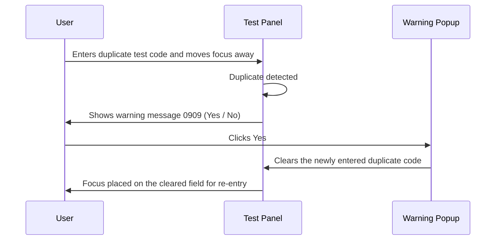
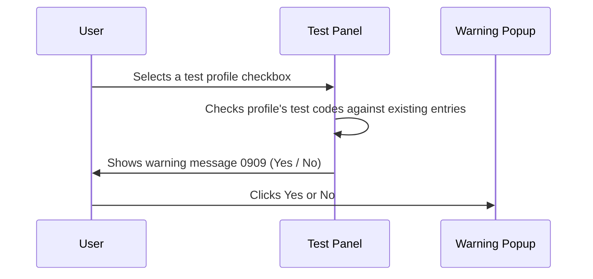

# Test Code Selection Behavior

## Overview

When a user enters a test code or selects a test profile in the **Test Panel** during Manual Registration, the system automatically validates the entry against all test codes and profiles already present in the panel as soon as the entry loses focus. If the newly entered code is a duplicate of one already in the panel, a warning is displayed, giving the user the option to remove the duplicate or retain it for manual correction. This check applies to both typed test code inputs and selectable test profile checkboxes. The check is always active and cannot be disabled.

---

## Related User Stories

- **[[CRST-103]]** - Registration - Test Panel / Test Code Selection Behavior

**Epic:** LISP-26 [CRST][DEV] Registration - Test Panel

---

## Key Concepts

### Test Code (Alpha Code)
A short code that uniquely identifies a single test in the laboratory system. Entered by the user into a text input field in the Test Panel.

### Test Profile
A named group of tests. A profile can be typed into a text input or selected via a checkbox in the Test Panel, depending on how the panel is configured.

### Test Panel
The area within the Registration screen where the user enters the tests to be performed on the request. It contains one or more test code text inputs and, when configured, selectable test profile checkboxes.

### Duplicate
A test code or profile is considered a duplicate if its code already appears elsewhere in the Test Panel — whether in another text input or in a selected checkbox profile.

---

## Trigger Point

This workflow is triggered when a test code text input field in the Test Panel loses focus (i.e., the user tabs away, clicks elsewhere, or a test selection dialogue closes), or when a selectable test profile checkbox is ticked. The check runs immediately at that moment.

---

## Workflow Scenarios

### Scenario 1: Non-Duplicate Test Code Entered

#### Prerequisites
- The Registration screen is open and the Test Panel is displayed.
- The user has entered a test code into a text input field.
- The entered code does not match any test code or profile already present in the panel.

#### Process Flow

```mermaid
sequenceDiagram
    User->>Test Panel: Enters test code and moves focus away
    Test Panel->>Test Panel: Compares code against all existing entries
    Test Panel->>Registration Screen: No duplicate found — validation passes
    Registration Screen->>User: No message shown; workflow continues normally
```

#### Step-by-Step Details

1. The user enters a test code into one of the text input fields in the **Test Panel** and moves focus away from the field.
2. The system compares the entered code against all test codes and profiles currently in the panel (including those entered in other text input fields and any selected checkbox profiles).
3. No match is found.
4. The system accepts the entry silently and the registration workflow continues without any interruption.

---

### Scenario 2: Duplicate Test Code Entered — User Chooses to Remove It (Yes)

#### Prerequisites
- The Registration screen is open and the Test Panel is displayed.
- The user has entered a test code into a text input field.
- The entered code **matches** a test code or profile already present elsewhere in the panel.

#### Process Flow



#### Step-by-Step Details

1. The user enters a test code into one of the text input fields in the **Test Panel** and moves focus away from the field.
2. The system compares the entered code against all test codes and profiles currently in the panel.
3. A match is found — the entered code is a duplicate.
4. Warning message **0909** is displayed in a popup. The message names the duplicate test code and asks the user whether to remove it.
5. The user clicks **Yes**.
6. The popup closes, the newly entered duplicate code is cleared from its field, and focus is placed on that field so the user can enter a different code.

---

### Scenario 3: Duplicate Test Code Entered — User Chooses to Keep It (No)

#### Prerequisites
- The Registration screen is open and the Test Panel is displayed.
- The user has entered a test code into a text input field.
- The entered code **matches** a test code or profile already present elsewhere in the panel.

#### Process Flow

```mermaid
sequenceDiagram
    User->>Test Panel: Enters duplicate test code and moves focus away
    Test Panel->>Test Panel: Duplicate detected
    Test Panel->>User: Shows warning message 0909 (Yes / No)
    User->>Warning Popup: Clicks No
    Warning Popup->>Test Panel: Closes popup; duplicate code retained in field
    Test Panel->>User: Focus returned to the field with the duplicate code highlighted
```

#### Step-by-Step Details

1. The user enters a test code into one of the text input fields in the **Test Panel** and moves focus away from the field.
2. The system compares the entered code against all test codes and profiles currently in the panel.
3. A match is found — the entered code is a duplicate.
4. Warning message **0909** is displayed in a popup. The message names the duplicate test code and asks the user whether to remove it.
5. The user clicks **No**.
6. The popup closes. The duplicate code is retained in the field. Focus is returned to the field with the duplicate code highlighted, allowing the user to manually edit or clear the entry.

---

### Scenario 4: Duplicate Profile Selected via Checkbox

#### Prerequisites
- The Test Panel includes selectable test profile checkboxes (when the panel is configured in checkbox mode).
- The user ticks a checkbox for a test profile.
- One or more test codes within that profile already exist elsewhere in the Test Panel.

#### Process Flow



#### Step-by-Step Details

1. The user ticks a selectable test profile checkbox in the **Test Panel**.
2. The system checks each test code contained within that profile against all test codes and profiles already present in the panel.
3. If a duplicate is found, warning message **0909** is displayed, identifying the duplicate test code or profile name.
4. The Yes / No resolution follows the same logic as Scenario 2 (Yes → uncheck / clear) or Scenario 3 (No → retain, focused and highlighted).
5. If no duplicate is found, the profile selection is accepted silently.

---

## Summary Tables

### Duplicate Detection Scope

| Entry Type | What Is Compared | What It Is Compared Against |
|---|---|---|
| Text input field | The text entered in the field on focus-loss | All other text input fields and all selected checkbox profiles in the panel |
| Selectable checkbox | The test codes contained in the selected profile | All text input fields and all other selected checkbox profiles in the panel |

### Warning Message Response Outcomes

| User Response | Outcome |
|---|---|
| **Yes** | Duplicate entry cleared; focus placed on the cleared field for re-entry |
| **No** | Duplicate entry retained; popup closes; focus returned to field with entry highlighted |

---

## Error Messages and System Prompts

| Message Code | Trigger | Message Content | User Options |
|---|---|---|---|
| 0909 | A duplicate test code or profile is detected when a field loses focus or a checkbox is selected | "The test code/profile **[X]** has already been entered. Do you want to remove it?" (where **[X]** is the duplicate code or profile name) | Yes / No |

---

## Business Rules

1. The duplicate check is performed every time a test code field loses focus and every time a selectable profile checkbox is ticked.
2. A code is considered duplicate if it matches any entry already in the Test Panel — regardless of whether the existing entry is in a text input or a selected checkbox profile.
3. The check covers **all** entries currently in the panel, not just the immediately adjacent field.
4. The duplicate check is always active; there is no configuration option to disable it.
5. Clicking **Yes** at the warning clears only the newly entered duplicate field, not the existing entry that caused the conflict.
6. Clicking **No** retains the duplicate but leaves the decision to the user; the system does not prevent saving with duplicate codes at this point.
7. The warning message includes the name of the duplicate test code or profile to help the user identify which entry is conflicting.

---

## Related Workflows

- [[Retrieve Patient by HKID]] — Test code selection occurs as part of the overall registration flow after patient retrieval.
- [[Request No. Generation]] — Request number generation follows test code entry as part of the save-time workflow.
