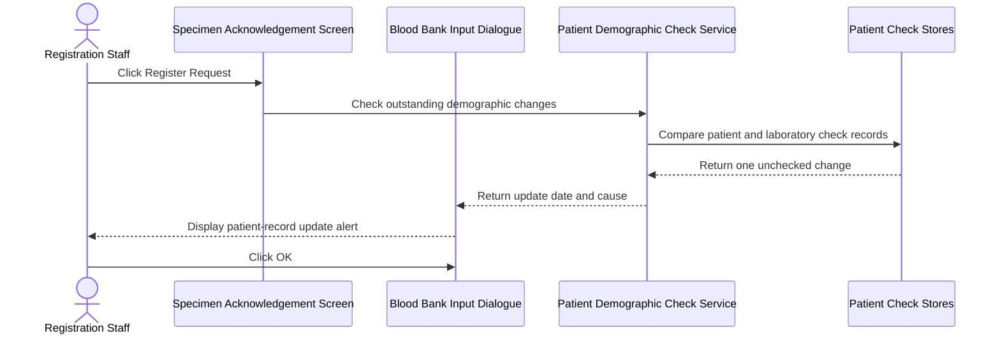
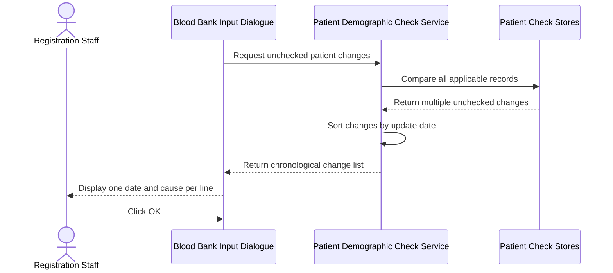
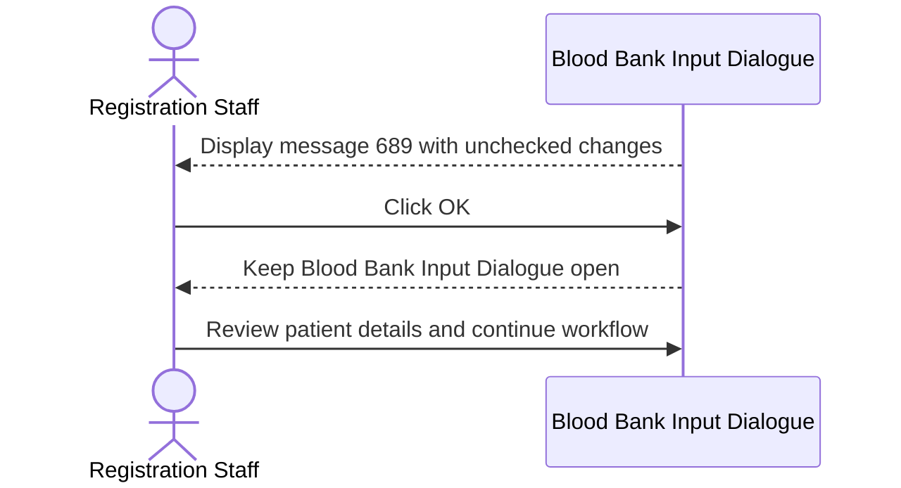
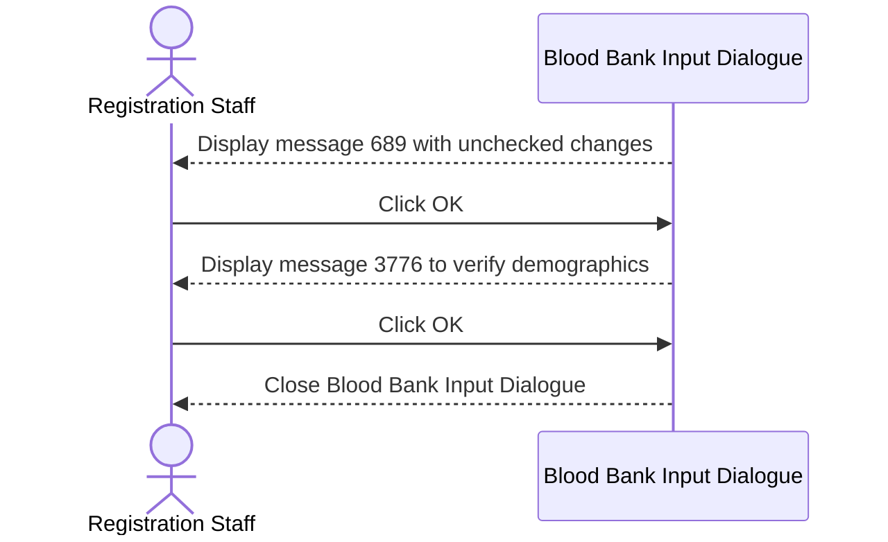
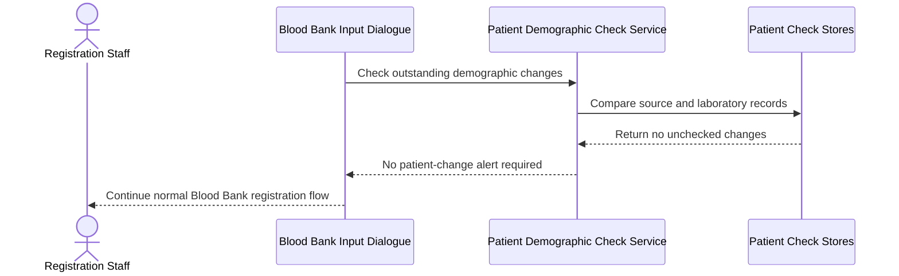
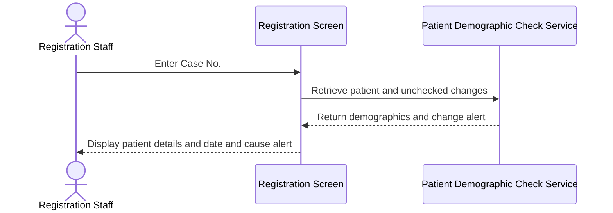

# Alert on Unchecked Patient Demographic Changes

## Overview

This workflow warns Registration Staff when the patient associated with a request has crucial demographic changes from the Integrated Patient Administration System (IPAS) that have not yet been checked by the laboratory. The alert displays the date, time, and cause of each outstanding change so staff can review and rectify the patient information before registration. The original CRST-9 requirement placed the alert at Case Number patient retrieval; it was subsequently consolidated into CRST-78, where the check occurs before Blood Bank request registration in Specimen Acknowledgement.

---

## Related User Stories

- **[[CRST-9]]** - Specimen Acknowledgement - Alerts on Crucial Patient Demographic Change
- **[[CRST-78]]** - Specimen Acknowledgement - Blood Bank Alert: PID Checking

**Original Epic:** LISP-3 [CRST][DEV] Specimen Ack - Retrieve Order Information  
**Consolidated Epic:** LISP-19 [CRST][DEV] Specimen Ack - Special Lab Workflow (BBNK)

> CRST-9 is recorded as covered by CRST-78. The shared business requirement is the unchecked patient-demographic-change warning; the trigger moved from Case Number patient retrieval to the Blood Bank pre-registration flow.

---

## Key Concepts

### Patient Identifier Check
A record of a crucial patient demographic or encounter change received from IPAS. Each record identifies the patient group, encounter group, type of change, and update date and time.

### Laboratory Check Record
The laboratory's state for the corresponding patient change. A source change is considered checked only when a matching laboratory record exists, is at least as recent as the source change, and has a checked status of `1`.

### Patient Group
An internal identity grouping for a patient. Both the active group and relevant historical groups are considered when the patient is resolved by Hong Kong Identity Card (HKID).

### Encounter Group
An internal grouping for the patient's encounter or Case Number. It is used with Patient Group and Amend Action to match a source change to the laboratory check record.

### Mandatory PID Checking
A configurable mode that prevents the Blood Bank registration dialogue from continuing while unchecked demographic changes exist.

---

## Trigger Point

> In the consolidated Specimen Acknowledgement workflow, the check begins after a Blood Bank GCRS order is retrieved and Registration Staff click **Register Request**, before registration proceeds in the Blood Bank Input Dialogue.

The original CRST-9 trigger was the entry of a **Case No.** during patient retrieval. That trigger is not implemented by the current Registration application and is retained here as historical scope.

---

## Workflow Scenarios

### Scenario 1: One Unchecked Demographic Change

#### Prerequisites

- A Blood Bank GCRS order has been retrieved.
- The order patient has one applicable Patient Identifier Check record.
- No current matching Laboratory Check Record has checked status `1`.

#### Process Flow

#### Step-by-Step Details

1. Registration Staff click **Register Request** for the retrieved Blood Bank order.
2. The system identifies the patient by encounter when an LIS-originated encounter is available; otherwise it uses the patient's HKID and associated Patient Groups.
3. Patient Identifier Check records are retrieved for the applicable Encounter Group or Patient Groups.
4. Each source change is compared with its Laboratory Check Record using Patient Group, Encounter Group, and Amend Action.
5. A change remains unchecked when no matching laboratory record exists, its laboratory timestamp is older, its checked status is empty, or its status is not `1`.
6. Message `689` displays the change's update date, time, and mapped IPAS cause.
7. The patient information remains available so staff can review it.
8. Clicking **OK** acknowledges the warning but does not mark the change as checked.

---

### Scenario 2: Multiple Unchecked Demographic Changes

#### Prerequisites

- The patient has more than one unchecked Patient Identifier Check record.

#### Process Flow

#### Step-by-Step Details

1. All applicable patient-change records are evaluated independently.
2. Unchecked records are sorted by update date and time.
3. Message `689` lists every unchecked record on a separate line.
4. Each line contains the update date and time followed by the business description of the IPAS change.
5. Clicking **OK** continues according to the mandatory-check configuration.

---

### Scenario 3: PID Checking Is Not Mandatory

#### Prerequisites

- At least one unchecked change exists.
- **PID Check Mandatory** is disabled or is not configured.

#### Process Flow

#### Step-by-Step Details

1. Message `689` is displayed with all unchecked changes.
2. The user clicks **OK** after reviewing the alert.
3. No second mandatory-verification message is displayed.
4. The Blood Bank Input Dialogue remains open.
5. Registration may continue after staff take the necessary patient-verification action.

---

### Scenario 4: PID Checking Is Mandatory

#### Prerequisites

- At least one unchecked change exists.
- **PID Check Mandatory** is enabled.

#### Process Flow

#### Step-by-Step Details

1. Message `689` displays all unchecked changes.
2. After the user clicks **OK**, message `3776` instructs the user to verify the patient demographics.
3. The user clicks **OK** on message `3776`.
4. The Blood Bank Input Dialogue closes and the current registration attempt does not proceed.
5. The retrieved patient and order should remain available on the parent screen for review; closing the dialogue must not itself clear the patient context.

---

### Scenario 5: All Demographic Changes Are Checked

#### Prerequisites

- Every applicable Patient Identifier Check has a matching Laboratory Check Record.
- Each matching record is at least as recent as the source change and has checked status `1`.

#### Process Flow

#### Step-by-Step Details

1. The matching composite identifiers are found in both patient-check stores.
2. The laboratory check timestamp is equal to or later than the source update timestamp.
3. The Laboratory Checked status equals `1`.
4. Messages `689` and `3776` are not displayed.
5. The normal Blood Bank registration workflow continues.

---

### Scenario 6: Original Case Number Retrieval Trigger

#### Prerequisites

- A patient is searched by **Case No.** during Registration.
- The patient has an unchecked crucial demographic change.

#### Process Flow

#### Step-by-Step Details

1. The system retrieves the patient identified by **Case No.**
2. Patient demographics are displayed on the Registration screen.
3. Applicable Patient Identifier Check and Laboratory Check records are compared.
4. If any change remains unchecked, an alert displays its update date, time, and cause.
5. The patient details remain displayed so staff can verify them.

> This is the original CRST-9 acceptance path. It was consolidated into CRST-78 but is not scope-equivalent to the current Blood Bank trigger; preservation of this Registration behavior requires product confirmation.

---

## Summary Tables

### Unchecked-State Rules

| Laboratory Record | Laboratory Timestamp | Checked Status | Source Change Outcome |
|---|---|---:|---|
| Missing | Not applicable | Not applicable | Unchecked; display alert |
| Present | Older than source update | Any | Unchecked; display alert |
| Present | Equal to or newer than source update | Empty | Unchecked; display alert |
| Present | Equal to or newer than source update | Not `1` | Unchecked; display alert |
| Present | Equal to or newer than source update | `1` | Checked; omit from alert |

### Record Matching

| Matching Field | Patient Identifier Check | Laboratory Check Record |
|---|---|---|
| Patient Group | `pidchk_pid_group` | `pidlabchk_pid_group` |
| Encounter Group | `pidchk_encounter_group` | `pidlabchk_encounter_group` |
| Amend Action | `pidchk_amend_action` | `pidlabchk_amend_action` |

### Message Behaviour

| Message Code | Text or Content | User Action | Result |
|---|---|---|---|
| `689` | IPAS update alert followed by one update date/time and cause per line | **OK** | Continue if checking is optional; otherwise show message `3776` |
| `3776` | Please verify patient demographic | **OK** | Close the Blood Bank Input Dialogue and abort the current dialogue flow |

### Mandatory-Check Matrix

| Unchecked Changes | Option Defined | Option Value | Result |
|---:|---:|---:|---|
| No | Either | Any | No PID alert; continue |
| Yes | No | Not applicable | Message `689`; dialogue remains open after **OK** |
| Yes | Yes | Not `1` | Message `689`; dialogue remains open after **OK** |
| Yes | Yes | `1` | Message `689`, then `3776`; close dialogue after **OK** |

### IPAS Change Causes

| Amend Action | Displayed Cause |
|---|---|
| `ADM` | Specialty Admission |
| `ADM C` | Changed to another Specialty |
| `ADM X` | Cancellation of admission |
| `DEMOC` | Name, Sex or Age has been changed |
| `DIS` | Patient discharged |
| `DIS X` | Discharged cancelled |
| `TFR` | Transfer to another Specialty |
| `TFR X` | Cancel Transfer to another Specialty |
| `PID C` | The patient's ID has been changed to a new one |
| `PID M` | The patient's ID has been merged |
| `CASEM` | Encounter number merged to another patient ID |
| `ENC M` | Encounter number merged |
| `TYMIS` | Rectify typing mistake |
| `PIDD` | Patient demographic changed by Patient Maintenance |
| `PIDL` | Patient location changed by Patient Maintenance |
| `WINFO` | Rectify wrong information given |
| `HPTAG` | Modify patient tag |
| `CUIDC` | HKID or document number changed to a new one |
| `CUIDM` | CUMC number merged |
| `MRNC` | Medical Record Number changed |
| `ENC C` | Encounter changed |
| `LINK` | Linked claimed HKID |
| `ULINK` | Unlinked claimed HKID |

---

## Data Sources

| Data | Source | Table | Column | Notes |
|---|---|---|---|---|
| Patient Group | IPAS patient-change record | `pid_check` | `pidchk_pid_group` | Part of the composite match |
| Encounter Group | IPAS patient-change record | `pid_check` | `pidchk_encounter_group` | Part of the composite match |
| Amend Action | IPAS patient-change record | `pid_check` | `pidchk_amend_action` | Determines the displayed cause and forms part of the composite match |
| Source Update Date | IPAS patient-change record | `pid_check` | `pidchk_updated_date` | Displayed in message `689` and compared with laboratory timestamp |
| Checked Patient Group | Laboratory check state | `pid_lab_checked` | `pidlabchk_pid_group` | Must match the source Patient Group |
| Checked Encounter Group | Laboratory check state | `pid_lab_checked` | `pidlabchk_encounter_group` | Must match the source Encounter Group |
| Checked Amend Action | Laboratory check state | `pid_lab_checked` | `pidlabchk_amend_action` | Must match the source Amend Action |
| Laboratory Update Date | Laboratory check state | `pid_lab_checked` | `pidlabchk_updated_date` | Must not be older than the source update |
| Checked Status | Laboratory check state | `pid_lab_checked` | `pidlabchk_checked` | Only `1` suppresses the warning |
| Mandatory PID Check | Laboratory option | `lab_option` | `option_value` | Read for option group `REQUEST_REGISTRATION` and option code `PID_CHECK_MANDATORY` |

### Data Written

Displaying or acknowledging messages `689` and `3776` does not update `pid_check` or `pid_lab_checked`, and it does not prove that the patient change has been verified. Any later update of Laboratory Checked status is a separate patient-verification operation and must not be inferred from clicking **OK**.

---

## Configuration

| Setting | Option Code | Purpose | Effect when enabled | Effect when disabled or missing |
|---|---|---|---|---|
| PID Check Mandatory | `PID_CHECK_MANDATORY` in option group `REQUEST_REGISTRATION` | Determines whether unchecked demographic changes block the Blood Bank dialogue flow | After message `689`, message `3776` is displayed and the dialogue closes | Message `689` is displayed, then the dialogue remains open |

---

## Business Rules

1. Patient Identifier Check and Laboratory Check records match only when Patient Group, Encounter Group, and Amend Action all match.
2. A missing Laboratory Check Record means the source change is unchecked.
3. A Laboratory Check Record older than the source change does not satisfy the check.
4. A missing or non-`1` checked status means the source change is unchecked.
5. Every unchecked record is displayed on a separate line with its update date, time, and cause.
6. Multiple unchecked records are displayed in update-date order.
7. Unknown Amend Actions must display a meaningful fallback cause rather than a blank description.
8. Clicking **OK** on the warning acknowledges only that the message was seen; it does not mark the change as checked.
9. When checking is optional, the Blood Bank Input Dialogue remains open after message `689`.
10. When checking is mandatory, message `3776` follows message `689`, and the Blood Bank Input Dialogue closes after acknowledgement.
11. Closing the mandatory dialogue must not clear the parent patient and order display.
12. If no unchecked changes exist, registration continues without either PID message.
13. The original CRST-9 Case Number trigger and the consolidated CRST-78 Blood Bank trigger are distinct workflow points and must not be assumed equivalent without product confirmation.

---

## Related Workflows

- [[Retrieve Order Information by Specimen Number]] — Loads the GCRS order and patient before the pre-registration check.
- [[Retrieve Order Information by Order Number]] — Alternative order retrieval path before Blood Bank registration.
- [[Register Blood Bank Request]] — Continues after alerts when PID checking is not mandatory.
- [[Retrieve Existing Patient by Case Number]] — Original CRST-9 trigger context in Registration.

---

Technical Notes — Legacy and Revamp Traceability

- The catalogue marks CRST-9 as covered by CRST-78, but their triggers differ: CRST-9 checks on Case Number patient retrieval, whereas CRST-78 checks when **Register Request** opens the Blood Bank Input Dialogue.
- No equivalent PID-check comparison was identified in the current Registration frontend or request service. The active revamp structures belong to the Specimen Acknowledgement Blood Bank flow.
- Legacy sorts unchecked records by update date before constructing message `689`. Revamp sorting is commented out, and the database query has no explicit ordering, so chronological display is not guaranteed.
- The active revamp delegates Blood Bank patient information to another service. Its client assigns the returned object only to a local parameter rather than copying data into the caller's response object, so unchecked PID changes may not reach the frontend.
- A local implementation of the composite matching and timestamp rules exists in the Specimen Acknowledgement backend but has no production caller in the examined flow.
- The revamp suppresses the returned unchecked list when the patient's internal HKID key is missing. This condition is not part of CRST-78 and can hide valid warnings.
- The mandatory revamp callback closes the dialogue and clears the entire specimen, order, and patient state. The story and legacy behavior require only the Blood Bank Input Dialogue to close.
- The source story describes `PID_CHECK` on SP9 and the laboratory check table on LAB_DB. Current data-source routing for these two sources is not demonstrably equivalent and requires deployment-level verification.
- Unknown Amend Actions currently produce an empty cause string rather than a fallback description.
- Message acknowledgement creates no PID-specific audit and does not update Laboratory Checked status.
- No focused revamp tests were identified for PID matching, date ordering, message `689`, message `3776`, mandatory branching, missing patient key, service response propagation, or database routing.

