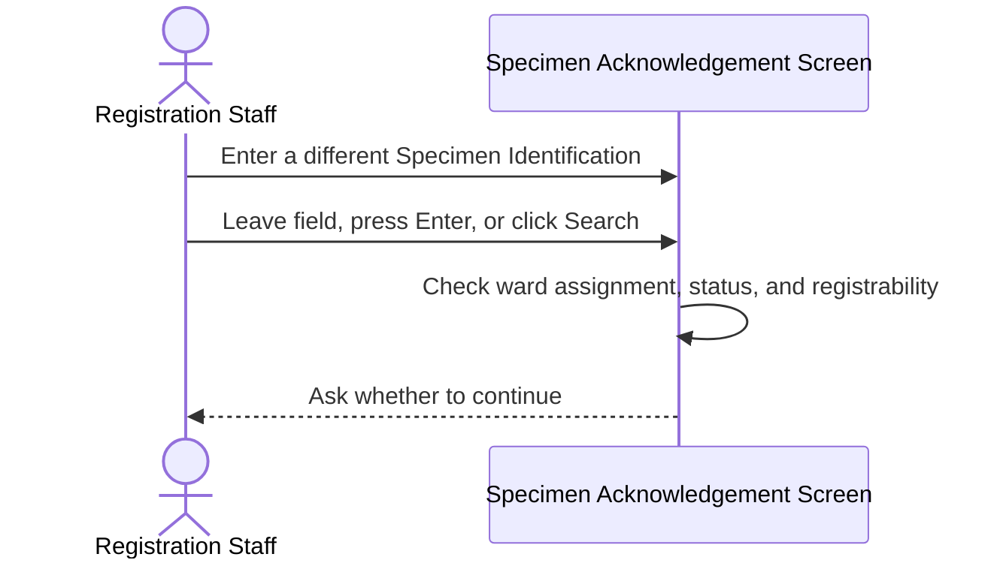
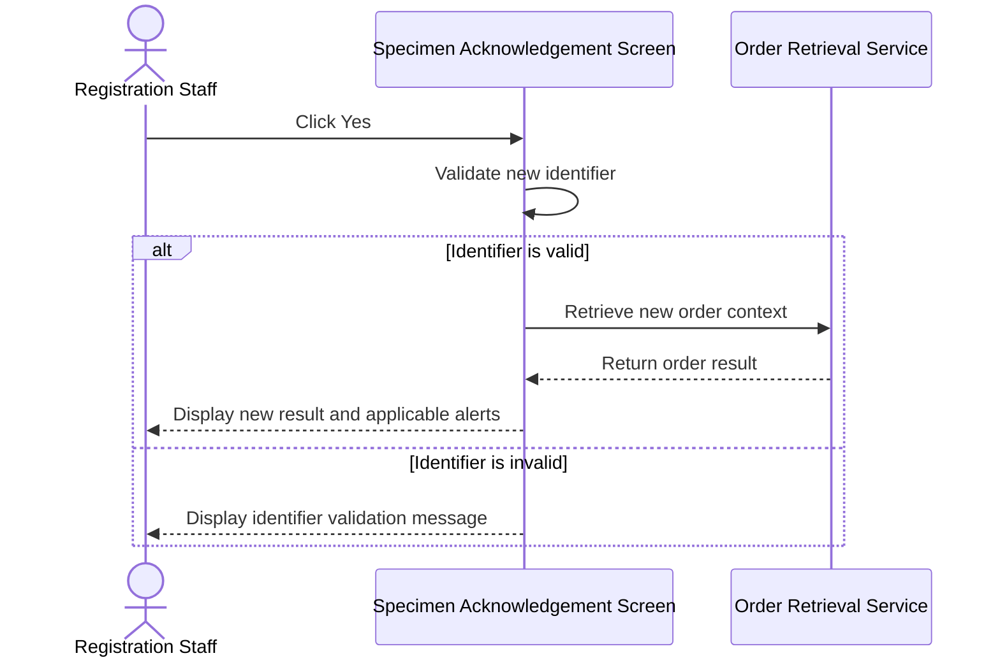
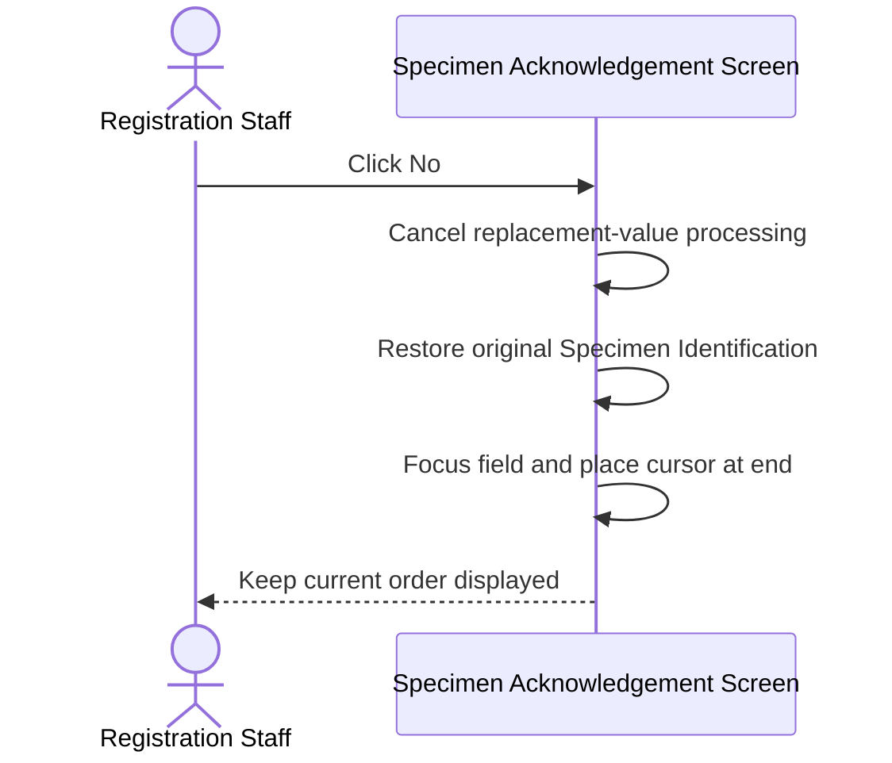
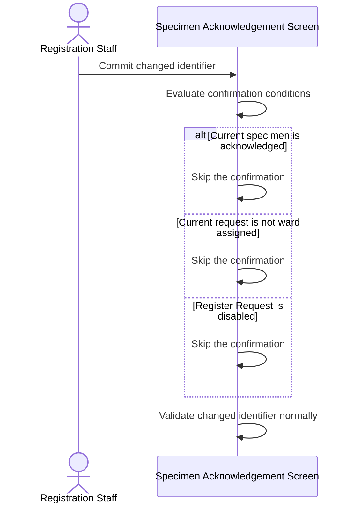
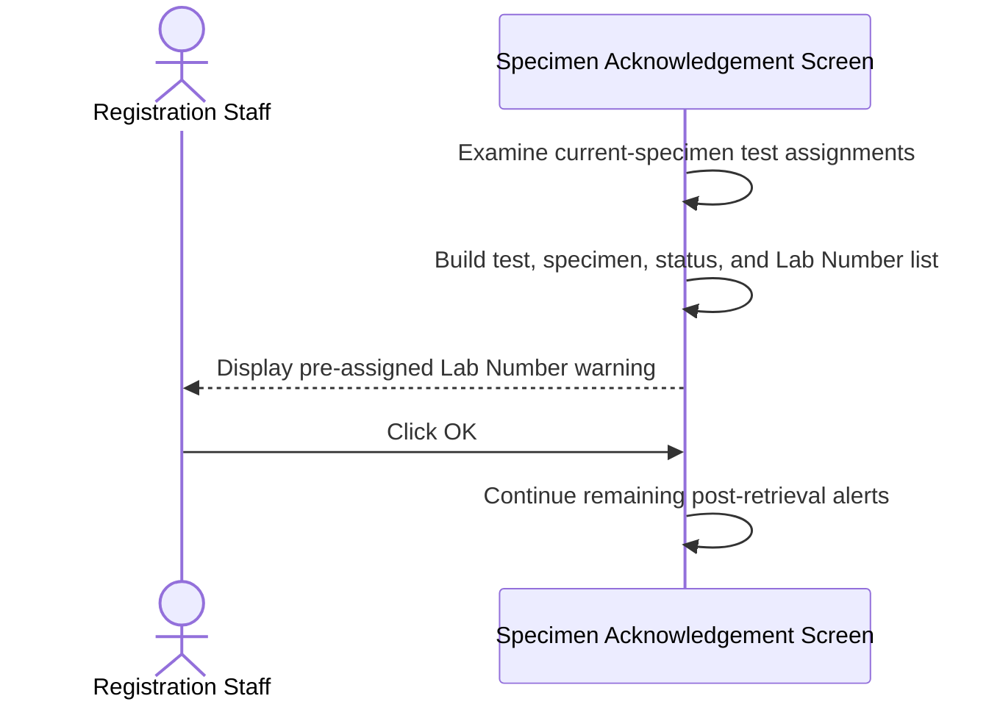

# Confirm Leaving Unacknowledged Ward-Assigned Request

## Overview

This workflow protects a ward-assigned request from being left before its current specimen has been acknowledged. When Registration Staff commit a replacement value in **Specimen No. / Lab No.**, the system asks whether to continue. Confirming starts validation of the new identifier. Declining restores the original identifier, returns focus to the field, and keeps the current request on screen. The same user story extract also defines a separate post-retrieval warning that lists tests already assigned a Lab Number.

---

## Related User Stories

- **[[CRST-471]]** - Specimen Acknowledgement - Alert Messaging: Ward Assign Case Not Acknowledged
- **[[CRST-162]]** - Specimen Acknowledgement - Alert Messaging
- **[[CRST-6]]** - Specimen Acknowledgement - Input Lab Number for a Ward-Assigned Case
- **[[CRST-47]]** - Specimen Acknowledgement - Ward-Assigned Request Number Registration

**Epic:** LISP-3 [CRST][DEV] Specimen Ack - Retrieve Order Information

---

## Key Concepts

### Ward-Assigned Request
A request whose Request Number was assigned in the ward before laboratory acknowledgement. The authoritative indicator is a Request Number stored on the test-to-specimen mapping while the test remains not registered.

### Not-Acknowledged Specimen
An active specimen that has not yet been acknowledged, rejected, or deleted. For this confirmation, that means **Label Printed without Collection Date/Time** or **Label Printed with Collection Date/Time**.

### Original Specimen Identification
The identifier currently displayed in **Specimen No. / Lab No.** before the user types or scans a replacement. Declining the confirmation restores this value.

### Pre-Assigned Lab Number Reminder
A separate post-retrieval warning. When the laboratory reminder is enabled and every relevant current-specimen test already carries a ward-assigned Request Number, the system lists those tests and numbers. It is not part of the leave-request confirmation.

---

## Trigger Point

> The confirmation begins after a ward-assigned, registrable, not-acknowledged specimen is already displayed, and Registration Staff commit a changed value in **Specimen No. / Lab No.** by leaving the field, pressing **Enter**, or clicking **Search**.

---

## Workflow Scenarios

### Scenario 1: Ask Before Replacing an Unacknowledged Ward-Assigned Request

#### Prerequisites

- A GCRS order is currently displayed.
- The current specimen is not acknowledged.
- The current request is ward assigned.
- **Register Request** is enabled.
- The user has entered a value different from the original Specimen Identification.

#### Process Flow

#### Step-by-Step Details

1. Registration Staff type or scan a replacement value in **Specimen No. / Lab No.**
2. The confirmation is evaluated when the changed value is committed by blur, **Enter**, or **Search**. It does not appear on every keystroke.
3. The system confirms that the current specimen is ward assigned, not acknowledged, and still registrable.
4. Message `3915` asks: **The current request has not been acknowledged. Do you want to continue?**
5. The user must choose **Yes** or **No**. There is no separate **Cancel** action.

---

### Scenario 2: Confirm and Process the New Identifier

#### Prerequisites

- Message `3915` is displayed.

#### Process Flow

#### Step-by-Step Details

1. The user clicks **Yes** on message `3915`.
2. The newly entered value becomes the active Specimen Identification candidate.
3. The system validates its format and determines whether it is a Specimen Number, Request Number, Order Number, barcode, or Unique Specimen Identifier.
4. If valid, the current screen context is replaced by the retrieval result for the new identifier.
5. If invalid or not found, the applicable validation or retrieval message is displayed.
6. Applicable post-retrieval alerts are then evaluated for the new order.
7. Clicking **Yes** does not acknowledge the previous specimen or write any data.

---

### Scenario 3: Decline and Remain on the Current Request

#### Prerequisites

- Message `3915` is displayed.

#### Process Flow

#### Step-by-Step Details

1. The user clicks **No** on message `3915`.
2. Validation and retrieval of the replacement value are cancelled.
3. **Specimen No. / Lab No.** is restored to the original Specimen Identification.
4. Focus returns to the field and the cursor is placed at the end of the restored value.
5. The existing order, patient, specimen, and test context remains displayed.
6. No backend request or database write occurs.

---

### Scenario 4: Continue Without the Confirmation

#### Prerequisites

At least one confirmation condition does not apply.

#### Process Flow

#### Step-by-Step Details

1. Message `3915` is not required when the current specimen has already been acknowledged.
2. It is not required for a request that is not ward assigned.
3. It is not required when **Register Request** is unavailable.
4. An unchanged field value is ignored and does not trigger validation or the message.
5. A changed value proceeds directly to normal identifier validation when the confirmation does not apply.

---

### Scenario 5: Remind Staff About Pre-Assigned Lab Numbers

#### Prerequisites

- A GCRS order with a current specimen has been retrieved.
- **Remind Pre-Assigned Lab Number** is enabled for the laboratory.
- Every relevant current-specimen test is not registered and already has a ward-assigned Request Number.

#### Process Flow

#### Step-by-Step Details

1. After successful retrieval, the system checks the current specimen's not-registered tests.
2. Each qualifying test must have a ward-assigned Request Number.
3. Message `1067` states that all tests for the specimen are pre-assigned to a Lab Number.
4. The message lists the Test Description, Specimen Description and status, and pre-assigned Lab Number for each applicable test.
5. The user clicks **OK**, and the remaining post-retrieval alert sequence continues.
6. This reminder does not change assigned Request Numbers or any test status.

> Message `1067` is a post-retrieval warning. It is separate from the message `3915` decision that occurs before replacing the current identifier. The extracted user story places this heading after the decline path; treat it as a distinct trigger, not as part of clicking **No**.

---

## Summary Tables

### Message Definitions

| Code | Text | Type | Buttons | Trigger Point |
|---|---|---|---|---|
| `3915` | The current request has not been acknowledged. Do you want to continue? | Question | **Yes / No** | Before validating a changed identifier on an unacknowledged ward-assigned request |
| `1067` | All tests for this specimen are pre-assigned to a labno. Test Desc (Specimen Desc) --Lab no, followed by the parameter list | Warning | **OK** | After successful order retrieval when the reminder is enabled |

### Decision Matrix

| Current Specimen | Actual Ward Assignment | Register Request Enabled | Changed Input | Show Message `3915` |
|---|---:|---:|---:|---:|
| Label Printed without Collection Date/Time | Yes | Yes | Yes | Yes |
| Label Printed with Collection Date/Time | Yes | Yes | Yes | Yes |
| Acknowledged | Yes | Yes | Yes | No |
| Rejected or Deleted | Yes | No | Yes | No |
| Pre-acknowledgement | No | Yes | Yes | No |
| Pre-acknowledgement | Yes | No | Yes | No |
| Pre-acknowledgement | Yes | Yes | No | No |

### User Choice Outcomes

| Choice | Replacement Input | Original Request | Focus | Backend Retrieval |
|---|---|---|---|---|
| **Yes** | Validated and retrieved when valid | Replaced after successful retrieval | Follows normal retrieval behaviour | Yes, after successful validation |
| **No** | Discarded | Remains displayed | Returned to **Specimen No. / Lab No.**, cursor at end | No |

### Pre-Assigned Reminder Detail

| Detail | Source |
|---|---|
| Test Description | Current test or mapped LIS test description |
| Specimen Description | Current specimen description, or specimen site and specified location for Anatomical Pathology |
| Specimen Status | Current specimen status |
| Pre-Assigned Lab Number | Ward-assigned Request Number |

### Data Written

Message `3915`, either response to it, and message `1067` do not write order, request, test, specimen, Lab Number, or configuration data. Choosing **Yes** only permits a read-only retrieval of the replacement identifier. Later acknowledgement or registration actions are separate workflows.

---

## Data Sources

| Data | Business Source | Table | Column | Notes |
|---|---|---|---|---|
| Specimen Status | GCRS specimen | `loe_specimen_detail` | `loespec_spec_status` | `P` or `C` are the intended not-acknowledged states; `A` is acknowledged |
| Specimen Number | GCRS specimen | `loe_specimen_detail` | `loespec_specno` | Identifies the displayed specimen |
| Specimen Suffix | GCRS specimen | `loe_specimen_detail` | `loespec_specno_suffix` | Completes the displayed specimen identity |
| Specimen Description | GCRS specimen | `loe_specimen_detail` | `loespec_spec_desc` | Used in the pre-assigned reminder list |
| Specimen Site | GCRS specimen | `loe_specimen_detail` | `loespec_spec_site` | Used instead of specimen description for Anatomical Pathology reminder rows |
| Specified Location | GCRS specimen | `loe_specimen_detail` | `loespec_specified_locn` | Appended to the Anatomical Pathology reminder row when present |
| Unique Specimen Identifier | GCRS specimen | `loe_specimen_detail` | `loespec_unique_id` | Alternative identification; must not by itself prove ward assignment |
| Request Sequence | Test-to-specimen mapping | `loe_request_test_spec` | `loereqtsp_req_seqno` | Connects the ward-assigned mapping to the order context |
| Test Sequence | Test-to-specimen mapping | `loe_request_test_spec` | `loereqtsp_test_seqno` | Links the assignment to the ordered test |
| Mapped Specimen Number | Test-to-specimen mapping | `loe_request_test_spec` | `loereqtsp_specno` | Links the assignment to the specimen |
| Ward-Assigned Request Number | Test-to-specimen mapping | `loe_request_test_spec` | `loereqtsp_reqno` | A non-empty value on a not-registered test is the authoritative ward-assignment indicator |
| Test Status | GCRS ordered test | `loe_request_test` | `loereqtst_test_status` | Ward-assigned tests are not registered (`P`) when the alert applies |
| Test Request Number | GCRS ordered test | `loe_request_test` | `loereqtst_reqno` | May already hold an assigned number; the mapping value is the ward fallback |
| Test Description | GCRS ordered test | `loe_request_test` | `loereqtst_test_desc` | Included in the pre-assigned reminder |
| Test Code | GCRS ordered test | `loe_request_test` | `loereqtst_test_code` | Resolves mapped LIS descriptions |
| Option Hospital | GCRS option | `loe_control` | `loectrl_hosp` | Hospital scope of each option |
| Option Group | GCRS option | `loe_control` | `loectrl_group` | `HOSP_SETTING` for these options |
| Option Name | GCRS option | `loe_control` | `loectrl_name` | Stores the option code |
| Option Value | GCRS option | `loe_control` | `loectrl_value` | Stores enabled state or enabled laboratory list |

---

## Configuration

| Setting | Option Code | Source | Purpose | Enabled | Disabled or Missing |
|---|---|---|---|---|---|
| Ward Print Lab Number Label | `WARD_PRINT_LABNO_LABEL` | `loe_control`, group `HOSP_SETTING` | Enables ward Request Number label behaviour | Ward-label functions are available | Ward-label functions are unavailable |
| Ward Print Enabled Laboratories | `WARD_PRINT_LABNO_ENABLED_LAB` | `loe_control`, group `HOSP_SETTING` | Lists laboratories allowed to use ward Request Number labels | Listed laboratories participate | Other laboratories do not participate |
| Remind Pre-Assigned Lab Number | `REMIND_PRE_ASSIGNED_LABNO` | `loe_control`, group `HOSP_SETTING` | Controls message `1067` after retrieval | Pre-assigned test and Lab Number details are shown | No reminder is shown |

> Ward-label configuration controls label printing and related retrieval. The actual presence of a ward-assigned Request Number must determine whether the current request is ward assigned for message `3915`.

---

## Business Rules

1. Message `3915` applies only when the current specimen is both not acknowledged and actually ward assigned.
2. The intended active not-acknowledged statuses are Label Printed without Collection Date/Time and Label Printed with Collection Date/Time.
3. **Register Request** must be enabled before message `3915` is shown.
4. The confirmation occurs only after the user commits a changed identifier, not on every keystroke.
5. Clicking **Yes** starts normal validation of the newly entered identifier.
6. Clicking **No** restores the original identifier, preserves the displayed request, and returns focus to **Specimen No. / Lab No.**
7. Clicking **No** must not perform a retrieval request or write data.
8. An unchanged identifier does not trigger the confirmation.
9. Ward-label configuration must not be used as a substitute for the actual ward-assignment state.
10. Message `1067` is a separate post-retrieval warning controlled by its own option.
11. The pre-assigned reminder lists every qualifying current-specimen test and its assigned Lab Number.
12. Acknowledging either message does not acknowledge the specimen or register its tests.

---

## Related Workflows

- [[Retrieve Order Information by Specimen Number]] — Validates and retrieves the replacement identifier after the user confirms.
- [[Input Lab Number for Ward-Assigned Request]] — Retrieves a ward-assigned request by Request Number.
- [[Show Post-Retrieval Specimen Status Alerts]] — Runs status-based alerts after a new order is retrieved.
- [[Retrieve Registered Request by Lab Number]] — Retrieves requests that already have assigned Lab Numbers.
- [[Specimen Number with 2D Barcode Input]] — May normalise a barcode into the identifier that is later restored on decline.

---

Technical Notes — Legacy and Revamp Traceability

- Message `3915` exists with the required text, Question severity, and **Yes / No** layout. The acceptance summaries incorrectly say “acknowledged specimen” in the confirm and decline headings, while the condition and message consistently mean “not acknowledged.”
- The story wording “input anything into the Specimen No. input field” is implemented as a committed change on blur, **Enter**, or **Search**, not as a per-keystroke prompt.
- The backend already exposes an authoritative ward-assignment signal: a non-empty `loereqtsp_reqno` maps a not-registered test to registration type `WardAssign`. Neither the examined legacy pre-modify guard nor the revamp confirmation uses that signal.
- Legacy approximates ward assignment with ward-label options plus a parsed Request Number on the current identification, or a Unique Specimen Identifier. Revamp approximates it with ward-label options plus a current Specimen Number, or a Unique Specimen Identifier. A true ward-assigned specimen retrieved by Specimen Number, or a non-ward Unique Specimen Identifier case, can therefore miss or over-trigger message `3915`.
- Revamp also requires specimen status not equal to Acknowledged. Legacy relies on **Register Request** enablement and does not test status directly. Enablement normally limits the prompt to Label Printed without or with Collection Date/Time, but that is a proxy.
- Revamp **No** restores the value, focus, and cursor position. Legacy restores the previous text and cancels processing, but does not explicitly restore focus in the examined branch.
- A normalised Request Number from a 2D barcode may be stored as the previous identifier, so declining a later change can restore the decoded value rather than the original barcode string.
- Legacy has a save-state protection message `4019` in the same pre-modify function. No equivalent branch was identified in the revamp confirmation. That path is outside this user story's acceptance criteria.
- The revamp identification field contains unused Unique Specimen Identifier / non-acknowledged state handling that never becomes active in the examined code. It must not be treated as a required CRST-471 path.
- Message code `3915` is reused in a DFT label-printing decision. That displays the ward acknowledgement question for an unrelated print action. The neighbouring dictionary entry for printing labels for all specimens is `2635` and is the likely intended print message.
- Message `1067`, option `REMIND_PRE_ASSIGNED_LABNO`, and the multiline pre-assigned Lab Number content builder exist in legacy post-retrieval alerting and are absent from the revamp. The catalogue code reference for CRST-471 is the pre-modify confirmation, so the `1067` heading in the extracted story may be concatenated CRST-162 content. It is documented here because it is present in the CRST-471 extract, as a separate trigger.
- No focused automated tests were identified for message `3915`, actual `WardAssign` detection, **Yes / No** behaviour, exact restoration, trigger events, message `1067`, or read-only behaviour.

