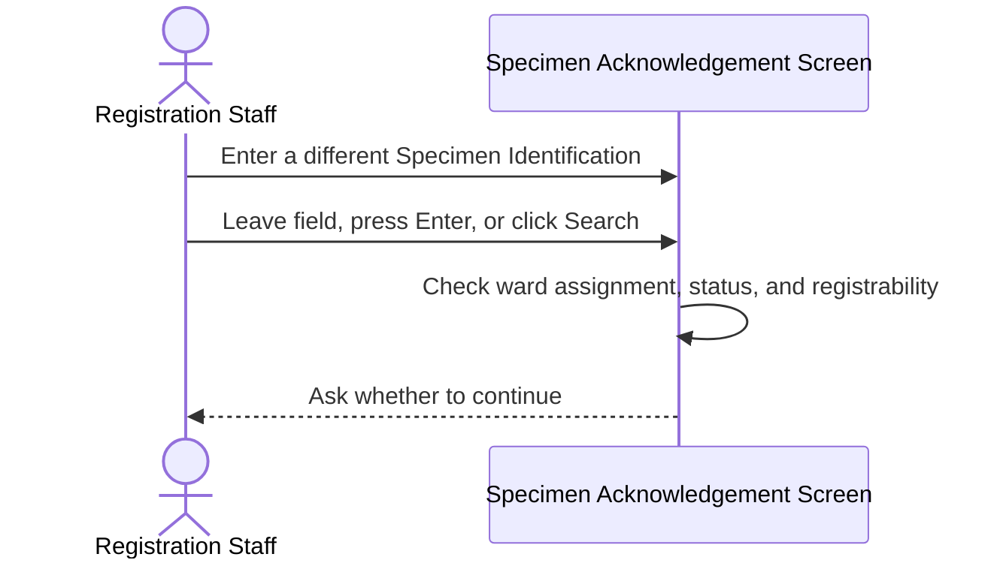
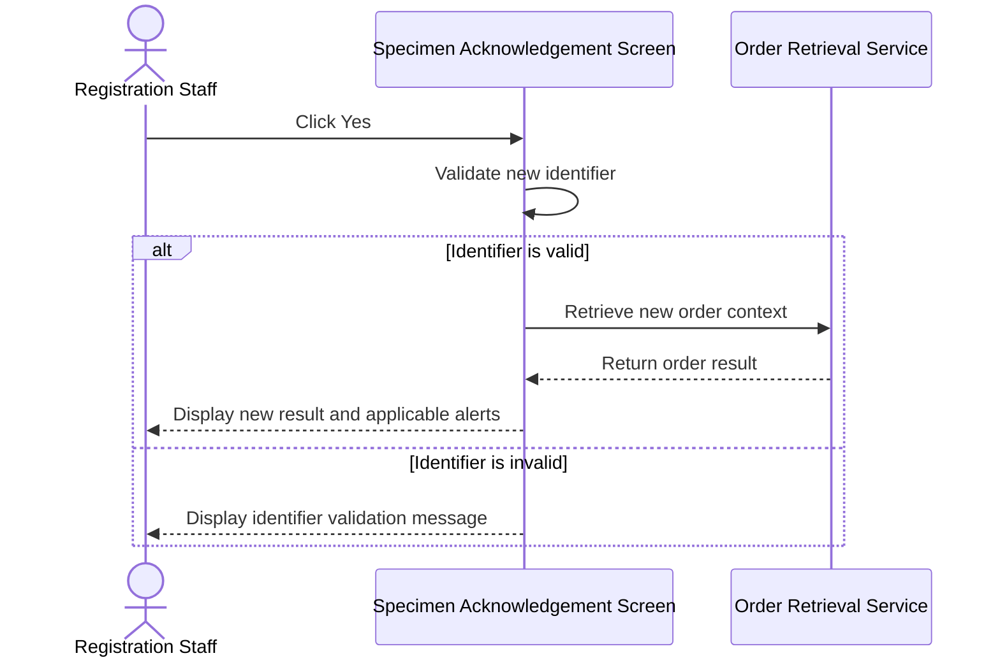
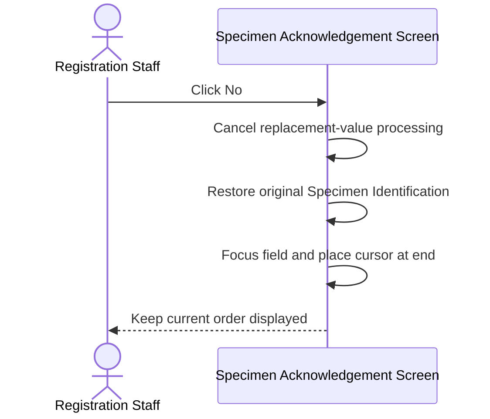
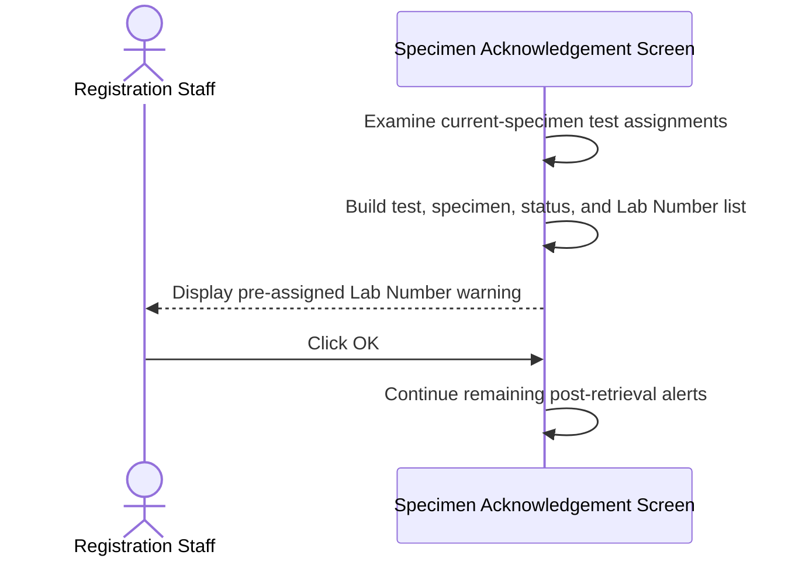

# Confirm Leaving Unacknowledged Ward-Assigned Request

## Overview

This workflow protects a ward-assigned request from being left before its current specimen has been acknowledged. When Registration Staff attempt to replace the current Specimen Identification, the system asks whether to continue. Confirming proceeds with validation of the new value, while declining restores the original identifier and keeps the user on the current request. The same user story also defines a separate post-retrieval warning that lists tests already assigned a Lab Number.

---

## Related User Stories

- **[[CRST-471]]** - Specimen Acknowledgement - Alert Messaging: Ward Assign Case Not Acknowledged
- **[[CRST-162]]** - Specimen Acknowledgement - Alert Messaging

**Epic:** LISP-3 [CRST][DEV] Specimen Ack - Retrieve Order Information

---

## Key Concepts

### Ward-Assigned Request
A request whose Request Number was assigned in the ward before laboratory acknowledgement. It is identified by a Request Number held in the test-to-specimen mapping while the test remains not registered.

### Not-Acknowledged Specimen
An active specimen in a pre-acknowledgement state. For this workflow, this means a specimen with status **Label Printed without Collection Date/Time** or **Label Printed with Collection Date/Time**, rather than Acknowledged, Rejected, or Deleted.

### Original Specimen Identification
The identifier for the request currently displayed before the user types a replacement value. It is restored when the user declines to leave the current request.

### Pre-Assigned Lab Number Reminder
A separate warning displayed after retrieval when all relevant current-specimen tests already carry ward-assigned Request Numbers and the reminder option is enabled.

---

## Trigger Point

> This workflow begins when a ward-assigned, registrable specimen is displayed but has not been acknowledged, and Registration Staff commit a changed value in the **Specimen No. / Lab No.** field by leaving the field, pressing **Enter**, or clicking **Search**.

---

## Workflow Scenarios

### Scenario 1: Ask Before Replacing an Unacknowledged Ward-Assigned Request

#### Prerequisites

- A GCRS order is currently displayed.
- The current specimen is in a pre-acknowledgement status.
- At least one current-specimen test is identified as ward assigned.
- **Register Request** is enabled.
- The user has entered a value different from the original Specimen Identification.

#### Process Flow

#### Step-by-Step Details

1. Registration Staff type or scan a replacement value in the **Specimen No. / Lab No.** field.
2. Processing starts when the changed value is committed by blur, **Enter**, or **Search**; the message does not appear on every keystroke.
3. The system confirms that the current specimen is ward assigned, not acknowledged, and still registrable.
4. Message `3915` asks: **The current request has not been acknowledged. Do you want to continue?**
5. The user must choose **Yes** or **No**; there is no separate **Cancel** action.

---

### Scenario 2: Confirm and Process the New Identifier

#### Prerequisites

- Message `3915` is displayed.

#### Process Flow

#### Step-by-Step Details

1. The user clicks **Yes** on message `3915`.
2. The newly entered value becomes the active Specimen Identification candidate.
3. The system validates its format and determines whether it represents a Specimen Number, Request Number, Order Number, barcode, or Unique Specimen Identifier (USID).
4. If valid, the current screen context is replaced by the retrieval result for the new identifier.
5. If invalid or not found, the applicable validation or retrieval message is displayed.
6. Applicable post-retrieval alerts are then evaluated for the new order.
7. Clicking **Yes** itself does not acknowledge the previous specimen or write any data.

---

### Scenario 3: Decline and Remain on the Current Request

#### Prerequisites

- Message `3915` is displayed.

#### Process Flow

#### Step-by-Step Details

1. The user clicks **No** on message `3915`.
2. Validation and retrieval of the replacement value are cancelled.
3. The **Specimen No. / Lab No.** field is restored to the original Specimen Identification.
4. Focus returns to the field and the cursor is positioned at the end of the value.
5. The existing order, patient, specimen, and test context remains displayed.
6. No backend request or database write occurs.

---

### Scenario 4: Continue Without the Confirmation

#### Prerequisites

At least one confirmation condition does not apply.

#### Process Flow

#### Step-by-Step Details

1. Message `3915` is not required when the current specimen has already been acknowledged.
2. It is not required for a request that is not ward assigned.
3. It is not required when **Register Request** is unavailable.
4. An unchanged field value is ignored and does not trigger validation or the message.
5. A changed value proceeds directly to normal validation when the guard does not apply.

---

### Scenario 5: Remind Staff About Pre-Assigned Lab Numbers

#### Prerequisites

- A GCRS order with a current specimen has been retrieved.
- **Remind Pre-Assigned Lab Number** is enabled for the laboratory.
- Every relevant current-specimen test is not registered and already has a ward-assigned Request Number.

#### Process Flow

#### Step-by-Step Details

1. After successful retrieval, the system checks the current specimen's not-registered tests.
2. Each qualifying test must have a ward-assigned Request Number.
3. Message `1067` states that all tests for the specimen are pre-assigned to a Lab Number.
4. The message lists the Test Description, Specimen Description and status, and pre-assigned Lab Number for each applicable test.
5. The user clicks **OK** and the remaining post-retrieval alert sequence continues.
6. This reminder does not change the assigned Request Numbers or any test status.

> Message `1067` is a post-retrieval warning. It is separate from the message `3915` decision that occurs before replacing the current identifier.

---

## Summary Tables

### Message Definitions

| Code | Text | Type | Buttons | Trigger Point |
|---|---|---|---|---|
| `3915` | The current request has not been acknowledged. Do you want to continue? | Question | **Yes / No** | Before validating a changed identifier |
| `1067` | All tests for this specimen are pre-assigned to a Lab Number, followed by test/specimen/Lab Number details | Warning | **OK** | After successful order retrieval |

### Message `3915` Decision Matrix

| Current Specimen | Actual Ward Assignment | Register Enabled | Changed Input | Show Message |
|---|---:|---:|---:|---:|
| Label Printed without Collection Date/Time | Yes | Yes | Yes | Yes |
| Label Printed with Collection Date/Time | Yes | Yes | Yes | Yes |
| Acknowledged | Yes | Yes | Yes | No |
| Rejected or Deleted | Yes | No | Yes | No |
| Pre-acknowledgement | No | Yes | Yes | No |
| Pre-acknowledgement | Yes | No | Yes | No |
| Pre-acknowledgement | Yes | Yes | No | No |

### User Choice Outcomes

| Choice | Replacement Input | Original Request | Focus | Backend Retrieval |
|---|---|---|---|---|
| **Yes** | Validated and retrieved when valid | Replaced after successful retrieval | Follows normal retrieval behavior | Yes, after successful validation |
| **No** | Discarded | Remains displayed | Returned to identification field | No |

### Pre-Assigned Reminder Detail

| Detail | Source |
|---|---|
| Test Description | Current test or mapped LIS test description |
| Specimen Description | Current specimen description |
| Specimen Status | Current specimen status |
| Pre-Assigned Lab Number | Ward-assigned Request Number |

---

## Data Sources

| Data | Source | Table | Column | Notes |
|---|---|---|---|---|
| Specimen Status | GCRS specimen | `loe_specimen_detail` | `loespec_spec_status` | `P` or `C` represents the intended not-acknowledged states |
| Specimen Number | GCRS specimen | `loe_specimen_detail` | `loespec_specno` | Identifies the displayed specimen |
| Specimen Suffix | GCRS specimen | `loe_specimen_detail` | `loespec_specno_suffix` | Completes the displayed specimen identity |
| Request Sequence | Test-to-specimen mapping | `loe_request_test_spec` | `loereqtsp_req_seqno` | Connects the ward-assigned mapping to the order context |
| Test Sequence | Test-to-specimen mapping | `loe_request_test_spec` | `loereqtsp_test_seqno` | Links the assignment to the ordered test |
| Mapped Specimen Number | Test-to-specimen mapping | `loe_request_test_spec` | `loereqtsp_specno` | Links the assignment to the specimen |
| Ward-Assigned Request Number | Test-to-specimen mapping | `loe_request_test_spec` | `loereqtsp_reqno` | A non-empty value is the authoritative ward-assignment indicator |
| Test Status | GCRS ordered test | `loe_request_test` | `loereqtst_test_status` | Ward-assigned tests are not registered when the alert applies |
| Test Request Number | GCRS ordered test | `loe_request_test` | `loereqtst_reqno` | Used when already assigned on the test; mapping value is the ward fallback |
| Test Description | GCRS ordered test | `loe_request_test` | `loereqtst_test_desc` | Included in the pre-assigned reminder |
| Test Code | GCRS ordered test | `loe_request_test` | `loereqtst_test_code` | Resolves mapped LIS descriptions |
| Option Hospital | GCRS option | `loe_control` | `loectrl_hosp` | Hospital scope of each option |
| Option Group | GCRS option | `loe_control` | `loectrl_group` | `HOSP_SETTING` for these options |
| Option Name | GCRS option | `loe_control` | `loectrl_name` | Stores the option code |
| Option Value | GCRS option | `loe_control` | `loectrl_value` | Stores enabled state or enabled Lab Number list |

### Data Written

Message `3915`, either response to it, and message `1067` do not write order, request, test, specimen, Lab Number, or configuration data. Choosing **Yes** only permits a read-only retrieval of the replacement identifier; later acknowledgement or registration actions are separate workflows.

---

## Configuration

| Setting | Option Code | Source | Purpose | Enabled | Disabled or Missing |
|---|---|---|---|---|---|
| Ward Print Lab Number Label | `WARD_PRINT_LABNO_LABEL` | `loe_control`, group `HOSP_SETTING` | Enables ward Request Number label behavior | Ward-label functions are available | Ward-label functions are unavailable |
| Ward Print Enabled Laboratories | `WARD_PRINT_LABNO_ENABLED_LAB` | `loe_control`, group `HOSP_SETTING` | Lists laboratories allowed to use ward Request Number labels | Listed laboratories participate | Other laboratories do not participate |
| Remind Pre-Assigned Lab Number | `REMIND_PRE_ASSIGNED_LABNO` | `loe_control`, group `HOSP_SETTING` | Controls message `1067` after retrieval | Pre-assigned test/Lab Number details are shown | No reminder is shown |

> Ward-label configuration controls label behavior. The actual presence of a ward-assigned Request Number must determine whether the current request is ward assigned.

---

## Business Rules

1. Message `3915` applies only when the current specimen is both not acknowledged and actually ward assigned.
2. The intended active not-acknowledged statuses are Label Printed without Collection Date/Time and Label Printed with Collection Date/Time.
3. **Register Request** must be enabled before message `3915` is shown.
4. The confirmation occurs only after the user commits a changed identifier, not on every keystroke.
5. Clicking **Yes** starts normal validation of the newly entered identifier.
6. Clicking **No** restores the original identifier, preserves the displayed request, and returns focus to the identification field.
7. Clicking **No** must not perform a retrieval request or write data.
8. An unchanged identifier does not trigger the confirmation.
9. Ward-label configuration must not be used as a substitute for the actual ward-assignment state.
10. Message `1067` is a separate post-retrieval warning controlled by its own option.
11. The pre-assigned reminder lists every qualifying current-specimen test and its assigned Lab Number.
12. Acknowledging either message does not acknowledge the specimen or register its tests.

---

## Related Workflows

- [[Retrieve Order Information by Specimen Number]] — Validates and retrieves the replacement identifier after the user confirms.
- [[Show Post-Retrieval Specimen Status Alerts]] — Runs status-based alerts after a new order is retrieved.
- [[Retrieve Registered Request by Lab Number]] — Retrieves requests that already have assigned Lab Numbers.
- [[Input Lab Number for Ward-Assigned Request]] — Handles direct Lab Number input for ward-assigned requests.

---

Technical Notes — Legacy and Revamp Traceability

- Message `3915` is present with the required text, Question severity, and **Yes / No** layout. The acceptance summaries incorrectly say “acknowledged specimen,” while the condition and message consistently mean “not acknowledged.”
- The revamp activates the guard on field blur, **Enter**, or **Search**, not on every input event.
- The backend already exposes an authoritative ward-assignment signal: a non-empty `loereqtsp_reqno` maps a not-registered test to registration type `WardAssign`.
- The revamp does not use that signal for message `3915`. It substitutes ward-label options and current identifier type, allowing non-ward specimens to trigger the message and true ward-assigned specimens to miss it.
- Legacy also used a ward-label proxy rather than directly testing the backend ward-assignment flag and did not explicitly test specimen status. The revamp adds a broad not-Acknowledged check, normally narrowed to `P` or `C` by registration enablement.
- USID input bypasses both ward-label configuration checks in the current revamp predicate, so a non-ward USID case can receive message `3915`.
- The revamp **No** path explicitly restores the value, focus, and cursor position. Legacy restored the value but did not explicitly restore focus in the examined branch.
- A normalized Request Number from a 2D barcode may be stored as the previous identifier, so declining a later change can restore the decoded value rather than the original barcode string.
- Legacy has a save-state protection message `4019`; no equivalent branch was identified in the revamp guard.
- Message `1067`, option `REMIND_PRE_ASSIGNED_LABNO`, and the multiline pre-assigned Lab Number content builder are absent from the revamp.
- Message code `3915` is incorrectly reused in a DFT label-printing decision. This displays the ward acknowledgement question for an unrelated action and must use a distinct message.
- No focused automated tests were identified for message `3915`, actual `WardAssign` detection, **Yes / No** behavior, exact restoration, trigger events, message `1067`, or read-only behavior.

