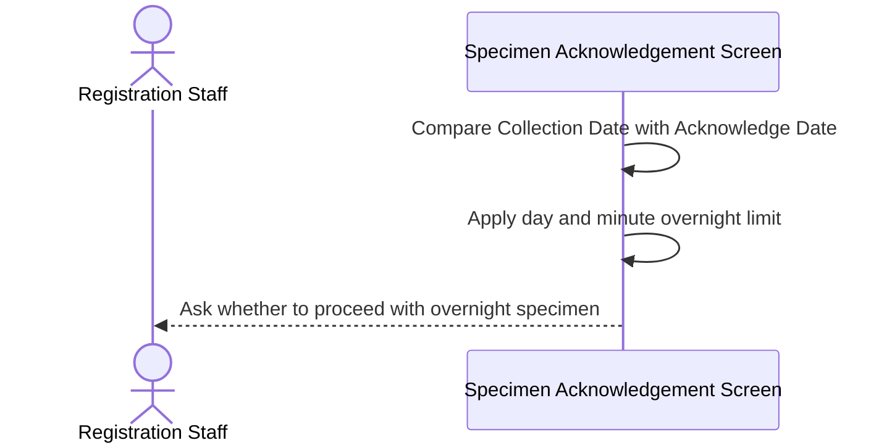
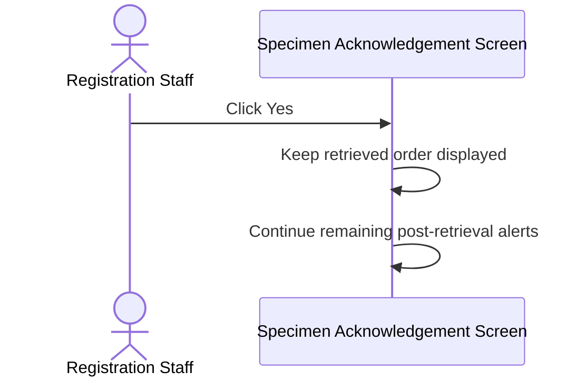
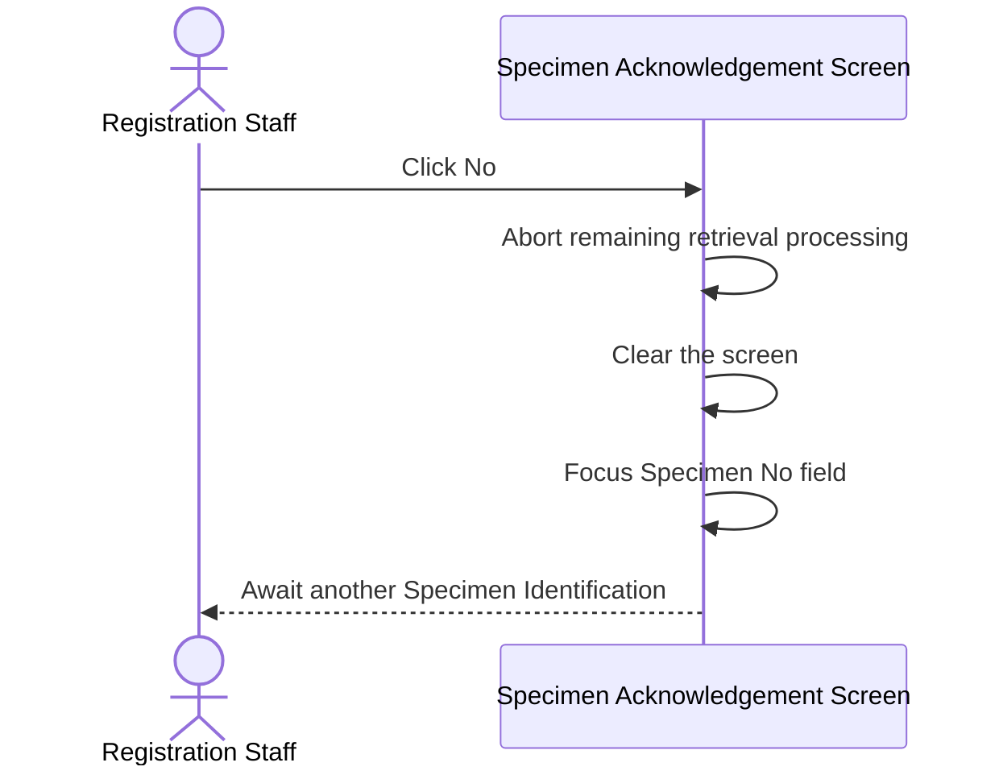
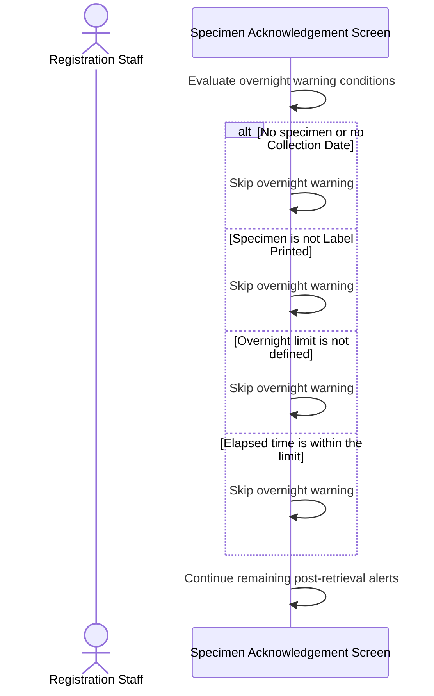

# Confirm Overnight Specimen After Retrieval

## Overview

This workflow warns Registration Staff when a retrieved specimen was collected so long before the current Acknowledge Date that it is treated as an overnight specimen. The laboratory overnight limit is read from hospital setting `COLLECT_DATE_EXCEED`. When the elapsed time from **Collection Date** to **Acknowledge Date** exceeds that limit, the system asks whether to proceed. **Yes** keeps the retrieved order and continues remaining alerts. **No** aborts further processing, clears the screen, and returns focus to **Specimen No. / Lab No.**

---

## Related User Stories

- **[[CRST-472]]** - Specimen Acknowledgement - Alert Messaging: Overnight Specimen
- **[[CRST-162]]** - Specimen Acknowledgement - Alert Messaging

**Epic:** LISP-3 [CRST][DEV] Specimen Ack - Retrieve Order Information

---

## Key Concepts

### Overnight Specimen
A specimen whose **Collection Date** is earlier than the current **Acknowledge Date** by more than the laboratory overnight limit. The message refers to this as an overnight specimen and compares Collection Date with Arrival Date, which is the Acknowledge Date shown on the screen.

### Overnight Limit
A laboratory option stored as one or two numbers. A single number is a whole-day limit. Two numbers are a day limit plus extra minutes. The check uses the total minutes represented by that option.

### Acknowledge Date
The acknowledgement date and time currently used on the Specimen Acknowledgement screen. After retrieval of a not-yet-acknowledged specimen, this is the current date and time. It is the Arrival Date named in the overnight message.

---

## Trigger Point

> This workflow begins automatically after GCRS order, specimen, and test data have been retrieved and displayed, when the current specimen has a Collection Date and a Label Printed status, before the user acknowledges, rejects, or registers the specimen.

---

## Workflow Scenarios

### Scenario 1: Warn When Collection Exceeds the Day Limit

#### Prerequisites

- A GCRS order with a current specimen has been retrieved.
- The specimen has a Collection Date.
- Specimen status is Label Printed without Collection Date/Time or Label Printed with Collection Date/Time.
- Overnight limit is defined as a single day value, for example `1`.
- The minute difference between Collection Date and Acknowledge Date is greater than the day limit converted to minutes.

#### Process Flow

#### Step-by-Step Details

1. The system confirms that the current specimen exists, has a Collection Date, and is in a Label Printed status.
2. The overnight option contains one number. That number of days is converted to minutes, for example 1 day becomes 1,440 minutes.
3. The elapsed minutes from Collection Date to Acknowledge Date are compared with that limit.
4. If the elapsed time is greater than the limit, message `2151` asks whether to proceed.
5. Parameter 1 is the configured day limit.
6. The user must choose **Yes** or **No**.

---

### Scenario 2: Warn When Collection Exceeds the Day-and-Minute Limit

#### Prerequisites

- A GCRS order with a current specimen has been retrieved.
- The specimen has a Collection Date.
- Specimen status is Label Printed without Collection Date/Time or Label Printed with Collection Date/Time.
- Overnight limit is defined as a day value and an extra-minute value, for example `1,240`.
- The minute difference between Collection Date and Acknowledge Date is greater than that combined limit.

#### Process Flow

#### Step-by-Step Details

1. The system confirms the same specimen, Collection Date, and Label Printed conditions as the day-only path.
2. The overnight option contains two numbers. The first is days and the second is extra minutes, for example 1 day plus 240 minutes.
3. The combined limit in minutes is compared with the elapsed time from Collection Date to Acknowledge Date.
4. If the elapsed time is greater than the limit, message `2198` asks whether to proceed.
5. Parameter 1 is the configured day limit. Parameter 2 is the configured extra minutes.
6. The user must choose **Yes** or **No**.

---

### Scenario 3: Accept and Continue Remaining Retrieval Processing

#### Prerequisites

- Message `2151` or `2198` is displayed.

#### Process Flow

#### Step-by-Step Details

1. The user clicks **Yes**.
2. The retrieved order, patient, specimen, and test information remains displayed.
3. Remaining post-retrieval alerts continue in sequence.
4. Clicking **Yes** does not acknowledge the specimen, change Collection Date or Acknowledge Date, or write any data.

> The acceptance wording “order retrieval process continues” means the already retrieved order remains on screen and later alerts and actions may continue. Retrieval itself has already completed.

---

### Scenario 4: Decline, Clear the Screen, and Return Focus

#### Prerequisites

- Message `2151` or `2198` is displayed.

#### Process Flow

#### Step-by-Step Details

1. The user clicks **No**.
2. Remaining post-retrieval alerts and later retrieval processing are aborted.
3. The displayed order, patient, specimen, and test information is cleared.
4. Focus is set on **Specimen No. / Lab No.**
5. No specimen, request, or configuration data is written.

---

### Scenario 5: Skip the Overnight Warning

#### Prerequisites

At least one overnight-warning condition does not apply.

#### Process Flow

#### Step-by-Step Details

1. The warning is not shown when the order has no current specimen.
2. It is not shown when the specimen has no Collection Date.
3. It is not shown when specimen status is Acknowledged, Rejected, or Deleted.
4. It is not shown when `COLLECT_DATE_EXCEED` is missing or empty.
5. It is not shown when the elapsed time is equal to or less than the configured limit.
6. Remaining post-retrieval alerts continue.

---

## Summary Tables

### Message Definitions

| Code | Text | Type | Buttons | Trigger Point |
|---|---|---|---|---|
| `2151` | Collection Date is earlier than Arrival Date for [@PARM1] day(s)! Over night Specimen. Do you want to proceed? | Question | **Yes / No** | Elapsed time exceeds a day-only overnight limit |
| `2198` | Collection Date is earlier than Arrival Date for [@PARM1] day(s) and the elapse time is over [@PARM2] min(s)! Over night Specimen. Do you want to proceed? | Question | **Yes / No** | Elapsed time exceeds a day-and-minute overnight limit |

### Overnight Limit Matrix

| Option Value | Limit Used | Message | Parameter 1 | Parameter 2 |
|---|---|---|---|---|
| `1` | 1 × 24 × 60 minutes | `2151` | `1` | Not used |
| `1,240` | 1 × 24 × 60 + 240 minutes | `2198` | `1` | `240` |
| Missing or empty | No overnight check | None | — | — |
| Elapsed minutes ≤ limit | No overnight check | None | — | — |

### User Choice Outcomes

| Choice | Retrieved Order | Remaining Alerts | Focus | Database Change |
|---|---|---|---|---|
| **Yes** | Remains displayed | Continue | Unchanged by this message | None |
| **No** | Cleared | Aborted | **Specimen No. / Lab No.** | None |

### Data Written

Displaying message `2151` or `2198`, clicking **Yes**, and clicking **No** do not write order, specimen, Collection Date, Acknowledge Date, or configuration data. Clearing the screen after **No** only resets the current screen context.

---

## Data Sources

| Data | Business Source | Table | Column | Notes |
|---|---|---|---|---|
| Specimen Status | GCRS specimen | `loe_specimen_detail` | `loespec_spec_status` | Overnight warning applies only to `P` or `C` |
| Collection Date | GCRS specimen | `loe_specimen_detail` | `loespec_collect_dtm` | Start of the elapsed-time comparison; shown as **Collection Date** |
| Specimen Number | GCRS specimen | `loe_specimen_detail` | `loespec_specno` | Identifies the current specimen |
| Specimen Suffix | GCRS specimen | `loe_specimen_detail` | `loespec_specno_suffix` | Completes the current specimen identity |
| Acknowledge Date | Current screen acknowledgement date and time | — | — | Arrival Date in the message; defaulted to the current date and time for a not-yet-acknowledged specimen |
| Overnight Option Hospital | GCRS option | `loe_control` | `loectrl_hosp` | Hospital scope of the overnight limit |
| Overnight Option Group | GCRS option | `loe_control` | `loectrl_group` | `HOSP_SETTING` |
| Overnight Option Name | GCRS option | `loe_control` | `loectrl_name` | `COLLECT_DATE_EXCEED` |
| Overnight Option Value | GCRS option | `loe_control` | `loectrl_value` | `1` or `1,240` in the story examples |

---

## Configuration

| Setting | Option Code | Source | Purpose | Enabled | Disabled or Missing |
|---|---|---|---|---|---|
| Overnight Collection Date Exceeded | `COLLECT_DATE_EXCEED` | `loe_control`, group `HOSP_SETTING`, laboratory-scoped | Defines the overnight elapsed-time limit | One number uses message `2151`; two numbers use message `2198` | Overnight warning is skipped |

> The extracted user story writes the option name as `X_COLLECT_DATE_EXCEED`. The implemented and verified option code is `COLLECT_DATE_EXCEED`.

---

## Business Rules

1. The overnight warning is evaluated after order retrieval, with no extra user action required.
2. The current specimen must exist and have a Collection Date.
3. Specimen status must be Label Printed without Collection Date/Time or Label Printed with Collection Date/Time.
4. The overnight limit comes from `COLLECT_DATE_EXCEED`.
5. A single option value is a day count converted to minutes.
6. Two option values are a day count plus extra minutes.
7. The warning is shown only when elapsed minutes from Collection Date to Acknowledge Date are greater than the limit.
8. Message `2151` is used for a day-only limit. Message `2198` is used for a day-and-minute limit.
9. Message parameters are the configured limits, not the actual elapsed days or minutes.
10. **Yes** keeps the retrieved order and continues remaining alerts without writing data.
11. **No** aborts remaining processing, clears the screen, and focuses **Specimen No. / Lab No.** without writing data.
12. Acknowledged, rejected, deleted, or uncollected specimens skip this warning.

---

## Related Workflows

- [[Retrieve Order Information by Specimen Number]] — Supplies the specimen, Collection Date, and status evaluated by this warning.
- [[Show Post-Retrieval Specimen Status Alerts]] — Other status-based alerts in the same post-retrieval sequence.
- [[Confirm Leaving Unacknowledged Ward-Assigned Request]] — A separate confirmation that occurs later when leaving an unacknowledged ward-assigned request.

---

Technical Notes — Legacy and Revamp Traceability

- The extracted story writes `X_COLLECT_DATE_EXCEED`. Legacy and revamp both read `COLLECT_DATE_EXCEED` from `loe_control` group `HOSP_SETTING` as a laboratory-scoped array. No `X_COLLECT_DATE_EXCEED` option was found.
- The story headings say “Accept” and “Decline on Overnight Specimen.” The implemented question uses **Yes / No**. Treat **Yes** as accept and **No** as decline.
- The day-and-minute story text uses lowercase “over night Specimen.” The message dictionary uses “Over night Specimen.” Use the dictionary text.
- Story wording “current acknowledged datetime” is the screen Acknowledge Date. After retrieval of a Label Printed specimen this is normally the current date and time, not a previously saved acknowledgement timestamp.
- Legacy compares the on-screen Collection Date with the current acknowledgement datetime captured at retrieval. Revamp compares the retrieved specimen Collection Date with the specimen acknowledgement date if present, otherwise the current date and time. For a normal Label Printed specimen both sides use current time against Collection Date.
- The second option token is extra minutes, matching the story example `1,240`. A legacy variable name calls it an hour while adding it as minutes; the minute interpretation is canonical.
- The warning uses a greater-than comparison. Equality with the limit does not show the message.
- Legacy **No** clears the screen and returns default focus to the identification field. Revamp **No** clears the order context, resets the identification field, and focuses **Specimen No. / Lab No.**, then stops the remaining alert sequence.
- Revamp **Yes** has no extra handler and continues the queued alerts, matching the intended continue path.
- No focused automated tests were identified for the day-only path, day-and-minute path, skip conditions, **Yes / No** outcomes, exact message parameters, or read-only behaviour.

