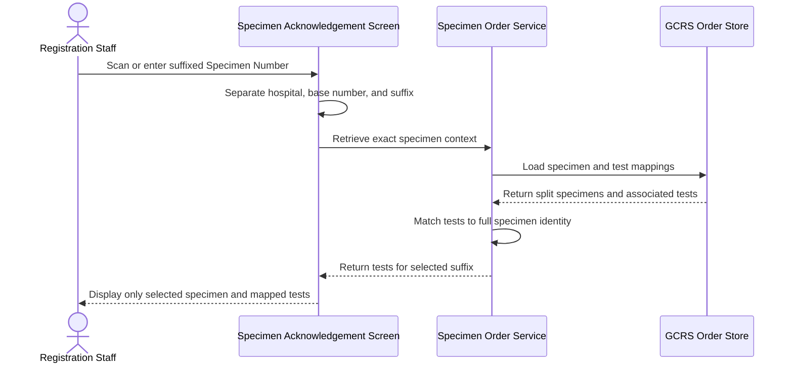
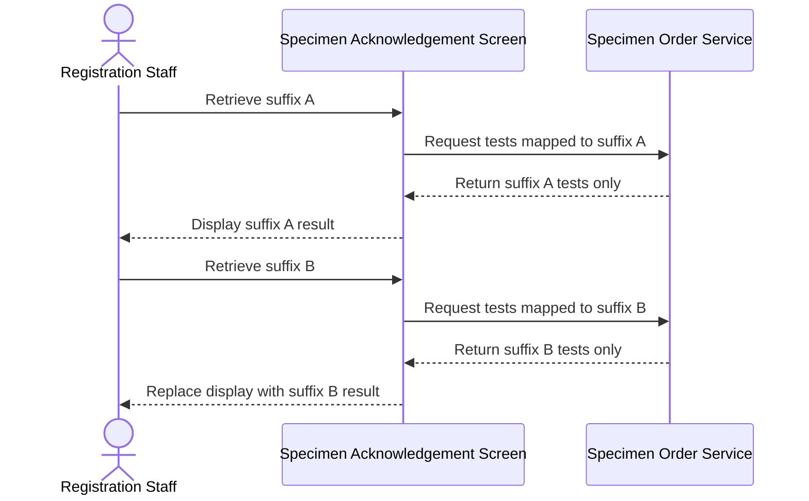
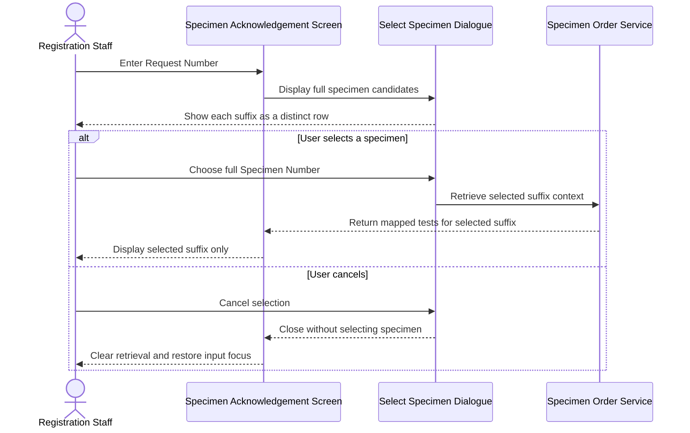
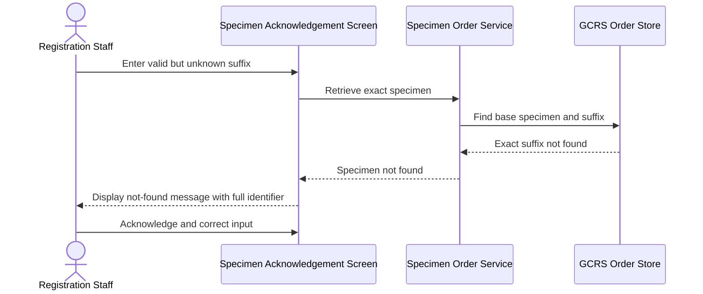
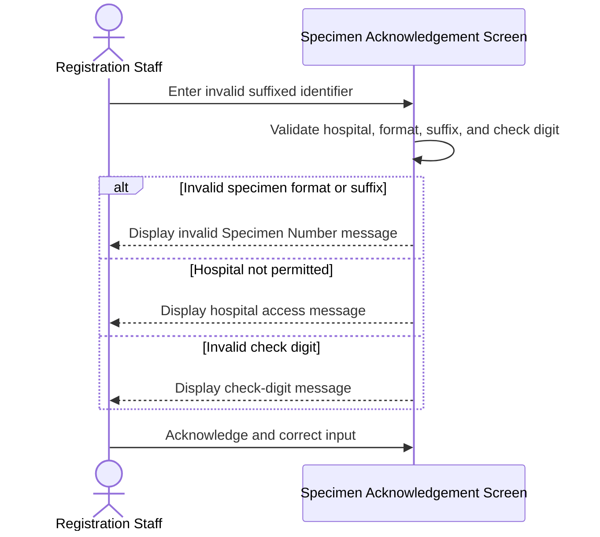

# Display Tests for Selected Specimen Suffix

## Overview

This workflow ensures that Registration Staff see only the tests assigned to the selected part of a split specimen. When multiple specimen records share the same base Specimen Number but have different suffixes, the suffix forms part of the specimen's identity. Retrieving one suffixed specimen filters the **Test** panel to that specimen's mapped tests and prevents tests belonging to a sibling suffix from being displayed or processed accidentally.

---

## Related User Stories

- **[[CRST-448]]** - Specimen Acknowledgement - Display for Specimen with Suffix in Test Panel

**Epic:** LISP-3 [CRST][DEV] Specimen Ack - Retrieve Order Information

---

## Key Concepts

### Split Specimen
A specimen that has been divided into multiple separately identifiable parts. Each part retains the same base Specimen Number and is distinguished by a non-zero suffix.

### Base Specimen Number
The Specimen Number before its optional suffix. It identifies the original specimen family but is not sufficient to distinguish split parts.

### Specimen Suffix
The final alphabetic character appended to a split specimen identifier. A stored suffix of `0` represents the unsuffixed specimen and is not displayed.

### Full Display Specimen
The visible identifier formed from the sending hospital, base Specimen Number, and non-zero suffix. A two-character hospital code is padded with one trailing space before the Specimen Number.

### Sibling Suffix
Another specimen record with the same sending hospital and base Specimen Number but a different suffix.

---

## Trigger Point

> This workflow begins during [[Retrieve Order Information by Specimen Number]] when the entered or selected specimen includes a suffix, or when a request-based retrieval requires the user to select one of several suffixed specimens.

---

## Workflow Scenarios

### Scenario 1: Retrieve a Specific Suffixed Specimen

#### Prerequisites

- More than one specimen record shares the same sending hospital and base Specimen Number.
- Each split specimen has a distinct non-zero suffix.
- Tests are mapped to the applicable split specimen.
- The user enters or scans one complete suffixed identifier.

#### Process Flow

#### Step-by-Step Details

1. Registration Staff scan or enter a suffixed identifier in the **Specimen No./Lab#/Order#** field.
2. The system separates the sending hospital, base Specimen Number, and suffix.
3. The complete specimen identity is validated before retrieval.
4. The order, specimen records, and test-to-specimen mappings are retrieved.
5. The system finds the specimen whose sending hospital, base Specimen Number, and suffix all match the entered identifier.
6. Only tests mapped to that full specimen identity are retained.
7. Sibling suffixes and their tests are excluded from the **Test** panel.
8. The selected full Specimen Number, including its suffix, is displayed with each retained test.

---

### Scenario 2: Retrieve a Different Suffix from the Same Specimen Family

#### Prerequisites

- Two or more suffixes exist for the same base Specimen Number.
- Different tests are mapped to each suffix.

#### Process Flow

#### Step-by-Step Details

1. Retrieving the first suffix displays only tests mapped to that suffix.
2. The user enters another full identifier with the same base Specimen Number and a different suffix.
3. The previous specimen context is replaced by the newly selected suffix.
4. Only tests mapped to the new full specimen identity are displayed.
5. Tests belonging solely to the first suffix are no longer visible.

---

### Scenario 3: Select a Suffix After Request-Based Retrieval

#### Prerequisites

- Retrieval by Request Number returns more than one applicable specimen.
- At least two candidates have the same base Specimen Number with different suffixes.

#### Process Flow

#### Step-by-Step Details

1. The system gathers the specimens associated with the entered **Request No.**
2. Each full Specimen Number, including a non-zero suffix, is presented as a distinct choice.
3. Selecting a row preserves its sending hospital, base Specimen Number, and suffix.
4. The **Test** panel displays only tests mapped to the selected full specimen identity.
5. If the user clicks **Cancel**, no specimen or order context is loaded and focus returns to the identification field.

---

### Scenario 4: Exact Suffix Is Not Found

#### Prerequisites

- The entered identifier is syntactically valid.
- The order contains the base Specimen Number, but the entered suffix does not exist or is not returned for that specimen.

#### Process Flow

#### Step-by-Step Details

1. The system completes format and check-digit validation.
2. The returned specimen list is checked using both the base Specimen Number and suffix.
3. If no exact match exists, message `1377` is displayed with the full entered specimen identifier, including its suffix.
4. No tests are displayed and the current retrieval state is cleared.
5. The user acknowledges the message and enters another identifier.

---

### Scenario 5: Invalid Suffixed Identifier

#### Prerequisites

- The entered value is intended to be a suffixed Specimen Number.
- Its format, hospital, suffix, or check digit is invalid.

#### Process Flow

#### Step-by-Step Details

1. The system validates the complete identifier before retrieving data.
2. If its specimen format or suffix is invalid, message `1336` is displayed.
3. If its sending hospital is not permitted, message `1337` is displayed.
4. If its check digit is invalid, message `1338` is displayed.
5. Retrieval does not proceed until the value is corrected.

---

## Summary Tables

### Full Specimen Identity

| Component | Stored or Display Rule | Example Role |
|---|---|---|
| Sending Hospital | Two- or three-character hospital code; padded to three characters for display | Identifies source hospital |
| Base Specimen Number | Common number shared by split parts | Identifies specimen family |
| Suffix `0` | Represents unsuffixed specimen and is omitted from display | Original/unsplit identity |
| Non-zero suffix | Alphabetic character appended to display identifier | Distinguishes each split part |

### Test Panel Filtering

| Returned Relationship | Base Specimen Matches | Suffix Matches | Displayed |
|---|---:|---:|---:|
| Test mapped to selected split specimen | Yes | Yes | Yes |
| Test mapped only to sibling suffix | Yes | No | No |
| Sibling specimen row | Yes | No | No |
| Test with no mapping to selected full identity | Either | No | No |

### Messages

| Message Code | Condition | Outcome |
|---|---|---|
| `1336` | Invalid specimen format or suffix | Retrieval stops; user corrects input |
| `1337` | Sending hospital is not permitted | Retrieval stops; user enters an authorised identifier |
| `1338` | Invalid specimen check digit | Retrieval stops; user corrects input |
| `1377` | Exact specimen and suffix are not found | No tests are displayed; retrieval state is cleared |

### Selection Behaviour

| Action | Result |
|---|---|
| Select suffixed specimen | Selected suffix and its mapped tests are loaded |
| Press **Enter** on selected row | Same as selecting the row |
| Choose another suffix | Previous result is replaced by the new suffix result |
| Click **Cancel** | Dialogue closes; nothing is loaded; input state is cleared |

---

## Data Sources

| Data | Source | Table | Column | Notes |
|---|---|---|---|---|
| Sending Hospital | Specimen record | `loe_specimen_detail` | `loespec_send_hosp` | Part of the specimen's composite identity |
| Base Specimen Number | Specimen record | `loe_specimen_detail` | `loespec_specno` | Shared by sibling suffixes |
| Specimen Suffix | Specimen record | `loe_specimen_detail` | `loespec_specno_suffix` | `0` means no displayed suffix; non-zero values identify split specimens |
| Specimen Status | Specimen record | `loe_specimen_detail` | `loespec_spec_status` | Displayed with the selected specimen |
| Specimen Description | Specimen record | `loe_specimen_detail` | `loespec_spec_desc` | Displayed in specimen selection and the test panel |
| Request Sequence | Test-to-specimen mapping | `loe_request_test_spec` | `loereqtsp_req_seqno` | Connects the test mapping to its request context |
| Test Sequence | Test-to-specimen mapping | `loe_request_test_spec` | `loereqtsp_test_seqno` | Links a requested test to a specimen mapping |
| Mapped Base Specimen Number | Test-to-specimen mapping | `loe_request_test_spec` | `loereqtsp_specno` | Current schema mapping contains the base number but no suffix column |
| Request No. | Test-to-specimen mapping | `loe_request_test_spec` | `loereqtsp_reqno` | Supports request-based specimen selection |
| Test Code | Ordered test | `loe_request_test` | `loereqtst_test_code` | Identifies the requested test |
| Test Status | Ordered test | `loe_request_test` | `loereqtst_test_status` | Displayed in the **Test** panel |
| Test Urgency | Ordered test | `loe_request_test` | `loereqtst_test_urgency` | Controls urgency display for retained tests |
| Test Request No. | Ordered test | `loe_request_test` | `loereqtst_reqno` | Associates the displayed test with its LIS request where available |

### Data Written

No order, request, test, specimen, or mapping data is written by suffix-based retrieval. Selecting a suffix establishes the current screen context only; acknowledgement and registration are separate workflows.

---

## Configuration

No workflow-specific option changes the central rule that only tests mapped to the selected full specimen identity may be displayed. General settings controlling permitted hospitals, check-digit validation data, enabled identifier types, and message prompting affect whether retrieval may start but do not change suffix filtering.

---

## Business Rules

1. A non-zero Specimen Suffix is part of the specimen's business identity.
2. A stored suffix of `0` is treated as unsuffixed and is omitted from the visible identifier.
3. The sending hospital, base Specimen Number, and suffix together identify the selected specimen.
4. Tests are included only when their specimen mapping resolves to the selected full specimen identity.
5. A sibling suffix with the same base Specimen Number is a different specimen and must not appear in the selected suffix's result.
6. Retrieving another suffix replaces the current result rather than combining sibling suffixes.
7. Every candidate in a selection dialogue displays its full identifier so suffixes remain distinguishable.
8. Cancelling specimen selection does not choose a default specimen or load tests.
9. A not-found message preserves the entered suffix so staff can identify the rejected specimen precisely.
10. Retrieval does not acknowledge, register, reject, delete, or otherwise change the selected specimen.

---

## Related Workflows

- [[Retrieve Order Information by Specimen Number]] — Parses the specimen identifier and loads its order context before suffix filtering.
- [[Specimen Number with 2D Barcode Input]] — Supports barcode retrieval where the encoded Specimen Number may contain a suffix.
- [[Input Lab Number with Multiple Specimens]] — Uses a specimen selection dialogue when a Lab Number identifies multiple specimens.
- [[Retrieve Same-Discipline Tests from Multi-Sequence Order]] — Applies CMS discipline filtering across request sequences independently of suffix filtering.

---

Technical Notes — Legacy and Revamp Traceability

- Both implementations parse and carry a Specimen Suffix, construct a suffix-aware display identifier, and verify that the exact base-number/suffix specimen exists in the returned order.
- Legacy presentation contains an explicit condition that excludes a sibling specimen when its base number matches the current specimen but its suffix differs. The revamp has no equivalent filter: it creates rows for every returned specimen, moves current-suffix rows to the top, and highlights them while leaving sibling rows visible.
- The deeper data contract is suffix-blind. `loe_request_test_spec` stores the mapped base Specimen Number but has no Specimen Suffix column. Current request-sequence lookup and test-to-specimen association therefore use only the base number.
- When multiple `loe_specimen_detail` rows share a base number, the backend currently associates a mapped test with every matching suffix record. A frontend filter cannot reconstruct the true test-to-suffix relationship after this association has been lost.
- The intended suffix mapping source or derivation rule therefore requires clarification. The revamp must either obtain a suffix-aware relationship from an authoritative source or define a deterministic domain rule before CRST-448 can be implemented reliably.
- Revamp validation accepts uppercase alphabetic suffixes. Legacy validation is less strict and can accept a broader trailing character, so compatibility for historic identifiers should be confirmed.
- Request-sequence lookup receives the suffix but queries by sending hospital and base Specimen Number only. If one base number maps to multiple request sequences, suffix cannot disambiguate the lookup and the result is treated as not found.
- The revamp request-based selection dialogue preserves full display specimens in its rows, but its selection callback can overwrite the selected base number with the first returned specimen. This can create inconsistent state when candidates do not share a base number.
- HTTP not-found handling currently constructs message `1377` from hospital and base Specimen Number without the suffix, while the later exact-match failure includes the suffix. The message should consistently show the full input.
- Core GCRS order/specimen/test retrieval is read-only. Shared patient enrichment can invoke an external patient refresh, but this is not a CRST-448 specimen or test write.
- No focused automated tests were identified for suffix parsing, suffix-aware backend association, sibling-row exclusion, full-identifier not-found messages, or request-dialogue suffix selection.

