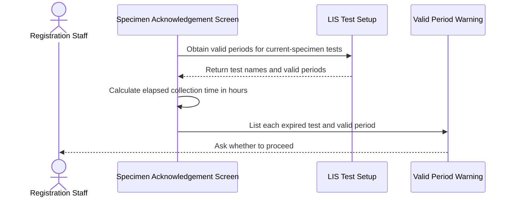
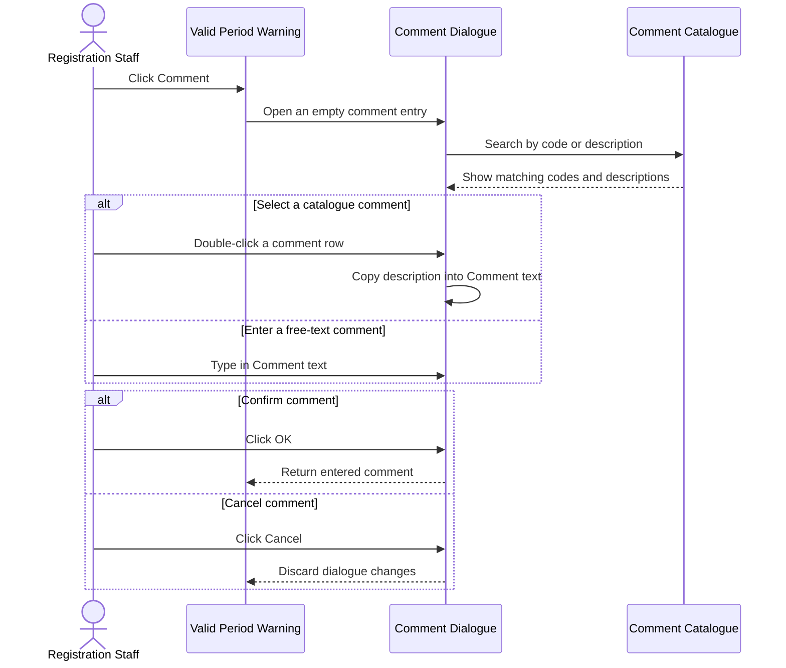
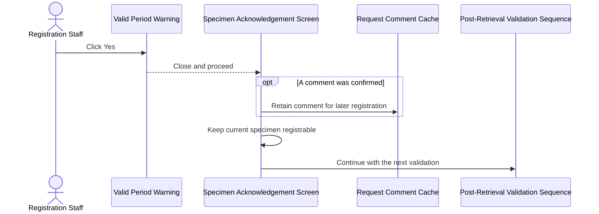
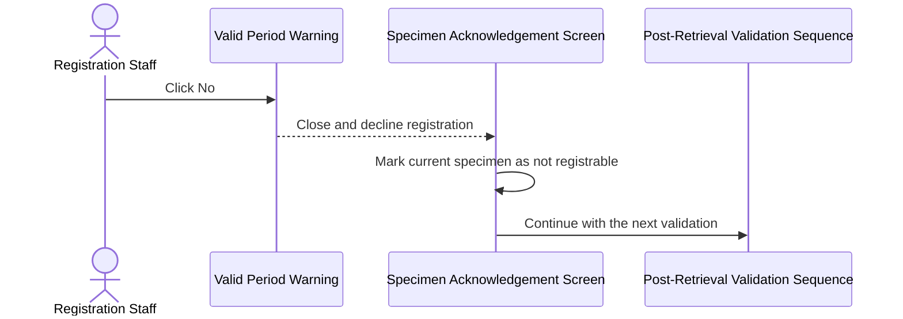
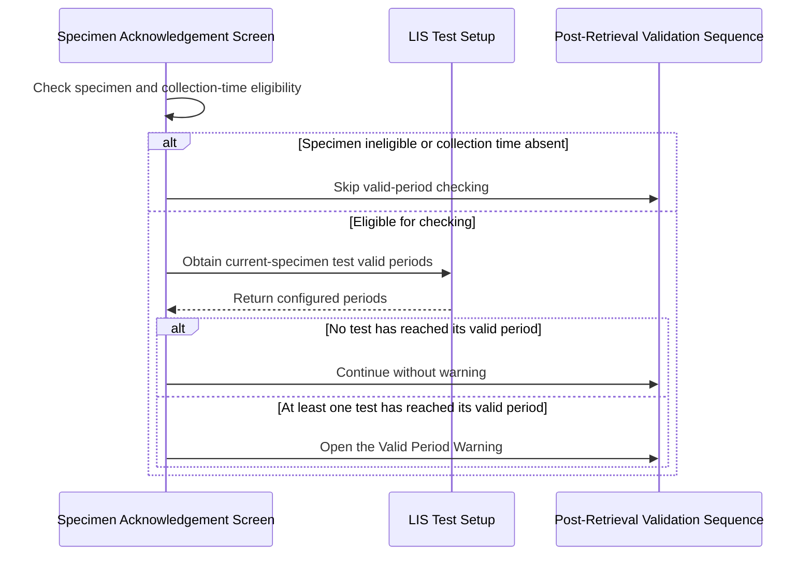

# Handle Tests Exceeding Their Valid Period After Collection

## Overview

This workflow warns Registration Staff when a test on the current specimen has reached or exceeded its allowed period after specimen collection. It displays each affected test and its configured valid period, lets the user add a request comment, and asks whether registration should remain available. This prevents an expired specimen-test combination from proceeding without an explicit decision while preserving the remaining post-retrieval validations.

---

## Related User Stories

- **[[CRST-165]]** - Specimen Ack - Alert Messaging (Collection DateTime Exceed Valid Period)

**Epic:** LISP-3 [CRST][DEV] Specimen Ack - Retrieve Order Information

---

## Key Concepts

### Test Valid Period

The Test Valid Period is the maximum number of hours after specimen collection during which a particular LIS test is considered valid. It is configured separately for each laboratory test. A missing or zero value means that the test has no valid-period check.

### Elapsed Collection Time

Elapsed Collection Time is the number of hours from the **Collection Date/Time** to the specimen's **Acknowledgement Date/Time**, when acknowledgement already exists, or to the current date and time otherwise. Decimal hours are retained when comparing the elapsed time with the Test Valid Period.

### Request Comment Cache

A comment confirmed from the warning's **Comment** dialogue is held temporarily for the current registration workflow. It is not written to the database by this alert; it becomes part of **Request Comment** only if the related request is subsequently registered.

### Registrable Specimen

A registrable specimen has current tests that may proceed through registration. Declining the valid-period warning makes the current specimen non-registrable for the current retrieval.

---

## Trigger Point

> This workflow starts automatically within the post-retrieval validation sequence after Global Clinical Record System (GCRS) order information has been displayed and before later Test Validity and patient-related alerts.

---

## Workflow Scenarios

### Scenario 1: Warn About Tests That Have Exceeded Their Valid Period

#### Prerequisites

- GCRS order information has been retrieved.
- The current specimen is registrable.
- **Collection Date/Time** exists for the current specimen.
- At least one mapped LIS test on the current specimen is eligible for validation.
- The eligible test has a non-zero Test Valid Period.
- Elapsed Collection Time is greater than or equal to that Test Valid Period.

#### Process Flow

#### Step-by-Step Details

1. The system identifies mapped LIS tests belonging to the current specimen that are not excluded from validation.
2. For each eligible test, the system reads its Test Valid Period.
3. Tests with a missing or zero Test Valid Period are excluded from this check.
4. The system calculates the hours elapsed from **Collection Date/Time** to **Acknowledgement Date/Time**, when acknowledgement already exists, or to the current date and time otherwise.
5. A test fails when elapsed time is greater than or equal to its Test Valid Period.
6. Each failed test is displayed on a separate line as: **Collection time of test: [Test Name] > [Test Valid Period] hours ago!**
7. The question **Do you want to proceed?** is displayed with **Yes**, **No**, and **Comment** actions.
8. The user must respond before interacting with the rest of the screen.

---

### Scenario 2: Add or Select a Comment

#### Prerequisites

- The Valid Period Warning is displayed.
- The **Comment** action is available.

#### Process Flow

#### Step-by-Step Details

1. The user clicks **Comment** on the Valid Period Warning.
2. The Comment Dialogue opens with an empty **Comment** text area.
3. Available comments are displayed with **Code** and **Description** columns.
4. The user may filter or search the catalogue by **Code** or **Description**.
5. Double-clicking a comment row copies its **Description** into the **Comment** text area.
6. The user may edit the copied text or enter free text.
7. Clicking **OK** returns the current text to the Valid Period Warning for temporary retention.
8. Clicking **Cancel** closes the Comment Dialogue and discards changes made during that opening.
9. The Valid Period Warning remains available so the user can choose **Yes**, **No**, or reopen **Comment**.

---

### Scenario 3: Confirm and Continue With the Cached Comment

#### Prerequisites

- The Valid Period Warning is displayed.
- One or more tests have exceeded their Test Valid Period.
- A comment may optionally have been confirmed from the Comment Dialogue.

#### Process Flow

#### Step-by-Step Details

1. The user clicks **Yes** to proceed despite the expired test period.
2. The Valid Period Warning closes.
3. If a comment was confirmed in the Comment Dialogue, it is retained in the Request Comment Cache.
4. The current specimen remains registrable.
5. The system continues with the next post-retrieval validation.
6. No database write occurs merely by selecting **Yes** or caching the comment.

---

### Scenario 4: Decline and Make the Specimen Non-Registrable

#### Prerequisites

- The Valid Period Warning is displayed.
- One or more tests have exceeded their Test Valid Period.

#### Process Flow

#### Step-by-Step Details

1. The user clicks **No** to decline proceeding with registration for the expired tests.
2. The Valid Period Warning closes.
3. The current specimen becomes not registrable and the **Register** action is disabled for the current retrieval.
4. The system continues with the next post-retrieval validation; declining this warning must not suppress unrelated later alerts.
5. No database write occurs merely by selecting **No**.

---

### Scenario 5: Skip the Valid Period Warning

#### Prerequisites

At least one of the following applies:

- The current specimen is not registrable.
- **Collection Date/Time** is absent.
- No mapped current-specimen test is eligible for validation.
- Every eligible test has a missing or zero Test Valid Period.
- Elapsed Collection Time is less than every applicable Test Valid Period.

#### Process Flow

#### Step-by-Step Details

1. The system checks whether the current specimen is registrable and has **Collection Date/Time**.
2. If either condition is false, valid-period checking is skipped.
3. Tests that are excluded from validation or do not have a non-zero Test Valid Period do not trigger the warning.
4. A test within its valid period does not trigger the warning.
5. If no test fails, the system continues with the next post-retrieval validation without displaying the Valid Period Warning.

---

## Summary Tables

### Message Definition

| Code | Text | Type | Actions | Parameters | Trigger Point |
|---|---|---|---|---|---|
| Not specified by CRST-165 | `Collection time of test: [Test Name] > [Test Valid Period] hours ago!` followed by `Do you want to proceed?` | Question | Yes / No / Comment | Test Name; Test Valid Period in hours. Repeat the first line for each failed test. | At least one eligible current-specimen test has elapsed hours greater than or equal to its configured Test Valid Period. |

### User Choice Outcomes

| User Choice | Comment Outcome | Specimen Registrable | Continue Next Validation | Immediate Database Write |
|---|---|---|---|---|
| **Comment**, then **OK** | Retain the entered text in the warning until the user chooses **Yes** or **No** | Unchanged | Not yet; return to the warning | No |
| **Comment**, then **Cancel** | Discard changes made during that Comment Dialogue opening | Unchanged | Not yet; return to the warning | No |
| **Yes** | Cache the confirmed comment, if any, for later Request Comment handling | Yes | Yes | No |
| **No** | No new Request Comment is committed by the alert | No; **Register** is disabled | Yes | No |

### Valid Period Decision Matrix

| Specimen Registrable | Collection Date/Time | Test Eligible | Test Valid Period | Elapsed Hours | Outcome |
|---|---|---|---|---|---|
| No | Any | Any | Any | Any | Skip the check |
| Yes | Missing | Any | Any | Any | Skip the check |
| Yes | Present | No | Any | Any | Ignore the test |
| Yes | Present | Yes | Missing or `0` | Any | No valid-period check for the test |
| Yes | Present | Yes | Greater than `0` | Less than Test Valid Period | Test remains within period; no warning for the test |
| Yes | Present | Yes | Greater than `0` | Greater than or equal to Test Valid Period | Include the test in the warning |

### Data Written

This alert workflow is read-only. Displaying or responding to the warning and temporarily caching a comment do not write to the database.

If the user later completes registration, the cached comment is merged into **Request Comment** and may then be stored in `request.req_comment` or `crs_request.req_comment`, according to the request store used by that separate registration workflow. A later registration may also create a Test Valid Period bypass operation audit. These are downstream registration effects, not writes performed by this alert.

---

## Data Sources

| Data | Business Source | Table | Column | Notes |
|---|---|---|---|---|
| Test Identifier | LIS test dictionary | `test_dict` | `test_ckey` | Stable identifier for the mapped LIS test |
| Test Code | LIS test dictionary | `test_dict` | `test_alpha_code` | Used to match the retrieved test to LIS setup; not the required display parameter |
| Test Name | LIS test dictionary | `test_dict` | `test_name` | Preferred human-readable name in the warning |
| Test Full Name | LIS test dictionary | `test_dict` | `test_full_name` | Fallback when Test Name is unavailable |
| Test Laboratory | LIS test dictionary | `test_dict` | `test_labno` | Restricts setup to the current laboratory |
| Test Valid Period | LIS test dictionary | `test_dict` | `test_valid_period` | Maximum valid hours after collection; missing or zero disables checking for that test |
| Collection Date/Time | Retrieved GCRS specimen | `loe_specimen_detail` | `loespec_collect_dtm` | Start of elapsed-time calculation |
| Acknowledgement Date/Time | Retrieved GCRS specimen | `loe_specimen_detail` | `loespec_ack_dtm` | End of elapsed-time calculation when already present |
| Comment Laboratory | Comment catalogue | `comment` | `com_labno` | Restricts comments to the applicable laboratory |
| Comment Code | Comment catalogue | `comment` | `com_code` | Displayed and searchable in the Comment Dialogue |
| Comment Description | Comment catalogue | `comment` | `com_desc` | Displayed, searchable, and copied into Comment text |

---

## Configuration

No separate enable/disable option is required by CRST-165 or found in the traced implementations. Applicability is controlled by the per-test setup below.

| Setting | Option Code | Source | Purpose | Enabled | Disabled or Missing |
|---|---|---|---|---|---|
| Test Valid Period | Not a `LAB_OPTION` code | `test_dict.test_valid_period` | Defines the maximum valid hours after specimen collection for each laboratory test | A value greater than zero enables checking for that test | Missing or zero means no valid-period check for that test |

The legacy dialogue also reads message `3934` setup for default-button focus, first for the current hospital and then for `ALL`; when no usable setup exists, **No** receives focus. CRST-165 does not specify a required default button, so this observed compatibility behavior requires confirmation before it is treated as a revamp requirement.

---

## Business Rules

1. Valid-period checking runs only when the current specimen is registrable and **Collection Date/Time** exists.
2. Only eligible mapped LIS tests belonging to the current specimen are evaluated.
3. A missing or zero Test Valid Period means that no valid-period checking applies to that test.
4. Elapsed hours are measured from **Collection Date/Time** to existing **Acknowledgement Date/Time**, or to the current date and time when acknowledgement does not exist.
5. A test reaches the warning threshold when elapsed hours are greater than or equal to its Test Valid Period.
6. Each failed test is shown by human-readable Test Name and Test Valid Period on a separate line.
7. The **Comment** action remains available until the user chooses **Yes** or **No**.
8. Selecting **Yes** retains a confirmed comment in cache, keeps the specimen registrable, and continues the remaining validation sequence.
9. Selecting **No** makes the specimen non-registrable but still continues the remaining validation sequence.
10. The alert itself does not update specimen, test, request, comment, or audit records.

---

## Related Workflows

- [[Validate Tests Against Patient Sex and Age After Retrieval]] — Runs after this check in the post-retrieval validation sequence.
- [[Show Patient-Related Alerts After Order Retrieval]] — Covers subsequent alerts based on retrieved patient information.
- [[Show Post-Retrieval Specimen Status Alerts]] — Provides the wider post-retrieval alert context.
- [[Show and Inactivate Post-Retrieval Specimen Reminders]] — Handles other reminders after order retrieval.

---

Technical Notes — Legacy and Revamp Traceability

- **Core timing logic is aligned.** Legacy and revamp both restrict the check to a registrable specimen with collection time, scope tests to the current specimen, read `test_dict.test_valid_period`, compare against acknowledgement time when present or current time otherwise, ignore missing or zero periods, and trigger at the greater-than-or-equal boundary.
- **The User Story does not assign a message code.** Legacy composes a dedicated dialogue locally and reads message `3934` only for default-button metadata. Revamp uses content-bearing message `4446` with **Yes/No** actions. These identifiers are not equivalent usages and should not be collapsed into one canonical message code without clarification.
- **Revamp displays the wrong test identifier.** CRST-165 and legacy behavior require the human-readable Test Name. Revamp constructs the warning with `test_dict.test_alpha_code` instead.
- **The revamp Comment workflow is missing.** Message `4446` has no **Comment** action tied to the warning. No equivalent filter/search dialogue, Code/Description grid, double-click copy, OK/Cancel handling, or alert-specific comment cache was found.
- **Decline continuation is a revamp parity defect.** CRST-165 and legacy behavior require **No** to disable registration and continue the next validation. Revamp disables **Register**, but its message callback rejects the alert promise, which likely aborts remaining alerts instead of continuing.
- **Confirmed bypass state is not propagated by the revamp.** The registration request initializes the Test Valid Period bypass flag to false and the bypassed-test list to empty. The current alert does not update those values or merge an alert comment into the registration request's **Request Comment**.
- **The backend bypass mapper contains a defect.** The registration parameter converter assigns the Test Validity bypass list twice and does not copy the Test Valid Period bypass list. If the frontend begins sending a true valid-period bypass flag, later audit generation can receive a missing test list.
- **Downstream audit support exists but is not part of the immediate alert.** Later registration can write operation audit type `119` with the bypassed test names. The alert itself performs no persistence.
- **Focused tests are missing.** No focused revamp tests were found for message `4446`, single/multiple test formatting, exact-threshold behavior, missing/zero period handling, acknowledgement-time comparison, Comment Dialogue requirements, comment caching, **Yes/No** outcomes, continuation after **No**, request-comment propagation, or bypass-audit mapping.

