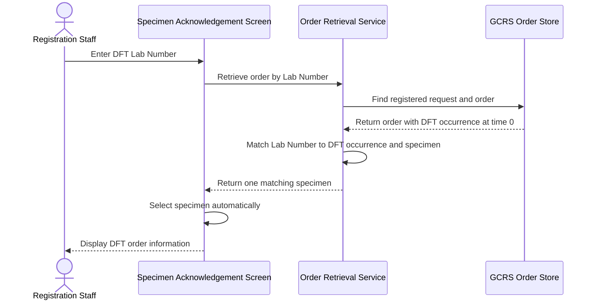
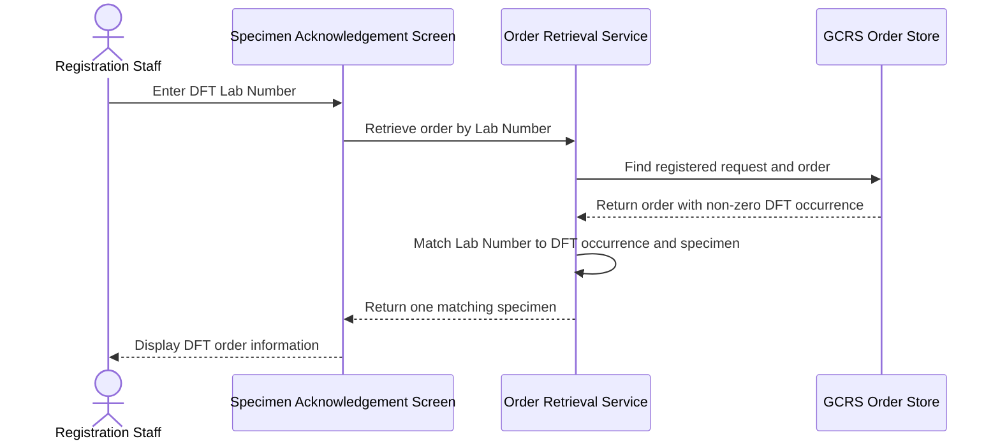
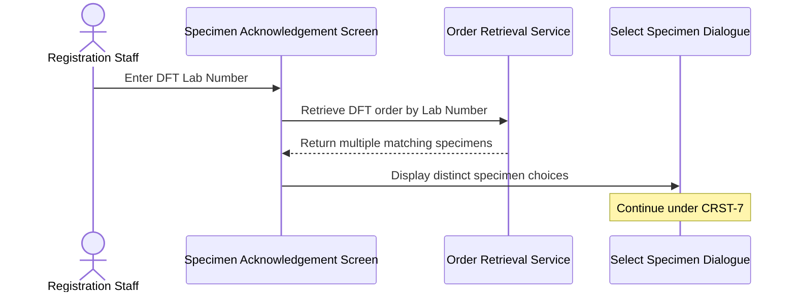
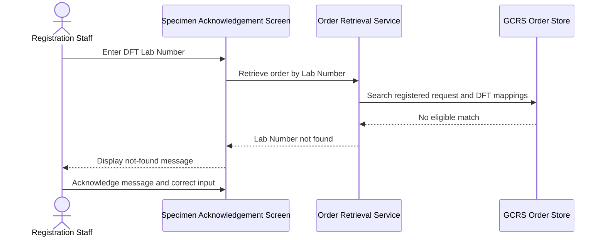

# Input Lab Number for DFT Case

## Overview

This workflow allows Registration Staff to retrieve a General Clinical Request System (GCRS) order for a Dynamic Function Test (DFT) case by entering its registered Lab Number on the **Specimen Acknowledgement** screen. The Lab Number is assigned during an earlier DFT registration and is retained against the relevant DFT occurrence and specimen. Retrieval supports both zero and non-zero DFT Time values and restores the matching order and specimen so acknowledgement or further processing can continue.

---

## Related User Stories

- **[[CRST-84]]** - Specimen Acknowledgement - Input Lab Number for a DFT Case
- **[[CRST-7]]** - Specimen Acknowledgement - Input Lab Number with Multiple Specimens
- **[[CRST-85]]** - Specimen Acknowledgement - Input Lab Number for a Registered Request

**Epic:** LISP-3 [CRST][DEV] Specimen Ack - Retrieve Order Information  
**Related issue:** LIST-2038

---

## Key Concepts

### Dynamic Function Test (DFT)
A test represented by one or more timed occurrences linked to a GCRS order and specimen. Each occurrence carries its own DFT Time, status, and registered Lab Number.

### DFT Lab Number
The Request Number assigned when the DFT occurrence is registered. It is stored against the DFT occurrence and is the value entered in the **Specimen No./Lab#/Order#** field for this workflow.

### DFT Time
The numeric time value associated with the DFT occurrence. CRST-84 explicitly supports both a value of `0` and any non-zero value; neither category is excluded from retrieval.

### Registered and Partially Registered Status
A DFT occurrence is eligible for this workflow when its status is **Registered** (`R`) or **Partially Registered** (`r`). A Lab Number is expected to exist because registration has already taken place for all or part of the DFT case.

### Retrieval and Registration Boundary
This workflow retrieves an existing DFT registration. It does not assign or change the Lab Number. Lab Number assignment occurs earlier through the **Register Request** action and DFT registration dialogue.

---

## Trigger Point

> The workflow begins when Registration Staff enter or scan a DFT Lab Number in the **Specimen No./Lab#/Order#** field on the **Specimen Acknowledgement** screen and submit or leave the field for validation.

---

## Workflow Scenarios

### Scenario 1: Retrieve a DFT Case with DFT Time 0

#### Prerequisites

- The GCRS order contains at least one specimen.
- A DFT occurrence is linked to the specimen.
- The DFT Time is `0`.
- The DFT status is **Registered** (`R`) or **Partially Registered** (`r`).
- A Lab Number exists for the DFT occurrence.
- Exactly one distinct specimen matches the entered Lab Number.

#### Process Flow

#### Step-by-Step Details

1. Registration Staff enter or scan the DFT Lab Number in the **Specimen No./Lab#/Order#** field.
2. The value is recognised as a Request Number and is used to locate the previously registered request and its GCRS order.
3. The order's DFT occurrences are examined for the entered Lab Number.
4. The system confirms that the matching occurrence is registered or partially registered and is linked to a specimen.
5. A DFT Time of `0` is accepted as a valid value and does not prevent retrieval.
6. Because exactly one distinct specimen matches, that specimen is selected automatically.
7. The order, patient, request, test, DFT occurrence, and specimen information is displayed on the **Specimen Acknowledgement** screen.
8. The user may continue with the actions available for the retrieved specimen.

---

### Scenario 2: Retrieve a DFT Case with a Non-Zero DFT Time

#### Prerequisites

- The GCRS order contains at least one specimen.
- A DFT occurrence is linked to the specimen.
- The DFT Time is greater than or otherwise different from `0`.
- The DFT status is **Registered** (`R`) or **Partially Registered** (`r`).
- A Lab Number exists for the DFT occurrence.
- Exactly one distinct specimen matches the entered Lab Number.

#### Process Flow

#### Step-by-Step Details

1. Registration Staff enter the Lab Number assigned to a non-zero DFT occurrence.
2. The system locates the registered request and loads its GCRS order.
3. The system compares the entered Lab Number with the Lab Number held against each DFT occurrence.
4. A non-zero DFT Time is treated as eligible in the same way as DFT Time `0`.
5. When one specimen is associated with the matching occurrence, it is selected automatically.
6. The matching DFT occurrence is displayed with its Lab Number, status, DFT Time, DFT unit, and specimen relationship.
7. The complete order information is made available for subsequent specimen processing.

---

### Scenario 3: DFT Lab Number Maps to Multiple Specimens

#### Prerequisites

- The entered Lab Number matches eligible DFT data in the retrieved order.
- More than one distinct specimen is associated with the matching DFT occurrence or occurrences.

#### Process Flow

#### Step-by-Step Details

1. The system collects every distinct specimen associated with DFT occurrences whose Lab Number equals the entered value.
2. If more than one specimen matches, no specimen is selected automatically.
3. The **Select Specimen** dialogue is displayed with the matching **Specimen** and **Description** values.
4. The user selects the required specimen and clicks **Retrieve**, or clicks **Cancel** to stop retrieval.
5. Detailed selection and cancellation behaviour continue under [[Input Lab Number with Multiple Specimens]].

---

### Scenario 4: DFT Lab Number Is Not Eligible or Cannot Be Found

#### Prerequisites

One or more required conditions are absent, for example:

- No registered request can be located for the entered Lab Number.
- The GCRS order has no specimen.
- No DFT occurrence carries the entered Lab Number.
- The matching DFT occurrence is not **Registered** (`R`) or **Partially Registered** (`r`).

#### Process Flow

#### Step-by-Step Details

1. Registration Staff enter a value recognised as a Request Number.
2. The system searches the registration history for the order and specimen associated with that number.
3. The retrieved order, when available, is checked for a DFT occurrence carrying the entered Lab Number.
4. The DFT occurrence must have an associated specimen and an eligible registered or partially registered status.
5. If no eligible match is found, no order or specimen is loaded through this workflow.
6. A not-found message is displayed, and the **Specimen No./Lab#/Order#** field is made available for correction after the message is acknowledged.

---

## Summary Tables

### Eligibility Matrix

| Condition | Eligible | Outcome |
|---|---|---|
| DFT Time `0`, status `R` or `r`, Lab Number present, one specimen | Yes | Matching specimen is selected and order information is displayed |
| DFT Time non-zero, status `R` or `r`, Lab Number present, one specimen | Yes | Matching specimen is selected and order information is displayed |
| Status other than `R` or `r` | No | No eligible DFT retrieval match |
| Lab Number missing from the DFT occurrence | No | The occurrence cannot be retrieved by Lab Number |
| No specimen linked to the DFT occurrence | No | The DFT case does not satisfy CRST-84 retrieval criteria |
| More than one matching specimen | Yes, with selection | The **Select Specimen** dialogue is displayed under CRST-7 |

### DFT Time Outcomes

| DFT Time | Retrieval Treatment |
|---|---|
| `0` | Valid and retrievable when all other criteria are met |
| Non-zero | Valid and retrievable when all other criteria are met |

### Messages

| Message Code | Business Meaning | User Action |
|---|---|---|
| `3405` | The entered Lab Number cannot be resolved as an eligible Request Number | Acknowledge the message and correct or replace the input |

> The exact displayed text is supplied by the message dictionary. The stable business meaning is “Request Number not found.”

### Field State After Retrieval

| Field or Area | Successful Retrieval | Not-Found Outcome |
|---|---|---|
| **Specimen No./Lab#/Order#** | Retains the entered DFT Lab Number | Available for correction after the message is acknowledged |
| Order information | Populated | Not populated |
| Current specimen | Matching specimen selected automatically, or selected by the user when multiple specimens exist | Not populated |
| DFT information | Displays matching DFT occurrence details | Not populated |
| Registration data | Unchanged by retrieval | Unchanged |

---

## Data Sources

| Data | Source | Table | Column | Notes |
|---|---|---|---|---|
| DFT Lab Number | GCRS DFT occurrence | `loe_dft` | `loedft_lis_reqno` | Authoritative registered Lab Number used to match the DFT occurrence |
| DFT Time | GCRS DFT occurrence | `loe_dft` | `loedft_time` | Both `0` and non-zero values are supported |
| DFT Status | GCRS DFT occurrence | `loe_dft` | `loedft_status` | Must represent Registered (`R`) or Partially Registered (`r`) for CRST-84 |
| DFT Sequence | GCRS DFT occurrence | `loe_dft` | `loedft_seqno` | Distinguishes the DFT occurrence within the test |
| DFT Unit | GCRS DFT occurrence | `loe_dft` | `loedft_unit` | Unit associated with the DFT Time |
| Specimen Number | GCRS DFT occurrence | `loe_dft` | `loedft_specno` | Links the DFT occurrence to the specimen |
| Test Sequence | GCRS DFT occurrence | `loe_dft` | `loedft_test_seqno` | Links the occurrence to the order test |
| Request Sequence | GCRS DFT occurrence | `loe_dft` | `loedft_req_seqno` | Links the occurrence to the GCRS request |
| Order Number | GCRS DFT occurrence | `loe_dft` | `loedft_orderno` | Links the occurrence to the GCRS order |
| Registered Request lookup | Specimen Acknowledgement history | `loe_audit_trail` | `loeaud_reqno` | Supporting lookup used to locate the previously processed order and specimen |
| Order reference | Specimen Acknowledgement history | `loe_audit_trail` | `loeaud_orderno` | Identifies the GCRS order associated with the Lab Number |
| Sending Hospital | Specimen Acknowledgement history | `loe_audit_trail` | `loeaud_send_hosp` | Identifies the hospital owning the specimen |
| Specimen Number | Specimen Acknowledgement history | `loe_audit_trail` | `loeaud_spec_no` | Identifies the specimen associated with the previous registration activity |
| Specimen Suffix | Specimen Acknowledgement history | `loe_audit_trail` | `loeaud_spec_no_suffix` | Distinguishes suffixed specimens when applicable |

### Data Written

No data is written by this retrieval workflow. The Lab Number, DFT status, and registration history are created by the earlier DFT registration workflow.

---

## Configuration

No CRST-84-specific system option was identified. Retrieval depends on the presence and status of existing DFT registration data rather than an enable/disable setting.

---

## Business Rules

1. A DFT Lab Number is assigned before this retrieval workflow and must not be changed by retrieval.
2. The GCRS order must contain a specimen linked to the matching DFT occurrence.
3. The DFT occurrence must have a Lab Number equal to the entered value.
4. Both DFT Time `0` and non-zero DFT Time values are eligible.
5. The DFT status must be **Registered** (`R`) or **Partially Registered** (`r`).
6. Exactly one distinct matching specimen is selected automatically.
7. Duplicate references to the same specimen must not create duplicate choices.
8. Multiple distinct matching specimens require explicit selection under CRST-7.
9. If no eligible DFT occurrence and specimen can be resolved, no order information is loaded.
10. Retrieval is read-only and does not create, update, or re-register the DFT case.

---

## Related Workflows

- [[Input Lab Number for Ward-Assigned Request]] — Retrieves an unregistered ward-assigned case by its pre-assigned Request Number rather than a registered DFT Lab Number.
- [[Input Lab Number with Multiple Specimens]] — Handles selection when the DFT Lab Number maps to more than one specimen.
- [[Retrieve Registered Request by Lab Number]] — Handles the general registered Request Number path outside the DFT-specific matching rules.
- [[Register DFT Request]] — Assigns and stores the DFT Lab Number that is later used by this retrieval workflow.
- [[Retrieve Order Information by Specimen Number]] — Provides an alternative order retrieval route using the specimen identifier.

---

Technical Notes — Legacy and Revamp Traceability

- The authoritative DFT Lab Number is mapped from `loe_dft.loedft_lis_reqno`; DFT Time and status are mapped from `loedft_time` and `loedft_status`.
- Request Number retrieval first resolves the previously processed order and specimen through `loe_audit_trail`, then loads the complete GCRS order. The DFT-specific selection step compares the entered value with each DFT occurrence's Lab Number.
- The legacy `SpecimenNoTextInputPm.processRetrieveResultAction()` first attempts normal test matching. If no normal specimen is found, or the result is a DFT specimen, it rebuilds the candidates from DFT specimens whose DFT Request Number equals the entered value.
- The revamp `getSelectSpecDialogData()` recognises DFT orders and builds candidates from DFT occurrence data. However, it currently reads DFT occurrences only from the first order test. A DFT Lab Number attached only to another order test may therefore be omitted from candidate construction.
- In the current revamp single-candidate path, `useHandleSpecId()` assigns the first specimen in the order rather than the sole specimen returned by the matching candidate list. If the matching DFT specimen is not the first order specimen, this can select the wrong specimen. This is a CRST-84 parity item for review.
- The legacy Request Number not-found state uses message `3405`. The current revamp maps several not-found states to a shared response and displays generic message `1377`; dedicated `3405` handling remains commented. The intended business outcome remains “Request Number not found.”

