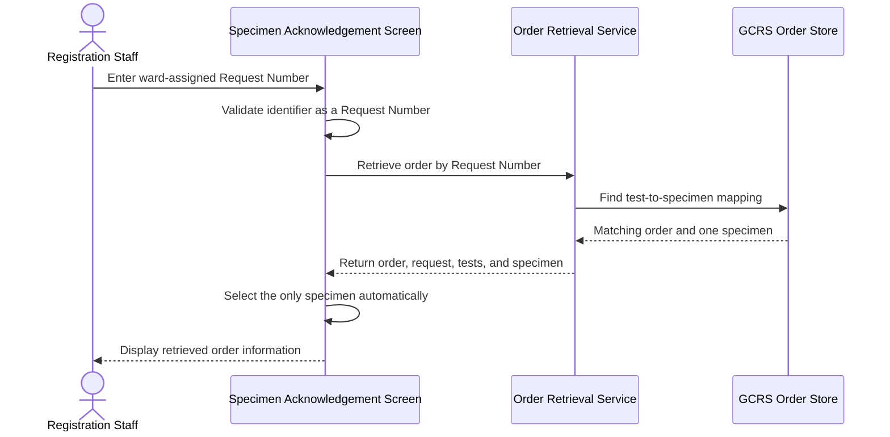
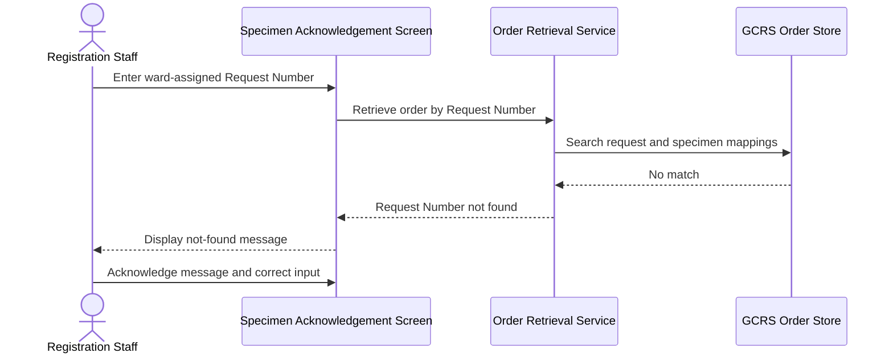
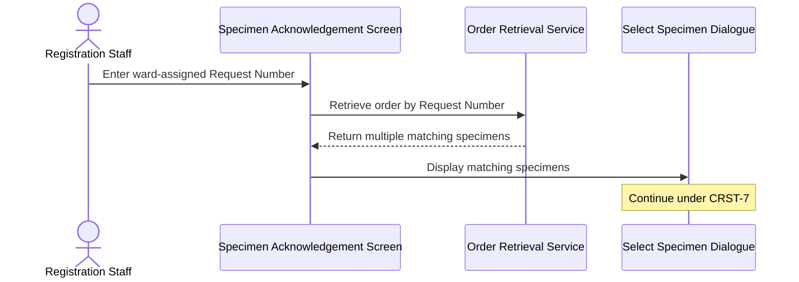
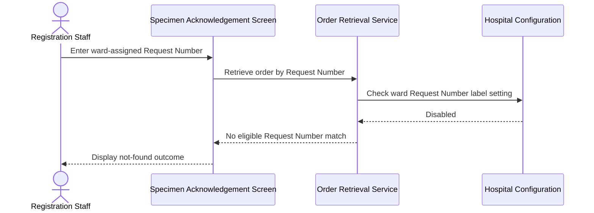

# Input Lab Number for Ward-Assigned Request

## Overview

This workflow allows Registration Staff to retrieve a General Clinical Request System (GCRS) order by entering the Request Number that was assigned and printed by a ward. It is used when the ward has already labelled the request before the specimen reaches the laboratory. The workflow retrieves the order and its single mapped specimen so that specimen acknowledgement and any required registration can continue without assigning a different number during retrieval.

---

## Related User Stories

- **[[CRST-6]]** - Specimen Acknowledgement - Retrieve Order Information by Lab Number for a Ward-Assigned Case
- **[[CRST-7]]** - Specimen Acknowledgement - Input Lab Number with Multiple Specimens
- **[[CRST-47]]** - Specimen Acknowledgement - Ward-Assigned Request Number Registration
- **[[CRST-84]]** - Specimen Acknowledgement - Input Lab Number for a DFT Case
- **[[CRST-85]]** - Specimen Acknowledgement - Input Lab Number for a Registered Request
- **[[CRST-471]]** - Specimen Acknowledgement - Ward-Assigned Case Not Acknowledged Alert

**Epic:** LISP-3 [CRST][DEV] Specimen Ack - Retrieve Order Information  
**Related issue:** LIST-46

---

## Key Concepts

### Ward-Assigned Request Number
A Request Number allocated by the ward and stored against the GCRS test-to-specimen relationship before laboratory receipt. It identifies the request label already attached to the specimen.

### Lab Number Terminology
The CRST-6 title uses “Lab Number,” but the value entered in this workflow is the ward-assigned **Request Number**. The **Specimen No./Lab#/Order#** field accepts this number and determines that it is a Request Number from the configured identifier format.

### Single Mapped Specimen
CRST-6 covers a ward-assigned Request Number whose relevant tests map to exactly one specimen. When more than one specimen is mapped, the separate multiple-specimen selection workflow applies.

### Retrieval and Registration Boundary
Retrieval loads existing GCRS order information and does not register the request or write a new Request Number. Reusing the ward-assigned number during registration is handled by the related ward-assigned registration workflow.

---

## Trigger Point

> The workflow begins when Registration Staff enter or scan a ward-assigned Request Number in the **Specimen No./Lab#/Order#** field on the **Specimen Acknowledgement** screen and submit or leave the field for validation.

---

## Workflow Scenarios

### Scenario 1: Retrieve a Ward-Assigned Request with One Specimen

#### Prerequisites

- Ward-assigned Request Number retrieval is enabled for the hospital.
- A ward-assigned Request Number already exists for the GCRS test-to-specimen relationship.
- The Request Number follows a supported Request Number format.
- The matching tests map to exactly one specimen.
- The request is available for specimen acknowledgement.

#### Process Flow

#### Step-by-Step Details

1. Registration Staff enter or scan the ward-assigned Request Number in the **Specimen No./Lab#/Order#** field.
2. The value is trimmed and evaluated against the supported identifier formats.
3. When the value is recognised as a Request Number, the system searches both previously processed Request Number records and eligible ward-assigned Request Number mappings.
4. The system finds the GCRS order containing a test-to-specimen relationship with the entered ward-assigned Request Number.
5. The matching test is linked to its specimen through the existing order relationship.
6. Because exactly one specimen is associated with the matching tests, that specimen is selected automatically; the **Select Specimen** dialogue is not displayed.
7. The order, patient, request, test, and specimen information is displayed on the **Specimen Acknowledgement** screen.
8. The Request Number remains identified as ward-assigned for subsequent acknowledgement and registration rules.
9. The user may continue with specimen acknowledgement or the applicable registration workflow.

> Retrieval is read-only. The ward-assigned Request Number and its specimen mapping already exist before this workflow begins.

---

### Scenario 2: Ward-Assigned Request Number Is Not Found

#### Prerequisites

- Ward-assigned Request Number retrieval is enabled.
- The entered value is recognised as a Request Number.
- No accessible request or eligible ward-assigned test-to-specimen mapping matches the entered number.

#### Process Flow

#### Step-by-Step Details

1. Registration Staff enter a value that is recognised as a Request Number.
2. The system searches for a matching processed request and, when none is found, searches the ward-assigned Request Number mappings.
3. If neither source identifies an order and specimen, no order information is loaded.
4. The **Request Number not found** message is displayed.
5. After the user acknowledges the message, the current retrieval state is cleared and the **Specimen No./Lab#/Order#** field is made available for correction or another scan.

---

### Scenario 3: Ward-Assigned Request Number Maps to Multiple Specimens

#### Prerequisites

- Ward-assigned Request Number retrieval is enabled.
- The entered Request Number matches GCRS tests associated with more than one distinct specimen.

#### Process Flow

#### Step-by-Step Details

1. The system retrieves the order and collects the distinct specimens associated with tests matching the entered Request Number.
2. If more than one specimen is found, the system does not choose one automatically.
3. The **Select Specimen** dialogue is displayed with the matching specimen choices.
4. Selection, retrieval, and cancellation behaviour continue under [[Input Lab Number with Multiple Specimens]].

> CRST-6 defines only the single-specimen acceptance path. The multiple-specimen path is documented by CRST-7 and is not duplicated here.

---

### Scenario 4: Ward-Assigned Request Number Retrieval Is Disabled

#### Prerequisites

- The ward-assigned Request Number exists in the GCRS order data.
- The hospital-level ward Request Number label setting is disabled.
- No previously processed Request Number record provides an alternative match.

#### Process Flow

#### Step-by-Step Details

1. Registration Staff enter the ward-assigned Request Number.
2. The system first checks for an existing processed Request Number record.
3. When no processed record is found, the system checks whether ward-assigned Request Number label handling is enabled.
4. If the setting is disabled, the ward-assigned test-to-specimen mapping is not used for retrieval.
5. No order is loaded through this workflow, and the user receives the standard not-found outcome.

---

## Summary Tables

### Retrieval Outcome Matrix

| Condition | Specimen Selection | Outcome |
|---|---|---|
| Matching ward-assigned Request Number; one specimen | Automatic | Order and specimen information are displayed |
| Matching ward-assigned Request Number; multiple specimens | User selection required | Continue under [[Input Lab Number with Multiple Specimens]] |
| No matching processed or ward-assigned Request Number | None | Not-found message is displayed; no order is loaded |
| Ward-assigned retrieval disabled and no processed match | None | Ward mapping is not searched; not-found outcome is displayed |
| Request already registered | Governed by a separate workflow | Continue under [[Retrieve Registered Request by Lab Number]] |
| DFT case | Governed by a separate workflow | Continue under [[Input Lab Number for DFT Case]] |

### Messages

| Message Code | Business Meaning | User Action |
|---|---|---|
| `3405` | The Request Number cannot be found through the legacy Request Number retrieval path | Acknowledge the message and correct or replace the input |

> The exact displayed text is supplied by the message dictionary. The stable business meaning is “Request Number not found.”

### Field State After Retrieval

| Field or Area | Successful Retrieval | Not-Found Outcome |
|---|---|---|
| **Specimen No./Lab#/Order#** | Retains the entered ward-assigned Request Number | Available for correction after the message is acknowledged |
| Order information | Populated | Not populated |
| Specimen information | Single specimen loaded automatically | Not populated |
| Registration status | Unchanged by retrieval | Unchanged |

---

## Data Sources

| Data | Source | Table | Column | Notes |
|---|---|---|---|---|
| Ward-Assigned Request Number | GCRS test-to-specimen relationship | `loe_request_test_spec` | `loereqtsp_reqno` | The stable identifier used to find a ward-assigned case |
| Sending Hospital | GCRS test-to-specimen relationship | `loe_request_test_spec` | `loereqtsp_send_hosp` | Identifies the hospital that owns the specimen relationship |
| Request Sequence | GCRS test-to-specimen relationship | `loe_request_test_spec` | `loereqtsp_req_seqno` | Links the specimen relationship to its GCRS request |
| Test Sequence | GCRS test-to-specimen relationship | `loe_request_test_spec` | `loereqtsp_test_seqno` | Identifies the test carrying the ward-assigned Request Number |
| Specimen Number | GCRS test-to-specimen relationship | `loe_request_test_spec` | `loereqtsp_specno` | Identifies the specimen mapped to the matching test |
| Order, patient, request, test, and specimen details | GCRS order records | *(multiple GCRS order tables)* | *(multiple columns)* | Loaded after the request and specimen relationship is resolved |

### Data Written

No data is written by this retrieval workflow. The ward-assigned Request Number is created before retrieval, and acknowledgement or registration writes are handled by their respective workflows.

---

## Configuration

| Setting | Option Code | Purpose | Effect when enabled | Effect when disabled |
|---|---|---|---|---|
| Ward Request Number Label | `WARD_PRINT_LABNO_LABEL` | Enables ward-assigned Request Number label handling and fallback retrieval through the GCRS test-to-specimen relationship | A Request Number that has no processed-request match can be resolved through its ward-assigned specimen mapping | The ward-assigned mapping is not used as a fallback retrieval source |

---

## Business Rules

1. The value described as a “Lab Number” in CRST-6 is the Request Number assigned by the ward.
2. A ward-assigned Request Number must already be stored against a GCRS test-to-specimen relationship before it can be used for retrieval.
3. A processed Request Number match takes precedence over the ward-assigned Request Number fallback.
4. Ward-assigned fallback retrieval is available only when the hospital setting for ward Request Number labels is enabled.
5. Only specimens linked to tests whose Request Number matches the entered value are considered.
6. Duplicate specimen choices are removed before the number of matching specimens is evaluated.
7. Exactly one matching specimen is selected automatically.
8. More than one matching specimen requires explicit user selection under CRST-7.
9. CRST-6 does not register the request, assign a new Request Number, acknowledge the specimen, or write retrieval data.
10. When the retrieved ward-assigned request is registered later, its assigned number is reused according to CRST-47.
11. If a ward-assigned request is left without acknowledgement while the user tries to retrieve another specimen, the confirmation behaviour is governed by CRST-471.
12. Registered Request Number retrieval and DFT retrieval are governed by CRST-85 and CRST-84 respectively.

---

## Related Workflows

- [[Retrieve Order Information by Specimen Number]] — Retrieves the same GCRS order information by Specimen Number rather than a ward-assigned Request Number.
- [[Input Lab Number with Multiple Specimens]] — Handles specimen selection when one Request Number maps to more than one specimen.
- [[Ward-Assigned Request Number Registration]] — Reuses the ward-assigned Request Number when the retrieved request is registered.
- [[Ward-Assigned Request Not Acknowledged Alert]] — Warns before replacing a ward-assigned request that has not been acknowledged.
- [[Input Lab Number for DFT Case]] — Handles Request Number retrieval for a DFT case.
- [[Retrieve Registered Request by Lab Number]] — Handles retrieval when the Request Number has already been registered.

---

Technical Notes — Legacy and Revamp Traceability

- The original CRST-6 requirement is written for the Queen Elizabeth Hospital (QEH) ward-assignment case. The latest legacy modification history dated 24 July 2026 records removal of the QEH hardcode; the intended workflow is therefore documented as configuration-driven ward-assigned retrieval rather than a QEH-only rule.
- In the legacy retrieval path, a test matches when either its ward-assigned Request Number or its normal Request Number equals the entered value. Exactly one distinct mapped specimen is returned automatically, while multiple specimens open the selection dialogue.
- The backend maps `loe_request_test_spec.loereqtsp_reqno` into the order test's ward-assignment state. When the normal test Request Number is absent, the ward-assigned value is also exposed as the effective Request Number, allowing the current frontend specimen matching logic to identify it.
- The current revamp service searches ward-assigned specimen mappings only when `WARD_PRINT_LABNO_LABEL` is enabled, consistent with the legacy fallback rule.
- The legacy not-found state displays message `3405`. The current revamp API converts Request Number, Specimen Number, and Order Number not-found states to a common not-found response, and the frontend currently displays generic message `1377`; its dedicated `3405` handling remains commented. This is a message-parity item for review and does not change the intended “Request Number not found” outcome.

