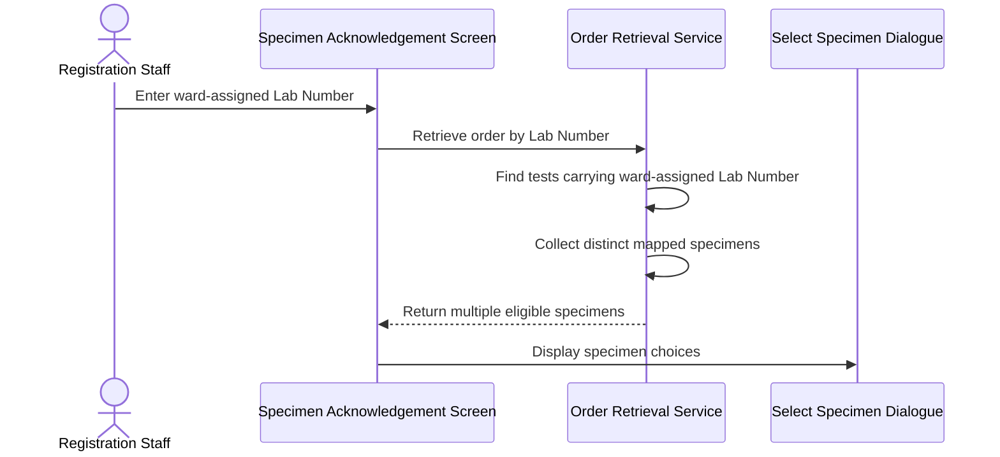
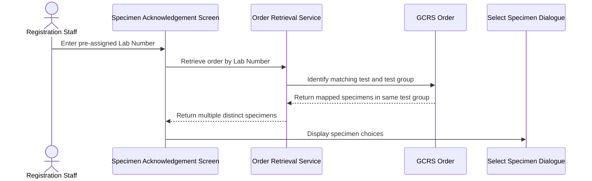
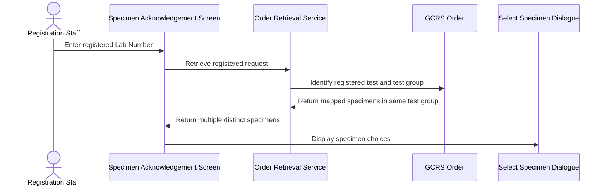
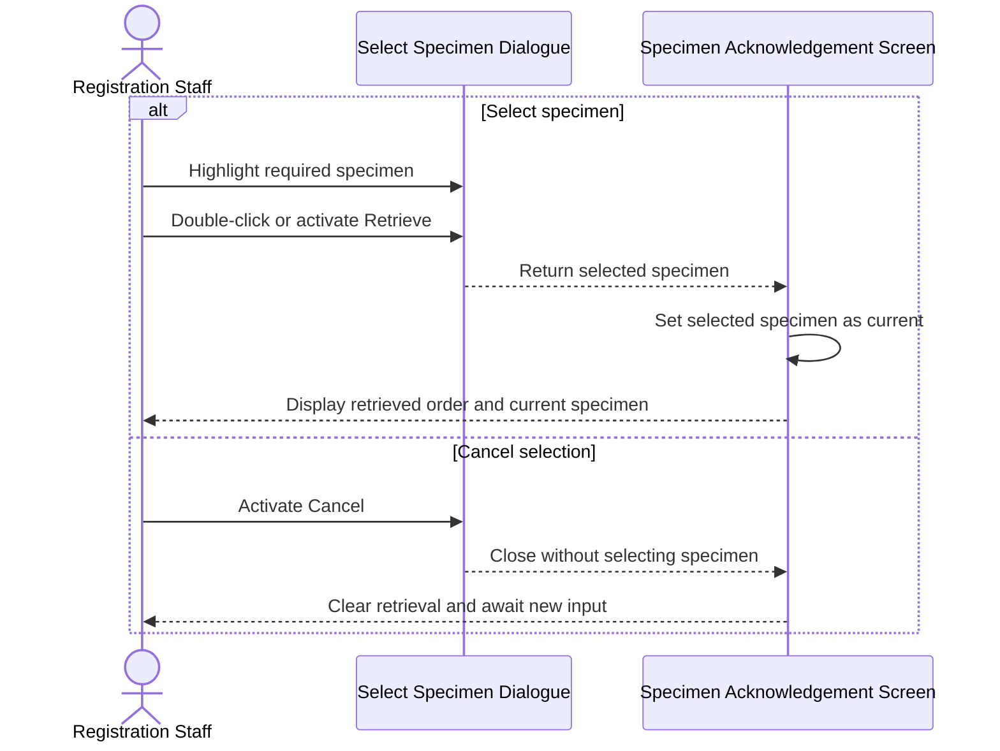

# Input Lab Number with Multiple Specimens

## Overview

This workflow allows Registration Staff to retrieve a General Clinical Request System (GCRS) order when an entered Lab Number is associated with more than one specimen. It applies to ward-assigned, pre-assigned, and registered requests. Instead of choosing a specimen automatically, the system displays a **Select Specimen** dialogue so the user can identify which mapped specimen becomes the current specimen for subsequent acknowledgement or registration work.

---

## Related User Stories

- **[[CRST-7]]** - Specimen Acknowledgement - Retrieve Order Information by Lab Number with Multiple Specimens
- **[[CRST-6]]** - Specimen Acknowledgement - Input Lab Number for a Ward-Assigned Request
- **[[CRST-84]]** - Specimen Acknowledgement - Input Lab Number for a DFT Case
- **[[CRST-85]]** - Specimen Acknowledgement - Input Lab Number for a Registered Request

**Epic:** LISP-3 [CRST][DEV] Specimen Ack - Retrieve Order Information

---

## Key Concepts

### Multiple-Specimen Lab Number
A Lab Number whose matching test or test group is mapped to more than one distinct specimen in the same GCRS order.

### Ward-Assigned Request
An unregistered request for which a Lab Number has already been assigned and stored with the test-to-specimen relationship. Only specimens mapped to tests carrying that ward-assigned Lab Number are offered.

### Pre-Assigned Request
A request whose Lab Number has been assigned to the test before registration is completed. The selection list contains specimens mapped to tests under the same test group as the test carrying the entered Lab Number.

### Registered Request
A request with **Registered** status (`R`) whose registered test or tests are mapped to multiple specimens. The selection list contains specimens mapped to tests under the same test group as the registered test carrying the entered Lab Number.

### Current Specimen
The specimen selected from the dialogue. The full order remains available, but subsequent screen actions operate in the context of this selected specimen.

---

## Trigger Point

> This workflow begins after a valid Lab Number has been entered in the **Specimen No./Lab#/Order#** field and the retrieved order contains more than one distinct specimen eligible for that Lab Number.

---

## Workflow Scenarios

### Scenario 1: Ward-Assigned Lab Number Maps to Multiple Specimens

#### Prerequisites

- The GCRS order is a ward-assigned case.
- The order contains specimens.
- A ward-assigned Lab Number exists.
- More than one distinct specimen is mapped to tests carrying the entered ward-assigned Lab Number.
- Ward-assigned Lab Number retrieval is enabled.

#### Process Flow

#### Step-by-Step Details

1. Registration Staff enter or scan the ward-assigned Lab Number in the **Specimen No./Lab#/Order#** field.
2. The system locates the ward-assigned request and retrieves its GCRS order.
3. Tests carrying the entered ward-assigned Lab Number are identified.
4. The system gathers the specimens mapped to those tests.
5. Duplicate references to the same **Specimen** are removed.
6. Because more than one distinct specimen remains, the **Select Specimen** dialogue is displayed.
7. Only specimens associated with tests carrying the entered ward-assigned Lab Number are available for selection.

---

### Scenario 2: Pre-Assigned Lab Number Maps to Multiple Specimens

#### Prerequisites

- The GCRS order is a pre-assigned case.
- The order contains specimens.
- A pre-assigned Lab Number exists on a test.
- Tests under the same test group are mapped to more than one distinct specimen.

#### Process Flow

#### Step-by-Step Details

1. Registration Staff enter the pre-assigned Lab Number.
2. The system retrieves the source GCRS order and identifies the test carrying that Lab Number.
3. The test group of the matching test is determined.
4. Specimens mapped to tests under the same test group are gathered.
5. Duplicate specimen references are consolidated.
6. When more than one distinct specimen is eligible, the **Select Specimen** dialogue is displayed.

---

### Scenario 3: Registered Lab Number Maps to Multiple Specimens

#### Prerequisites

- The GCRS order contains specimens.
- The relevant request is **Registered** (`R`).
- One or more registered tests carry the entered Lab Number.
- Tests under the same test group are mapped to more than one distinct specimen.

#### Process Flow

#### Step-by-Step Details

1. Registration Staff enter the Lab Number of a registered request.
2. The system retrieves the source GCRS order.
3. Registered tests carrying the entered Lab Number are identified.
4. Specimens mapped to tests under the same test group as the matching registered test are gathered.
5. Duplicate references to the same specimen are removed.
6. When more than one distinct specimen remains, the **Select Specimen** dialogue is displayed.

---

### Scenario 4: Select or Cancel a Specimen

#### Prerequisites

- The **Select Specimen** dialogue is open.
- At least two distinct specimen choices are displayed.
- The first specimen is initially highlighted.

#### Process Flow

#### Step-by-Step Details

1. The dialogue displays the eligible specimens in a table with **Specimen** and **Description** columns.
2. The first specimen is highlighted initially.
3. The user may move the highlight to another specimen by clicking the row or using the Up and Down Arrow keys.
4. To retrieve the highlighted specimen, the user double-clicks it, clicks **Retrieve**, or presses Enter.
5. The dialogue closes and the selected specimen becomes the current specimen.
6. The patient, order, request, specimen, and test information is displayed on the **Specimen Acknowledgement** screen.
7. Subsequent actions operate on the selected current specimen.
8. If the user clicks **Cancel**, the dialogue closes without loading a current specimen; the pending retrieval is cleared and the screen awaits new input.

---

## Summary Tables

### Case Eligibility Matrix

| Case | Required Request State | Candidate Specimens | Multiple-Specimen Outcome |
|---|---|---|---|
| Ward-assigned | Ward-assigned Lab Number exists on the test-to-specimen mapping | Specimens mapped to tests carrying the ward-assigned Lab Number | Display **Select Specimen** dialogue |
| Pre-assigned | Lab Number is assigned before registration | Specimens mapped under the same test group as the matching pre-assigned test | Display **Select Specimen** dialogue |
| Registered | Request status is `R` and registered test carries the Lab Number | Specimens mapped under the same test group as the matching registered test | Display **Select Specimen** dialogue |
| DFT | DFT occurrence carries the Lab Number | Specimens associated with the matching DFT occurrence or occurrences | Display **Select Specimen** dialogue when more than one distinct specimen matches |

### Candidate Count Outcomes

| Number of Distinct Matching Specimens | Outcome |
|---|---|
| `0` | No specimen is loaded through this workflow; applicable not-found handling is used |
| `1` | The specimen is selected automatically; no selection dialogue is displayed |
| More than `1` | The **Select Specimen** dialogue is displayed |

### Dialogue Fields and Actions

| Element | Purpose | Behaviour |
|---|---|---|
| **Specimen** column | Identifies each eligible specimen | Displays the specimen number or unique specimen identifier |
| **Description** column | Helps distinguish specimen choices | Displays specimen description and current specimen status; APS cases use specimen site and specified location where applicable |
| Highlighted row | Indicates the candidate to retrieve | Defaults to the first row and changes by mouse click or arrow key |
| **Retrieve** button | Confirms the highlighted specimen | Closes the dialogue and loads the selected specimen as current |
| Double-click | Shortcut to confirm a specimen | Selects the row and retrieves it |
| Enter key | Keyboard confirmation | Retrieves the highlighted specimen |
| **Cancel** button | Aborts specimen selection | Closes the dialogue, clears the pending retrieval, and returns to input |

### Selection Outcomes

| User Action | Current Specimen | Order Display |
|---|---|---|
| Double-click a specimen | Selected specimen | Retrieved order is displayed |
| Highlight a specimen and click **Retrieve** | Selected specimen | Retrieved order is displayed |
| Highlight a specimen and press Enter | Selected specimen | Retrieved order is displayed |
| Click **Cancel** | None | Pending retrieval is cleared |

---

## Data Sources

| Data | Source | Table | Column | Notes |
|---|---|---|---|---|
| Registered or pre-assigned Lab Number | GCRS test | `loe_request_test` | `loereqtst_reqno` | Identifies the matching standard test |
| Test Status | GCRS test | `loe_request_test` | `loereqtst_test_status` | `R` identifies the registered case |
| Order Number | GCRS test | `loe_request_test` | `loereqtst_orderno` | Links the test to its GCRS order |
| Request Sequence | GCRS test | `loe_request_test` | `loereqtst_req_seqno` | Identifies the request within the order |
| Test Sequence | GCRS test | `loe_request_test` | `loereqtst_test_seqno` | Identifies the test within the request |
| Ward-assigned Lab Number | Test-to-specimen relationship | `loe_request_test_spec` | `loereqtsp_reqno` | Identifies the ward-assigned request before registration |
| Mapped Specimen Number | Test-to-specimen relationship | `loe_request_test_spec` | `loereqtsp_specno` | Links each test to an eligible specimen |
| Request Sequence Link | Test-to-specimen relationship | `loe_request_test_spec` | `loereqtsp_req_seqno` | Joins the specimen mapping to its request |
| Test Sequence Link | Test-to-specimen relationship | `loe_request_test_spec` | `loereqtsp_test_seqno` | Joins the specimen mapping to its test |
| Sending Hospital Link | Test-to-specimen relationship | `loe_request_test_spec` | `loereqtsp_send_hosp` | Identifies the hospital owning the mapping |
| Specimen Number | Specimen record | `loe_specimen_detail` | `loespec_specno` | Identifies the specimen |
| Specimen Suffix | Specimen record | `loe_specimen_detail` | `loespec_specno_suffix` | Distinguishes suffixed specimens |
| Unique Specimen Identifier | Specimen record | `loe_specimen_detail` | `loespec_unique_id` | Displayed instead of the conventional specimen number when applicable |
| Specimen Description | Specimen record | `loe_specimen_detail` | `loespec_spec_desc` | Displayed in the selection dialogue for most laboratories |
| Specimen Status | Specimen record | `loe_specimen_detail` | `loespec_spec_status` | Displayed with the specimen description |
| Specimen Site | Specimen record | `loe_specimen_detail` | `loespec_spec_site` | Used in the APS selection description |
| Specified Location | Specimen record | `loe_specimen_detail` | `loespec_specified_locn` | Appended to the APS specimen site when present |
| Registered Request lookup | Registration and processing history | `loe_audit_trail` | `loeaud_reqno` | Supports registered Lab Number retrieval before candidates are built |
| Registered Specimen reference | Registration and processing history | `loe_audit_trail` | `loeaud_spec_no` | Supports locating the source order and specimen |

### Data Written

No data is written by this selection workflow. Choosing a specimen changes only the current screen context; it does not update the GCRS order, test-to-specimen mappings, Lab Number, or specimen record.

---

## Configuration

| Setting | Option Code | Purpose | Effect when enabled | Effect when disabled |
|---|---|---|---|---|
| Ward Request Number Label | `WARD_PRINT_LABNO_LABEL` | Enables ward-assigned Lab Number handling and fallback retrieval through the test-to-specimen relationship | Ward-assigned Lab Numbers can resolve their mapped specimens and open the selection dialogue when multiple specimens match | The ward-assigned fallback is not used; registered and pre-assigned paths remain subject to their own retrieval data |

No additional CRST-7-specific option was identified for the pre-assigned, registered, or selection-dialogue paths.

---

## Business Rules

1. The GCRS order must contain at least one specimen.
2. The entered Lab Number must match the applicable ward-assigned, pre-assigned, registered, or DFT request data.
3. Ward-assigned candidates are limited to specimens mapped to tests carrying the entered ward-assigned Lab Number.
4. Pre-assigned candidates are specimens mapped under the same test group as the matching pre-assigned test.
5. Registered candidates are specimens mapped under the same test group as the registered test carrying the entered Lab Number.
6. A standard registered request must have **Registered** status (`R`).
7. The same specimen must appear only once even when several matching tests reference it.
8. The selection dialogue is displayed only when more than one distinct specimen is eligible.
9. The first candidate is highlighted when the dialogue opens.
10. Confirming a specimen makes it the current specimen while preserving the retrieved order context.
11. Cancelling selection must not assign a current specimen or write any registration data.
12. Specimen selection is read-only; acknowledgement, registration, rejection, and other state changes occur in separate workflows.

---

## Related Workflows

- [[Input Lab Number for Ward-Assigned Request]] — Defines how an unregistered ward-assigned Lab Number resolves its order and candidate specimens.
- [[Retrieve Registered Request by Lab Number]] — Defines the registered-request eligibility and Lab Number retrieval path.
- [[Input Lab Number for DFT Case]] — Defines the DFT-specific Lab Number matching rules before multiple-specimen selection.
- [[Retrieve Order Information by Specimen Number]] — Bypasses the Lab Number selection path by retrieving a specific specimen directly.
- [[Register Request]] — Assigns Lab Numbers and establishes mappings that can later produce a multiple-specimen choice.

---

Technical Notes — Legacy and Revamp Traceability

- Legacy candidate construction scans normal request tests for either the entered ward-assigned Request Number or registered/pre-assigned Request Number. If none are found, it scans add-request tests. Specimens are de-duplicated by display specimen number.
- The legacy dialogue exposes **Specimen** and **Description** columns, initially selects the first row, and completes retrieval when a row is double-clicked. Its close handler assigns the currently highlighted specimen, so generic dialogue closure can continue with the default or current row.
- The revamp candidate builder matches the entered value against each standard test's Request Number and de-duplicates by displayed specimen identifier. For DFT orders, it uses the DFT occurrence's Request Number and mapped specimens.
- CRST-7 requires pre-assigned and registered candidates to come from tests under the same test group. Neither the legacy candidate loop nor the revamp candidate builder explicitly filters by test group; both rely on shared Request Number assignment to produce the intended set. Records with reused Lab Numbers across different test groups require parity testing.
- The revamp dialogue supports **Retrieve**, **Cancel**, Enter, arrow-key navigation, and row clicks. Clicking an already highlighted row retrieves immediately, so a conventional double-click works, but the implementation does not enforce a timed double-click gesture.
- Revamp **Cancel** clears the pending retrieval and screen state. This differs from the legacy generic close handler, which assigns the highlighted row when the dialogue closes.
- In the revamp selection callback, the selected specimen's internal specimen number is overwritten with the first specimen from the first returned request before the order is loaded. The displayed selection can therefore become inconsistent with the internal current specimen. This is a CRST-7 parity defect for correction.
- If revamp candidate construction returns zero specimens while the backend returned an order, the current single-result fallback selects the first order specimen instead of treating the Request Number as unmatched. This is an error-path parity risk.
- Revamp registered and pre-assigned candidate construction does not explicitly enforce request status or registration type. It matches the Lab Number and mapped specimen list supplied by the backend.
- Legacy not-found states use separate messages, including `3405` for Request Number not found. Revamp currently collapses retrieval not-found responses into generic message `1377`; detailed state-specific handling remains incomplete.
- No focused revamp unit tests were identified for the three CRST-7 candidate cases, specimen de-duplication, test-group isolation, selected-specimen identity, or cancellation.

