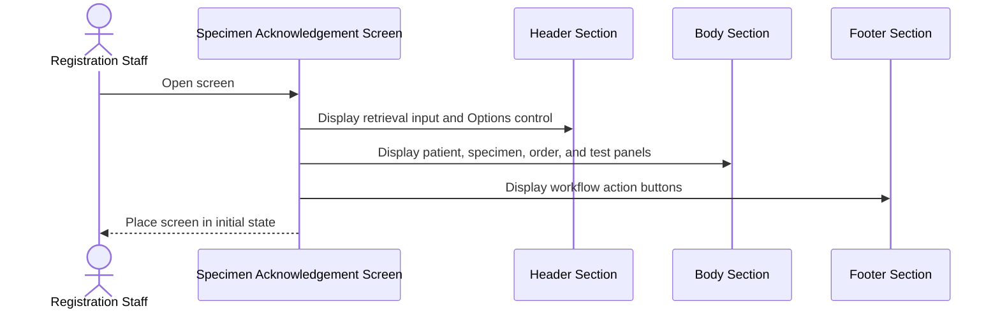
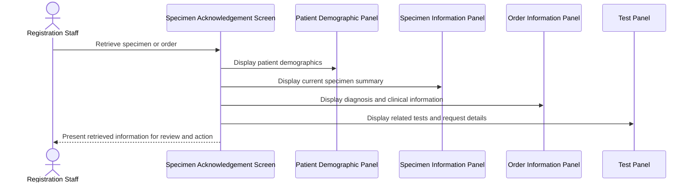
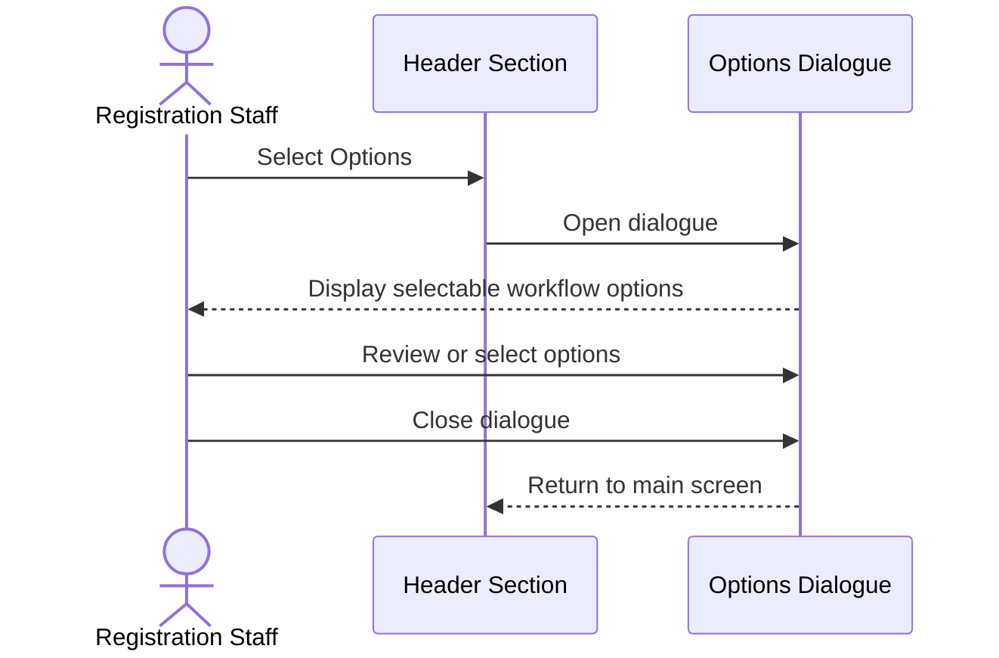

# Open and Navigate Specimen Acknowledgement Screen

## Overview

The Specimen Acknowledgement screen provides registration staff with one workspace for retrieving specimen or order information, reviewing patient and order details, maintaining order information, acknowledging specimens, registering requests, and printing. The screen separates lookup controls, clinical and specimen information, test details, and workflow actions into Header, Body, and Footer sections so staff can move from identification to review and action without leaving the screen. Detail dialogues provide expanded information while preserving the main workflow context.

---

## Related User Stories

- **[[CRST-3]]** - Specimen Acknowledgement - Main Screen Layout

**Epic:** LISP-2 [CRST][DEV] Specimen Ack - Layout

---

## Key Concepts

### Specimen Number
An identifier assigned to a collected specimen. It can be entered to retrieve the related specimen and order information.

### Lab Number
A Laboratory Information System identifier assigned to a registered laboratory request. It can be used as an alternative retrieval key.

### Order Number
An identifier for the originating clinical order. An order can contain multiple specimens and tests.

### Current Specimen
The specimen selected for review or action. Other specimens belonging to the same order remain available in the detail views.

### Electronic Patient Record
The electronic patient record (ePR) is the clinical record in which eligible laboratory results and images may be viewed.

---

## Trigger Point

> The workflow begins when an authorised registration staff member opens the **Specimen Acknowledgement** screen.

---

## Workflow Scenarios

### Scenario 1: Open the Screen in Its Initial State

#### Prerequisites

- The user is authorised to access the **Specimen Acknowledgement** screen.
- No specimen or order has yet been retrieved.

#### Process Flow



#### Step-by-Step Details

1. The user opens the **Specimen Acknowledgement** screen.
2. The screen is displayed in three main sections: **Header**, **Body**, and **Footer**.
3. The **Header** displays the **Specimen No./Lab#/Order#** input field and the **Options** control.
4. Focus can be placed in the **Specimen No./Lab#/Order#** input field so the user can enter a Specimen Number, Lab Number, or Order Number for retrieval.
5. The **Body** displays the **Patient Demographic**, **Specimen Information**, **Order Information**, and **Test** panels. Before a successful retrieval, these panels provide the screen structure but do not present retrieved order data.
6. The **Footer** displays the available workflow action buttons. Whether an action can be used is governed by the current specimen or request state and the user's access rights; those rules are documented by the corresponding action workflows.

---

### Scenario 2: Review Retrieved Information on the Main Screen

#### Prerequisites

- The user is authorised to access the screen.
- A specimen or order has been retrieved successfully.

#### Process Flow



#### Step-by-Step Details

1. After retrieval succeeds, the **Patient Demographic** panel displays the patient's English name, Chinese name, Date of Birth, Hong Kong Identity Card (HKID), Sex, Specialty/Sub-specialty, Ward-Bed, Case Number, and other available demographic details.
2. The **Specimen Information** panel displays the current specimen's Status, Specimen Description, Type Detail, Site, Acknowledgement Date and Time, Collection Date and Time, Marker, Preparation, and Specified Location.
3. The **Order Information** panel displays separate tabs for **Admit Diagnosis**, **Clinical Note**, and **Clinical Info**.
4. The **Test** panel displays a selection indicator, Specimen Number, Specimen Description and status, Test Name, Test Status, Request Number, urgency, and Other Information.
5. The **Test** panel also provides the **Urgent**, **Add Test**, and **Delete Test** controls. Their availability and behaviour depend on the selected test and the current workflow state.
6. The **Footer** remains available for the user to continue with specimen, registration, save, clear, or print actions.

---

### Scenario 3: Open and Close the Options Dialogue

#### Prerequisites

- The user is authorised to access the screen.
- The **Specimen Acknowledgement** screen is open.

#### Process Flow



#### Step-by-Step Details

1. The user selects the **Options** control in the **Header**.
2. The **Options** dialogue is displayed over the main screen.
3. The dialogue presents checkboxes for optional workflow actions and preferences available to the user.
4. The user reviews or changes the applicable options.
5. Closing the dialogue returns the user to the main screen without losing the currently retrieved specimen or order context.

---

### Scenario 4: Review Specimen Information Details

#### Prerequisites

- A specimen has been retrieved successfully.
- The **Specimen Information** panel is populated.

#### Process Flow

```mermaid
sequenceDiagram
    actor Staff as Registration Staff
    participant Panel as Specimen Information Panel
    participant Details as Specimen Information Details Dialogue

    Staff->>Panel: Select details control
    Panel->>Details: Open specimen details
    Details-->>Staff: Show current and related specimens in tabs
    Staff->>Details: Review specimen tabs
    Staff->>Details: Close dialogue
    Details-->>Panel: Return to specimen summary
```

#### Step-by-Step Details

1. The user selects the details control in the **Specimen Information** panel.
2. The **Specimen Information Details** dialogue is displayed.
3. The current specimen and each other specimen belonging to the same order are organised into separate tabs.
4. Each specimen tab displays Specimen Status, Specimen Description, Marker, Specimen Type, Type Detail, Collection Date, Collected By, Acknowledgement Date, Acknowledged By, and Chemotherapy information when available.
5. The user can move between tabs to compare specimens from the same order.
6. Closing the dialogue returns the user to the current specimen summary on the main screen.

---

### Scenario 5: Review Order Information Details

#### Prerequisites

- A specimen or order has been retrieved successfully.
- The **Order Information** panel is populated.

#### Process Flow

```mermaid
sequenceDiagram
    actor Staff as Registration Staff
    participant Panel as Order Information Panel
    participant Details as Order Information Details Dialogue

    Staff->>Panel: Select details control
    Panel->>Details: Open order details
    Details-->>Staff: Display complete order information
    Staff->>Details: Review details
    Staff->>Details: Close dialogue
    Details-->>Panel: Return to order summary
```

#### Step-by-Step Details

1. The user selects the details control in the **Order Information** panel.
2. The **Order Information Details** dialogue is displayed.
3. The dialogue displays Order Number, Order Date, Pay Code, Requested By, Request Location, Report Location, Copy To Location, Admit Diagnosis, Clinical Info, and Clinical Note.
4. The user reviews the expanded order information.
5. Closing the dialogue returns the user to the **Order Information** panel without losing the retrieved context.

---

### Scenario 6: Review Test Details

#### Prerequisites

- A specimen or order has been retrieved successfully.
- Test information is available for the order.

#### Process Flow

```mermaid
sequenceDiagram
    actor Staff as Registration Staff
    participant Panel as Test Panel
    participant Details as Test Details Dialogue

    Staff->>Panel: Select details control
    Panel->>Details: Open test details
    Details-->>Staff: Show order tests in tabs
    Staff->>Details: Review test tabs
    Staff->>Details: Close dialogue
    Details-->>Panel: Return to test summary
```

#### Step-by-Step Details

1. The user selects the details control in the **Test** panel.
2. The **Test Details** dialogue is displayed.
3. All tests belonging to the order are organised into tabs.
4. Each test tab displays Test Status, Specimen Number, LIS Test Name, CMS Test Code, CMS Test Description, CMS Test Category, Request Number, Registered Date, Test Information, and Duplicate Reason when available.
5. The user can move between tabs to review the tests belonging to the order.
6. Closing the dialogue returns the user to the **Test** panel without losing the retrieved context.

---

## Screen Content Summary

### Header Section

| Area | Content | Purpose |
|---|---|---|
| **Specimen No./Lab#/Order#** | Single retrieval input | Accepts a Specimen Number, Lab Number, or Order Number to retrieve information |
| **Options** | Options control and dialogue | Allows the user to select optional workflow actions and preferences |

### Body Section

| Panel | Main-screen content | Expanded view |
|---|---|---|
| **Patient Demographic** | Patient Name, Chinese Name, Date of Birth, HKID, Sex, Specialty/Sub-specialty, Ward-Bed, Case Number, and other available demographics | Not specified for this user story |
| **Specimen Information** | Status, Specimen Description, Type Detail, Site, Acknowledgement Date and Time, Collection Date and Time, Marker, Preparation, Specified Location | Current and related specimen details in separate tabs |
| **Order Information** | **Admit Diagnosis**, **Clinical Note**, and **Clinical Info** tabs | Complete order, requester, location, diagnosis, and clinical information |
| **Test** | Selection, Specimen Number and status, Test Name, Test Status, Request Number, Urgency, Other Information, and test action controls | All tests in the order, organised into tabs |

### Footer Section

| Button | Business purpose |
|---|---|
| **Delete SP** | Initiates deletion of the applicable specimen |
| **Reject SP** | Initiates rejection of the applicable specimen |
| **Send Out Ack.** | Initiates the send-out acknowledgement workflow |
| **Acknowledge** | Initiates specimen acknowledgement |
| **Register** | Initiates request registration |
| **Save** | Saves eligible changes made to the current information |
| **Clear** | Clears the current screen context and returns the screen to its initial state |
| **Print** | Provides the applicable printing actions |

> [!note]
> This user story defines the presence and organisation of controls. Detailed enablement, validation, confirmation, persistence, and error handling are governed by their dedicated workflows and user stories.

---

## Data Sources

| Data | Source |
|---|---|
| Patient demographics | Retrieved patient information associated with the selected specimen or order |
| Specimen information | Current specimen and other specimens associated with the same order |
| Order information | Retrieved clinical order |
| Test information | Tests associated with the retrieved order |
| Workflow options | Specimen Acknowledgement screen setup and user-selectable options |

---

## Business Rules

1. Only an authorised user can open the **Specimen Acknowledgement** screen.
2. The screen is always organised into **Header**, **Body**, and **Footer** sections.
3. The retrieval input accepts a Specimen Number, Lab Number, or Order Number.
4. Expanded specimen and test information is available only after a successful retrieval.
5. Related specimens and tests belonging to the same order are separated into tabs in their detail dialogues.
6. Closing a detail dialogue returns the user to the main screen without discarding the retrieved specimen or order context.
7. The screen layout does not itself determine whether an action is permitted; action availability depends on access rights, current data, and workflow state.
8. This layout workflow does not write data. Data is written only when the user completes a dedicated save, acknowledgement, registration, deletion, rejection, or send-out workflow.

---

## Related Workflows

- [[Retrieve Order Information by Specimen Number]] — Populates the screen when a Specimen Number is entered.
- [[Retrieve Order Information by Lab Number]] — Populates the screen when a Lab Number is entered.
- [[Retrieve Order Information by Order Number]] — Populates the screen when an Order Number is entered.
- [[Acknowledge Specimen]] — Continues from the **Acknowledge** button.
- [[Register Request from Specimen Acknowledgement]] — Continues from the **Register** button.
- [[Delete Specimen]] — Continues from the **Delete SP** button.
- [[Reject Specimen]] — Continues from the **Reject SP** button.
- [[Send Out Specimen Acknowledgement]] — Continues from the **Send Out Ack.** button.
- [[Print Specimen Acknowledgement Documents]] — Continues from the **Print** button.
