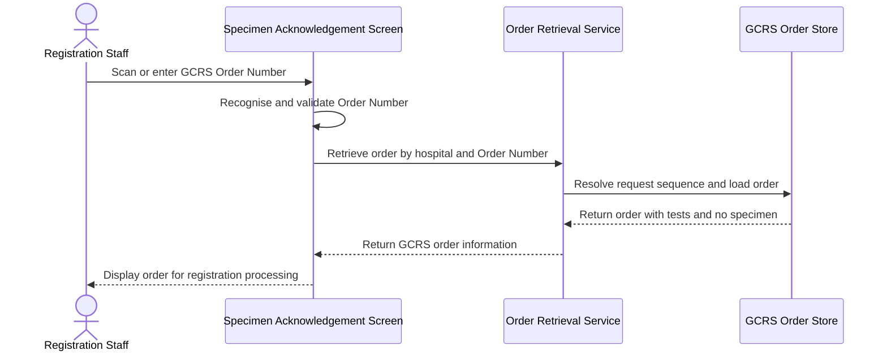
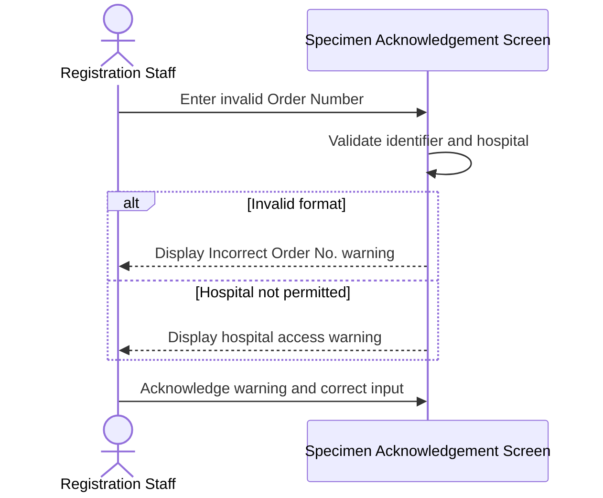
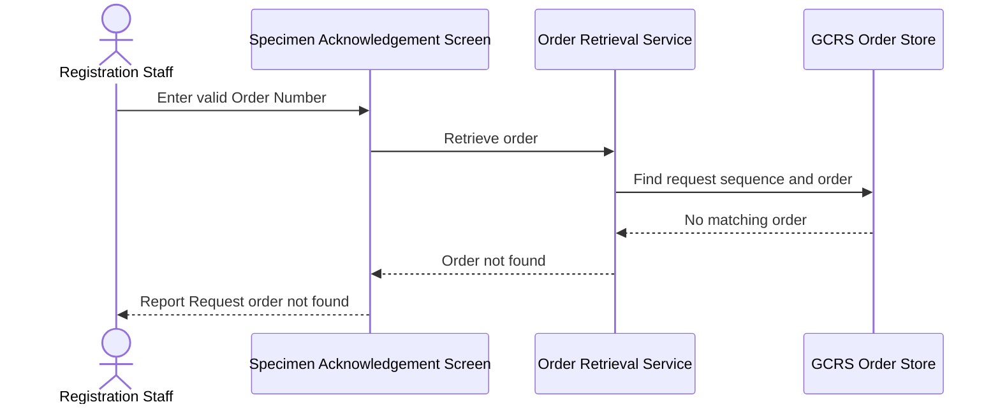
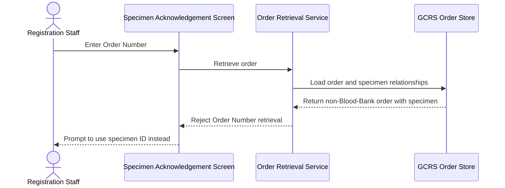
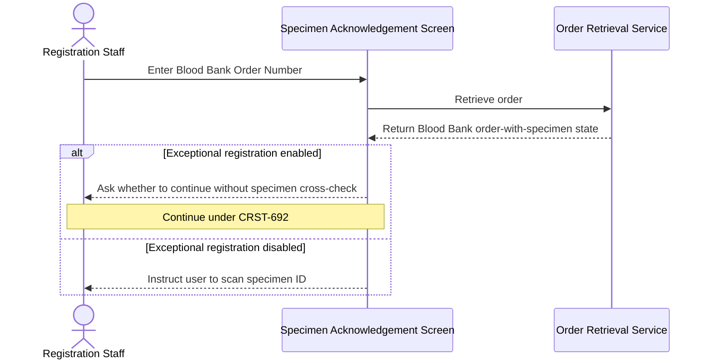

# Retrieve Order Information by Order Number

## Overview

This workflow allows Registration Staff to retrieve a General Clinical Request System (GCRS) order by scanning or entering its Order Number on the **Specimen Acknowledgement** screen. It is intended for orders that contain tests but have no physical specimen, such as selected Blood Bank and Anatomical Pathology requests. The workflow loads the matching order and prevents Order Number retrieval when a non-Blood-Bank order already has a specimen that should be scanned instead.

---

## Related User Stories

- **[[CRST-8]]** - Specimen Acknowledgement - Retrieve Order Information by Order Number
- **[[CRST-692]]** - Specimen Acknowledgement - Retrieve Order Information by Order Number for Blood Bank Order with Specimen

**Epic:** LISP-3 [CRST][DEV] Specimen Ack - Retrieve Order Information  
**Related issues:** LIST-47, LIST-1547

---

## Key Concepts

### GCRS Order Number
A 15-character identifier generated by the Clinical Management System (CMS). It identifies the sending hospital and source GCRS order independently of any specimen number.

### No-Specimen Order
A GCRS order containing one or more tests without a physical specimen record. No specimen-level row exists for the order, so its Order Number is used for retrieval.

### Blood Bank Special Flow
A Blood Bank order that already has a specimen may, under controlled configuration and authorisation, follow the exceptional flow defined by CRST-692. It is not the normal CRST-8 no-specimen path.

---

## Trigger Point

> This workflow begins when Registration Staff scan the barcode on a printed GCRS order form or enter its Order Number in the **Specimen No./Lab#/Order#** field.

---

## Workflow Scenarios

### Scenario 1: Retrieve an Existing Order with No Specimen

#### Prerequisites

- The entered Order Number follows the 15-character GCRS Order Number format.
- The sending hospital is within the hospitals the user may process.
- A GCRS order exists for the sending hospital and Order Number.
- The order contains one or more tests but has no physical specimen or specimen-level record.

#### Process Flow

#### Step-by-Step Details

1. Registration Staff scan or enter the GCRS Order Number in the **Specimen No./Lab#/Order#** field.
2. The system recognises the value from its length and fixed Order Number marker.
3. The sending hospital is obtained from the first three characters; a two-character hospital code is right-padded with a space in the printed identifier.
4. The system confirms that the sending hospital is permitted for the user.
5. The order's request sequence is located using the sending hospital and Order Number.
6. The patient, order, request, and test information is retrieved.
7. The system confirms that no specimen exists for the order.
8. The order information is displayed without a current specimen so the applicable no-specimen registration workflow can continue.

---

### Scenario 2: Reject an Invalid Order Number

#### Prerequisites

- The entered value is intended to be an Order Number.
- The value does not satisfy the required format, or its sending hospital is not permitted.

#### Process Flow

#### Step-by-Step Details

1. The system examines the entered value before retrieval.
2. An Order Number must contain exactly 15 characters in the defined format.
3. If its format is invalid, message `2693` is displayed with the entered value.
4. If the sending hospital is outside the user's permitted hospital list, message `2692` is displayed.
5. No order lookup is performed after validation fails.
6. The user acknowledges the message and corrects or replaces the input.

---

### Scenario 3: Valid Order Number Does Not Exist

#### Prerequisites

- The Order Number format is valid.
- No matching GCRS order or request sequence exists.

#### Process Flow

#### Step-by-Step Details

1. The system accepts the entered value as a valid GCRS Order Number.
2. The sending hospital and Order Number are used to locate a request sequence.
3. If no request sequence or order is found, no order information is loaded.
4. The outcome is recorded in the Log Monitor and reported as **Request order not found**.
5. The input is made available for correction or replacement.

---

### Scenario 4: Non-Blood-Bank Order Already Has a Specimen

#### Prerequisites

- The Order Number format is valid and identifies an existing order.
- The order is not a Blood Bank order.
- At least one physical specimen exists for the order.

#### Process Flow

#### Step-by-Step Details

1. The system retrieves the order identified by the entered Order Number.
2. The order's laboratory and specimen relationships are examined.
3. If the non-Blood-Bank order already has a specimen, its data is not displayed through this path.
4. Message `4193` instructs the user to scan the **Specimen ID** on the sample instead.
5. The message also directs a genuine no-sample unmatched Group O case to proceed to registration.
6. After acknowledgement, the screen is cleared for another identifier.

---

### Scenario 5: Blood Bank Order Already Has a Specimen

#### Prerequisites

- The Order Number identifies a Blood Bank order.
- The order already contains at least one specimen.

#### Process Flow

#### Step-by-Step Details

1. The system identifies the retrieved request as a Blood Bank order with an existing specimen.
2. If exceptional registration by Order Number is disabled, message `3917` instructs the user to scan the specimen or use the Blood Bank no-sample registration process.
3. If it is enabled, message `3916` asks whether to proceed without cross-checking the specimen.
4. Authorisation and continuation are handled under [[Retrieve Blood Bank Order with Specimen by Order Number]].
5. The normal CRST-8 workflow does not select or load the existing specimen.

---

## Summary Tables

### Order Number Format

| Character Position | Content | Rule |
|---|---|---|
| 1–3 | Sending Hospital | Three-character code; a two-character code is padded with one trailing space |
| 4–5 | Order Number marker | Fixed text `OR` |
| 6–7 | Year | Last two digits of the order creation year |
| 8–15 | Sequence | Eight alphanumeric characters distinguishing the order |
| Overall | Complete identifier | Exactly 15 characters |

### Retrieval Outcome Matrix

| Format | Order Exists | Order Type | Specimen Exists | Outcome |
|---|---|---|---|---|
| Invalid | Not checked | Any | Any | Message `2693`; retrieval stops |
| Valid, hospital not permitted | Not checked | Any | Any | Message `2692`; retrieval stops |
| Valid | No | Any | Not applicable | Not-found outcome; no order displayed |
| Valid | Yes | Non-Blood-Bank | No | Order information is displayed |
| Valid | Yes | Non-Blood-Bank | Yes | Message `4193`; user must scan specimen ID |
| Valid | Yes | Blood Bank | No | Order information is displayed |
| Valid | Yes | Blood Bank | Yes | Messages `3916` or `3917`; continue under CRST-692 when applicable |

### Messages

| Message Code | Business Meaning | User Options or Outcome |
|---|---|---|
| `2693` | Incorrect Order Number format | Acknowledge and correct the value |
| `2692` | The user may not process the identified hospital | Acknowledge and enter an authorised identifier |
| `1382` | No request order exists for the valid Order Number | No order is loaded; correct or replace input |
| `4193` | A non-Blood-Bank order has a specimen and must be retrieved by Specimen ID | Acknowledge and scan the specimen; use registration for an actual no-sample unmatched Group O case |
| `3916` | Blood Bank order has a specimen and exceptional Order Number registration is allowed | Yes / No; continuation belongs to CRST-692 |
| `3917` | Blood Bank order has a specimen and exceptional Order Number registration is not allowed | Acknowledge and follow the instructed Blood Bank path |

### Screen State

| Outcome | Order Information | Current Specimen | Next Action |
|---|---|---|---|
| Successful no-specimen retrieval | Displayed | None | Continue to applicable registration workflow |
| Invalid format or hospital | Not displayed | None | Correct input |
| Order not found | Not displayed | None | Correct input or verify source order |
| Existing non-Blood-Bank specimen | Not displayed | None | Scan specimen ID |
| Existing Blood Bank specimen | Controlled by CRST-692 | Not selected by CRST-8 | Follow Blood Bank prompt and authorisation |

---

## Data Sources

| Data | Source | Table | Column | Notes |
|---|---|---|---|---|
| Sending Hospital | GCRS order | `loe_order` | `loeord_send_hosp` | First component of the Order Number and part of the order key |
| GCRS Order Number | GCRS order | `loe_order` | `loeord_orderno` | Identifier excluding the hospital prefix used by the screen input |
| Order Creation Date | GCRS order | `loe_order` | `loeord_create_dtm` | Source order creation timestamp |
| Request Date | GCRS order | `loe_order` | `loeord_request_dtm` | Date and time the order was requested |
| Patient Case Number | GCRS order | `loe_order` | `loeord_pat_case` | Displayed with retrieved order information |
| Patient HKID | GCRS order | `loe_order` | `loeord_pat_hkid` | Patient identity held on the order |
| Patient Name | GCRS order | `loe_order` | `loeord_pat_name` | Patient identity held on the order |
| Request Sequence | GCRS test | `loe_request_test` | `loereqtst_req_seqno` | Located from hospital and Order Number before loading the order |
| Test Order Number | GCRS test | `loe_request_test` | `loereqtst_orderno` | Links each test to the order |
| Test Sending Hospital | GCRS test | `loe_request_test` | `loereqtst_send_hosp` | Used with the Order Number lookup |
| Test Code | GCRS test | `loe_request_test` | `loereqtst_test_code` | Identifies each ordered test |
| Test Status | GCRS test | `loe_request_test` | `loereqtst_test_status` | Current processing state of each test |
| LIS Laboratory Number | GCRS test mapping | `loe_test_map` | `loetestmap_labno` | Distinguishes Blood Bank requests from other laboratories |
| Specimen Relationship | Test-to-specimen mapping | `loe_request_test_spec` | `loereqtsp_specno` | Its absence confirms that no specimen is mapped to the test |
| Specimen Record | GCRS specimen store | `loe_specimen_detail` | `loespec_specno` | No row is expected for a successful CRST-8 no-specimen case |

### Data Written

No GCRS order, request, test, specimen, or mapping data is written by this retrieval workflow. Retrieval only establishes the current order context on the screen.

---

## Configuration

| Setting | Option Code | Purpose | Effect when enabled | Effect when disabled |
|---|---|---|---|---|
| Register by Order Number | `ALLOW_REGISTER_BY_ORDER_NO` *(source: cached GCRS option dictionary)* | Controls the exceptional Blood Bank flow when an Order Number identifies an order that already has a specimen | Message `3916` asks whether to continue under the authorised CRST-692 flow | Message `3917` blocks exceptional Order Number registration and directs the user to the specimen-based or Blood Bank no-sample path |

> This setting affects only the Blood Bank order-with-specimen exception. A valid order with no specimen remains eligible for normal CRST-8 retrieval.

---

## Business Rules

1. A GCRS Order Number contains exactly 15 characters.
2. Characters 1–3 identify the sending hospital; a two-character code is padded on the right with a space.
3. Characters 4–5 are the fixed marker `OR`.
4. Characters 6–7 contain the two-digit order year.
5. Characters 8–15 contain the alphanumeric sequence distinguishing the order.
6. The user must be permitted to process the sending hospital encoded in the Order Number.
7. A valid Order Number must resolve to a request sequence and GCRS order before information is displayed.
8. Normal retrieval applies to an order with tests but no physical specimen.
9. A non-Blood-Bank order with a specimen must be retrieved by its Specimen ID.
10. A Blood Bank order with a specimen follows the controlled CRST-692 exception.
11. Successful no-specimen retrieval does not create a specimen or assign a current specimen.
12. Retrieval is read-only and does not register or modify the order.

---

## Related Workflows

- [[Retrieve Blood Bank Order with Specimen by Order Number]] — Handles the controlled Blood Bank exception when an Order Number identifies an order that already has a specimen.
- [[Retrieve Order Information by Specimen Number]] — Required path when a non-Blood-Bank order has a specimen.
- [[Register Request]] — Continues processing after a no-specimen GCRS order is loaded.
- [[Input Lab Number with Multiple Specimens]] — Handles Lab Number retrieval where the user must select among mapped specimens.
- [[Clear Specimen Acknowledgement Screen]] — Resets the screen after an invalid or blocked retrieval outcome.

---

Technical Notes — Legacy and Revamp Traceability

- Legacy classification identifies an Order Number from the marker after the hospital prefix and checks its length. The revamp applies a stricter full expression in addition to those checks.
- CRST-8 permits an alphanumeric sequence in characters 8–15. The current revamp expression requires characters 6–14 to be numeric and permits an alphabetic character only at position 15. This is stricter than the story definition and legacy validation and requires compatibility review.
- Backend retrieval finds a distinct request sequence from `loe_request_test`, then loads the complete order. Blood Bank data may provide an additional request-sequence route through `loe_bbnk`.
- Both implementations reject non-Blood-Bank Order Number retrieval when the order contains specimens and use message `4193`.
- Legacy maps an Order Number not-found state to message `1382`. The revamp backend preserves the state, but the frontend currently maps every retrieval not-found response to generic specimen message `1377`; dedicated `1382` handling remains commented.
- Legacy message `3916` can continue after confirmation, identity verification, and access-right checking. The revamp currently displays the question but returns no order regardless of the response, so CRST-692 continuation is incomplete.
- The revamp no-specimen path passes an empty specimen identity into shared order loading. Focused testing is required to confirm downstream panels and actions behave correctly without a current specimen.
- The retrieval service can refresh patient information from an external patient source when local active data is unavailable. This implementation side effect is not a CRST-8 order/specimen write and should not alter the business definition of retrieval.
- No focused revamp tests were identified for Order Number validation, not-found mapping, message `4193`, Blood Bank continuation, or the backend decision matrix.

