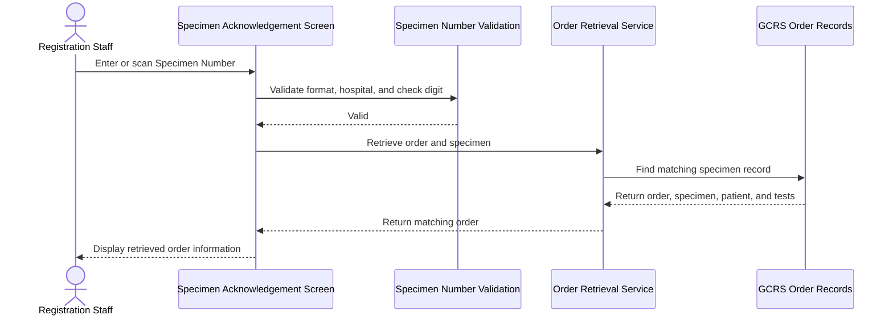
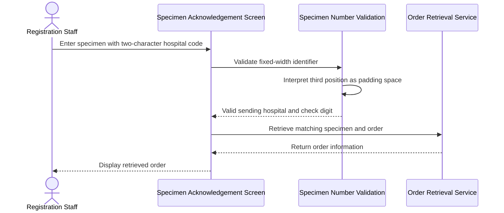
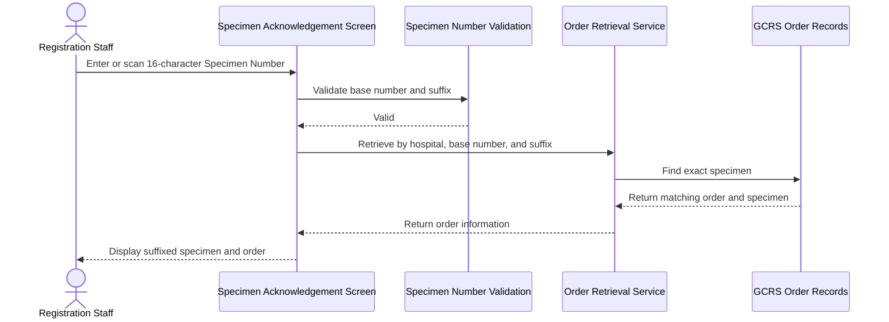
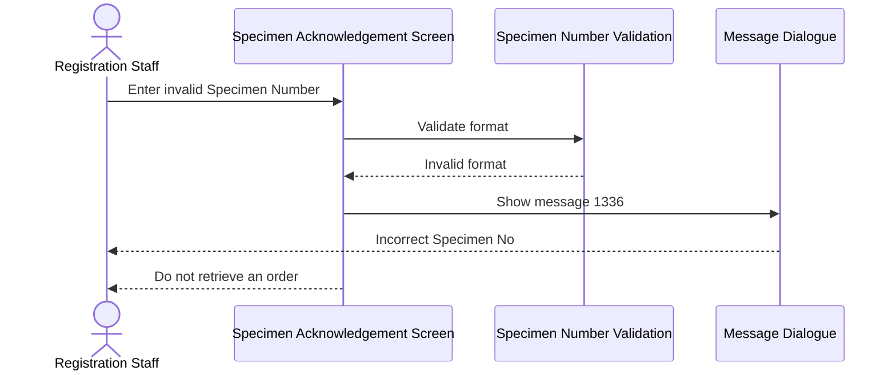
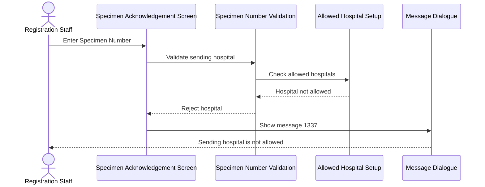
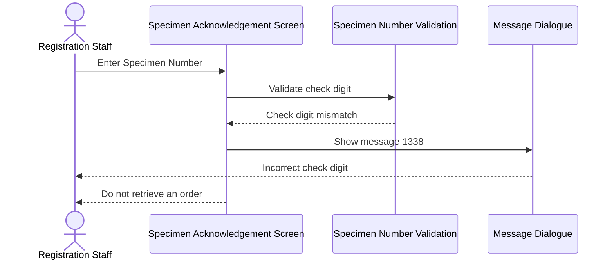
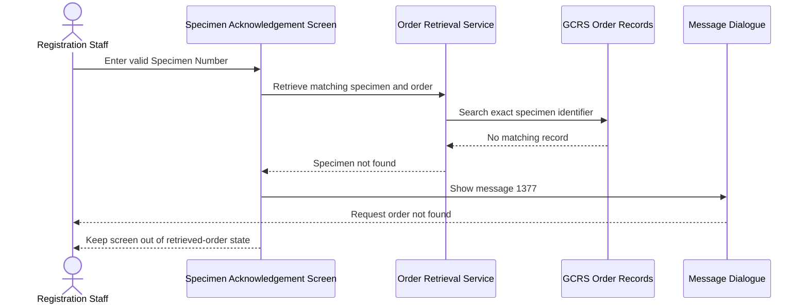

# Retrieve Order Information by Specimen Number

## Overview

This workflow allows registration staff to retrieve a General Clinical Request System (GCRS) order by entering or scanning its Specimen Number on the **Specimen Acknowledgement** screen. The Specimen Number identifies a specimen created by the Clinical Management System (CMS) and links it to the originating order, patient, and tests. Format, sending-hospital, and check-digit validation prevent the wrong order from being loaded before specimen acknowledgement or registration continues.

---

## Related User Stories

- **[[CRST-4]]** - Specimen Acknowledgement - Retrieve Order Information by Specimen Number Input

**Epic:** LISP-3 [CRST][DEV] Specimen Ack - Retrieve Order Information  
**Related issue:** LIST-84 - Validate GCRS Specimen Number Input

---

## Key Concepts

### GCRS Specimen Number
A 15-character identifier, with an optional 16th-character specimen suffix, assigned to a specimen created from a GCRS order.

### Sending Hospital
The hospital that created or sent the specimen. Its two- or three-character hospital code forms the beginning of the displayed Specimen Number. A two-character code is padded with one trailing space in the fixed-width identifier.

### Specimen Suffix
An optional alphabetic character used to distinguish related specimens. When no suffix is present, the stored suffix value is `0`.

### Check Digit
The final digit of the 15-character base Specimen Number. It is validated using the sending hospital's check-digit factor to detect mistyped or incorrectly scanned identifiers.

---

## Trigger Point

> The workflow begins when the user enters or scans a value into the **Specimen No./Lab#/Order#** field on the **Specimen Acknowledgement** screen and submits or leaves the field for validation.

---

## Workflow Scenarios

### Scenario 1: Retrieve an Order with a Valid 15-Character Specimen Number

#### Prerequisites

- The user is authorised to access the **Specimen Acknowledgement** screen.
- The GCRS order contains a specimen.
- The specimen is stored in the specimen-detail records.
- The sending hospital is allowed for specimen retrieval.
- The Specimen Number has a valid format and check digit.
- The Specimen Number has no suffix.

#### Process Flow

#### Step-by-Step Details

1. The user enters or scans a 15-character Specimen Number in the **Specimen No./Lab#/Order#** field.
2. Leading and trailing spaces around the complete input are removed before validation. A trailing space within a two-character sending-hospital segment remains part of the fixed-width format.
3. The system confirms that the value follows the GCRS Specimen Number structure.
4. The sending-hospital code is extracted and checked against the hospitals allowed for specimen retrieval.
5. The check digit is validated using the sending hospital's check-digit factor.
6. When validation succeeds, the system searches for the exact combination of Sending Hospital, base Specimen Number, and the no-suffix value.
7. If the specimen exists, its GCRS order is retrieved and the matching specimen is selected automatically.
8. Patient demographics, specimen information, order information, and related tests are displayed on the main screen.
9. The user can continue with the specimen acknowledgement or request registration workflow.

---

### Scenario 2: Retrieve an Order with a Two-Character Sending-Hospital Code

#### Prerequisites

- All prerequisites for a valid specimen retrieval are met.
- The sending-hospital code contains two characters.

#### Process Flow

#### Step-by-Step Details

1. The user enters or scans the Specimen Number.
2. The system reads the first three character positions as the sending-hospital segment.
3. Because the hospital code has two characters, the third position is treated as a required trailing padding space.
4. The two-character hospital code is then used for allowed-hospital and check-digit validation.
5. If validation and retrieval succeed, the matching order and specimen information are displayed in the same way as for a three-character hospital code.

---

### Scenario 3: Retrieve an Order with a Specimen Suffix

#### Prerequisites

- All prerequisites for a valid specimen retrieval are met.
- The input contains a 15-character base Specimen Number followed by a one-character suffix.

#### Process Flow

#### Step-by-Step Details

1. The user enters or scans a 16-character Specimen Number.
2. The first 15 characters are treated as the base Specimen Number and the 16th character is treated as the Specimen Suffix.
3. The base number is subjected to the same structure, allowed-hospital, and check-digit validation as a number without a suffix.
4. The system searches using the Sending Hospital, base Specimen Number, and exact Specimen Suffix.
5. If the exact specimen exists, the associated order is retrieved and the suffixed specimen is selected.
6. The retrieved information is displayed on the main screen.

---

### Scenario 4: Reject an Invalid Specimen Number Format

#### Prerequisites

- The user has entered or scanned a non-empty value.
- The value does not conform to the supported 15- or 16-character GCRS Specimen Number format.

#### Process Flow

#### Step-by-Step Details

1. The user enters or scans a value in the **Specimen No./Lab#/Order#** field.
2. The system determines that the value does not match the supported Specimen Number structure, including a value shorter than 15 characters.
3. Message **1336**, **“Incorrect Specimen No: (invalid specimen no.)”**, is displayed with the entered value.
4. No order is retrieved and the screen does not proceed to the retrieved-order state.
5. The user closes the message and can correct or rescan the Specimen Number.

---

### Scenario 5: Reject a Specimen from a Disallowed Sending Hospital

#### Prerequisites

- The input has a recognisable GCRS Specimen Number structure.
- The sending-hospital code is not configured as an allowed hospital for specimen retrieval.

#### Process Flow

#### Step-by-Step Details

1. The sending-hospital code is extracted from the Specimen Number.
2. The system compares it with the configured list of hospitals accepted by the current receiving hospital.
3. If it is not allowed, message **1337** is displayed with the sending-hospital code.
4. No order lookup is performed.
5. The user closes the message and can enter another Specimen Number.

---

### Scenario 6: Reject an Incorrect Check Digit

#### Prerequisites

- The Specimen Number has the expected structure and length.
- The sending hospital is allowed.
- The check digit does not match the value calculated for the Specimen Number and sending hospital.

#### Process Flow

#### Step-by-Step Details

1. The system validates the check digit after the format and sending-hospital checks succeed.
2. If the entered check digit does not match the calculated value, message **1338**, **“Incorrect check digit for Specimen No: (invalid specimen no.)”**, is displayed with the entered value.
3. No order is retrieved.
4. The user closes the message and can correct or rescan the Specimen Number.

---

### Scenario 7: Handle a Valid Specimen Number with No Matching Record

#### Prerequisites

- The Specimen Number has a valid format and check digit.
- The sending hospital is allowed.
- No specimen record exists for the exact base Specimen Number and suffix combination.

#### Process Flow

#### Step-by-Step Details

1. The input passes format, allowed-hospital, and check-digit validation.
2. The system searches for the exact specimen record, including the Specimen Suffix when present.
3. If no matching specimen is found, message **1377**, **“Request order not found for Specimen No: (valid specimen no.)”**, is displayed with the Specimen Number.
4. No order information is populated.
5. The user closes the message and can enter another Specimen Number.

---

## Specimen Number Structure

| Character position | Business meaning | Rule |
|---|---|---|
| 1–3 | Sending Hospital | Three-character hospital code, or a two-character code followed by one padding space |
| 4–5 | Identifier Type | Fixed text `SP`, indicating a Specimen Number |
| 6–7 | Order Year | Last two digits of the year in which the order was created |
| 8–14 | Sequence Number | Seven-digit sequence assigned by CMS when the specimen is generated |
| 15 | Check Digit | Digit used to validate the base Specimen Number |
| 16 | Specimen Suffix | Optional, normally alphabetic, beginning with values such as `A`, `B`, or `C` |

---

## Validation and Message Summary

| Condition | Outcome | Message Code | Message |
|---|---|---|---|
| Valid 15-character number and matching specimen | Order and specimen are displayed | — | — |
| Valid 16-character number and matching suffix | Order and suffixed specimen are displayed | — | — |
| Invalid structure or fewer than 15 characters | Retrieval is stopped | `1336` | Incorrect Specimen No: (invalid specimen no.) |
| Sending hospital is not allowed | Retrieval is stopped | `1337` | Sending hospital is not allowed for retrieval |
| Incorrect check digit | Retrieval is stopped | `1338` | Incorrect check digit for Specimen No: (invalid specimen no.) |
| Valid number but exact specimen record does not exist | Retrieval is stopped | `1377` | Request order not found for Specimen No: (valid specimen no.) |

---

## Data Sources

| Data | Source |
|---|---|
| Sending Hospital | `LOE_SPECIMEN_DETAIL.loespec_send_hosp` |
| Base Specimen Number | `LOE_SPECIMEN_DETAIL.loespec_specno` |
| Specimen Suffix | `LOE_SPECIMEN_DETAIL.loespec_specno_suffix`; value `0` means no suffix |
| Allowed sending hospitals | Specimen acknowledgement hospital setting, option `SP_ALLOW_HOSP` |
| Sending-hospital check-digit factor | Hospital reference data; the exact database source requires confirmation |
| Retrieved order, patient, specimen, and tests | GCRS order records associated with the exact specimen identifier |

---

## Configuration

| Setting | Option Code | Purpose | Effect when configured | Effect when missing or hospital not listed |
|---|---|---|---|---|
| Allowed Sending Hospitals | `SP_ALLOW_HOSP` *(source: `LOE_CONTROL`, group `HOSP_SETTING`)* | Defines the comma-separated hospital codes accepted for specimen retrieval by the receiving hospital | A listed sending hospital can proceed to format and check-digit validation | The hospital is rejected and message `1337` is displayed |
| Hospital Check-Digit Factor | *(source: hospital reference data; exact table/column requires clarification)* | Supplies the hospital-specific factor used to validate a GCRS Specimen Number | The check digit can be calculated and validated | Retrieval cannot be confirmed as valid |

---

## Business Rules

1. A GCRS order can be retrieved by Specimen Number only when the order has a specimen, the specimen-detail record exists, and the Specimen Number is valid.
2. A displayed GCRS Specimen Number contains exactly 15 characters without a suffix or 16 characters with a suffix.
3. A two-character sending-hospital code occupies three positions by using one trailing padding space.
4. The identifier type at positions 4–5 is always `SP`.
5. The optional suffix is not part of the base number's check-digit calculation, but it is part of the exact specimen lookup.
6. A missing suffix is represented by the stored value `0`.
7. The sending hospital must be included in the receiving hospital's allowed-hospital setup.
8. Format validation is completed before an order lookup is attempted.
9. The check digit is validated before an order lookup is attempted.
10. A valid identifier is not sufficient for retrieval; an exact specimen-detail record must also exist.
11. Successful retrieval selects the exact specimen automatically and populates the screen with its associated order information.
12. Retrieval is read-only and does not write or alter specimen or order data.

---

## Related Workflows

- [[Open and Navigate Specimen Acknowledgement Screen]] — Provides the retrieval field and panels populated by this workflow.
- [[Specimen Number with 2D Barcode Input]] — Decodes a barcode before applying Specimen Number validation and retrieval.
- [[Input Lab Number for Ward-Assigned Request]] — Retrieves information using a Lab Number instead of a Specimen Number.
- [[Input Order Number]] — Retrieves information using an Order Number instead of a Specimen Number.
- [[Display Order Data]] — Defines how retrieved patient, specimen, order, and test information is presented.
- [[Acknowledge Specimen]] — A possible next action after successful retrieval.
- [[Register Request from Specimen Acknowledgement]] — A possible next action after successful retrieval.
