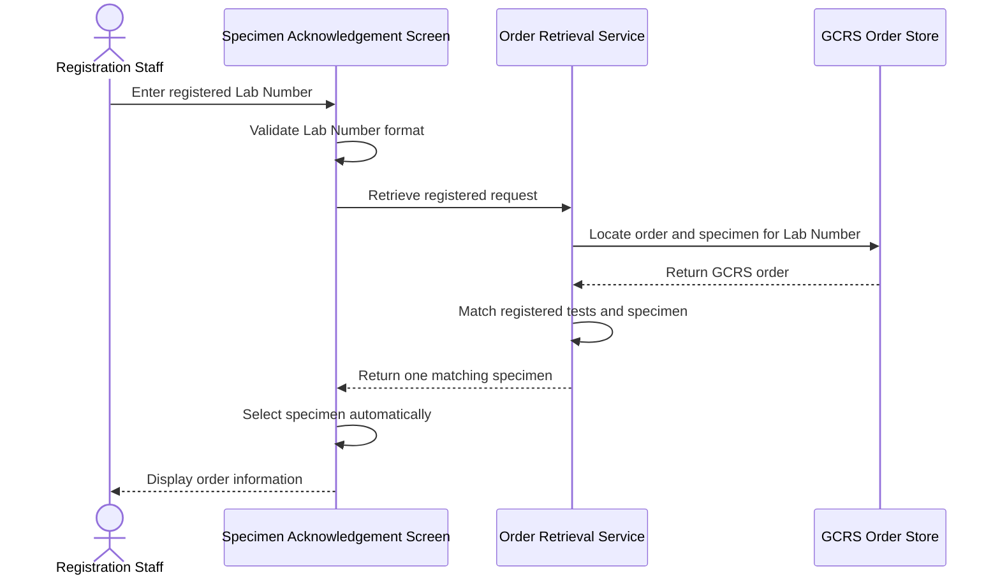
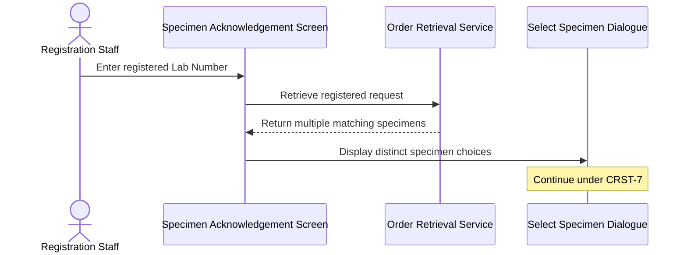
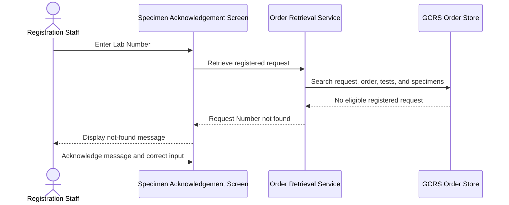

# Retrieve Registered Request by Lab Number

## Overview

This workflow allows Registration Staff to retrieve a previously registered General Clinical Request System (GCRS) request by entering its Lab Number on the **Specimen Acknowledgement** screen. The Lab Number identifies the registered test or tests and their associated specimen within the source GCRS order. Successful retrieval restores the matching patient, order, request, specimen, and test information so specimen processing can continue without registering the request again.

---

## Related User Stories

- **[[CRST-85]]** - Specimen Acknowledgement - Input Lab Number for a Registered Request
- **[[CRST-7]]** - Specimen Acknowledgement - Input Lab Number with Multiple Specimens
- **[[CRST-84]]** - Specimen Acknowledgement - Input Lab Number for a DFT Case

**Epic:** LISP-3 [CRST][DEV] Specimen Ack - Retrieve Order Information  
**Related issue:** LIST-85

---

## Key Concepts

### Registered Request Lab Number
The Request Number assigned to a GCRS test when registration is completed. For this workflow, the authoritative Lab Number is held against the registered test rather than against an unregistered ward-assigned specimen.

### Registered Status
The relevant GCRS test must have the status **Registered** (`R`). A Request Number by itself is not sufficient if the order has no specimen or the relevant request is not registered.

### Matching Specimen
The specimen or specimens linked to tests whose registered Lab Number equals the entered value. References to the same specimen are consolidated so that a specimen appears only once during retrieval or selection.

### Retrieval and Registration Boundary
This workflow reads a registration that already exists. It does not assign a new Lab Number, change the test status, or repeat registration.

---

## Trigger Point

> The workflow begins when Registration Staff enter or scan a registered Lab Number in the **Specimen No./Lab#/Order#** field on the **Specimen Acknowledgement** screen and submit or leave the field for validation.

---

## Workflow Scenarios

### Scenario 1: Retrieve a Registered Request with One Matching Specimen

#### Prerequisites

- A GCRS order exists for the entered Lab Number.
- The order contains at least one specimen.
- At least one test carries the entered Lab Number.
- The matching test status is **Registered** (`R`).
- Exactly one distinct specimen is linked to the matching test or tests.

#### Process Flow

#### Step-by-Step Details

1. Registration Staff enter or scan the registered Lab Number in the **Specimen No./Lab#/Order#** field.
2. The system validates that the value is a recognised Lab Number format.
3. The previously registered order and specimen relationship is located for the current hospital context.
4. The complete GCRS order is retrieved.
5. The system examines the order's tests and selects those whose **Lab Number** equals the entered value.
6. The matching test must be **Registered** and must be linked to a specimen.
7. If several matching tests refer to the same specimen, the specimen is included only once.
8. Because exactly one distinct specimen matches, it is selected automatically.
9. The patient, order, request, specimen, and test information is displayed on the **Specimen Acknowledgement** screen.
10. The user may continue with the actions available for the retrieved specimen.

---

### Scenario 2: Registered Lab Number Maps to Multiple Specimens

#### Prerequisites

- The GCRS order satisfies the registered-request criteria.
- More than one distinct specimen is linked to tests carrying the entered Lab Number.

#### Process Flow

#### Step-by-Step Details

1. The system collects every distinct specimen linked to registered tests whose Lab Number equals the entered value.
2. If more than one specimen matches, no specimen is selected automatically.
3. The **Select Specimen** dialogue is displayed with the matching **Specimen** and **Description** values.
4. The user selects the required specimen and clicks **Retrieve**, or clicks **Cancel** to stop retrieval.
5. Detailed selection and cancellation behaviour continue under [[Input Lab Number with Multiple Specimens]].

---

### Scenario 3: Registered Request Cannot Be Retrieved

#### Prerequisites

One or more required conditions are absent, for example:

- No registered request can be located for the entered Lab Number.
- The GCRS order has no specimen.
- No test carries the entered Lab Number.
- The relevant test status is not **Registered** (`R`).
- No specimen is linked to the matching registered test.

#### Process Flow

#### Step-by-Step Details

1. Registration Staff enter a value recognised as a Lab Number.
2. The system attempts to locate the previously registered request and its source order.
3. The order must contain a test whose registered Lab Number equals the entered value.
4. The matching test must have **Registered** status and an associated specimen.
5. If any required condition is absent, no order or specimen is loaded through this workflow.
6. A Request Number not-found message is displayed.
7. After the user acknowledges the message, the **Specimen No./Lab#/Order#** field is cleared or made available for corrected input.

---

## Summary Tables

### Retrieval Eligibility Matrix

| Condition | Eligible | Outcome |
|---|---|---|
| Order contains specimen, matching Lab Number exists, status is `R`, one matching specimen | Yes | Specimen is selected automatically and order information is displayed |
| Order contains specimen, matching Lab Number exists, status is `R`, multiple matching specimens | Yes, with selection | The **Select Specimen** dialogue is displayed under CRST-7 |
| Order contains no specimen | No | Request Number not-found outcome |
| No test carries the entered Lab Number | No | Request Number not-found outcome |
| Matching test status is not `R` | No | The request does not satisfy CRST-85 |
| Matching test has no linked specimen | No | The request does not satisfy CRST-85 |

### Matching and Selection Rules

| Matching Result | System Behaviour |
|---|---|
| No distinct specimen | No specimen is loaded; not-found handling applies |
| One distinct specimen | The specimen is selected automatically |
| More than one distinct specimen | The user selects a specimen under CRST-7 |
| Several tests reference the same specimen | The specimen is shown once |

### Messages

| Message Code | Business Meaning | User Action |
|---|---|---|
| `3405` | The entered Lab Number cannot be resolved as an eligible registered Request Number | Acknowledge the message and correct or replace the input |

> The exact displayed text is supplied by the message dictionary. The stable business meaning is “Request Number not found.”

### Field State After Retrieval

| Field or Area | Successful Retrieval | Not-Found Outcome |
|---|---|---|
| **Specimen No./Lab#/Order#** | Retains the entered registered Lab Number | Cleared or available for correction after the message is acknowledged |
| Order information | Populated | Not populated |
| Current specimen | Matching specimen selected automatically, or selected by the user when multiple specimens exist | Not populated |
| Test information | Matching and related order tests are displayed | Not populated |
| Registration data | Unchanged by retrieval | Unchanged |

---

## Data Sources

| Data | Source | Table | Column | Notes |
|---|---|---|---|---|
| Registered Lab Number | GCRS registered test | `loe_request_test` | `loereqtst_reqno` | Authoritative Lab Number defined by CRST-85 |
| Registration Status | GCRS registered test | `loe_request_test` | `loereqtst_test_status` | Must be Registered (`R`) for this workflow |
| Registration Date | GCRS registered test | `loe_request_test` | `loereqtst_register_dtm` | Date and time at which the test was registered |
| Order Number | GCRS registered test | `loe_request_test` | `loereqtst_orderno` | Links the registered test to its GCRS order |
| Request Sequence | GCRS registered test | `loe_request_test` | `loereqtst_req_seqno` | Identifies the request within the order |
| Test Sequence | GCRS registered test | `loe_request_test` | `loereqtst_test_seqno` | Identifies the registered test within the request |
| Sending Hospital | GCRS registered test | `loe_request_test` | `loereqtst_send_hosp` | Identifies the hospital owning the order |
| Specimen Number | Test-to-specimen relationship | `loe_request_test_spec` | `loereqtsp_specno` | Links the registered test to its specimen |
| Request Sequence Link | Test-to-specimen relationship | `loe_request_test_spec` | `loereqtsp_req_seqno` | Joins the specimen relationship to the request |
| Test Sequence Link | Test-to-specimen relationship | `loe_request_test_spec` | `loereqtsp_test_seqno` | Joins the specimen relationship to the test |
| Sending Hospital Link | Test-to-specimen relationship | `loe_request_test_spec` | `loereqtsp_send_hosp` | Joins the specimen relationship within the owning hospital |
| Registered Request lookup | Registration and processing history | `loe_audit_trail` | `loeaud_reqno` | Supporting lookup used to locate the previously processed order and specimen |
| Performing Hospital | Registration and processing history | `loe_audit_trail` | `loeaud_act_hosp` | Restricts the lookup to the applicable hospital context |
| Order reference | Registration and processing history | `loe_audit_trail` | `loeaud_orderno` | Identifies the GCRS order associated with the Lab Number |
| Sending Hospital reference | Registration and processing history | `loe_audit_trail` | `loeaud_send_hosp` | Identifies the hospital owning the specimen |
| Specimen reference | Registration and processing history | `loe_audit_trail` | `loeaud_spec_no` | Identifies the specimen associated with the registration activity |
| Specimen Suffix | Registration and processing history | `loe_audit_trail` | `loeaud_spec_no_suffix` | Distinguishes suffixed specimens when applicable |

### Data Written

No data is written by this retrieval workflow. The registered Lab Number and status are created by the earlier registration workflow.

---

## Configuration

No CRST-85-specific system option was identified. Lab Number entry is a standard capability of the **Specimen Acknowledgement** screen.

The ward-assigned Request Number fallback setting documented under [[Input Lab Number for Ward-Assigned Request]] is not required for the normal registered-request path. A registered request is expected to be discoverable from its prior registration and processing history.

---

## Business Rules

1. The Lab Number must have been assigned before this workflow begins.
2. The Lab Number used for a standard registered request is the value held against the GCRS test.
3. The source GCRS order must contain at least one specimen.
4. A matching test must carry the entered Lab Number.
5. The matching test status must be **Registered** (`R`).
6. Only specimens linked to matching registered tests are candidates for retrieval.
7. Duplicate references to the same specimen must not create duplicate choices.
8. Exactly one distinct matching specimen is selected automatically.
9. Multiple distinct matching specimens require explicit selection under CRST-7.
10. If no eligible registered test and specimen can be resolved, no order information is loaded.
11. Retrieval is read-only and does not create, update, or re-register the request.
12. DFT-specific Lab Number matching is handled separately under CRST-84.

---

## Related Workflows

- [[Input Lab Number for DFT Case]] — Handles Lab Numbers assigned to Dynamic Function Test occurrences rather than standard registered tests.
- [[Input Lab Number with Multiple Specimens]] — Handles selection when a registered Lab Number maps to more than one specimen.
- [[Input Lab Number for Ward-Assigned Request]] — Handles a pre-assigned Request Number stored with an unregistered test-to-specimen relationship.
- [[Retrieve Order Information by Specimen Number]] — Provides an alternative retrieval route using the specimen identifier.
- [[Register Request]] — Assigns and stores the registered Lab Number that is later used by this workflow.

---

Technical Notes — Legacy and Revamp Traceability

- The authoritative registered Lab Number is `loe_request_test.loereqtst_reqno`. The registered status is `loe_request_test.loereqtst_test_status` with data value `R`.
- Both the legacy and revamp backends resolve a Request Number through `loe_audit_trail` first. The lookup returns the order, sending hospital, specimen number, suffix, and performing hospital, after which the complete GCRS order is loaded.
- The backend audit lookup filters by `loeaud_reqno` and the current performing hospital but does not filter by audit action. A registered request is therefore operationally dependent on a suitable audit-history row even though CRST-85 defines the Lab Number in `loe_request_test`.
- If no audit match exists, both implementations query `loe_request_test_spec.loereqtsp_reqno` only when ward-assigned Request Number retrieval is enabled. That fallback belongs to CRST-6 and is not the primary CRST-85 lookup.
- When the order is returned, legacy logic scans standard and add-request tests, compares the entered value with the test Request Number, gathers linked specimens, and removes duplicate specimen display numbers. Revamp candidate construction applies the same Request Number matching and de-duplication through the order-test DTOs.
- CRST-85 requires status `R`, but neither the legacy candidate filter nor the revamp candidate filter explicitly checks the returned test status while matching the Lab Number. They rely on the registration lifecycle and audit lookup to imply eligibility. A partially registered or inconsistent record that already carries the same Request Number should be tested to confirm the required exclusion.
- In the current revamp single-candidate path, the screen assigns the first specimen in the retrieved order rather than the sole specimen from the matched candidate list. If the registered Lab Number belongs to a different specimen, the wrong specimen can be selected. This is a CRST-85 parity item for review.
- The revamp multiple-specimen callback also overwrites the internal specimen number with the first order specimen after the user selects a candidate. Detailed correction belongs with CRST-7.
- Legacy not-found handling displays message `3405`. The current revamp converts all retrieval not-found states to a shared response and displays generic specimen-not-found message `1377`; dedicated `3405` handling remains commented. The intended CRST-85 business outcome remains “Request Number not found.”
- No focused unit test for registered Lab Number candidate matching or the single-candidate specimen selection path was identified in the revamp frontend.

