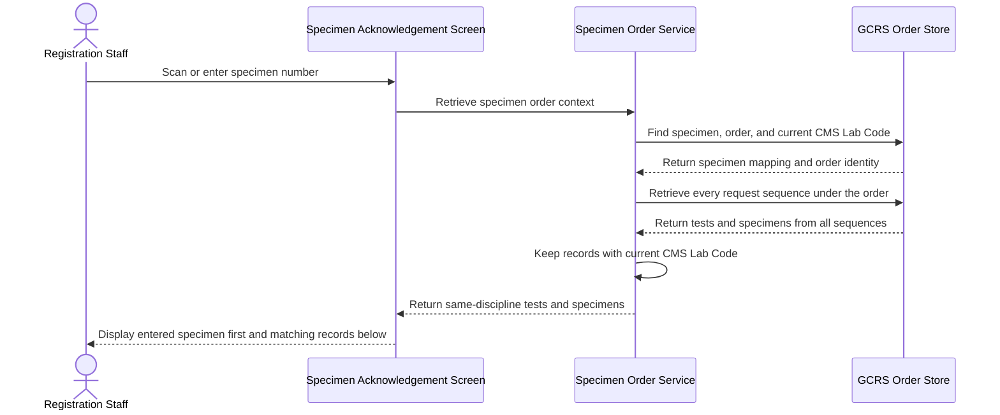
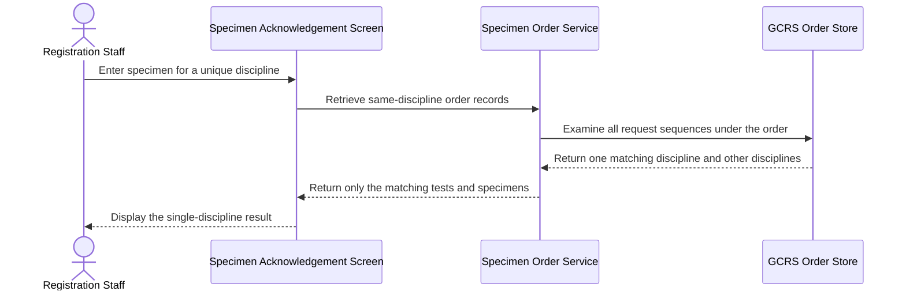
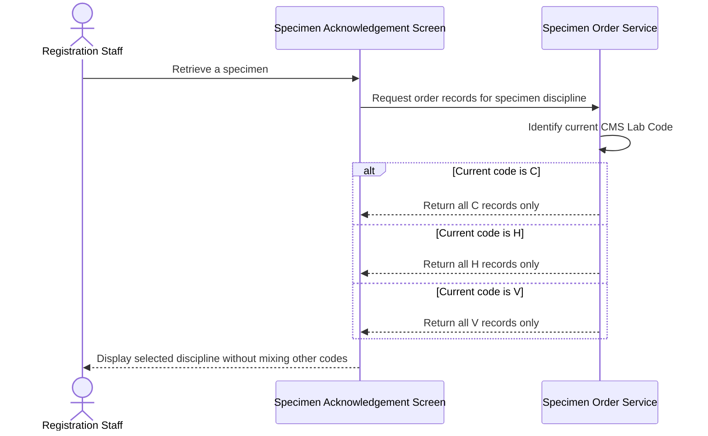
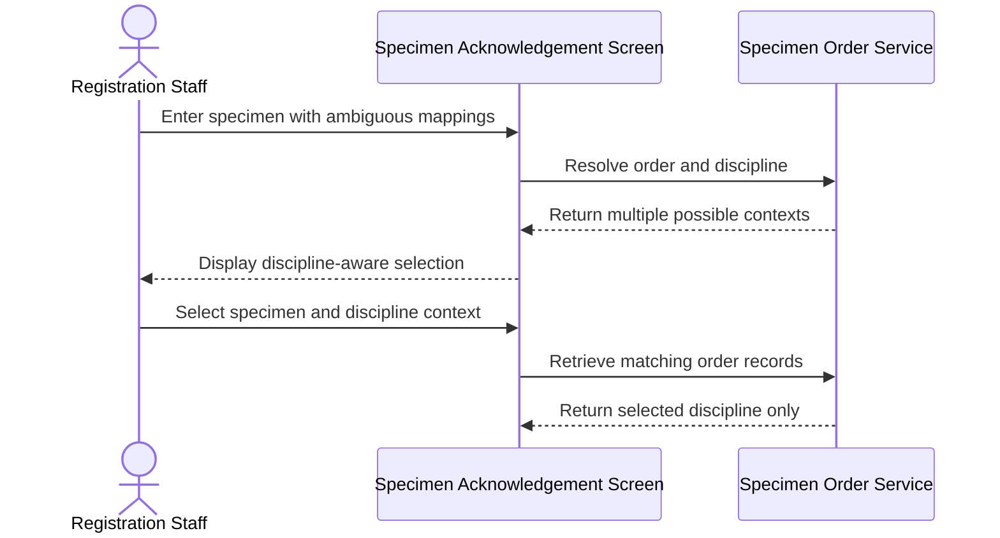

# Retrieve Same-Discipline Tests from Multi-Sequence Order

## Overview

This workflow ensures that Registration Staff see the correct tests when a General Clinical Request System (GCRS) order contains multiple request sequences for different CMS disciplines. After a specimen is scanned or entered, the system determines its CMS Lab Code and displays every test and specimen from the same order assigned to that discipline, even when they belong to different request sequences. Tests for other disciplines are excluded so staff do not process work intended for another laboratory.

---

## Related User Stories

- **[[CRST-413]]** - Specimen Acknowledgement - Multiple Request Sequence in the Same GCRS Order

**Epic:** LISP-3 [CRST][DEV] Specimen Ack - Retrieve Order Information

---

## Key Concepts

### GCRS Order
A common clinical order that may contain tests for one or more CMS disciplines. Every request sequence considered by this workflow belongs to the same GCRS Order Number.

### Request Sequence
An internal subdivision of a GCRS order. A single order may contain multiple request sequences, and request-sequence boundaries do not by themselves determine which tests are displayed.

### CMS Lab Code
The discipline code assigned to each ordered test, such as `C`, `H`, or `V`. It is the primary grouping rule for this workflow.

### Current Discipline
The CMS Lab Code associated with the test-to-specimen mapping for the entered specimen. All tests displayed by this workflow must belong to this discipline and the same GCRS order.

---

## Trigger Point

> This workflow begins during [[Retrieve Order Information by Specimen Number]] after the entered specimen has been located and its GCRS Order Number is known.

---

## Workflow Scenarios

### Scenario 1: Matching Discipline Appears in Multiple Request Sequences

#### Prerequisites

- One GCRS order contains multiple request sequences.
- At least two request sequences contain tests with the same CMS Lab Code.
- At least one other request sequence contains a different CMS Lab Code.
- The entered specimen is mapped to a test in the repeated discipline.

#### Process Flow

#### Step-by-Step Details

1. Registration Staff scan or enter a specimen number in the **Specimen No./Lab#/Order#** field.
2. The system locates the specimen's test-to-specimen mapping and identifies its GCRS Order Number.
3. The CMS Lab Code attached to the mapped test becomes the current discipline.
4. Every request sequence belonging to the same GCRS order is examined.
5. Tests and specimens with the current CMS Lab Code are included, regardless of their request sequence.
6. Tests and specimens with any other CMS Lab Code are excluded.
7. The selected specimen is moved to the top of the **Test** panel.
8. Other eligible specimens and tests from the same discipline remain visible below it.

---

### Scenario 2: Current Discipline Appears Only Once

#### Prerequisites

- The GCRS order contains multiple CMS disciplines.
- Only one request sequence contains the entered specimen's CMS Lab Code.

#### Process Flow

#### Step-by-Step Details

1. The system determines the entered specimen's GCRS order and CMS Lab Code.
2. All request sequences under the order are checked.
3. Only the tests and specimens carrying the current CMS Lab Code are retained.
4. Because no other request sequence shares that code, only the current discipline's records are displayed.
5. Records for all other disciplines remain hidden.

---

### Scenario 3: Order Contains Several Repeated Disciplines

#### Prerequisites

- One order contains tests for three or more CMS disciplines.
- More than one discipline occurs in multiple request sequences.

#### Process Flow

#### Step-by-Step Details

1. The current discipline is determined from the entered specimen's associated test.
2. The number of request sequences is not used as an inclusion limit.
3. Every test and specimen sharing both the GCRS Order Number and current CMS Lab Code is displayed.
4. Switching retrieval to a specimen from another discipline produces a separate result containing only that discipline.

---

### Scenario 4: Specimen Mapping Is Ambiguous

#### Prerequisites

- The entered specimen number maps to more than one request sequence or CMS discipline.
- The mapping cannot be resolved automatically from the full specimen identity and test relationship.

#### Process Flow

#### Step-by-Step Details

1. The system uses the complete specimen identity, including suffix where applicable, to resolve its mappings.
2. If more than one valid context remains, records are not selected merely by response order.
3. A selection dialogue identifies each choice by **Specimen No.**, **Request No.**, **Request Sequence**, and **Discipline**.
4. The user selects the intended context.
5. The system retrieves all records with the selected GCRS Order Number and CMS Lab Code.
6. Cancelling the selection leaves the order unloaded and returns focus to the identification field.

---

## Summary Tables

### Inclusion Rules

| Relationship to Entered Specimen | Same Order Number | Same CMS Lab Code | Same Request Sequence | Displayed |
|---|---:|---:|---:|---:|
| Current specimen and tests | Yes | Yes | Yes | Yes |
| Sibling specimen in current sequence | Yes | Yes | Yes | Yes |
| Specimen in another request sequence | Yes | Yes | No | Yes |
| Test in another discipline | Yes | No | Either | No |
| Record from another GCRS order | No | Either | Either | No |
| Same CMS Lab Code mapped to a different LIS laboratory | Yes | Yes | Either | Requires mapping validation before inclusion |

### Example Discipline Results

| CMS Lab Codes in Order | Entered Specimen Discipline | Expected Display |
|---|---|---|
| `C`, `C`, `H` | `C` | All `C` tests and specimens from both request sequences |
| `C`, `C`, `H` | `H` | Only the `H` tests and specimen |
| `C`, `H`, `H`, `H`, `H`, `V`, `V` | `H` | All four `H` groups; no `C` or `V` records |
| `C`, `H`, `H`, `H`, `H`, `V`, `V` | `V` | Both `V` groups; no `C` or `H` records |

### Display Rules

| Item | Display Behaviour |
|---|---|
| Entered specimen | Appears first in the **Test** panel |
| Other same-discipline specimens | Remain visible below the entered specimen |
| Same-discipline tests in another request sequence | Displayed as part of the same retrieval result |
| Other-discipline tests | Hidden |
| Request sequence | Retained with each record so later actions use the correct sequence |
| Discipline | Displays the CMS Lab Code associated with each included group |

---

## Data Sources

| Data | Source | Table | Column | Notes |
|---|---|---|---|---|
| GCRS Order Number | Ordered test | `loe_request_test` | `loereqtst_orderno` | Common order identity used to gather all request sequences |
| Sending Hospital | Ordered test | `loe_request_test` | `loereqtst_send_hosp` | Used with Order Number to identify the order |
| Request Sequence | Ordered test | `loe_request_test` | `loereqtst_req_seqno` | Preserved for each test but must not limit order-wide same-discipline retrieval |
| CMS Lab Code | Ordered test | `loe_request_test` | `loereqtst_lab_code` | Primary discipline filter |
| Test Sequence | Ordered test | `loe_request_test` | `loereqtst_test_seqno` | Links tests to their specimen mappings |
| Test Code | Ordered test | `loe_request_test` | `loereqtst_test_code` | Identifies the requested test |
| Request No. | Ordered test | `loe_request_test` | `loereqtst_reqno` | Display and selection context where assigned |
| Test Status | Ordered test | `loe_request_test` | `loereqtst_test_status` | Current processing status displayed in the **Test** panel |
| Test Urgency | Ordered test | `loe_request_test` | `loereqtst_test_urgency` | Controls urgency display |
| Specimen-to-Test Mapping | Test-to-specimen mapping | `loe_request_test_spec` | `loereqtsp_test_seqno` | Associates a test with a specimen within a request sequence |
| Mapped Specimen No. | Test-to-specimen mapping | `loe_request_test_spec` | `loereqtsp_specno` | Identifies the specimen attached to a test |
| Mapping Request Sequence | Test-to-specimen mapping | `loe_request_test_spec` | `loereqtsp_req_seqno` | Connects each specimen mapping to the owning request sequence |
| Specimen Suffix | Specimen record | `loe_specimen_detail` | `loespec_specno_suffix` | Distinguishes specimens sharing a base number |
| Specimen Status | Specimen record | `loe_specimen_detail` | `loespec_spec_status` | Displayed with the specimen |
| LIS Laboratory Number | CMS-to-LIS test mapping | `loe_test_map` | `loetestmap_labno` | Secondary safety grouping used with CMS Lab Code |
| Fallback CMS Lab Code | CMS lab-code mapping | `loe_cms_labcode_map` | `loecmslmap_cms_labcode` | Used when no direct test mapping exists |
| Fallback LIS Laboratory | CMS lab-code mapping | `loe_cms_labcode_map` | `loecmslmap_lab_code` | Resolves the corresponding LIS laboratory |
| Additional Request Discipline | Additional request | `loe_add_request` | `loeaddreq_lab_code` | Additional tests are included only in the matching discipline context |
| Additional Request Sequence | Additional request | `loe_add_request` | `loeaddreq_req_seqno` | Preserved with additional tests |

### Data Written

No order, request, test, specimen, or mapping data is written by this retrieval workflow. Each included record retains its original Request Sequence so any later acknowledgement or registration action can target the correct source record.

---

## Configuration

No workflow-specific option changes the core rule: every request sequence under the same GCRS order must be considered, and only records with the current CMS Lab Code are displayed. General test-description and laboratory-mapping settings may affect labels and mapped LIS laboratory values but must not change discipline inclusion.

---

## Business Rules

1. The entered specimen must identify one GCRS order before discipline filtering begins.
2. The current CMS Lab Code is derived from the test mapped to the entered specimen, not from the specimen record alone.
3. Every request sequence belonging to the same GCRS order must be examined.
4. Records are included when both their GCRS Order Number and CMS Lab Code match the current context.
5. A request-sequence boundary must not suppress a same-discipline test or specimen.
6. Tests carrying another CMS Lab Code must never be mixed into the displayed result.
7. Each displayed record retains its own Request Sequence for subsequent processing.
8. The entered specimen is displayed first; other eligible specimens remain visible.
9. Specimen suffix is part of the specimen identity and must be considered when resolving ambiguous mappings.
10. An unresolved multi-discipline mapping requires an explicit, discipline-aware user selection.
11. Cancelling an ambiguous selection does not load any order context.
12. Retrieval does not change order, request, test, or specimen status.

---

## Related Workflows

- [[Retrieve Order Information by Specimen Number]] — Locates the specimen and GCRS order before same-discipline aggregation begins.
- [[Input Lab Number with Multiple Specimens]] — Provides specimen selection when a Lab Number refers to multiple specimens.
- [[Retrieve Order Information by Order Number]] — Retrieves no-specimen orders directly by GCRS Order Number and has separate specimen-existence rules.

---

Technical Notes — Legacy and Revamp Traceability

- The current legacy and revamp backends first resolve the entered specimen to exactly one Request Sequence, then use that sequence to load the order's tests and specimens. Neither expands to every Request Sequence under the GCRS Order Number before applying the CMS Lab Code filter.
- Consequently, a same-discipline specimen in another Request Sequence is currently omitted, contrary to CRST-413. Zero or multiple Request Sequences from the initial specimen lookup are treated as not found.
- Current grouping combines LIS Laboratory Number and CMS Lab Code, but every resulting group is stamped with the one initially resolved Request Sequence.
- The current revamp screen selects the first returned group containing the entered specimen and builds the **Test** panel only from that selected group. Response order therefore acts as an unintended tie-break when a specimen appears in more than one group.
- The legacy screen may display sibling CMS Lab Code groups loaded from the same Request Sequence, while the revamp displays only the selected group. Neither implementation retrieves matching groups from other Request Sequences.
- Current Request Sequence resolution uses the base Specimen Number without the Specimen Suffix, which can make suffixed mappings ambiguous.
- The revamp selection dialogue shows Specimen Number and Description but not Request Sequence, Request No., or Discipline, and it deduplicates rows by display specimen. It cannot reliably distinguish identical display specimens from different contexts.
- Subsequent acknowledgement, registration, rejection, deletion, and add-test actions depend on the selected Request Sequence and CMS Lab Code. An incorrect first-match selection can therefore affect later processing, not only display.
- Core GCRS retrieval is read-only. Shared patient enrichment may invoke an external patient refresh, but that is not a CRST-413 order, request, test, or specimen write.
- No focused automated tests were identified for order-wide same-discipline aggregation, multi-sequence ambiguity, suffix-aware resolution, dialogue context preservation, or same-lab inclusion and other-lab exclusion.

