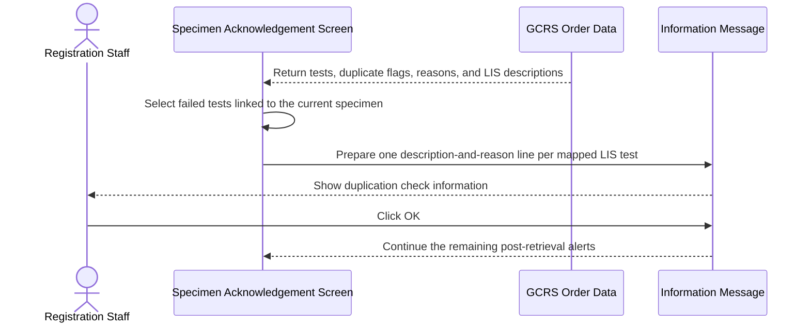
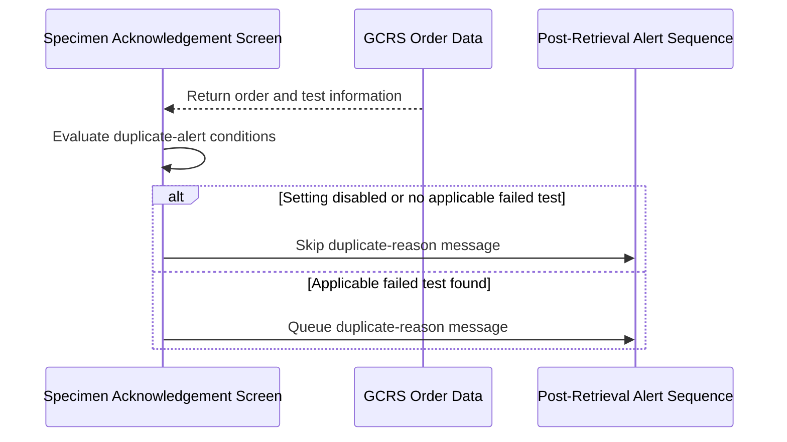
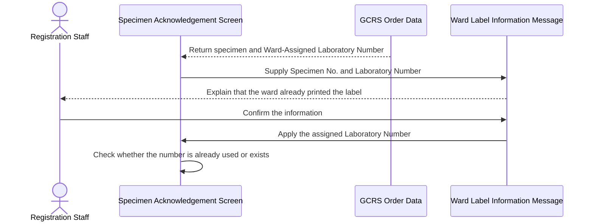
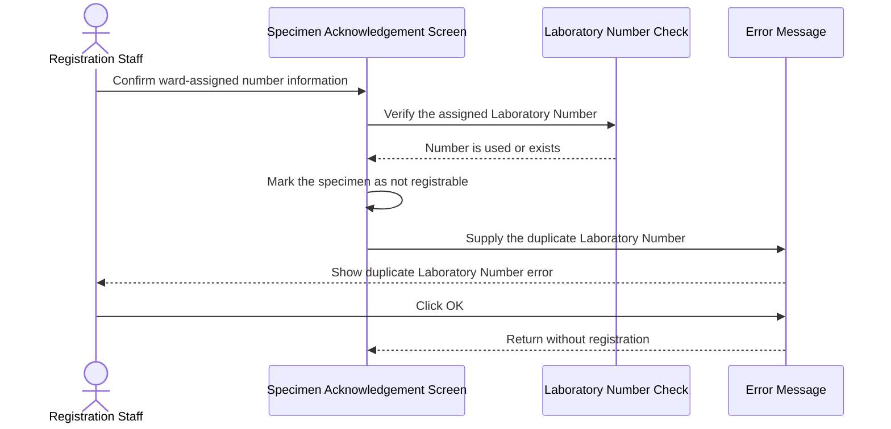
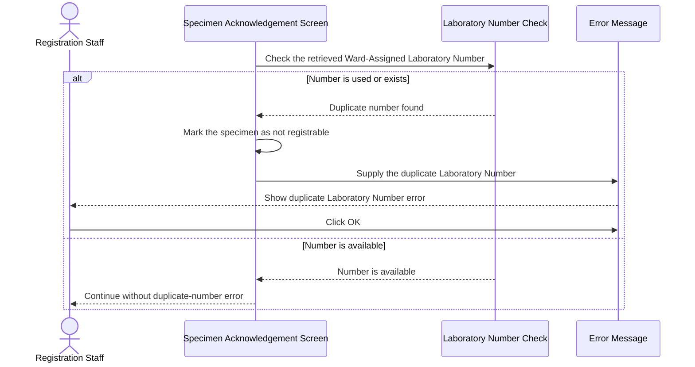

# Show Duplicate Reasons and Ward-Assigned Lab Number Alerts

## Overview

This workflow alerts Registration Staff after Global Clinical Record System (GCRS) order information is retrieved in the **Specimen Acknowledgement** screen. It explains why ordered tests failed the Clinical Management System (CMS) duplication check and protects registration from using a ward-assigned Laboratory Number that already exists in ECPath. These alerts allow staff to understand the retrieved order state before manipulating tests, specimens, or registration information.

---

## Related User Stories

- **[[CRST-474]]** - Specimen Ack - Alert Messaging (Duplicate Reason)
- **[[CRST-162]]** - Specimen Ack - Alert Messaging

**Epic:** LISP-3 [CRST][DEV] Specimen Ack - Retrieve Order Information

---

## Key Concepts

### Duplication Check Failure

A test has failed the duplication check when its **Duplicate Flag** is `Y`. The reason supplied with the retrieved order explains which existing or recent request caused the test to be treated as a duplicate.

### Ward-Assigned Laboratory Number

A Laboratory Number may be assigned and its label printed by the ward before the specimen reaches the laboratory. When this number is returned with a registrable specimen, the system must preserve it for registration only if it is not already used or recorded in ECPath.

### Current Specimen

When an order contains more than one specimen, only tests linked to the specimen currently being handled are included in the alerts and checks described below. If the order has no individual specimen selected, all applicable tests are considered current.

---

## Trigger Point

> This workflow begins automatically after GCRS order information has been retrieved and the current specimen has been identified in the **Specimen Acknowledgement** screen. No additional user action is required to start the duplicate-reason evaluation.

---

## Workflow Scenarios

### Scenario 1: Show Duplicate Check Failure Reasons

#### Prerequisites

- GCRS order information has been retrieved.
- The **Show Duplicate Reason** setting is enabled for the current laboratory.
- At least one test linked to the current specimen has a **Duplicate Flag** of `Y`.
- The failed test has a mapped LIS Test Description and a Duplicate Reason.

#### Process Flow

#### Step-by-Step Details

1. The system examines the tests associated with the current specimen after the order is retrieved.
2. For each test whose **Duplicate Flag** is `Y`, the system creates one line for every mapped LIS test in the format **LIS Test Description : Duplicate Reason**.
3. If at least one line is produced, information message `2632` is displayed with all lines in its parameter.
4. The user reviews the duplicate reasons and clicks **OK**.
5. The alert closes and the remaining post-retrieval alert sequence continues.
6. The composed duplicate explanation is retained for the later registration workflow, where it may be included in the registered request's clinical details. Confirming this alert does not itself register the request or write data.

---

### Scenario 2: Skip the Duplicate Reason Alert

#### Prerequisites

At least one of the following applies:

- The **Show Duplicate Reason** setting is disabled or missing.
- No current-specimen test has a **Duplicate Flag** of `Y`.
- Failed tests do not produce any mapped LIS Test Description and Duplicate Reason lines.

#### Process Flow

#### Step-by-Step Details

1. The system evaluates the setting and the retrieved tests.
2. If the setting is disabled or no applicable failed test produces message content, no duplicate-reason message is shown.
3. Any previously held duplicate explanation must not be treated as belonging to the newly retrieved specimen.
4. The system continues with the next applicable post-retrieval alert.

---

### Scenario 3: Show the Ward-Assigned Laboratory Number

#### Prerequisites

- GCRS order information has been retrieved by entering a **GCRS Specimen No.**
- The **Ward Print Laboratory Number Label** setting is enabled for the current laboratory.
- The current specimen is registrable.
- At least one current-specimen test has a Ward-Assigned Laboratory Number.

#### Process Flow

#### Step-by-Step Details

1. The system identifies the Ward-Assigned Laboratory Number linked to the current specimen.
2. Information message `2603` is displayed with the **Specimen No.** and **Ward-Assigned Laboratory Number**.
3. The message explains that the ward has already assigned the Laboratory Number and printed the label, and that registration is to proceed with this number.
4. The user confirms the message.
5. The assigned Laboratory Number is placed into the registration context.
6. Before registration can proceed, the system verifies the number's format and checks whether it is already used or recorded in ECPath.

---

### Scenario 4: Reject a Duplicate Ward-Assigned Laboratory Number After Confirmation

#### Prerequisites

- The Ward-Assigned Laboratory Number information message has been displayed for a specimen retrieved by **GCRS Specimen No.**
- The user has confirmed that message.
- The assigned Laboratory Number is already used or exists in ECPath.

#### Process Flow

#### Step-by-Step Details

1. After the ward-label information is confirmed, the system checks the Ward-Assigned Laboratory Number.
2. If the number is already used or exists, the current specimen is marked as not registrable.
3. Error message `888` is displayed with the Ward-Assigned Laboratory Number.
4. The user clicks **OK** to close the error.
5. Registration does not proceed with the duplicate number. The user remains on the screen to resolve the conflict or retrieve another item.

---

### Scenario 5: Check a Ward-Assigned Number Retrieved by Another Identifier

#### Prerequisites

- GCRS order information has been retrieved using an identifier other than the **GCRS Specimen No.**, such as the assigned Laboratory Number or Universal Specimen Identifier (USID).
- The **Ward Print Laboratory Number Label** setting is enabled for the current laboratory.
- The current specimen is registrable.
- The specimen has a Ward-Assigned Laboratory Number.

#### Process Flow

#### Step-by-Step Details

1. The system checks the Ward-Assigned Laboratory Number without first showing the specimen-number-specific ward-label information message.
2. If the number is already used or exists, the current specimen is marked as not registrable.
3. Error message `888` is displayed with the duplicate Laboratory Number.
4. The user clicks **OK**, and registration remains blocked for that number.
5. If the number is available, no duplicate-number error is displayed and the normal registration workflow may continue.

---

## Summary Tables

### Message Definitions

| Code | Text | Type | Buttons | Parameters | Trigger Point |
|---|---|---|---|---|---|
| `2632` | These test(s) are violated the duplication check in CMS:  \[@PARM1\] | Information | OK | `@PARM1`: One or more **LIS Test Description : Duplicate Reason** lines | Applicable current-specimen tests have failed duplication checking and the setting is enabled |
| `2603` | This specimen has got Lab Number assigned and the label was printed by ward. This screen will be refreshed and registration will proceed with the assigned Lab Number. Specimen No: \[\[@PARM1\]\] Lab Number: \[\[@PARM2\]\] | Information | Confirm | `@PARM1`: Specimen No.; `@PARM2`: Ward-Assigned Laboratory Number | A registrable specimen with a ward-assigned number is retrieved by GCRS Specimen No. |
| `888` | Duplicate Laboratory Number: \[@PARM1\] found in ECPath System! | Error | OK | `@PARM1`: Ward-Assigned Laboratory Number | The assigned number is already used or exists |

> [!question] Decline behaviour requires confirmation
> The User Story labels message `2632` with “Extra Functionality: Decline,” but the verified legacy and revamp flows provide an acknowledgement path and then continue. No distinct **Decline** button outcome or cancellation rule was found. This metadata should be clarified before adding a separate decline path.

### Decision Matrix

| Duplicate Reason Setting | Failed Current-Specimen Test | Mapped LIS Description | Outcome |
|---|---|---|---|
| Enabled | Yes | Available | Show message `2632` |
| Enabled | No | Not applicable | Skip message `2632` |
| Enabled | Yes | No message line can be produced | Skip message `2632` |
| Disabled or missing | Any | Any | Skip message `2632` |

| Retrieval Input | Ward Label Setting | Registrable | Ward-Assigned Number | Number Used or Exists | Outcome |
|---|---|---|---|---|---|
| GCRS Specimen No. | Enabled | Yes | Yes | No | Show `2603`, apply the number, and continue |
| GCRS Specimen No. | Enabled | Yes | Yes | Yes | Show `2603`, then show `888` and block registration |
| Other identifier | Enabled | Yes | Yes | Yes | Show `888` and block registration without the specimen-number-specific information message |
| Any | Disabled, not applicable to the lab, or specimen not registrable | Any | Any | Any | Skip the ward-label workflow |

### Data Written

This post-retrieval alert workflow is read-only. Displaying or confirming messages `2632`, `2603`, or `888` does not itself write to the database. A successful later registration may save the selected Laboratory Number and append the composed duplicate explanation to registered request information; those writes belong to the registration workflow, not to these alerts.

---

## Data Sources

| Data | Business Source | Table | Column | Notes |
|---|---|---|---|---|
| Duplicate Flag | Retrieved GCRS test | `loe_request_test` | `loereqtst_dup_flag` | `Y` means the CMS duplication check failed |
| Duplicate Reason | Retrieved GCRS test | `loe_request_test` | `loereqtst_dup_reason` | Combined with each mapped LIS Test Description |
| Test description | Retrieved GCRS test | `loe_request_test` | `loereqtst_test_desc` | GCRS description; the alert uses the mapped LIS Test Description where available |
| Ward-Assigned Laboratory Number | Retrieved specimen-test association | `loe_request_test_spec` | `loereqtsp_reqno` | Number assigned and printed by the ward |
| Specimen No. | Retrieved specimen-test association | `loe_request_test_spec` | `loereqtsp_specno` | Identifies the specimen linked to the assigned number |
| Existing Laboratory Number evidence | ECPath audit history | `loe_audit_trail` | `loeaud_reqno` | Used by the revamp service to identify a number already recorded for the hospital |

---

## Configuration

| Setting | Option Code | Source | Purpose | Enabled | Disabled or Missing |
|---|---|---|---|---|---|
| Show Duplicate Reason | `SHOW_DUPLICATE_REASON` | GCR hospital/laboratory option, group `HOSP_SETTING`; the User Story names legacy `LOE_CONTROL.loectrl_name = X_SHOW_DUPLICATE_REASON` | Controls whether failed duplication reasons are shown | Applicable failed tests produce message `2632` | No duplicate-reason message is shown |
| Ward Print Laboratory Number Label | `WARD_PRINT_LABNO_LABEL` | GCR hospital option, group `HOSP_SETTING` | Controls recognition of Laboratory Numbers assigned and printed by the ward | Eligible specimens use the ward-assigned-number alert and existence check | The ward-label alert and associated automatic number handling are skipped |

---

## Business Rules

1. Duplicate reasons are shown only for failed tests linked to the current specimen.
2. Every mapped LIS test under a failed GCRS test contributes its own **LIS Test Description : Duplicate Reason** line.
3. All applicable duplicate-reason lines are presented in one information message.
4. A Ward-Assigned Laboratory Number is accepted for registration only when the current specimen is registrable and the number is not already used or recorded in ECPath.
5. Retrieval by **GCRS Specimen No.** shows the ward-label information before checking the assigned number.
6. Retrieval by another identifier performs the duplicate-number check without requiring the specimen-number-specific information message.
7. A duplicate Ward-Assigned Laboratory Number makes the current specimen not registrable and must not be used to complete registration.
8. Closing an informational or error message does not itself save or register data.

---

## Related Workflows

- [[Show Post-Retrieval Specimen Status Alerts]] — This workflow runs within the wider sequence of alerts shown after order retrieval.
- [[Show Patient-Related Alerts After Order Retrieval]] — Patient-related warnings are evaluated in the same post-retrieval alert sequence.
- [[Confirm Leaving Unacknowledged Ward-Assigned Request]] — Handles navigation away from a retrieved but unacknowledged ward-assigned request.

---

Technical Notes — Legacy and Revamp Traceability

- **Duplicate-reason behavior is substantially implemented in both systems.** The legacy flow filters failed GCRS tests to the current specimen, emits one mapped LIS description per test, prefixes the composed content with `Test duplication found:`, shows `0002632`, and retains the same composed value for registration. The revamp performs the corresponding filtering through current-order test selection, queues `2632`, and retains the composed value for registration.
- **Message formatting is potentially duplicated.** Message `2632` already contains the fixed instruction “These test(s) are violated the duplication check in CMS,” while both legacy and revamp pass a parameter beginning with `Test duplication found:`. This is preserved as implementation evidence, but the intended business parameter remains the User Story format **LIS Test Description : Duplicate Reason**. Product confirmation is recommended before changing presentation.
- **The User Story's `X_SHOW_DUPLICATE_REASON` name differs from the normalized application option code.** Both legacy and revamp screen logic request `SHOW_DUPLICATE_REASON` in `HOSP_SETTING`; the requirement names the underlying legacy LOE control with an `X_` prefix.
- **Ward-assigned-number parity is incomplete in the revamp frontend.** The legacy workflow explicitly shows `0002603`, assigns the returned number, performs an existence check, shows `0000888` when duplicated, and marks the specimen not registrable. No equivalent `2603` or `888` orchestration was found in the current revamp frontend. Current revamp code instead carries ward-assigned numbers into registration groups, includes service-side request-number lookup/existence facilities, and shows message `3915` (“The current request has not been acknowledged. Do you want to continue?”) in related navigation/continuation handling. Message `3915` is not equivalent to the CRST-474 ward-label messages.
- **The non-specimen-number branch is also a parity risk.** Legacy code checks an assigned number directly for USID or other input paths and shows `0000888` if duplicated. Revamp request-number retrieval can look up audit and request-test data, but the exact CRST-474 popup sequence was not found.
- **Existence evidence differs by implementation.** Legacy request-number verification reports whether a number is used or exists. The traced revamp service explicitly checks `loe_audit_trail.loeaud_reqno` for the current hospital and can also resolve request-number retrieval through GCR audit and GCR request-test data. The full ECPath uniqueness boundary should be confirmed before implementing parity.
- **Read-only boundary:** The alert itself performs no persistence. During later registration, the retained duplicate explanation may be appended to clinical details and registration writes occur through the normal registration transaction.
- **Test coverage gap:** No focused automated tests were found for message `2632`, the disabled/no-failed-test branches, message `2603`, message `888`, or specimen-number versus alternate-input ward-assigned-number behavior.

