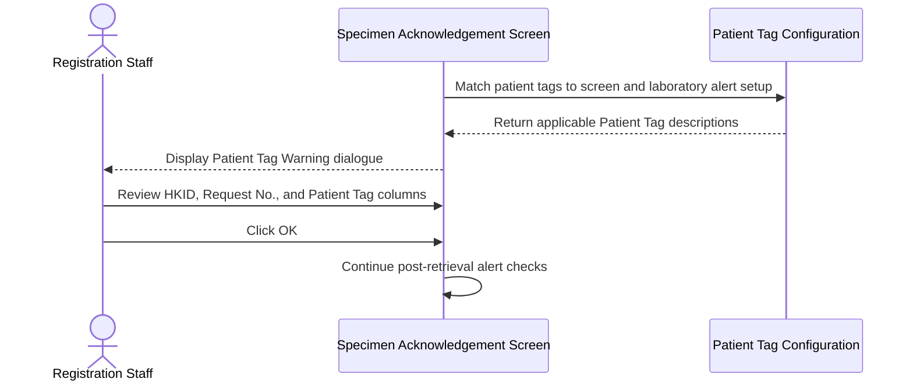
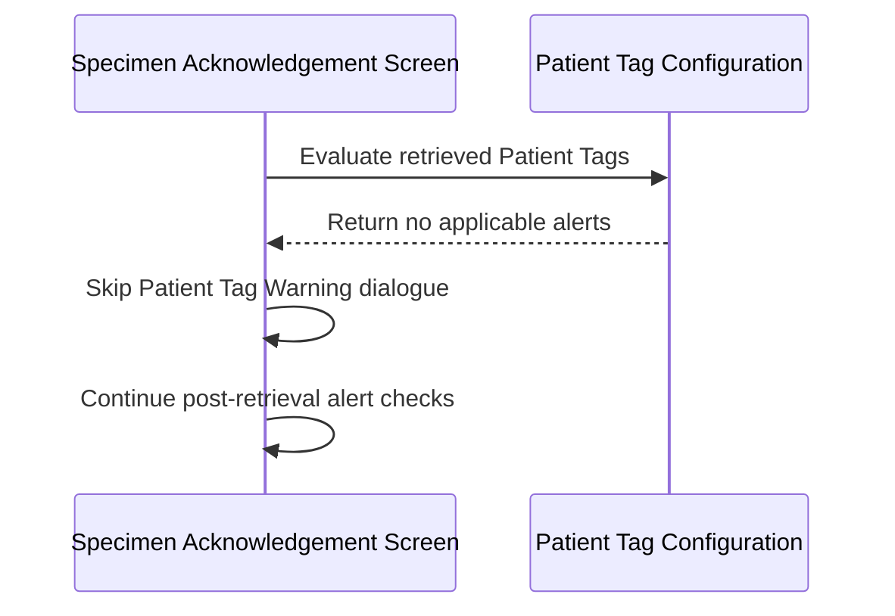
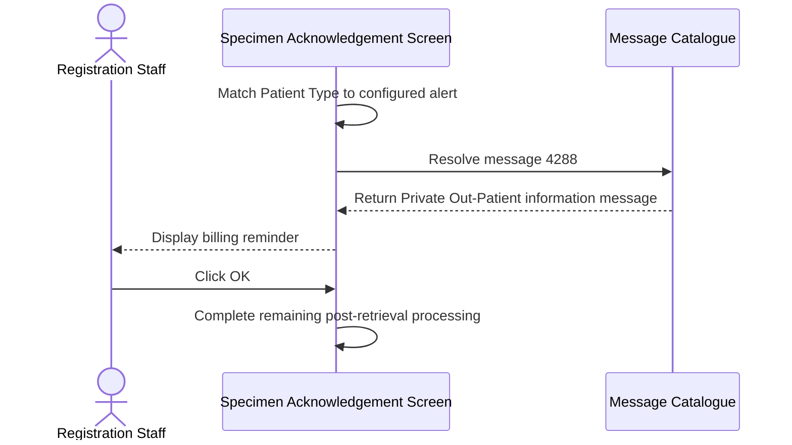
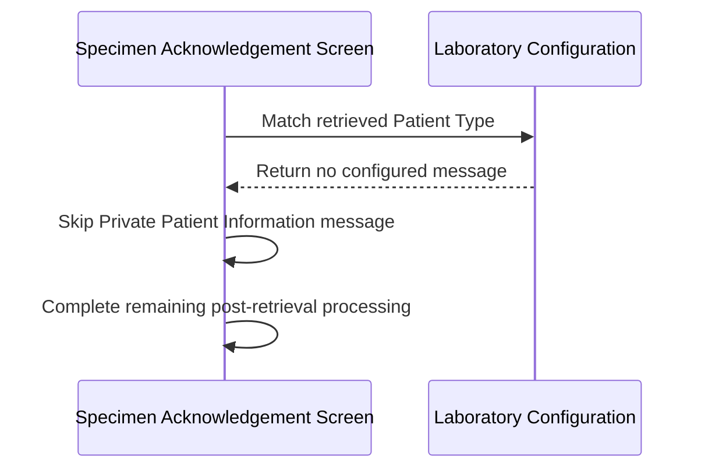
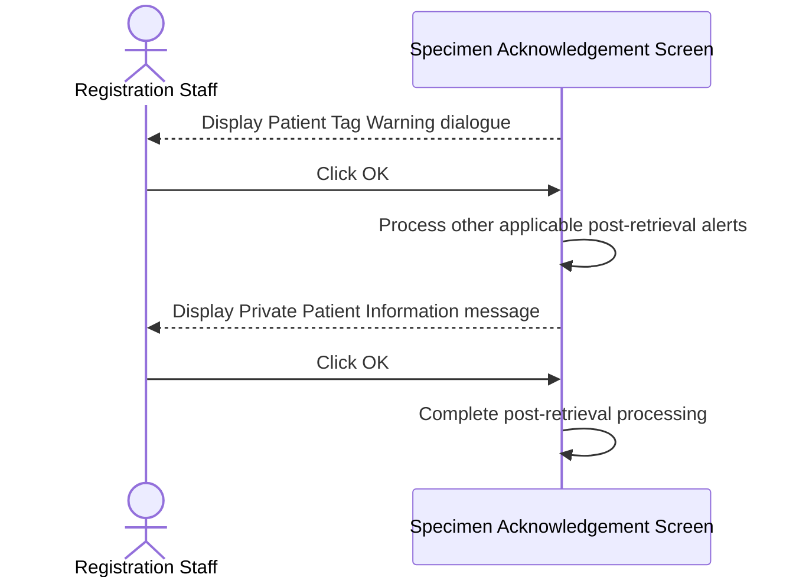

# Show Patient-Related Alerts After Order Retrieval

## Overview

This workflow alerts Registration Staff to patient characteristics that require attention after a General Clinical Request System (GCRS) order is retrieved in **Specimen Acknowledgement**. A Patient Tag Warning identifies clinically or operationally significant patient tags, while a Private Patient Information message reminds staff to check billing arrangements. Both alerts are informational safeguards; confirming them continues the post-retrieval workflow without changing patient or order data.

---

## Related User Stories

- **[[CRST-473]]** - Specimen Acknowledgement - Alert Messaging (Patient Related)
- **[[CRST-162]]** - Specimen Acknowledgement - Alert Messaging

**Epic:** LISP-3 [CRST][DEV] Specimen Ack - Retrieve Order Information

---

## Key Concepts

### Private Out-Patient
A patient whose Patient Type is `POP`. The alert is configuration-driven so other Patient Types can also be associated with a message where required by a laboratory.

### Patient Tag
A patient-level classification used to highlight clinical, administrative, or operational characteristics. The stored tag code is translated to a business description before it is shown.

### Patient Tag Alert Setup
Screen- and laboratory-specific setup that determines which patient-tag groups produce a warning in **Specimen Acknowledgement**. A tag assigned to Laboratory Number `0` applies across laboratories, subject to the screen's alert setup for the relevant request laboratory.

### Alert Sequence
Patient Tag Warning is evaluated before the general post-retrieval alert sequence. The Private Patient Information message is evaluated near the end of that sequence after preceding specimen, test, and duplication alerts have been handled.

---

## Trigger Point

> This workflow begins after GCRS order information and its patient details have been successfully retrieved and displayed in **Specimen Acknowledgement**, before Registration Staff perform further specimen or test actions.

---

## Workflow Scenarios

### Scenario 1: Display Patient Tag Warning

#### Prerequisites

- A GCRS order has been retrieved.
- The retrieved patient has one or more Patient Tags.
- At least one tag applies to a relevant request laboratory or to all laboratories.
- The **Specimen Acknowledgement** Patient Tag Alert Setup allows that tag group to be shown as an alert.
- The tag code has an active Patient Tag Description.

#### Process Flow

#### Step-by-Step Details

1. After order retrieval, the system obtains the patient's Hong Kong Identity Card (HKID) number and Patient Tags.
2. Each Patient Tag is checked against the laboratories associated with the request. A tag recorded for Laboratory Number `0` is treated as applicable to all relevant request laboratories.
3. The system checks the **Specimen Acknowledgement** screen setup to determine whether the tag's group is configured as an alert for the applicable laboratory.
4. Applicable tag codes are translated to their Patient Tag Descriptions. Duplicate descriptions are displayed only once.
5. If at least one alert remains, the **Patient tag warning** dialogue is displayed before the remaining post-retrieval alert sequence.
6. The dialogue contains one row with the **HKID**, **Request no.**, and comma-separated **Patient Tag** descriptions.
7. The user clicks **OK** to confirm that the warning has been reviewed.
8. The dialogue closes and the next applicable post-retrieval alert is evaluated.

---

### Scenario 2: Continue When No Patient Tag Alert Applies

#### Prerequisites

At least one of the following applies:

- The retrieved patient has no Patient Tags.
- None of the patient's tags applies to the request laboratories.
- No applicable tag has a Patient Tag Description.
- The screen and laboratory setup excludes all applicable tags from alerts.

#### Process Flow

#### Step-by-Step Details

1. The system evaluates the retrieved Patient Tags against the active screen, laboratory, grouping, and description setup.
2. If no Patient Tag qualifies as an alert, the **Patient tag warning** dialogue is not displayed.
3. The workflow immediately continues with the remaining post-retrieval alert checks.
4. The absence of a warning does not remove or change any Patient Tag.

---

### Scenario 3: Display Private Out-Patient Billing Reminder

#### Prerequisites

- A GCRS order has been retrieved.
- The retrieved Patient Type is `POP` (Private Out-Patient).
- **Private Patient Alert Mapping** associates `POP` with message `4288`, either directly or through the configured default message.

#### Process Flow

#### Step-by-Step Details

1. The system reads the Patient Type from the retrieved encounter details.
2. The Patient Type is matched against **Private Patient Alert Mapping** for the current laboratory.
3. For Patient Type `POP`, message `4288` is displayed when the mapping selects that message.
4. The Information message states: **Private Out-Patient. Please note any BILLING arrangement.**
5. The user clicks **OK** after reviewing the reminder.
6. The alert closes and post-retrieval processing continues.

---

### Scenario 4: Continue When No Private Patient Alert Applies

#### Prerequisites

At least one of the following applies:

- Patient Type is empty.
- Patient Type is not included in **Private Patient Alert Mapping**.
- The mapping or its default message is not configured for the current laboratory.

#### Process Flow

#### Step-by-Step Details

1. The system checks the retrieved Patient Type against the laboratory mapping.
2. If no valid mapping is found, no Private Patient Information message is displayed.
3. The workflow continues without requiring user confirmation.
4. The absence of the message does not change the patient's Patient Type.

---

### Scenario 5: Display Both Patient-Related Alerts

#### Prerequisites

- At least one Patient Tag qualifies for a warning.
- Patient Type is mapped to a Private Patient Information message.

#### Process Flow

#### Step-by-Step Details

1. The **Patient tag warning** dialogue is displayed first.
2. The user clicks **OK**, allowing the general post-retrieval alert sequence to begin.
3. Other applicable specimen, test, validity, and duplication alerts are processed in their defined order.
4. The Private Patient Information message is displayed when the sequence reaches the patient-type check.
5. The user clicks **OK** and processing continues.
6. One alert does not suppress the other when both conditions apply.

---

## Summary Tables

### Alert Definitions

| Alert | Code | Text or Content | Type | User Action | Trigger Point |
|---|---|---|---|---|---|
| Patient Tag Warning | No message code; structured dialogue | Columns: **HKID**, **Request no.**, **Patient Tag** | Warning dialogue | **OK** | Before the general post-retrieval alert sequence |
| Private Out-Patient | `4288` | Private Out-Patient. Please note any BILLING arrangement. | Information | **OK** | Near the end of the general post-retrieval alert sequence |

### Patient Tag Decision Matrix

| Patient Tags Retrieved | Applicable Laboratory | Screen Alert Setup | Description Found | Warning Displayed |
|---:|---:|---:|---:|---:|
| No | — | — | — | No |
| Yes | No | Any | Any | No |
| Yes | Yes | Excludes tag group | Yes | No |
| Yes | Yes | Includes tag group | No | No |
| Yes | Yes | Includes tag group | Yes | Yes |
| Laboratory Number `0` tag | Any relevant request laboratory | Includes tag group | Yes | Yes |

### Private Patient Decision Matrix

| Patient Type | Mapping | Result |
|---|---|---|
| `POP` | Directly or by default maps to `4288` | Display Private Out-Patient billing reminder |
| Any configured Patient Type | Maps to another valid message | Display the configured message |
| Empty | Any | No Private Patient message |
| Not configured | No match | No Private Patient message |
| Any | No valid default or mapping | No Private Patient message |

### Patient Tag Dialogue Fields

| Column | Content | Notes |
|---|---|---|
| **HKID** | Retrieved patient HKID | Falls back to the order's stored HKID when no active patient record is available |
| **Request no.** | `----------` | Current legacy and revamp behavior uses a placeholder rather than an actual Request Number |
| **Patient Tag** | Comma-separated applicable Patient Tag Descriptions | Duplicate descriptions are removed |

### Data Written

Displaying, confirming, or skipping these patient-related alerts does not write Patient Type, Patient Tag, order, request, test, or specimen data. The alert workflow is read-only. Any separate patient refresh that may occur while retrieving the order precedes alert evaluation and is not caused by clicking **OK**.

---

## Data Sources

| Data | Business Source | Table | Column | Notes |
|---|---|---|---|---|
| Patient Type | Active patient encounter | `patient` | `pat_type` | `POP` identifies a Private Out-Patient for the stated acceptance criterion |
| Patient HKID | Active patient record | `patient` | `pat_pid` | Displayed in the Patient Tag Warning dialogue |
| Fallback Patient HKID | Retrieved GCRS order | `loe_order` | `loeord_pat_hkid` | Used when the patient is constructed from order data |
| Patient Identity Group | Active patient record | `patient` | `pat_pid_group` | Links the patient to stored Patient Tags |
| Patient Tag Laboratory | Patient Tag record | `lis_patient` | `lispat_labno` | `0` represents a tag that applies across laboratories |
| Patient Tag Code | Patient Tag record | `lis_patient` | `lispat_tag` | Matched to the Patient Tag Description and alert setup |
| Patient Tag Identity Group | Patient Tag record | `lis_patient` | `lispat_pid_group` | Selects tags belonging to the retrieved patient |
| Patient Tag Description | LIS constant dictionary | `lis_constant` | `const_desc` | Business description shown in the dialogue |
| Patient Tag Dictionary Code | LIS constant dictionary | `lis_constant` | `const_alpha` | Matched to the stored Patient Tag Code |
| Patient Tag Dictionary Laboratory | LIS constant dictionary | `lis_constant` | `const_format` | `0` or a relevant request laboratory is accepted |
| Screen and Laboratory Setup | Patient Tag Setup | `patient_tag_setup` | `screen_name`, `labno`, `alert_tag` | Selects the alert group for **Specimen Acknowledgement** |
| Alert Group Membership | Patient Tag Grouping | `patient_tag_grouping` | `group_name`, `code`, `labno` | Maps the configured alert group to tag codes |
| Laboratory Option Identity | Laboratory options | `lab_option` | `option_hospital`, `option_labno`, `option_group`, `option_code` | Locates patient-related configuration for the current laboratory |
| Laboratory Option Value | Laboratory options | `lab_option` | `option_value` | Stores the default Private Patient message code and boolean option values |
| Laboratory Option Text | Laboratory options | `lab_option` | `option_text` | Stores Patient Type mappings and text-based option values |

---

## Configuration

| Setting | Option Code | Source | Purpose | Enabled or Configured | Disabled or Missing |
|---|---|---|---|---|---|
| Private Patient Alert Mapping | `PRIVATE_PATIENT_ALERT_MAP` | `lab_option`, group `REQUEST_REGISTRATION` | Maps Patient Types to message codes | Semicolon-separated Patient Type entries are evaluated; an entry may specify its message code or use `option_value` as the default | No Private Patient message is shown when no valid mapping/default exists |
| Patient Tag Alert Default Focus | `PATIENT_TAG_ALERT_NO_DEFAULT` | `lab_option`, group `HOSP_SETTING` | Controls whether **OK** receives default focus in the Patient Tag Warning | Default button focus is suppressed | **OK** may receive default focus |
| Patient Tag Alert Group | *(source: `patient_tag_setup.alert_tag`)* | `patient_tag_setup`, keyed by `screen_name` and `labno` | Selects the tag group that must produce warnings on this screen | Matching group members are eligible for alerting | With no matching screen/laboratory setup, no Patient Tag Warning is shown |
| Patient Tag Group Membership | *(source: `patient_tag_grouping`)* | `patient_tag_grouping`, keyed by `group_name`, `code`, and `labno` | Determines which tag codes belong to the configured alert group | Matching codes are eligible | Non-members are excluded |
| Patient Tag Description | *(source: LIS constant group for patient tags)* | `lis_constant` | Provides the visible Patient Tag Description and laboratory applicability | Matching active descriptions are displayed | Unresolved tag codes are not displayed |

---

## Business Rules

1. Patient-related alerts are evaluated only after a GCRS order and patient context have been retrieved.
2. A Patient Tag Warning is shown only when at least one retrieved tag qualifies under the **Specimen Acknowledgement** screen and laboratory setup.
3. A Patient Tag assigned to Laboratory Number `0` applies to all relevant request laboratories.
4. The Patient Tag Warning displays business descriptions rather than stored tag codes.
5. Duplicate Patient Tag Descriptions are displayed once in a comma-separated list.
6. Registration Staff must confirm the Patient Tag Warning by clicking **OK** before subsequent alerts continue.
7. Patient Tag Warning is evaluated before the general post-retrieval alert sequence.
8. Private Patient Information is controlled by a Patient Type-to-message mapping rather than hardcoded solely to `POP`.
9. For `POP` mapped to message `4288`, the reminder must identify the patient as a Private Out-Patient and call attention to billing arrangements.
10. The Private Patient Information message is evaluated after preceding post-retrieval alerts.
11. Confirming either alert does not modify Patient Type, Patient Tags, or order data.
12. The **Request no.** column remains required by the User Story even though the current implementations display a placeholder; the intended source of an actual Request Number requires business clarification.

---

## Related Workflows

- [[Retrieve Order Information by Specimen Number]] — Supplies the patient and order context used by both alerts.
- [[Retrieve Registered Request by Lab Number]] — Another retrieval route that can lead to patient-related alert evaluation.
- [[Show Post-Retrieval Specimen Status Alerts]] — Defines the general alert sequence that continues after the Patient Tag Warning.
- [[Alert on Unchecked Patient Demographic Changes]] — Covers a separate patient-related warning before the current patient context is accepted.
- [[Confirm Overnight Specimen After Retrieval]] — May be processed earlier in the same post-retrieval alert sequence.

---

Technical Notes — Legacy and Revamp Traceability

- Legacy and revamp both evaluate Patient Tag Warning before their general post-retrieval alert chain and evaluate Private Patient Information later in that chain.
- Legacy passes every Request Laboratory to Patient Tag evaluation. The revamp passes only the currently selected Laboratory Number, which can omit alerts belonging to another laboratory in a multi-laboratory order.
- Both legacy and revamp populate **Request no.** with `----------`. This satisfies the presence of the column but not the apparent User Story intent to display the request's actual Request Number.
- The revamp has a dedicated Patient Tag Warning dialogue with the required **HKID**, **Request no.**, and **Patient Tag** columns and an **OK** action.
- Legacy passes `PATIENT_TAG_ALERT_NO_DEFAULT` to its shared Patient Tag dialogue. The shared revamp library also supports this behavior, but the Specimen Acknowledgement-specific revamp dialogue does not consume the loaded option, so **OK** default-focus suppression is not preserved.
- Private Patient mapping is represented by `PRIVATE_PATIENT_ALERT_MAP`. Its `option_text` is split into semicolon-separated entries; each entry is split into Patient Type and optional message code. An entry without a message code uses `option_value` as the default.
- Message `4288` exists in the revamp message catalogue with the required Information type, **OK** button, and exact billing reminder text.
- The revamp depends on encounter Patient Type. When no active LIS/PMI patient is available and patient data is built only from the GCRS order, the fallback conversion does not populate Patient Type. A valid private-patient alert can therefore be skipped on that path.
- Retrieved Patient Tags are available only when linked to an active patient identity group. The order-data fallback path does not attach Patient Tags.
- Patient Tag setup and grouping are provided as cached dictionaries from `patient_tag_setup` and `patient_tag_grouping`; visible descriptions come from the LIS patient constant group.
- Order retrieval is normally read-only. When no active patient is found and the Patient Master Index path is disabled, retrieval can invoke a patient-interface refresh before falling back to order data; any resulting persistence is part of retrieval, not this alert workflow.
- No focused frontend tests were found for the Patient Tag evaluation, multi-laboratory behavior, dialogue fields, sequencing, default-focus option, or Private Patient mapping. No focused backend retrieval tests were found for Patient Type and Patient Tag propagation or fallback behavior.

