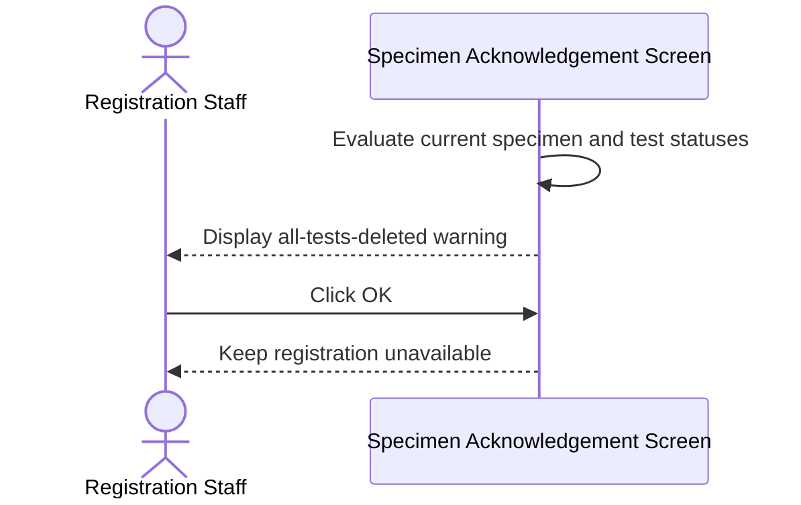
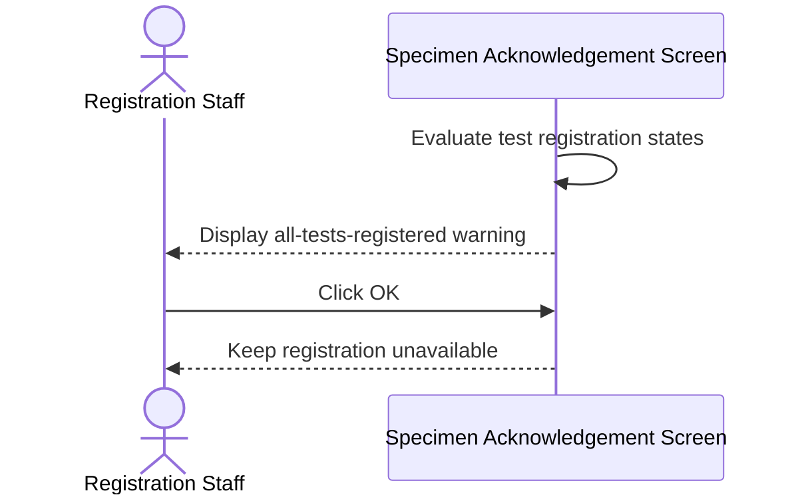
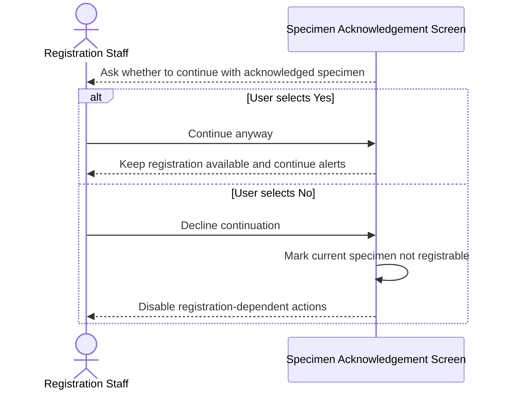
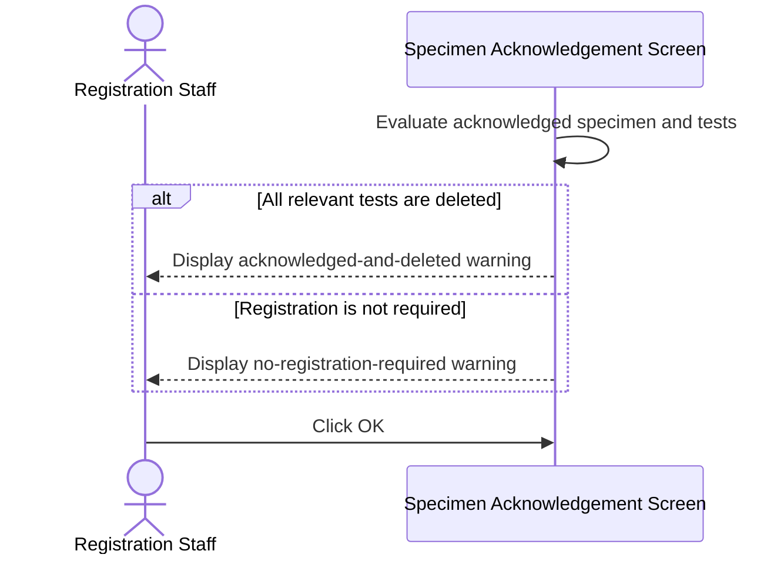
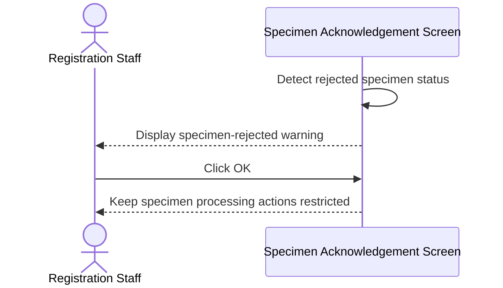
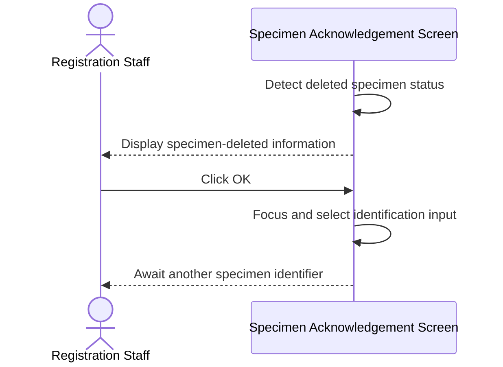
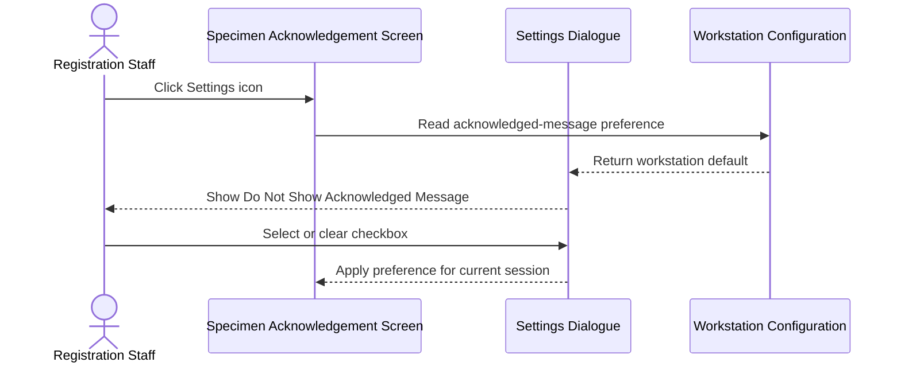

# Show Post-Retrieval Specimen Status Alerts

## Overview

This workflow evaluates a retrieved GCRS order and immediately warns Registration Staff about specimen or test conditions that restrict subsequent actions. It distinguishes deleted or fully registered tests, acknowledged specimens, rejected specimens, and deleted specimens. The alerts explain what processing remains available and, where appropriate, allow staff to decide whether registration should continue.

---

## Related User Stories

- **[[CRST-162]]** - Specimen Acknowledgement - Alert Messaging

**Epic:** LISP-3 [CRST][DEV] Specimen Ack - Retrieve Order Information  
**Related issue:** LIST-158

> This document covers only the core status and registrability alerts defined by CRST-162. Ward-assigned, overnight, patient-related, duplicate-reason, extra-action, extra-setup, and collection-validity alerts are documented by their respective user stories.

---

## Key Concepts

### Registrable Specimen
A specimen with at least one eligible test that has a usable LIS test mapping and may proceed to registration under the current screen rules.

### Partially Registered Specimen
A specimen for which only part of the requested test work has been registered. It is treated separately from a fully registered specimen.

### No-Specimen Order
A GCRS order containing tests without a physical specimen. Test status still determines whether registration is available.

### Suppress Acknowledged Message
A workstation-derived preference shown as **Do Not Show Acknowledged Message** under the **Registration** settings. It suppresses only the acknowledged-and-registrable confirmation message.

### Specimen Status
The processing state of a physical specimen:

| Code | Business Meaning |
|---|---|
| `P` | Label printed without collection date and time |
| `C` | Label printed with collection date and time |
| `A` | Acknowledged |
| `J` | Rejected |
| `D` | Deleted |

### Test Status
The processing state of an ordered test:

| Code | Business Meaning |
|---|---|
| `P` | Not registered |
| `r` | Partially registered |
| `R` | Registered |
| `D` | Deleted |
| `M` | Additional request |

---

## Trigger Point

> This workflow begins automatically after GCRS order, specimen, and test data have been retrieved and displayed, before the user performs acknowledgement, rejection, deletion, or registration.

---

## Workflow Scenarios

### Scenario 1: All Relevant Tests Are Deleted

#### Prerequisites

- The order has no specimen, or the current specimen is not Acknowledged, Rejected, or Deleted.
- Every test relevant to the current specimen is Deleted.

#### Process Flow

#### Step-by-Step Details

1. The system evaluates the tests associated with the current specimen, or all applicable tests when the order has no specimen.
2. If every relevant test is Deleted, message `1190` is displayed.
3. The message explains that registration is not allowed and only acknowledgement or rejection may remain available.
4. The user clicks **OK**.
5. No status is changed by the message; action buttons remain governed by the retrieved specimen and test states.

---

### Scenario 2: All Relevant Tests Are Registered

#### Prerequisites

- The order has no specimen, or the current specimen is not Acknowledged, Rejected, or Deleted.
- Every relevant test is Registered.
- The current specimen is not partially registered.

#### Process Flow

#### Step-by-Step Details

1. The system confirms that all relevant tests have been registered.
2. A partial-registration state prevents the specimen from being treated as fully registered for this alert.
3. Message `2158` explains that registration is not allowed and only acknowledgement or rejection may remain available.
4. The user clicks **OK** and continues with the actions permitted by the current state.

---

### Scenario 3: Acknowledged Specimen Is Still Registrable

#### Prerequisites

- The order contains a specimen.
- The current specimen status is Acknowledged.
- At least one eligible mapped test remains registrable.
- The specimen is not partially registered.
- **Do Not Show Acknowledged Message** is not selected.

#### Process Flow

#### Step-by-Step Details

1. Message `1069` asks whether the user wants to continue with an already acknowledged specimen.
2. If the user clicks **Yes**, the specimen remains registrable and the remaining post-retrieval alerts continue in sequence.
3. If the user clicks **No**, the current specimen becomes not registrable for the active screen context.
4. The **Register Request** button is disabled.
5. Other controls whose availability depends on registration are recalculated, including acknowledged-specimen rejection, send-out, test deletion, urgency editing, and registration-time functions.
6. Declining the question does not alter the specimen or test records in the database.

---

### Scenario 4: Acknowledged Specimen Is Not Registrable

#### Prerequisites

- The current specimen status is Acknowledged.
- Registration is unavailable.

#### Process Flow

#### Step-by-Step Details

1. If every relevant test is Deleted, message `1070` states that the specimen has been acknowledged and all its tests have been deleted.
2. Otherwise, when no registration is required, message `1068` states that the specimen has been acknowledged and registration is unnecessary.
3. The user clicks **OK**.
4. Registration remains unavailable and no record is changed by the warning.

---

### Scenario 5: Retrieved Specimen Is Rejected

#### Prerequisites

- The order contains a specimen.
- The current specimen status is Rejected.

#### Process Flow

#### Step-by-Step Details

1. The system detects that the specimen has already been rejected.
2. Message `1072` informs the user that the specimen has been rejected.
3. The user clicks **OK**.
4. Registration and incompatible specimen/test actions remain unavailable.

---

### Scenario 6: Retrieved Specimen Is Deleted

#### Prerequisites

- The order contains a specimen.
- The current specimen status is Deleted.

#### Process Flow

#### Step-by-Step Details

1. Message `2152` informs the user that the specimen was deleted.
2. The user clicks **OK**.
3. Registration and acknowledgement are unavailable for the deleted specimen.
4. Focus returns to the **Specimen No./Lab#/Order#** field and its value is selected so another identifier can be entered.

---

### Scenario 7: Configure the Acknowledged-Specimen Warning

#### Prerequisites

- The Specimen Acknowledgement screen is open.

#### Process Flow

#### Step-by-Step Details

1. The user clicks the **Settings** icon.
2. The **Do Not Show Acknowledged Message** checkbox is displayed under **Registration** when the workstation setting is available.
3. A workstation setting value of `Y` selects the checkbox by default; `N` leaves it cleared.
4. When selected, message `1069` is not shown for an acknowledged but otherwise registrable specimen.
5. Changing the checkbox affects the current user interface state only and does not update workstation configuration.

---

## Summary Tables

### Alert Decision Matrix

| Specimen State | Test State | Registrable | Partial | Suppression | Message |
|---|---|---:|---:|---:|---|
| No specimen or not `A/J/D` | All Deleted | No | Either | Either | `1190` |
| No specimen or not `A/J/D` | All Registered | No | No | Either | `2158` |
| Acknowledged | Eligible mapped test remains | Yes | No | Off | `1069` |
| Acknowledged | Eligible mapped test remains | Yes | No | On | No acknowledged warning |
| Acknowledged | All Deleted | No | Either | Either | `1070` |
| Acknowledged | Registration not required | No | Either | Either | `1068` |
| Rejected | Any | No | Either | Either | `1072` |
| Deleted | Any | No | Either | Either | `2152` |

### Messages

| Code | Text | Type | Buttons |
|---|---|---|---|
| `1190` | All the tests of this specimen were deleted, registration is not allowed. You can only acknowledge or reject the specimen. | Warning | **OK** |
| `2158` | All the tests of this specimen were registered, registration does not allow. You can only acknowledge or reject the specimen. | Warning | **OK** |
| `1069` | Specimen has been acknowledged. Do you want to continue anyway? | Question | **Yes / No** |
| `1070` | Specimen has been acknowledged and all its tests have been deleted. | Warning | **OK** |
| `1068` | Specimen has been acknowledged. No registration is required. | Warning | **OK** |
| `1072` | Specimen has been rejected. | Warning | **OK** |
| `2152` | This specimen was deleted. | Information | **OK** |

### Effect of Message `1069`

| User Choice | Registrable State | Remaining Alerts | Database Change |
|---|---|---|---|
| **Yes** | Preserved | Continue | None |
| **No** | Forced to not registrable | Must continue in the defined alert sequence | None |

### Action Availability Summary

| Condition | Register | Acknowledge | Reject | Identification Field |
|---|---:|---:|---:|---|
| All tests deleted/registered on unacknowledged specimen | No | Subject to normal rules | Subject to normal rules | Available |
| Acknowledged and user continues | Yes | No | Subject to acknowledged-specimen rules | Available |
| Acknowledged and user declines | No | No | Recalculated from registration-dependent rules | Available |
| Rejected | No | No | No | Available |
| Deleted | No | No | No | Focused after alert |

---

## Data Sources

| Data | Source | Table | Column | Notes |
|---|---|---|---|---|
| Specimen Status | GCRS specimen | `loe_specimen_detail` | `loespec_spec_status` | Determines Acknowledged, Rejected, or Deleted alerts |
| Specimen Number | GCRS specimen | `loe_specimen_detail` | `loespec_specno` | Identifies the current specimen |
| Specimen Suffix | GCRS specimen | `loe_specimen_detail` | `loespec_specno_suffix` | Distinguishes split specimens |
| Collection Date and Time | GCRS specimen | `loe_specimen_detail` | `loespec_collect_dtm` | Used by broader alert and enablement processing |
| Acknowledgement Date and Time | GCRS specimen | `loe_specimen_detail` | `loespec_ack_dtm` | Shows existing acknowledgement state |
| Test Status | GCRS ordered test | `loe_request_test` | `loereqtst_test_status` | Determines Deleted, Registered, and eligible test conditions |
| Test Code | GCRS ordered test | `loe_request_test` | `loereqtst_test_code` | Used to resolve LIS test mappings |
| Test Sequence | GCRS ordered test | `loe_request_test` | `loereqtst_test_seqno` | Connects the displayed test with specimen and DFT records |
| Registration Date and Time | GCRS ordered test | `loe_request_test` | `loereqtst_register_dtm` | Existing test registration information |
| LIS Test Mapping | CMS-to-LIS mapping | `loe_test_map` | `loetestmap_lis_code` | At least one eligible mapping is required for normal registration |
| LIS Laboratory Number | CMS-to-LIS mapping | `loe_test_map` | `loetestmap_labno` | Associates a test mapping with the LIS laboratory |
| DFT Status | DFT series | `loe_dft` | `loedft_status` | Used instead of ordinary test status when evaluating DFT rows |
| DFT Registration Date | DFT series | `loe_dft` | `loedft_register_dtm` | Existing DFT registration information |
| Workstation Hospital | Workstation configuration | `loe_ws_config` | `loews_hosp` | Part of the workstation configuration key |
| Workstation ID | Workstation configuration | `loe_ws_config` | `loews_wsid` | Part of the workstation configuration key |
| Suppress Acknowledged Message | Workstation configuration | `loe_ws_config` | `loews_suppress_ackmsg` | `Y` selects **Do Not Show Acknowledged Message** by default |

### Data Written

Displaying any CRST-162 message, clicking **OK**, choosing **Yes** or **No** for message `1069`, or changing the acknowledged-message checkbox does not write order, specimen, test, DFT, or workstation configuration data. Declining message `1069` changes only the active screen's registrability state.

---

## Configuration

| Setting | Storage | Purpose | `Y` | `N` | Missing |
|---|---|---|---|---|---|
| Suppress Acknowledged Message | `loe_ws_config.loews_suppress_ackmsg` for current hospital and workstation | Sets the default for **Do Not Show Acknowledged Message** | Checkbox selected; message `1069` suppressed | Checkbox cleared; message `1069` may be shown | Checkbox should be unavailable because no workstation setup exists |

---

## Business Rules

1. Post-retrieval alerts are evaluated before the user performs specimen or registration actions.
2. Only tests relevant to the current specimen are considered when determining whether all tests are Deleted or Registered.
3. DFT orders use their DFT row statuses for the same all-deleted and all-registered evaluations.
4. A partially registered specimen must not be treated as fully registered for message `2158`.
5. Message `1069` applies only to an Acknowledged, registrable, non-partial specimen when suppression is off.
6. Selecting **Yes** on message `1069` preserves registration and continues the alert sequence.
7. Selecting **No** disables registration for the current specimen but must not prevent later applicable alerts from being evaluated.
8. Message `1070` takes precedence over message `1068` when an Acknowledged nonregistrable specimen has all tests Deleted.
9. Rejected and Deleted specimens cannot proceed to registration.
10. After the Deleted-specimen message, focus returns to the identification field.
11. Alert acknowledgement alone never changes database status.
12. The acknowledged-message checkbox is available only when a workstation configuration value exists.
13. Child-story alert rules must remain separate and follow the agreed overall alert order.

---

## Related Workflows

- [[Retrieve Order Information by Specimen Number]] — Loads the specimen and test statuses evaluated by this workflow.
- [[Retrieve Order Information by Order Number]] — Supplies no-specimen orders whose test statuses are also evaluated.
- [[Input Lab Number for DFT Case]] — Retrieves DFT orders whose DFT row statuses feed the restricted-action alerts.
- [[Alert on Unchecked Patient Demographic Changes]] — Separate Blood Bank patient-demographic alert flow.
- [[Confirm Leaving Unacknowledged Ward-Assigned Request]] — Separate confirmation before leaving an unacknowledged ward-assigned request.
- [[Confirm Overnight Specimen After Retrieval]] — Separate overnight Collection Date confirmation after retrieval.

---

Technical Notes — Legacy and Revamp Traceability

- All seven CRST-162 message codes, texts, severities, and nominal button layouts exist in the revamp.
- Legacy continues the alert sequence after the user declines message `1069`. The revamp's **No** callback rejects the message promise, so later alerts stop and an unhandled rejection may occur. Decline must disable registration without terminating the sequence.
- Revamp does not explicitly test the partial-registration flag in the message `2158` branch. Its all-registered calculation usually excludes partial status, but inconsistent status and registration-type combinations require testing.
- Legacy uses message `1068` as the general Acknowledged/nonregistrable fallback when tests are not all Deleted or Registered. Revamp requires an empty LIS mapping and marks this condition true when any relevant test lacks mappings, creating both over-trigger and under-trigger risks.
- Revamp displays the **Do Not Show Acknowledged Message** checkbox even when workstation setup is undefined. Legacy hides or disables it in that case.
- The no-specimen wording in messages `1190` and `2158` says acknowledgement or rejection remains available, but revamp button visibility depends on a current physical specimen. The no-specimen action path requires verification.
- CRST-162 contains an empty DFT heading. Revamp applies ordinary all-deleted/all-registered alerts to DFT rows, but legacy DFT manual-registration messages `2179` and `3442` have no identified revamp equivalent.
- The overall revamp alert order differs from legacy, particularly for unboxed, duplicate, validity, overnight, and private-patient alerts. Child-story documentation should define the required final order.
- Retrieval currently supplies a hardcoded user identity in the backend request context; this is unrelated to message display but is an audit-integrity concern for later actions.
- No meaningful automated tests were identified for the seven-message decision matrix, suppression defaults, decline sequencing, DFT evaluation, focus restoration, or action enablement.

