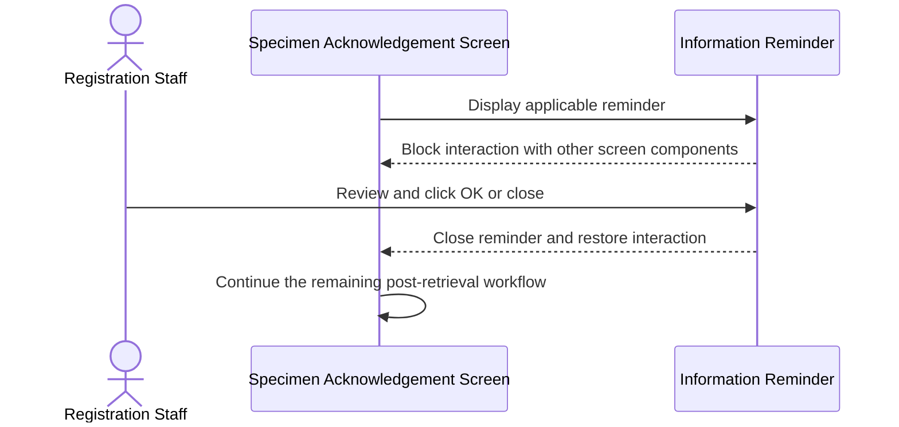
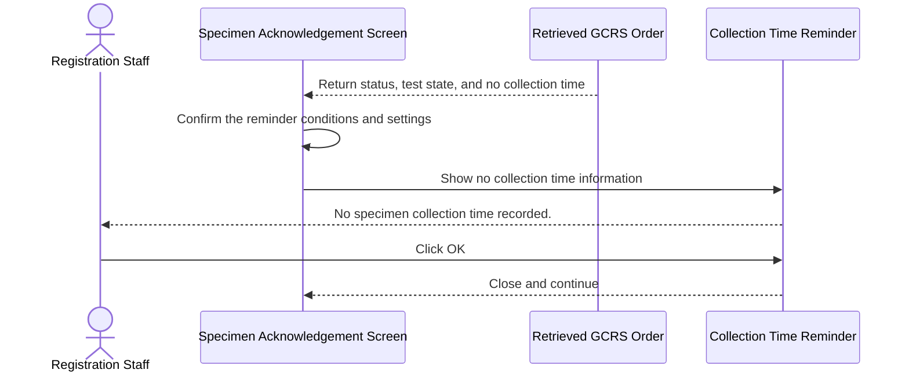
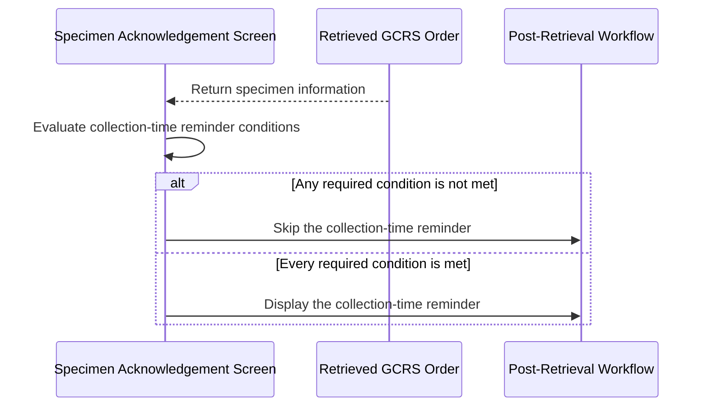
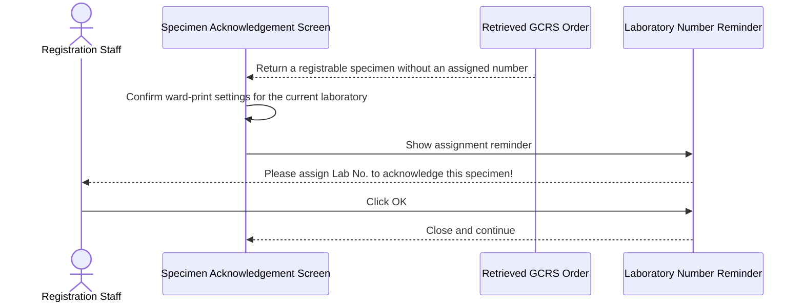
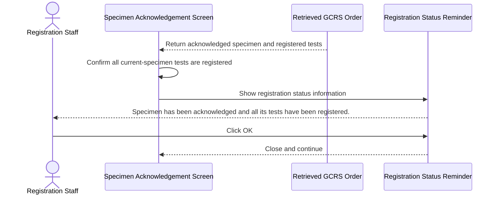
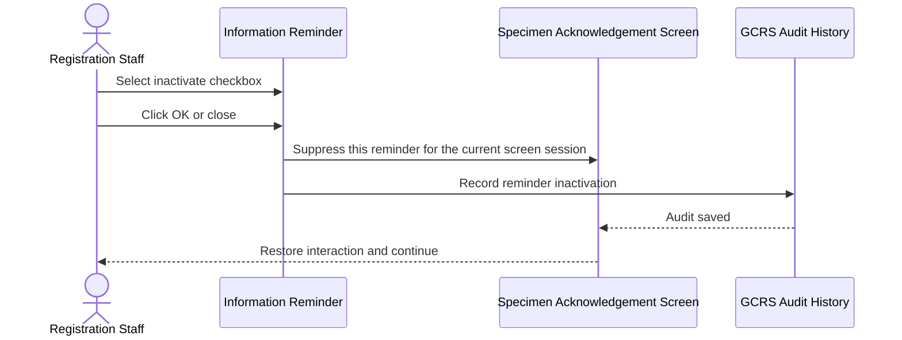

# Show and Inactivate Post-Retrieval Specimen Reminders

## Overview

This workflow shows modal reminders to Registration Staff after Global Clinical Record System (GCRS) order information is retrieved in the **Specimen Acknowledgement** screen. It warns when the specimen has no collection time, when a Laboratory Number still needs to be assigned before acknowledgement, and when an acknowledged specimen already has all tests registered. Each reminder may be inactivated for the current screen session, and that choice is recorded in the GCRS audit history.

---

## Related User Stories

- **[[CRST-163]]** - Specimen Ack - Alert Messaging (with extra user action)

**Epic:** LISP-3 [CRST][DEV] Specimen Ack - Retrieve Order Information

---

## Key Concepts

### Modal Reminder

A modal reminder prevents interaction with the rest of the **Specimen Acknowledgement** screen while it is displayed. Closing or confirming the reminder restores interaction and allows the remaining post-retrieval workflow to continue.

### Inactivate for the Current Screen Session

The user may select the reminder's inactivation checkbox before clicking **OK**. The same reminder is then suppressed until the **Specimen Acknowledgement** screen is closed and reopened; it is not a permanent laboratory configuration change.

### Specimen Status

- **P — Printed:** A specimen label has been printed.
- **C — Collected:** The specimen has been collected.
- **A — Acknowledged:** The laboratory has acknowledged receipt of the specimen.

### Registrable Test State

A specimen still requires registration when at least one linked test is not registered or partially registered. A specimen whose linked tests are all registered does not require further test registration.

---

## Trigger Point

> This workflow begins automatically after GCRS order information has been retrieved and the current specimen's status, collection time, linked tests, and Laboratory Number assignment have been evaluated.

---

## Workflow Scenarios

### Scenario 1: Display and Close a Modal Reminder

#### Prerequisites

- At least one reminder condition in this workflow is met.

#### Process Flow

#### Step-by-Step Details

1. An applicable information reminder is displayed above the **Specimen Acknowledgement** screen.
2. While the reminder remains open, the user cannot interact with other screen controls.
3. The user reviews the reminder and clicks **OK** or closes it.
4. The reminder closes, the screen becomes interactive again, and the next applicable post-retrieval action continues.

---

### Scenario 2: Warn That No Specimen Collection Time Is Recorded

#### Prerequisites

- The retrieved order contains the current specimen.
- The current specimen status is **P — Printed** or **C — Collected**.
- At least one linked test is not registered or partially registered.
- The specimen has no recorded **Specimen Collection Time**.
- No editable collection time has been entered on the screen, or collection-time modification is not allowed.
- The **No Specimen Collection Time Message** setting is enabled.
- This reminder has not been inactivated during the current screen session.

#### Process Flow

#### Step-by-Step Details

1. The system checks the current specimen's status, linked-test registration state, and **Specimen Collection Time**.
2. If all prerequisites are met, the information reminder **“No specimen collection time recorded.”** is displayed.
3. The reminder includes **OK** and a checkbox labelled **“Check this box to inactivate the alert”**.
4. If the user clicks **OK** without selecting the checkbox, the reminder closes and remains eligible to appear for another matching specimen during the same screen session.
5. The post-retrieval workflow continues.

---

### Scenario 3: Skip the Missing Collection Time Reminder

#### Prerequisites

At least one of the following applies:

- The **No Specimen Collection Time Message** setting is disabled or missing.
- Collection-time modification is allowed and a **Specimen Collection Time** has been entered on the screen.
- The specimen status is not **P — Printed** or **C — Collected**.
- All linked tests are fully registered, or no linked test is in a not-registered or partially registered state.
- A collection time already exists.
- The reminder was inactivated earlier in the current screen session.

#### Process Flow

#### Step-by-Step Details

1. The system evaluates every collection-time reminder condition.
2. If any condition is not met, the reminder is not displayed.
3. In particular, enabling collection-time modification suppresses the reminder once a collection time is available for use on the screen.
4. The system proceeds to the next applicable post-retrieval action.

---

### Scenario 4: Remind the User to Assign a Laboratory Number

#### Prerequisites

- GCRS order information has been retrieved.
- The **Ward Print Laboratory Number Label** setting is enabled.
- The current laboratory is included in the enabled-laboratory list.
- The current specimen is registrable.
- No usable Ward-Assigned Laboratory Number is available for the current specimen.
- Relabelling rules do not suppress the reminder.
- This reminder has not been inactivated during the current screen session.

#### Process Flow

#### Step-by-Step Details

1. The system checks whether the registrable specimen already has a usable Ward-Assigned Laboratory Number.
2. If no usable number is available and the ward-print settings apply, the information reminder **“Please assign Lab No. to acknowledge this specimen!”** is displayed.
3. The reminder includes **OK** and a checkbox labelled **“Check this box to inactivate this prompt until log-off”**.
4. If the user clicks **OK** without selecting the checkbox, the reminder closes but remains eligible to appear for another matching specimen during the same screen session.
5. The user must assign a Laboratory Number before the specimen can be acknowledged through the applicable registration path.

> [!important]
> The User Story says this reminder applies when a Ward-Assigned Request No. exists. That wording conflicts with the reminder's purpose and the established ward-assigned-number workflow: when a usable ward-assigned number exists, the system follows the assigned-number path instead. The intended condition is therefore documented as **no usable Ward-Assigned Laboratory Number is available**.

---

### Scenario 5: Warn That an Acknowledged Specimen Has All Tests Registered

#### Prerequisites

- The retrieved order contains the current specimen.
- The specimen status is **A — Acknowledged**.
- All tests linked to the current specimen are registered.
- This reminder has not been inactivated during the current screen session.

#### Process Flow

#### Step-by-Step Details

1. The system checks the current specimen status and all tests linked to it.
2. If the specimen is acknowledged and every linked test is registered, the information reminder **“Specimen has been acknowledged and all its tests have been registered.”** is displayed.
3. The reminder includes **OK** and a checkbox labelled **“Check this box to inactivate the alert”**.
4. If the user clicks **OK** without selecting the checkbox, the reminder closes and remains eligible to appear for another matching specimen during the same screen session.
5. The post-retrieval workflow continues without attempting to register the already registered tests.

---

### Scenario 6: Inactivate a Reminder for the Current Screen Session

#### Prerequisites

- One of the three reminders in this workflow is displayed.
- The reminder includes an inactivation checkbox.

#### Process Flow

#### Step-by-Step Details

1. The user selects the inactivation checkbox and clicks **OK** or closes the reminder.
2. The reminder closes and screen interaction is restored.
3. The selected reminder is suppressed for the remainder of the current **Specimen Acknowledgement** screen session.
4. The system writes one audit record using the action and description assigned to that reminder.
5. Other reminder types remain active unless the user inactivates them separately.
6. Closing and reopening the **Specimen Acknowledgement** screen resets the session choices, allowing the reminders to appear again when their conditions are met.

---

## Summary Tables

### Reminder Definitions

| Reminder | Text | Type | Controls | Trigger Point |
|---|---|---|---|---|
| Missing collection time | No specimen collection time recorded. | Information | **OK**; **Check this box to inactivate the alert** | Eligible printed or collected specimen has no usable collection time |
| Assign Laboratory Number | Please assign Lab No. to acknowledge this specimen! | Information | **OK**; **Check this box to inactivate this prompt until log-off** | Eligible registrable specimen has no usable ward-assigned number |
| Acknowledged and fully registered | Specimen has been acknowledged and all its tests have been registered. | Information | **OK**; **Check this box to inactivate the alert** | Acknowledged specimen has all linked tests registered |

These reminders are dedicated screen dialogues rather than message-dictionary entries; no message code is assigned by the verified workflow.

### Inactivation Audit Definitions

| Reminder | Audit Action | Exact Audit Description |
|---|---|---|
| Missing collection time | `COLDT_REMIN_OFF` | Reminder on No Collection Date Time to acknowledge specimen has been turned OFF by user |
| Assign Laboratory Number | `LABNO_REMINDER` | Reminder on assigning Lab Number to acknowledge specimen has been turned OFF by user |
| Acknowledged and fully registered | `REG_REMIN_OFF` | Reminder on All Tests Have Been Registered has been turned OFF by user |

### Decision Matrix

| Condition | Missing Collection Time | Assign Laboratory Number | Acknowledged and Fully Registered |
|---|---|---|---|
| Core trigger conditions met and reminder active | Show | Show | Show |
| Controlling laboratory setup disabled | Skip | Skip | Not configuration-controlled |
| Reminder inactivated in current screen session | Skip | Skip | Skip |
| Screen closed and reopened | Eligible again | Eligible again | Eligible again |
| User closes without selecting inactivation | Eligible again | Eligible again | Eligible again |

### Data Written When a Reminder Is Inactivated

| Field Label | Table | Column | Notes |
|---|---|---|---|
| Audit Action | `loe_audit_trail` | `loeaud_action` | One of `COLDT_REMIN_OFF`, `LABNO_REMINDER`, or `REG_REMIN_OFF` |
| Audit Description | `loe_audit_trail` | `loeaud_desc` | Exact reminder-specific description shown above |
| Performing Hospital | `loe_audit_trail` | `loeaud_act_hosp` | Hospital in which the user performs the action |
| Function | `loe_audit_trail` | `loeaud_function` | Identifies Specimen Acknowledgement as the audit source |
| Audit Date and Time | `loe_audit_trail` | `loeaud_dtm` | Time the reminder is inactivated |
| User Code | `loe_audit_trail` | `loeaud_usercode` | Current Registration Staff user |
| GCRS Order No. | `loe_audit_trail` | `loeaud_orderno` | Retrieved order associated with the reminder |
| Request No. | `loe_audit_trail` | `loeaud_reqno` | Not populated by these reminder-inactivation actions |
| Sending Hospital | `loe_audit_trail` | `loeaud_send_hosp` | Hospital that sent the GCRS order |
| Specimen No. | `loe_audit_trail` | `loeaud_spec_no` | Current specimen; blank for an order without a specimen |
| Specimen No. Suffix | `loe_audit_trail` | `loeaud_spec_no_suffix` | Current specimen suffix; blank for an order without a specimen |
| Workstation | `loe_audit_trail` | `loeaud_wktstation` | Workstation used by the Registration Staff |

Merely viewing or closing a reminder without selecting its inactivation checkbox performs no database write.

---

## Data Sources

| Data | Business Source | Table | Column | Notes |
|---|---|---|---|---|
| Specimen Status | Retrieved GCRS specimen | `loe_specimen_detail` | `loespec_spec_status` | Includes printed, collected, and acknowledged states |
| Specimen Collection Time | Retrieved GCRS specimen | `loe_specimen_detail` | `loespec_collect_dtm` | Empty value can trigger the collection-time reminder |
| Test Registration Status | Retrieved GCRS test | `loe_request_test` | `loereqtst_test_status` | Evaluated across tests linked to the current specimen |
| Ward-Assigned Laboratory Number | Retrieved specimen-test association | `loe_request_test_spec` | `loereqtsp_reqno` | Existing usable value follows the assigned-number workflow instead of the assignment reminder |
| Current Screen Collection Time | Specimen Acknowledgement input | Not yet persisted | Not applicable | An entered value can suppress the missing-time reminder when modification is allowed |

---

## Configuration

| Setting | Option Code | Source | Purpose | Enabled | Disabled or Missing |
|---|---|---|---|---|---|
| No Specimen Collection Time Message | `NO_SPECIMEN_COLLECT_TIME_MSG` | GCR hospital setting, group `HOSP_SETTING` | Controls the missing collection-time reminder | Reminder is evaluated | Reminder is skipped |
| Allow Collection Time Modification | `ALLOW_COL_DTM_MODIFY` | GCR laboratory/hospital setting, group `HOSP_SETTING` | Allows a collection time to be supplied or changed on the screen | A usable screen value suppresses the reminder | Missing retrieved collection time remains eligible for the reminder |
| Ward Print Laboratory Number Label | `WARD_PRINT_LABNO_LABEL` | GCR hospital setting, group `HOSP_SETTING` | Enables ward-assigned Laboratory Number handling | Assignment reminder is evaluated | Assignment reminder is skipped |
| Ward Print Enabled Laboratories | `WARD_PRINT_LABNO_ENABLED_LAB` | GCR hospital setting, group `HOSP_SETTING` | Restricts ward-print handling to listed laboratories | Current laboratory must be listed | Unlisted laboratories skip the assignment reminder |
| Relabel Ward-Assigned Request Number | `RELABEL_WARD_ASSIGN_REQ_NO` | GCR hospital setting | Controls relabelling behavior for ward-assigned numbers | The assignment reminder may be bypassed by the relabelling flow | Normal assignment-reminder eligibility applies |

> [!note]
> The verified screen logic loads these through the GCR option service. The exact physical configuration row mapping between `LOE_CONTROL` and other cached option stores should be confirmed for each deployment before data migration; the stable option codes above are the application contract.

---

## Business Rules

1. A displayed reminder must block interaction with the rest of the screen until it is closed.
2. Closing a reminder restores screen interaction and resumes the post-retrieval workflow.
3. Each reminder has an independent inactivation choice.
4. Inactivation lasts only for the current **Specimen Acknowledgement** screen session.
5. Inactivation must create exactly one reminder-specific audit record.
6. The missing collection-time reminder applies only to printed or collected specimens that still have unregistered or partially registered tests and no usable collection time.
7. If collection-time modification is allowed and a collection time is available on the screen, the missing-time reminder is not shown.
8. The Laboratory Number assignment reminder applies when ward-print handling is enabled, the specimen is registrable, and no usable ward-assigned number is available.
9. An acknowledged specimen with all linked tests registered is informational only; no further registration is performed for those tests.
10. Viewing or closing a reminder without inactivating it does not write to the database.

---

## Related Workflows

- [[Show Post-Retrieval Specimen Status Alerts]] — Provides the wider sequence of status-based alerts after GCRS order retrieval.
- [[Show Duplicate Reasons and Ward-Assigned Lab Number Alerts]] — Handles duplicate reasons and the separate path where a Ward-Assigned Laboratory Number exists.
- [[Confirm Leaving Unacknowledged Ward-Assigned Request]] — Handles leaving a retrieved request before acknowledgement is completed.

---

Technical Notes — Legacy and Revamp Traceability

- **Common modal behavior — partial parity.** The legacy process explicitly freezes the screen around its alert phase and unfreezes it afterward. The revamp uses the CMS Message Box with automatic closing disabled and resolves the alert queue only through message actions. Modal blocking therefore depends on the shared Message Box implementation rather than CRST-163-specific screen logic.
- **Missing collection-time reminder — revamp gap.** Legacy behavior implements the full predicate, option, session suppression, and `COLDT_REMIN_OFF` audit. The revamp loads `ALLOW_COL_DTM_MODIFY` but no `NO_SPECIMEN_COLLECT_TIME_MSG` lookup, matching reminder, session checkbox, or reminder-off audit call was found.
- **Assign Laboratory Number reminder — partial and behaviorally different.** Legacy behavior displays the reminder only when ward-print handling applies and no ward-assigned number is available, then supports session suppression and `LABNO_REMINDER` audit. The revamp has ward-print settings and a separate message `3915` stating “The current request has not been acknowledged. Do you want to continue?”, but this is not the CRST-163 assignment reminder and has no inactivation or reminder-off audit behavior.
- **Acceptance-criteria contradiction.** CRST-163 says the assignment reminder is shown when a Ward-Assigned Request No. exists. Legacy behavior follows the assigned-number information and existence-check path when the number exists; the “Please assign Lab No.” reminder is in the opposite branch. The message purpose, branch structure, and related CRST-474 behavior indicate the CRST-163 condition is inverted.
- **Acknowledged and fully registered reminder — revamp gap.** Legacy behavior provides the dedicated message, session suppression, and `REG_REMIN_OFF` audit. The revamp uses other message-dictionary paths such as `2158`, `1069`, `1070`, and `1068`; none is equivalent to the dedicated inactivatable reminder required here.
- **Alert order differs.** In the legacy post-retrieval sequence, the acknowledged-and-fully-registered reminder is evaluated before the missing collection-time reminder, while the Laboratory Number assignment reminder is evaluated later. The revamp's related Laboratory Number continuation prompt is outside the main post-retrieval alert queue, so end-to-end ordering parity is not established.
- **Audit backend exists but is not wired for this story.** The revamp backend can save generic GCRS audits to `loe_audit_trail`, and a generated frontend client exists. The endpoint is marked as unused, no frontend call site was found, and the three legacy reminder-off action constants were not found in the revamp backend constants.
- **Focused test coverage is missing.** No dedicated frontend tests were found for the three reminders, their skip conditions, independent session suppression, modal blocking, or audit submission. No focused backend tests were found for the three reminder-off audit actions and their exact persisted values.

