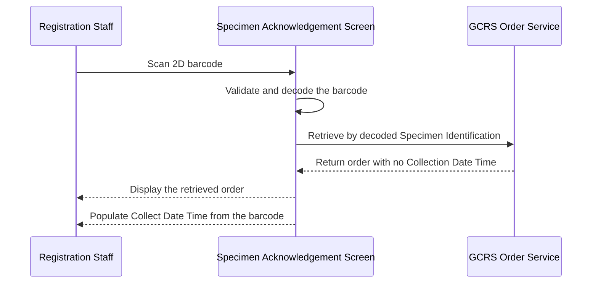
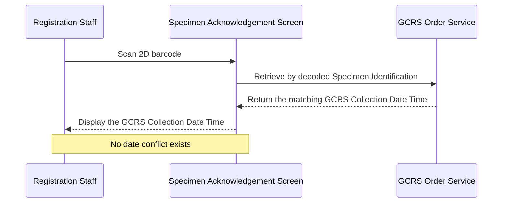
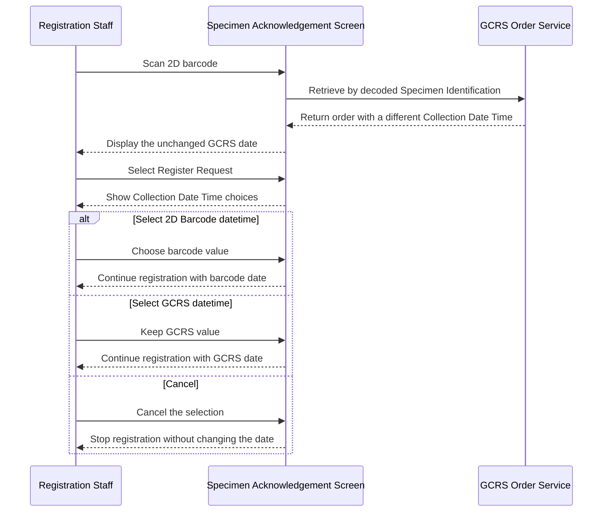
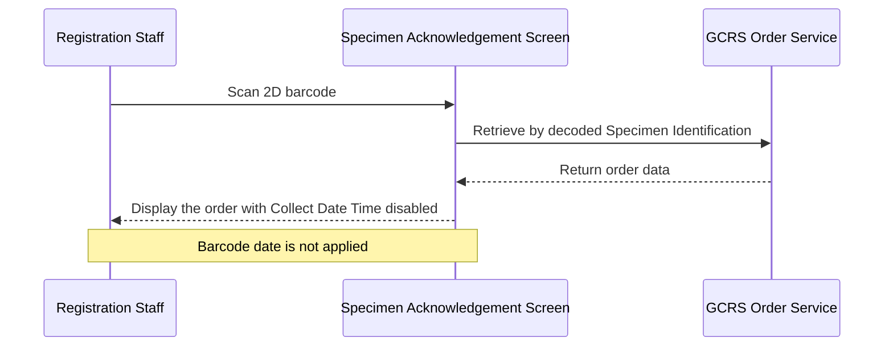
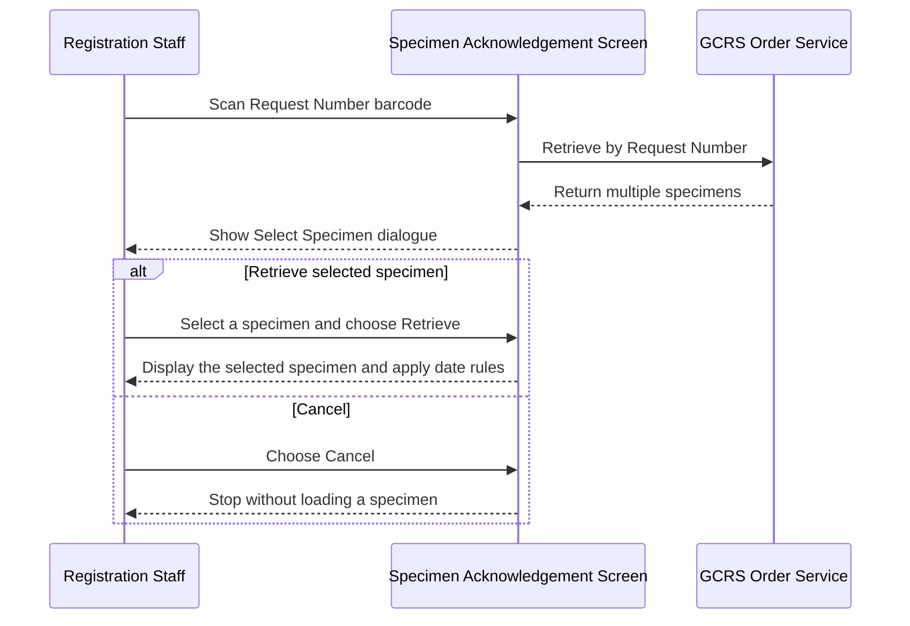
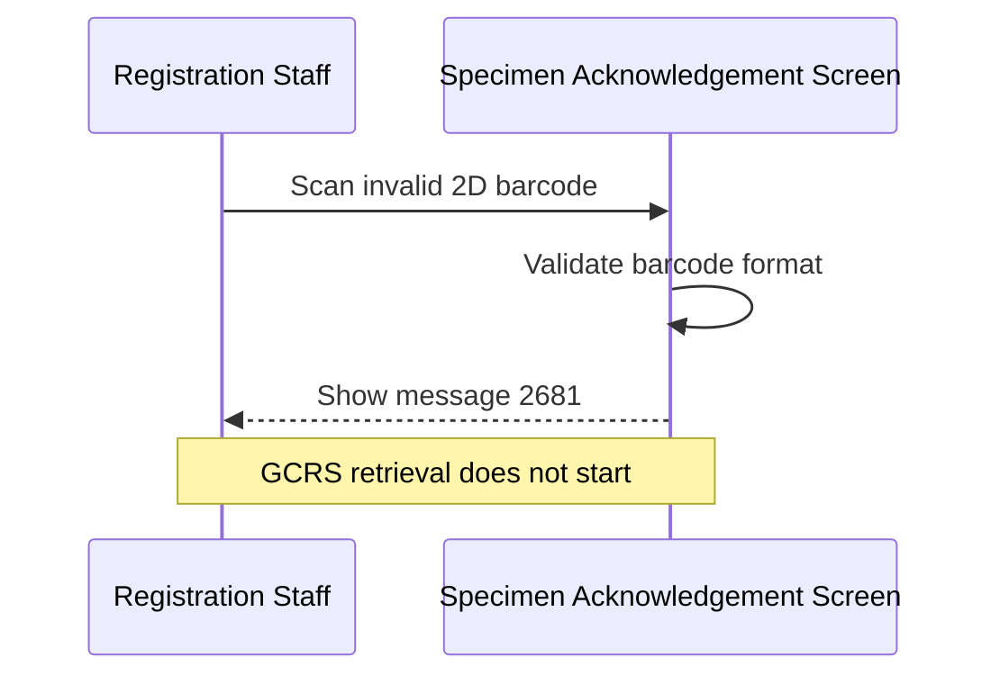
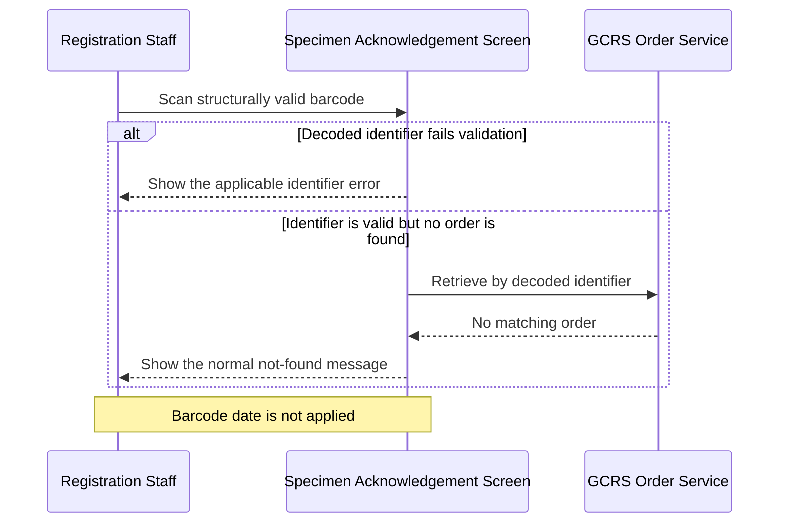

# Specimen Number with 2D Barcode Input

## Overview

This workflow allows Registration Staff to scan a 2D barcode containing a General Clinical Request System (GCRS) Specimen Identification and a specimen Collection Date Time. The identifier is validated and used in the same way as manual Specimen Number, Order Number, or Request Number input to retrieve the order, while the barcode timestamp supports accurate collection recording. Barcode validation prevents malformed data from starting retrieval, and an existing GCRS Collection Date Time is protected until any conflict is resolved during registration.

---

## Related User Stories

- **[[CRST-5]]** - Specimen Acknowledgement - Retrieve Order Information by Specimen Number with 2D Barcode
- **[[CRST-18]]** - Specimen Acknowledgement - Collection Date Input Field Enablement
- **[[CRST-37]]** - Specimen Acknowledgement - Pre-register: Collection Date Confirmation Dialogue
- **[[CRST-166]]**, **[[CRST-168]]**, **[[CRST-169]]**, **[[CRST-170]]**, and **[[CRST-172]]** - Common Specimen Identification retrieval behaviour referenced by CRST-5

**Epic:** LISP-3 [CRST][DEV] Specimen Ack - Retrieve Order Information

---

## Key Concepts

### 2D Barcode Payload
The barcode contains two business values in one scan: a Specimen Identification followed by a Collection Date Time. The canonical format is `*[Specimen Identification]#DD/MM/YYYY hh:mm`.

### Specimen Identification
The part between `*` and `#`. It may be a supported Specimen Number, Order Number, or Request Number. After decoding, it remains subject to the same format, hospital, check-digit, existence, and selection rules as the corresponding manually entered identifier.

### Barcode Collection Date Time
The date and time after `#`. The story denotes the time as `hh:mm`; it is a two-digit, 24-hour value from `00:00` to `23:59`.

### GCRS Collection Date Time
The Collection Date Time already held against the retrieved specimen. It remains the authoritative displayed value when it already exists, unless the user later chooses the barcode value during registration.

### Transient Barcode Value
A valid barcode timestamp is retained as a candidate value while the order is on screen. Scanning and retrieving do not by themselves save it to the database.

---

## Trigger Point

> The workflow begins when Registration Staff scan or enter a 2D barcode in the **Specimen No. / Lab No.** field on the **Specimen Acknowledgement** screen and submit the value by pressing Enter, selecting **Search**, or leaving the field.

---

## Workflow Scenarios

### Scenario 1: Retrieve an Order with No Existing Collection Date Time

#### Prerequisites

- The barcode follows the expected format.
- The decoded Specimen Identification is valid and permitted for retrieval.
- A matching GCRS order and specimen exist.
- The retrieved specimen has no GCRS Collection Date Time.
- The **Collect Date Time** field is enabled.

#### Process Flow

#### Step-by-Step Details

1. Registration Staff scan the barcode into the **Specimen No. / Lab No.** field.
2. The barcode structure and Collection Date Time are validated before retrieval begins.
3. The barcode is split into the decoded Specimen Identification and barcode Collection Date Time.
4. The decoded identifier is validated using its normal business rules. For a Specimen Number, these include the sending hospital and check digit.
5. The decoded identifier is used to retrieve the GCRS order.
6. If the identifier can represent more than one specimen, the user selects the intended specimen before it is displayed.
7. The patient, order, specimen, and test information is displayed for the selected specimen.
8. Because the GCRS Collection Date Time is empty and the field is enabled, the **Collect Date Time** field is populated with the barcode Collection Date Time.
9. The populated date remains subject to the normal collection-date validity checks.
10. No database value is written during this retrieval step.

### Scenario 2: Retrieve an Order with the Same Existing Collection Date Time

#### Prerequisites

- The barcode and decoded Specimen Identification are valid.
- A matching order and specimen exist.
- The GCRS Collection Date Time exactly matches the barcode Collection Date Time.

#### Process Flow

#### Step-by-Step Details

1. The barcode is decoded and the order is retrieved normally.
2. The system compares the barcode Collection Date Time with the existing GCRS Collection Date Time.
3. Because the two values represent the same date and time, the existing GCRS value remains displayed in **Collect Date Time**.
4. No Collection Date Time selection is required when registration is started.
5. Retrieval does not update the database.

### Scenario 3: Retrieve an Order with a Different Existing Collection Date Time

#### Prerequisites

- The barcode and decoded Specimen Identification are valid.
- A matching order and specimen exist.
- The GCRS Collection Date Time exists and differs from the barcode Collection Date Time.
- The **Collect Date Time** field is enabled.

#### Process Flow

#### Step-by-Step Details

1. The valid barcode is decoded and the matching order is retrieved.
2. The existing GCRS Collection Date Time remains displayed in **Collect Date Time**; it is not overwritten during retrieval.
3. The barcode Collection Date Time is retained separately as a candidate value.
4. Retrieval completes without writing either value to the database.
5. When the user selects **Register Request**, the **Select Collected Date** dialogue displays the GCRS and barcode values.
6. Selecting **2D Barcode datetime** updates **Collect Date Time** to the barcode value and continues the registration process.
7. Selecting **GCRS datetime** leaves **Collect Date Time** unchanged and continues the registration process.
8. Selecting **Cancel** closes the dialogue and stops the registration attempt without changing the GCRS value.
9. A database update occurs only if the subsequent registration completes; the detailed selection and persistence rules belong to [[Confirm Collection Date Before Registration]].

### Scenario 4: Retrieve with Collection Date Time Modification Disabled

#### Prerequisites

- The barcode and decoded Specimen Identification are valid.
- A matching order and specimen exist.
- The **Collect Date Time** field is disabled by hospital and laboratory configuration.

#### Process Flow

#### Step-by-Step Details

1. The decoded identifier is still used to retrieve the order.
2. The disabled state prevents the barcode Collection Date Time from populating or changing **Collect Date Time**.
3. If a GCRS Collection Date Time exists, it remains displayed and unchanged.
4. If the GCRS Collection Date Time is empty, the disabled field remains empty.
5. The barcode value is not offered as a registration choice while collection-date modification is disabled.
6. No Collection Date Time is saved by this workflow.

### Scenario 5: Select a Specimen for a Request Number Barcode

#### Prerequisites

- A valid Request Number barcode is scanned.
- The Request Number is associated with more than one specimen that can be retrieved.

#### Process Flow

#### Step-by-Step Details

1. The Request Number and barcode Collection Date Time are decoded.
2. All matching specimen candidates are retrieved.
3. The **Select Specimen** dialogue lists each Specimen Number and description.
4. The user selects the intended specimen and chooses **Retrieve**.
5. The selected specimen is displayed, and its Collection Date Time is handled by Scenarios 1 to 4.
6. If the user chooses **Cancel**, no specimen is loaded and the barcode date is not applied.

### Scenario 6: Reject an Invalid 2D Barcode

#### Prerequisites

- The scanned value is intended to be a 2D barcode.
- The value does not follow the expected barcode structure, identifier structure, or date-time format.

#### Process Flow

#### Step-by-Step Details

1. The system validates the complete barcode before sending a retrieval request.
2. The barcode is rejected if the opening `*`, separating `#`, identifier portion, date, time, spacing, or value ranges do not meet the required format.
3. Message `2681` is displayed with the entered value: **Invalid 2D barcode format &lt;entered value&gt;.**
4. The GCRS order is not retrieved.
5. No order information or barcode Collection Date Time is applied to the screen.
6. The user must correct or rescan the value before trying again.

### Scenario 7: Decoded Identifier Is Invalid or Not Found

#### Prerequisites

- The barcode envelope and Collection Date Time are valid.
- The decoded Specimen Identification fails a normal identifier rule, or no matching GCRS order exists.

#### Process Flow

#### Step-by-Step Details

1. After decoding, the identifier is checked using the same rules as manual input.
2. If identifier validation fails, the applicable Specimen Number, Order Number, or Request Number validation message is shown and retrieval stops.
3. If the identifier is valid but no matching order is returned, the normal not-found outcome for that identifier type is shown.
4. No patient, order, specimen, or test information is loaded.
5. The barcode Collection Date Time is discarded for the unsuccessful retrieval.

---

## Summary Tables

### Required Barcode Structure

| Part | Rule | Example |
|---|---|---|
| Opening marker | Must start with `*` | `*` |
| Specimen Identification | Supported Specimen Number, Order Number, or Request Number | `UCHSP2300000877` |
| Separator | A single `#` separates the identifier from the timestamp | `#` |
| Date | Two-digit day, two-digit month, four-digit valid calendar year | `19/04/2023` |
| Space | One space separates date and time | ` ` |
| Time | Two-digit 24-hour hour and minute | `11:04` |
| Complete example | All parts combined without extra characters | `*UCHSP2300000877#19/04/2023 11:04` |

### Supported Identifier Types

| Identifier Type | Barcode Example | Retrieval Behaviour |
|---|---|---|
| Specimen Number | `*UCHSP2300000877#19/04/2023 11:04` | Retrieves the matching specimen after hospital and check-digit validation |
| Request Number | `*10J2000215#05/10/2015 12:04` | Retrieves the request and prompts for a specimen when multiple candidates exist |
| Order Number | `*<hospital and order number>#19/04/2023 11:04` | Retrieves by the decoded Order Number using the normal order-retrieval rules |

### Collection Date Time Outcome Matrix

| Barcode | GCRS Collection Date Time | Field Enabled | Value Displayed After Retrieval | Registration-Time Outcome |
|---|---|---|---|---|
| Invalid | Any | Any | Existing screen state remains unchanged | Message `2681`; retrieval stops |
| Valid | Empty | Yes | Barcode Collection Date Time | No conflict choice is required |
| Valid | Empty | No | Empty | Barcode date is not applied |
| Valid | Same as barcode | Yes or No | Existing GCRS value | No conflict choice is required |
| Valid | Different from barcode | Yes | Existing GCRS value | User chooses barcode or GCRS value before registration |
| Valid | Different from barcode | No | Existing GCRS value | Barcode date is not applied or offered |

### Error Message

| Message Code | Condition | Message | Outcome |
|---|---|---|---|
| `2681` | The scanned 2D barcode does not match the required format | **Invalid 2D barcode format &lt;entered value&gt;.** | Retrieval stops and no barcode data is applied |

---

## Data Sources

| Data | Source |
|---|---|
| Scanned Specimen Identification | Identifier portion of the 2D barcode |
| Barcode Collection Date Time | Date-time portion of the 2D barcode |
| Patient, order, specimen, and test information | GCRS order retrieval service |
| Existing GCRS Collection Date Time | Retrieved specimen detail |
| Allowed sending hospitals and hospital check-digit factor | Cached hospital and GCRS option dictionaries |

### Database Source for Existing Collection Date Time

| Field Label | Table | Column | Use in This Workflow |
|---|---|---|---|
| Collect Date Time | `loe_specimen_detail` | `loespec_collect_dtm` | Compared with the barcode value and retained when already populated |

> [!note] Persistence boundary
> Scanning, decoding, and retrieving are read-only operations. The barcode Collection Date Time is held only as a screen-level candidate during this workflow. A database write can occur only in a later registration or explicit collection-date save workflow.

---

## Configuration

| Setting | Option Code | Purpose | Effect when enabled or configured | Effect when disabled or not configured |
|---|---|---|---|---|
| Collection Date Time Modification | `ALLOW_COL_DTM_MODIFY` *(source: `LOE_CONTROL`; lab-scoped setting `X_ALLOW_COL_DTM_MODIFY`, group `HOSP_SETTING`)* | Controls whether **Collect Date Time** can be populated or changed | The field is enabled; an empty GCRS value can be populated from the barcode; date conflicts can be resolved before registration | The field is disabled; the barcode date is not applied or offered; default behaviour is disabled |
| Allowed Sending Hospitals | `SP_ALLOW_HOSP` *(source: GCRS hospital settings backed by `LOE_CONTROL`, group `HOSP_SETTING`)* | Defines which hospital identifiers are valid for Specimen Number and Order Number retrieval | A decoded identifier from a listed hospital can proceed to the remaining validation checks | An unlisted hospital is rejected by the normal identifier validation workflow |

---

## Business Rules

1. A 2D barcode must contain exactly one business identifier and one Collection Date Time separated by `#`, with `*` as the opening marker.
2. The canonical date-time format is `DD/MM/YYYY hh:mm`, using a valid calendar date and a two-digit 24-hour time.
3. Specimen Number, Order Number, and Request Number are supported because CRST-5 explicitly identifies all three retrieval routes.
4. Decoding a barcode does not bypass normal identifier validation or order-retrieval rules.
5. Message `2681` is used when the 2D barcode itself does not meet the required format, and retrieval must stop.
6. If the barcode is valid but its decoded identifier is invalid or not found, the normal error handling for that identifier type applies.
7. A barcode Collection Date Time populates **Collect Date Time** only when the GCRS value is empty and collection-date modification is enabled.
8. An existing GCRS Collection Date Time is never overwritten merely because the order was retrieved with a barcode.
9. Equal barcode and GCRS values do not require a confirmation dialogue.
10. Under the CRST-5 and CRST-37 business requirement, any different barcode and GCRS values are resolved when the user starts registration, provided collection-date modification is enabled.
11. Cancelling specimen selection or Collection Date Time selection stops the current continuation path without saving the barcode value.
12. Retrieval does not persist the barcode Collection Date Time; persistence occurs only after a later save or completed registration action.

---

## Technical Notes

Source-parity observations for the revamp team

1. CRST-5 and CRST-37 define a conflict whenever the barcode and GCRS Collection Date Time values differ. Both the inspected legacy flow and the current revamped flow open the selection dialogue only when the barcode value is later than the GCRS value. The workflow above treats the user-story rule as canonical; product confirmation or an implementation correction is required for the earlier-barcode case.
2. The legacy parser accepts one- or two-digit hours and minutes, while CRST-5 and the revamped barcode patterns require exactly two digits. The canonical requirement above follows the user story.
3. CRST-5 requires a message box with code `2681` and no retrieval for malformed barcodes. The current revamped field validation returns the message text as a field error; the modal presentation and retrieval-blocking wiring should be verified.
4. The revamped Order Number barcode route accepts the barcode for retrieval, but the barcode timestamp association should be verified after the barcode wrapper is removed; the current condition appears to test the wrapped Order Number format against the decoded value.
5. The revamped date-time pattern checks the numeric shape, but the conversion path should also reject impossible calendar values rather than normalising them.
6. When collection-date modification is disabled, the revamped display path should be verified to ensure an existing GCRS Collection Date Time remains visible after barcode retrieval.

---

## Related Workflows

- [[Open and Navigate Specimen Acknowledgement Screen]] — Provides the barcode input field and order information panels.
- [[Retrieve Order Information by Specimen Number]] — Defines the validation and retrieval behaviour used when the barcode contains a Specimen Number.
- [[Retrieve Order Information by Request Number]] — Defines the retrieval and specimen-selection behaviour used when the barcode contains a Request Number.
- [[Input Order Number]] — Defines the retrieval behaviour used when the barcode contains an Order Number.
- [[Collection Date Input Field Enablement]] — Defines when **Collect Date Time** can be populated or modified.
- [[Confirm Collection Date Before Registration]] — Defines the barcode-versus-GCRS selection and persistence rules for different dates.
- [[Register Request from Specimen Acknowledgement]] — Persists the selected Collection Date Time when registration completes.
- [[Save Collection Date]] — Persists a separately confirmed Collection Date Time outside the retrieval step.
