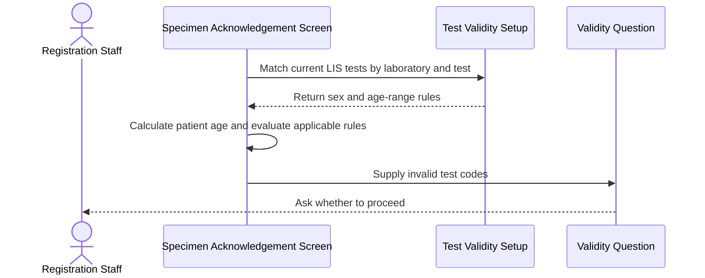
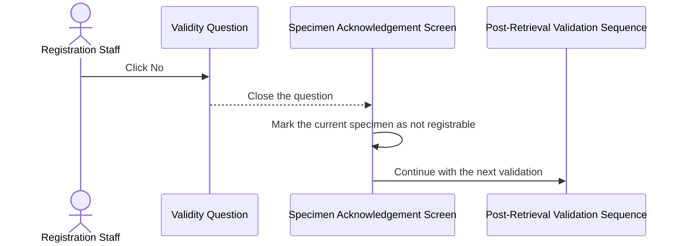
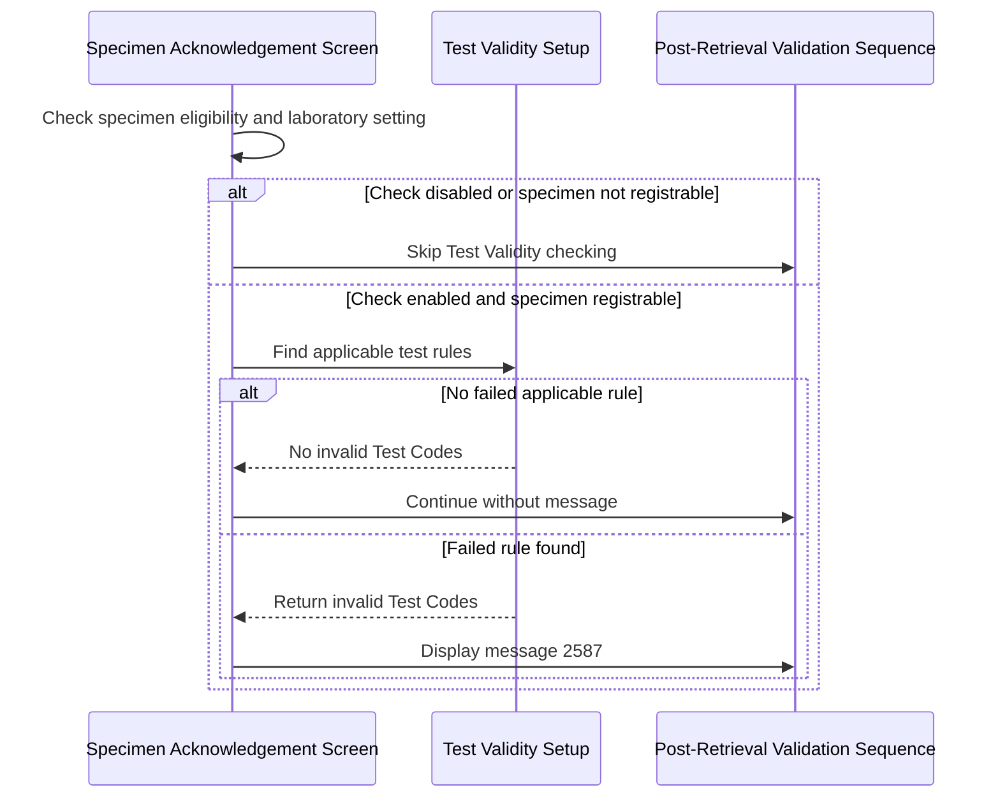

# Validate Tests Against Patient Sex and Age After Retrieval

## Overview

This workflow checks whether tests on a retrieved Global Clinical Record System (GCRS) order are valid for the patient's sex and age. Registration Staff are warned when one or more tests violate the configured Test Validity rules and may choose whether registration remains available. The check prevents unsuitable tests from being registered without an explicit user decision while allowing the remaining post-retrieval validations to continue.

---

## Related User Stories

- **[[CRST-164]]** - Specimen Ack - Alert Messaging (Extra setup)

**Epic:** LISP-3 [CRST][DEV] Specimen Ack - Retrieve Order Information

---

## Key Concepts

### Test Validity Setup

Test Validity setup defines whether a laboratory test is valid for a patient sex and age range. A setup row applies to one laboratory and test, either a specific sex or all sexes, and defines whether the stated age range is allowed or excluded.

### Inclusive Age Boundaries

The lower and upper age limits are inclusive. An age equal to either boundary is treated as inside the configured range.

### In-Range Rule

When the setup marks the range as valid, the test is valid only when the patient's age is between the lower and upper limits, inclusive.

### Out-of-Range Rule

When the setup marks the range as excluded, the test is valid only when the patient's age is below the lower limit or above the upper limit.

### Registrable Specimen

A registrable specimen has at least one current test that may proceed through registration. Declining the validity warning changes the current specimen to a non-registrable state for the current retrieval.

---

## Trigger Point

> This workflow starts automatically within the post-retrieval validation sequence after GCRS order information has been displayed and the system has determined that the current specimen is registrable.

---

## Workflow Scenarios

### Scenario 1: Show the Test Validity Warning

#### Prerequisites

- GCRS order information has been retrieved.
- The current specimen is registrable.
- The **Sex and Age Test Validity Check** setting is enabled for the current laboratory.
- Test Validity setup exists for at least one mapped LIS test linked to the current specimen.
- At least one test fails its applicable sex or age rule.

#### Process Flow

#### Step-by-Step Details

1. The system selects mapped LIS tests linked to the current specimen.
2. Each test is matched to Test Validity setup for the current laboratory and test identifier.
3. Setup for the patient's sex is evaluated together with setup that applies to all sexes.
4. The patient's age is calculated using the configured age reference date. For a deceased patient, age at death is used when the date of death is available; otherwise the configured collection-date or current-date rule applies.
5. For an in-range rule, the test fails when the patient's age is below the lower limit or above the upper limit.
6. For an excluded-range rule, the test fails when the patient's age is within the lower and upper limits, including either boundary.
7. If any test fails, question message `2587` displays the invalid **Test Code** values separated by spaces.
8. The user must choose **Yes** or **No** before interacting with the rest of the screen.

---

### Scenario 2: Confirm and Continue Registration Eligibility

#### Prerequisites

- Message `2587` is displayed.
- One or more Test Codes have failed sex or age validation.

#### Process Flow

#### Step-by-Step Details

1. The user reviews the invalid Test Codes and clicks **Yes** to proceed.
2. The message closes.
3. The current specimen remains registrable.
4. The system continues with the next post-retrieval validation.
5. No registration or database write occurs merely by confirming this question.

---

### Scenario 3: Decline and Make the Specimen Non-Registrable

#### Prerequisites

- Message `2587` is displayed.
- One or more Test Codes have failed sex or age validation.

#### Process Flow

#### Step-by-Step Details

1. The user clicks **No** to decline proceeding with registration for the invalid tests.
2. The message closes.
3. The current specimen becomes not registrable and the **Register** action is disabled for the current retrieval.
4. The system continues with the next post-retrieval validation; declining this question must not skip unrelated warnings or checks.
5. No database write is performed by declining the question.

---

### Scenario 4: Skip the Test Validity Warning

#### Prerequisites

At least one of the following applies:

- The current specimen is not registrable.
- The **Sex and Age Test Validity Check** setting is disabled or missing.
- No Test Validity setup exists for the current specimen's mapped LIS tests.
- Every applicable test passes its sex and age rules.
- No mapped LIS test is available for evaluation.

#### Process Flow

#### Step-by-Step Details

1. The system first checks whether the specimen is registrable and whether Test Validity checking is enabled.
2. If either condition is false, the check is skipped.
3. If no setup exists for the mapped current-specimen tests, no warning is displayed.
4. If setup exists and all applicable rules pass, no warning is displayed.
5. The system continues with the next post-retrieval validation.

---

## Summary Tables

### Message Definition

| Code | Text | Type | Buttons | Parameter | Trigger Point |
|---|---|---|---|---|---|
| `2587` | The following test(s) are invalid against patient's sex and/or age: \[@PARM1\]. Do you want to proceed now? | Question | Yes / No | `@PARM1`: Invalid Test Codes separated by spaces | At least one current-specimen test fails an applicable Test Validity rule |

### User Choice Outcomes

| User Choice | Specimen Registrable | Continue Next Validation | Immediate Database Write |
|---|---|---|---|
| **Yes** | Yes | Yes | No |
| **No** | No; **Register** is disabled | Yes | No |

### Test Validity Decision Matrix

| Applicable Sex Setup | Range Type | Patient Age | Result |
|---|---|---|---|
| No row for patient sex or all sexes | Any | Any | Invalid when Test Validity setup exists for the test but none applies to the patient sex |
| Patient sex or all sexes | In-range | Between lower and upper limits, inclusive | Valid |
| Patient sex or all sexes | In-range | Below lower or above upper limit | Invalid |
| Patient sex or all sexes | Excluded range | Between lower and upper limits, inclusive | Invalid |
| Patient sex or all sexes | Excluded range | Below lower or above upper limit | Valid |

### Data Written

This post-retrieval validity check is read-only. Displaying message `2587`, selecting **Yes**, or selecting **No** does not itself write to the database. A later successful registration is a separate workflow and may produce an operation audit if a validity rule is explicitly bypassed during registration.

---

## Data Sources

| Data | Business Source | Table | Column | Notes |
|---|---|---|---|---|
| Test Laboratory | LIS test dictionary | `test_dict` | `test_labno` | Matches the current laboratory |
| Test Identifier | LIS test dictionary | `test_dict` | `test_ckey` | Joins the test to Test Validity setup |
| Test Code | LIS test dictionary | `test_dict` | `test_alpha_code` | Displayed in message `2587` |
| Validity Laboratory | Test Validity setup | `test_valid` | `testval_labno` | Part of the setup key |
| Validity Test Identifier | Test Validity setup | `test_valid` | `testval_ckey` | Joins to the LIS test identifier |
| Applicable Sex | Test Validity setup | `test_valid` | `testval_sex` | Patient sex or `A` for all sexes |
| Range Type | Test Validity setup | `test_valid` | `testval_inrange` | `1` means the range is valid; `0` means the range is excluded |
| Lower Age Limit | Test Validity setup | `test_valid` | `testval_lb` | Inclusive lower boundary |
| Upper Age Limit | Test Validity setup | `test_valid` | `testval_ub` | Inclusive upper boundary |
| Patient Sex | Retrieved GCRS order | `loe_order` | `loeord_pat_sex` | Used to select applicable validity setup |
| Patient Date of Birth | Retrieved GCRS order | `loe_order` | `loeord_pat_dob` | Base date for age calculation |
| Patient Death Indicator | Patient record | `patient` | `pat_death` | Identifies a deceased patient |
| Patient Date of Death | Patient record | `patient` | `pat_death_date` | Used to derive age at death |
| Specimen Collection Time | Retrieved GCRS specimen | `loe_specimen_detail` | `loespec_collect_dtm` | Used when age is configured to be derived at collection |

---

## Configuration

| Setting | Option Code | Source | Purpose | Enabled | Disabled or Missing |
|---|---|---|---|---|---|
| Sex and Age Test Validity Check | `SEX_AGE_TEST_CHECK_ENABLED` | `lab_option`, group `REQUEST_REGISTRATION` | Controls whether Test Validity rules are evaluated | Eligible tests are checked | Check and message are skipped |
| Derive Age at Collection | `DERIVE_AGE_VALUE_CRITERIA` | `lab_option`, group `REQUEST_REGISTRATION` | Selects specimen collection time as the age reference date when available | Age is calculated at collection | Current date is used for a living patient |
| Allow Zero-Day Age | `ZERO_DAY_AGE_ALLOWED` | `lab_option`, group `PATIENT` | Controls whether a same-day newborn age remains zero days | Zero-day age is retained | Minimum age is adjusted to one day |

---

## Business Rules

1. Test Validity checking runs only for a registrable specimen when `SEX_AGE_TEST_CHECK_ENABLED` is enabled.
2. Only mapped LIS tests linked to the current specimen are evaluated.
3. A test without Test Validity setup does not trigger message `2587`.
4. A setup row for sex `A` applies to all patients.
5. Lower and upper age limits are inclusive.
6. Invalid Test Codes are shown once in a single question message and are separated by spaces.
7. Selecting **Yes** keeps the specimen registrable and continues the remaining validation sequence.
8. Selecting **No** makes the specimen not registrable but still continues the remaining validation sequence.
9. The user decision does not itself modify GCRS order, specimen, or test data.

---

## Related Workflows

- [[Show Post-Retrieval Specimen Status Alerts]] — Provides the wider post-retrieval alert sequence in which Test Validity checking runs.
- [[Show and Inactivate Post-Retrieval Specimen Reminders]] — Handles other configuration-driven reminders after order retrieval.
- [[Show Duplicate Reasons and Ward-Assigned Lab Number Alerts]] — Handles preceding duplicate-reason and ward-assigned-number alerts.

---

Technical Notes — Legacy and Revamp Traceability

- **Core alert behavior is implemented in both systems.** Both evaluate Test Validity only while the current specimen is registrable, use `SEX_AGE_TEST_CHECK_ENABLED`, identify invalid mapped tests, display message `2587`, preserve registration on **Yes**, and disable registration on **No**.
- **Decline continuation is a revamp parity defect.** CRST-164 and the legacy flow both require **No** to make the specimen non-registrable and then continue to the next validation. The revamp message callback disables registration but rejects the asynchronous alert queue, so later validations in the same sequence are likely skipped.
- **Parameter formatting differs.** The User Story and legacy implementation use space-separated Test Codes. The revamp joins them with a comma and space.
- **Sex mismatch behavior differs.** Legacy behavior treats a test as invalid when setup exists but no row applies to the patient's sex or all sexes. Revamp behavior filters to matching rows and reports nothing when that filtered set is empty.
- **Age option wiring is suspicious in the revamp.** The age calculation labels its switch as derive-by-collection but reads the separate displayed-age adjustment setting instead of `DERIVE_AGE_VALUE_CRITERIA`.
- **Deceased-patient age is incorrect in the traced revamp implementation.** Legacy behavior calculates age at the Date of Death. The revamp sets the age calculation date to Date of Birth when the death indicator is present, which produces an age close to zero and can change validity outcomes.
- **Bypass auditing is not preserved by the current revamp request.** The backend supports operation audit type `100` for a test-validity bypass during later registration. The current registration request initializes the bypass flag to false and the bypassed-test list to empty, so confirming the post-retrieval warning does not reach that audit path. This does not change CRST-164's immediate read-only behavior but is a downstream traceability gap.
- **Focused tests are missing.** No frontend unit tests were found for the Test Validity hook, message `2587`, age-boundary behavior, sex mismatch, deceased-patient calculation, Yes/No outcomes, delimiter formatting, or continuation after **No**. Dictionary service coverage verifies retrieval at a broad level, but no focused Specimen Acknowledgement backend tests were found for this workflow.

