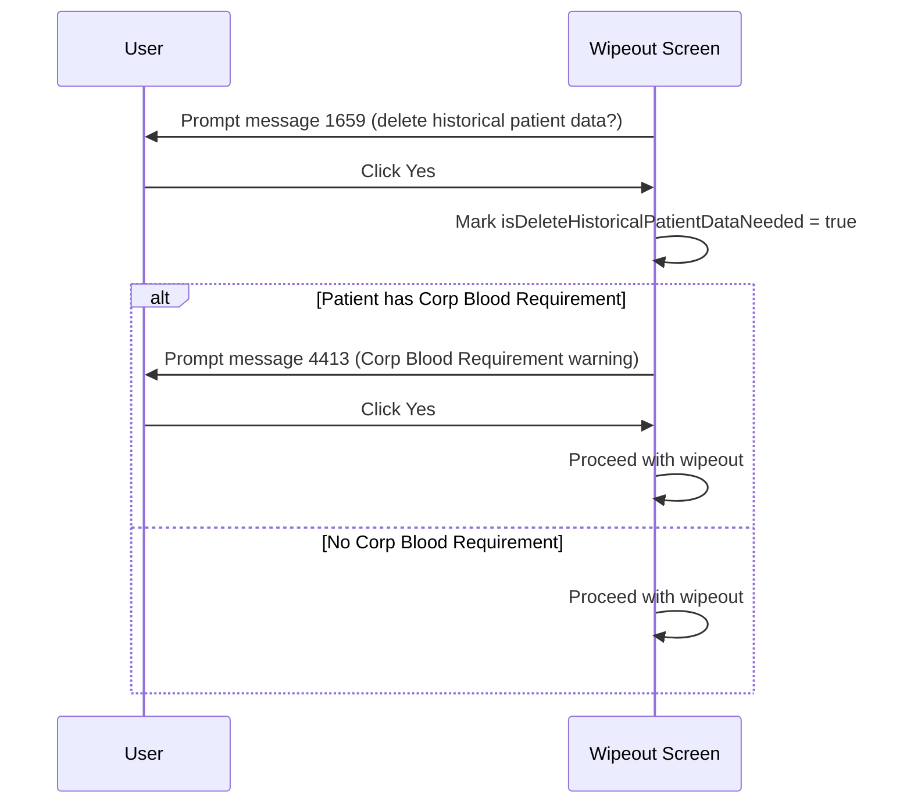

# BBNK - Ask for Confirmation

## Overview

Before proceeding with a BBNK (Blood Bank) wipeout, the system checks whether the patient has any historical request data that would also be deleted as part of the wipeout, and whether the patient has a Corp Blood Requirement. If the patient has only one BBNK request (making historical data deletion necessary), the user is prompted to confirm whether to delete that historical data. If the patient additionally has a Corp Blood Requirement, a second confirmation is required. This is a BBNK-specific pre-wipeout step with no equivalent in Cancel Request.

---

## Related User Stories

- **[[CRST-1001]]** — Wipeout Request — BBNK: Ask for Confirmation

**Epic:** LISP-256 [CRST][DEV] Wipeout Request — Special Lab Workflow (BBNK)

---

## Key Concepts

### Historical Patient Data
When a BBNK request is the only request in the patient's PID group (i.e., the patient has exactly one BBNK request), wiping it out would also delete the patient's historical Blood Bank data. The user is given a choice whether to proceed with that deletion.

### Corp Blood Requirement
A patient-level flag indicating the patient has a corporate (hospital) blood requirement. If this flag is set, an additional confirmation is required before the wipeout can proceed.

---

## Trigger Point

This confirmation step occurs during the wipeout pipeline, after user validation passes and before the final wipeout action is sent to the server.

---

## Workflow Scenarios

### Scenario 1: Patient Has Only One BBNK Request (Historical Data at Risk)

#### Prerequisites
- The request being wiped out is a BBNK request.
- The patient's PID group contains exactly one BBNK request (i.e., this is the only one).

#### Process Flow

#### Step-by-Step Details

1. The system detects that the patient's PID group has exactly one BBNK request.
2. Message 1659 is prompted, asking whether to delete the patient's historical Blood Bank data.
3. **If the user clicks Yes:**
   - The system marks the wipeout to include deletion of historical patient data.
   - If the patient also has a Corp Blood Requirement, message 4413 is prompted.
     - If the user clicks **Yes** on message 4413, the wipeout proceeds.
     - If the user clicks **No** on message 4413, the wipeout is aborted. The retrieved request data remains on the screen.
   - If the patient does not have a Corp Blood Requirement, the wipeout proceeds without message 4413.
4. **If the user clicks No:**
   - The system marks the wipeout to keep historical patient data (historical data will not be deleted).
   - The wipeout proceeds.

---

### Scenario 2: Patient Has More Than One BBNK Request

#### Prerequisites
- The patient's PID group contains more than one BBNK request.

#### Step-by-Step Details

1. No historical data is at risk — the patient retains other BBNK requests even after the wipeout.
2. Message 1659 is not prompted.
3. The wipeout pipeline proceeds directly without this confirmation step.

---

## Messages

| Message | Text | Trigger | User Options |
|---|---|---|---|
| 1659 | *(Delete historical patient data confirmation)* | Patient PID group has exactly one BBNK request | Yes (delete historical data and continue) / No (keep historical data and continue) |
| 4413 | *(Corp Blood Requirement warning)* | User responds Yes to message 1659; patient has Corp Blood Requirement | Yes (proceed with wipeout) / No (abort wipeout) |

---

## Business Rules

1. Message 1659 is shown only when the patient's PID group has exactly one BBNK request — meaning wiping out this request would also remove the patient's historical Blood Bank data.
2. The user's response to message 1659 (Yes or No) is passed as a flag to the backend wipeout process — it does not immediately delete data on the client side.
3. Message 4413 is shown only when the user confirms Yes on message 1659 AND the patient has a Corp Blood Requirement.
4. Responding No to message 4413 unconditionally aborts the wipeout. The retrieved request data remains on the screen.
5. If message 1659 is not prompted (patient has more than one request), the historical data deletion flag defaults to false.

---

## Related Workflows

- [[BBNK - Wipeout Request]] — The request packing step that uses the historical data deletion flag determined here.
- [[BBNK - Wipeout Message]] — The message monitor confirmation shown after successful wipeout when historical data was deleted.
- [[Blood Inventory Validation]] — An earlier BBNK-specific validation step in the pipeline.
- [[Wipeout Request (Action)]] — The main wipeout pipeline.
