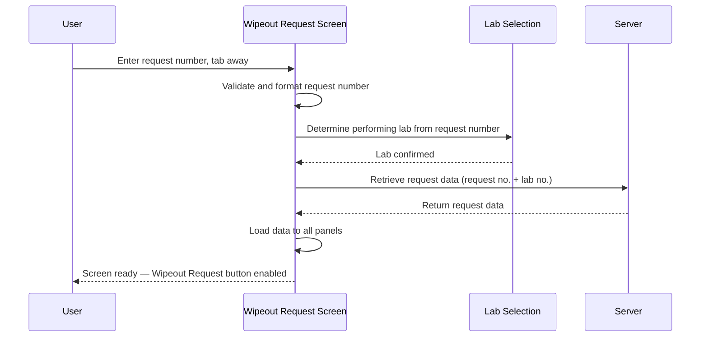

# Retrieve Request

## Overview

When a user enters a request number on the Wipeout Request screen and tabs away, the system validates the request number, determines the performing lab, and retrieves the full request data from the server. The Patient Demographic panel, Clinical Detail, Comment, Test Grid, and — for MBS/VRS — the Specimen and Site section are all populated from the retrieved data. Once data has loaded successfully, the screen transitions to the ready state and the **Wipeout Request** button becomes enabled.

> **Shared logic:** The retrieval mechanism, data mapping, and screen population logic are shared with Cancel Request. See [[Cancel Request/Workflows/Request Retrieval/Retrieve Request|Retrieve Request (Cancel Request)]] for the full data mapping table. Key difference: Wipeout Request does **not** load a previous cancel reason — there is no Cancel Reason field or Keep Cancel Reason checkbox on this screen.

---

## Related User Stories

- **[[CRST-983]]** - Wipeout Request - Retrieve Request
- Data mapping reference: **[[CRST-925]]** (Cancel Request - Retrieve Request)

**Epic:** LISP-252 [CRST][DEV] Wipeout Request — Request Retrieval

---

## Trigger Point

Initiated when the user enters a request number in the **Req. No.** field and the focus moves away (e.g., by pressing Tab). The system first validates and formats the request number, then selects the performing lab, then retrieves all request data from the server.

---

## Workflow Scenarios

### Scenario 1: Request Found and Retrieved Successfully

#### Prerequisites
- The Wipeout Request screen is open.
- The user has entered a valid, existing request number.

#### Process Flow

#### Step-by-Step Details

1. **Request number validation:** The system validates and formats the text in the **Req. No.** field. If the request number is not in a valid format or does not exist, the entry is rejected and the field is cleared (see [[Request Not Found Message]]).

2. **Lab determination:** The system examines the request number to identify the performing lab. If the lab is not supported on this screen, a message is shown and the field is cleared (see [[Not Supported Lab Message]]). Otherwise, the performing lab is set and the screen title is updated to include the lab name.

3. **Server retrieval:** The system sends the request number and lab number to the server to retrieve the full request data.

4. **Data loaded to panels:** On a successful response, the following panel areas are populated on the screen (same fields as Cancel Request — see [[Cancel Request/Workflows/Request Retrieval/Retrieve Request|Retrieve Request (Cancel Request)]] for the full column mapping):

   - **Patient Demographic Panel** — Request No., HKID, Encounter, Name, Sex, Age, Req. Doc, Request Location, Report Location, Report Copy, Bed
   - **Clinical Detail** — Combined from two database columns
   - **Comment** — Request comment

5. **Test Grid populated:** The tests attached to the request are loaded into the Test Grid. Each row shows the test code, status date (colour-coded by status), and whether the test is optional. If USID is enabled for the performing lab, a Specimen column is also shown (see [[Test Result]]).

6. **Screen transitions to ready state:** The **Wipeout Request** button is enabled. The **Req. No.** field becomes non-editable. All controls that require a retrieved request become active (see [[Object Enablement After Retrieval]]).

> **Key difference from Cancel Request:** There is no step to load a previous cancel reason. The Wipeout Request screen has no Cancel Reason field and does not check for a cancel comment test on retrieval.

---

### Scenario 2: Request Not Found

If the server returns no request data for the entered request number, the system shows a "not found" message and clears the screen. See [[Request Not Found Message]].

---

## Business Rules

1. The performing lab is derived from the request number prefix; the retrieval call includes both the request number and the lab number.
2. All patient demographic fields are **read-only** after retrieval; they cannot be edited on the Wipeout Request screen.
3. Clinical Detail is stored across two database columns; both are combined when displayed on screen.
4. Report Copy Location may have multiple entries; all are accessible via the Report Copy dialogue on the Patient Demographic panel.
5. Unlike Cancel Request, no previous cancel reason is loaded during retrieval — the Wipeout Request screen does not have a cancel reason field.

---

## Related Workflows

- [[Default Screen Behavior]] — Describes the initial state of the screen before any request is retrieved.
- [[Laboratory Selection]] — The lab determination step that runs after request number validation.
- [[Request Not Found Message]] — The message shown when no matching request exists.
- [[Not Supported Lab Message]] — The message shown when the request's lab is not supported.
- [[Test Result]] — Test grid population after a successful retrieval.
- [[Object Enablement After Retrieval]] — Which controls become enabled once a request is successfully loaded.
