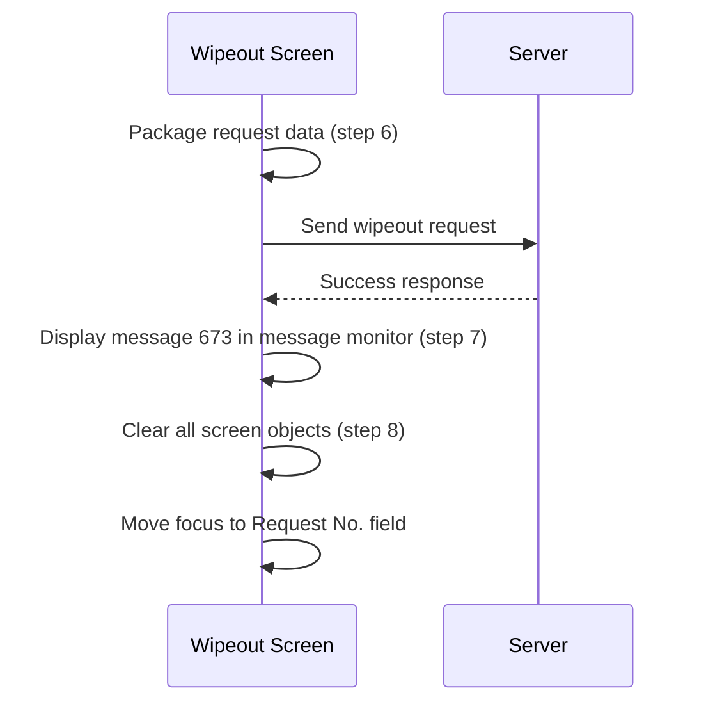
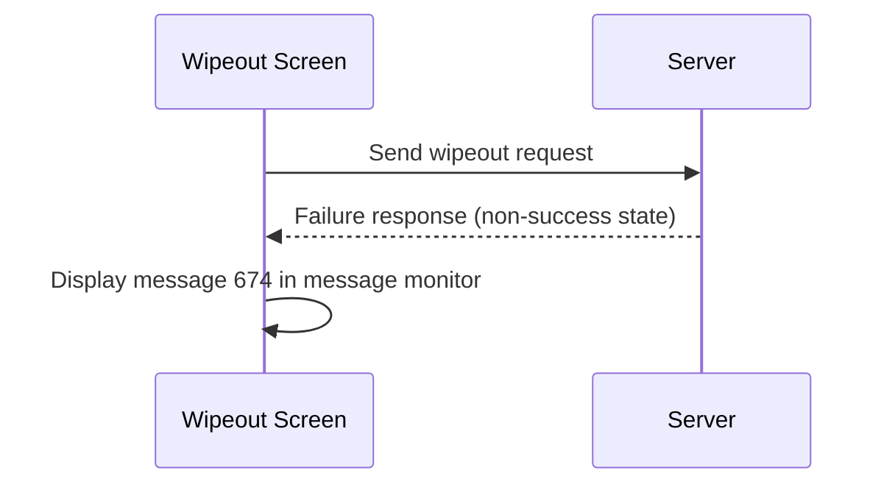
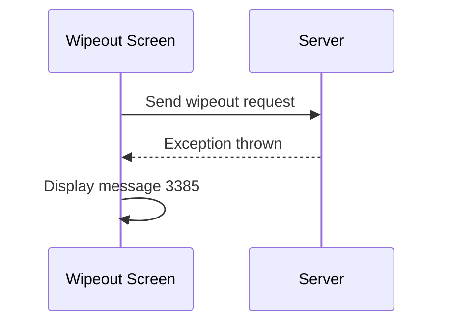

# Wipeout Request (Action)

## Overview

After all validation, user validation, and confirmation steps pass, the system commits the wipeout action. It packages the request data, sends it to the server, displays a completion message, and then clears the screen. On success, message 673 appears in the message monitor. On failure, message 674 is shown. On server error, message 3385 is shown.

> **Shared logic:** The core wipeout action pipeline (Process Save → server call → prompt completion message → clear) follows the same structure as [[Cancel Request (Action)]] in Cancel Request. The differences are in the request package contents — Wipeout Request does not include a cancel comment or cancel comment test. BBNK and VIRO requests carry additional lab-specific fields in the package.

---

## Related User Stories

- **[[CRST-996]]** — Wipeout Request — Wipeout Request (Action)

**Epic:** LISP-255 [CRST][DEV] Wipeout Action

---

## Trigger Point

Steps 6 through 8 of the wipeout pipeline, after [[Ask for Confirmation]] (step 5) passes.

---

## Workflow Scenarios

### Scenario 1: Successful Wipeout

#### Prerequisites
- All preceding pipeline steps have passed (confirmation, gather info, validation, user validation, ask for confirmation).

#### Process Flow

#### Step-by-Step Details

1. **Package request data (step 6 — Process Save):** The system assembles the wipeout request package. The base package includes:

   | Data Field | Content |
   |---|---|
   | Lab Result | Full lab result data for the retrieved request |
   | Authorize ID | The ID of the user who authorised via User Validation Dialogue |
   | Acting By ID | The ID of the user who performed the wipeout action |
   | Request Level | 4 = Printed; 3 = Authorized; 2 = Entered; 1 = No Result |

   For BBNK requests, additional fields are included — see [[BBNK - Wipeout Request]].

   For VIRO requests, additional fields are included — see [[VIRO - Wipeout Request]].

2. **Server call:** The packaged data is sent to the backend to perform the wipeout.
3. **On success — Prompt completion message (step 7):** Message 673 is displayed in the message monitor.
4. **Clear screen (step 8):** All screen objects are cleared, process parameters are reset, and focus moves to the **Request No.** field.

---

### Scenario 2: Wipeout Action Fails (Server Returns Failure)

#### Process Flow

#### Step-by-Step Details

1. The server processes the wipeout request but returns a failure state.
2. Message 674 — *"Record update failed!"* — is displayed in the message monitor.
3. The screen data is retained. See [[Failure Message]].

---

### Scenario 3: Server Error (Exception from Backend)

#### Process Flow

#### Step-by-Step Details

1. The backend throws an exception during processing.
2. Message 3385 is displayed as a prompt.
3. The screen data is retained. See [[Server Error Message]].

---

## Summary Tables

### Base Request Package Contents

| Data Field | Content |
|---|---|
| Lab Result | Full lab result data for the retrieved request |
| Authorize ID | Authorising user ID (from User Validation) |
| Acting By ID | Acting-by user ID (from User Validation) |
| Request Level | 4 = Printed; 3 = Authorized; 2 = Entered; 1 = No Result |

*Note: Wipeout Request does not include a Cancel Comment or Cancel Comment Test field, unlike Cancel Request.*

### Messages

| Message | Text | Trigger | Display Location |
|---|---|---|---|
| 673 | *(wipeout completion notice)* | Wipeout action succeeded | Message monitor |
| 674 | "Record update failed!" | Server returns failure state | Message monitor |
| 3385 | *(server error notice)* | Backend exception thrown | Prompt |

---

## Business Rules

1. The request package is assembled immediately before the server call — it captures the state of the screen at the point the wipeout pipeline reaches step 6.
2. The `Request Level` value in the package reflects the classification determined during the security check (see [[Validation]]).
3. After a successful wipeout, the screen is unconditionally cleared and focus returns to the **Request No.** field.
4. Failure and server error messages do not clear the screen — the operator can review the data and retry.
5. Wipeout Request does not package a cancel comment or cancel comment test — the wipeout action has no cancel reason concept.

---

## Related Workflows

- [[Ask for Confirmation]] — Step 5; immediately precedes the server call.
- [[Validation]] — Step 3; determines the Request Level value packed into the request.
- [[Failure Message]] — Documents message 674 shown when the server returns failure.
- [[Server Error Message]] — Documents message 3385 shown when an exception is thrown.
- [[BBNK - Wipeout Request]] — Additional request packing for BBNK requests.
- [[VIRO - Wipeout Request]] — Additional request packing for VIRO requests.
