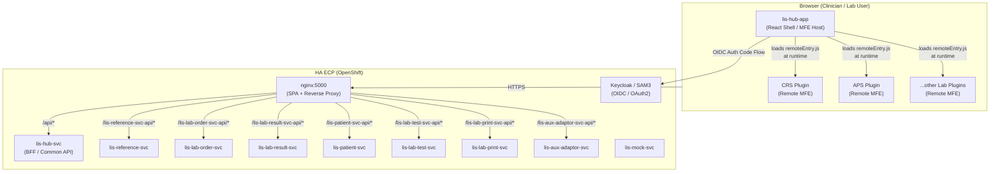

---
tags:
  - architecture
  - LIS
  - ECP
  - micro-frontend
  - microservice
created: '2026-03-06'
status: final
---
# LIS ECP — Micro-Frontend / Micro-Backend Architecture Overview

This document set provides a comprehensive architectural reference for the **LIS Hub Application** (`lis-hub-app`) and its surrounding ecosystem, covering:

| Section | Topic |
|---|---|
| [[01 - System Architecture]] | High-level system topology, repository structure, components |
| [[02 - Micro-Frontend Architecture]] | Module Federation, plugin system, routing, state sharing |
| [[03 - Backend Microservices]] | Service catalogue, communication patterns, auth/authz |
| [[04 - Infrastructure and Deployment]] | Containerisation, CI/CD pipeline, environment management |

---

## System at a Glance

---

## Key Architectural Decisions

| Decision | Choice | Rationale |
|---|---|---|
| Frontend pattern | **Webpack 5 Module Federation** | Runtime plugin loading without full-page reload |
| Shell framework | **React 18 + React Router v6** | SPA with nested routing per plugin |
| State management | **Zustand** | Lightweight, no-boilerplate, selector-based subscriptions |
| API communication | **REST (HTTP POST) via Axios** | Synchronous, uniform contract across all services |
| Identity provider | **Keycloak (SAM3) — OIDC** | Per-lab scoped tokens; silent re-auth on lab switch |
| Container runtime | **OpenShift ECP** | HA enterprise platform; two-cluster (C1/C2) HA topology |
| Build/deploy | **GitHub Actions + Helm** | Centralised `CDRA/workflow-template`; immutable Helm chart |
| Config injection | **nginx startup `sed` + K8s ConfigMap** | Single image, environment-specific behaviour at runtime |
| Private registry | **JFrog Artifactory (air-gapped)** | HA internal; separate dev/rel repos with separate credentials |
