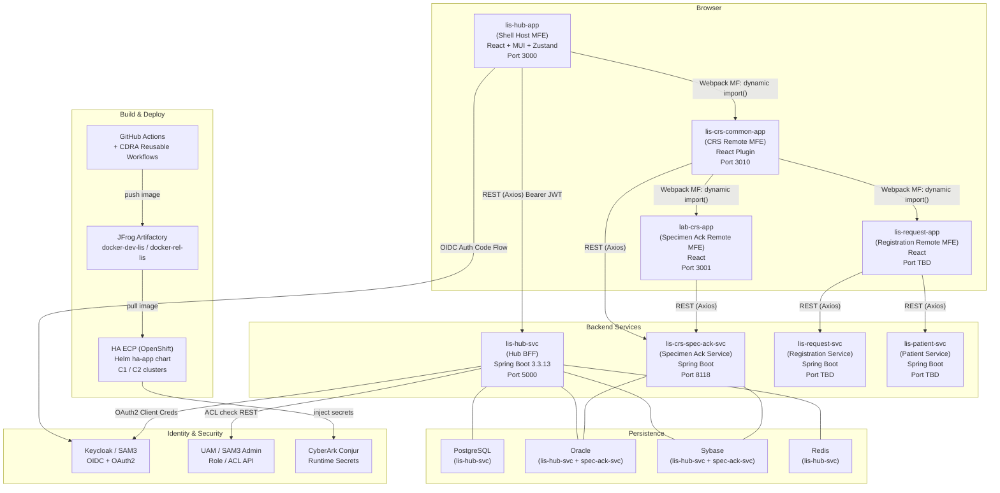

---
tags:
  - architecture
  - LIS
  - ECP
  - CRS
  - micro-frontend
  - microservice
  - overview
created: '2026-03-09'
updated: '2026-03-09'
status: final
---
# 00 — CRS Revamp System Overview

> **Scope:** The `crs-revamp` workspace (`D:\ECPath5_revamp\crs-revamp\`) contains **5 co-located polyrepos** forming the Hospital Authority LIS (Laboratory Information System) — CRS Revamp ecosystem. This document provides a system-at-a-glance reference.

---

## System Map

```mermaid
graph TB
    subgraph "Browser"
        Hub["lis-hub-app\n(Shell Host MFE)\nReact + MUI + Zustand\nPort 3000"]
        CRS["lis-crs-common-app\n(CRS Remote MFE)\nReact Plugin\nPort 3010"]
        LAB["lab-crs-app\n(Specimen Ack Remote MFE)\nReact\nPort 3001"]
        REQ["lis-request-app\n(Registration Remote MFE)\nReact\nPort TBD"]
    end

    subgraph "Backend Services"
        HubSvc["lis-hub-svc\n(Hub BFF)\nSpring Boot 3.3.13\nPort 5000"]
        SpecAck["lis-crs-spec-ack-svc\n(Specimen Ack Service)\nSpring Boot\nPort 8118"]
        ReqSvc["lis-request-svc\n(Registration Service)\nSpring Boot\nPort TBD"]
        PatSvc["lis-patient-svc\n(Patient Service)\nSpring Boot\nPort TBD"]
    end

    subgraph "Persistence"
        PG["PostgreSQL\n(lis-hub-svc)"]
        ORA["Oracle\n(lis-hub-svc + spec-ack-svc)"]
        SYB["Sybase\n(lis-hub-svc + spec-ack-svc)"]
        REDIS["Redis\n(lis-hub-svc)"]
    end

    subgraph "Identity & Security"
        KC["Keycloak / SAM3\nOIDC + OAuth2"]
        UAM["UAM / SAM3 Admin\nRole / ACL API"]
        CYB["CyberArk Conjur\nRuntime Secrets"]
    end

    subgraph "Build & Deploy"
        GH["GitHub Actions\n+ CDRA Reusable Workflows"]
        ART["JFrog Artifactory\ndocker-dev-lis / docker-rel-lis"]
        OCP["HA ECP (OpenShift)\nHelm ha-app chart\nC1 / C2 clusters"]
    end

    Hub -->|"Webpack MF: dynamic import()"| CRS
    CRS -->|"Webpack MF: dynamic import()"| LAB
    CRS -->|"Webpack MF: dynamic import()"| REQ
    Hub -->|"REST (Axios) Bearer JWT"| HubSvc
    CRS -->|"REST (Axios)"| SpecAck
    LAB -->|"REST (Axios)"| SpecAck
    REQ -->|"REST (Axios)"| ReqSvc
    REQ -->|"REST (Axios)"| PatSvc
    Hub -->|"OIDC Auth Code Flow"| KC
    HubSvc -->|"OAuth2 Client Creds"| KC
    HubSvc -->|"ACL check REST"| UAM
    HubSvc --- PG
    HubSvc --- ORA
    HubSvc --- SYB
    HubSvc --- REDIS
    SpecAck --- ORA
    SpecAck --- SYB
    GH -->|"push image"| ART
    ART -->|"pull image"| OCP
    OCP -->|"inject secrets"| CYB
```

---

## Repository Inventory

| Repository | Type | Role | Port | MF / Service Name |
|---|---|---|---|---|
| `lis-hub-app` | React MFE (Shell Host) | Portal shell; loads all lab plugins; owns routing & auth | 3000 | `LisHubAppModule` |
| `lis-crs-common-app` | React MFE (Remote Plugin) | CRS domain screens (spec-ack, registration, APS, BBS) | 3010 | `CRS` (pluginId in cms-manifest) |
| `lab-crs-app` | React MFE (Remote Plugin) | Specimen acknowledgment UI; sub-remote consumed by `lis-crs-common-app` | 3001 | `LabCrsSpecimenApp` |
| `lis-request-app` | React MFE (Remote Plugin) | Registration and request screens; sub-remote consumed by `lis-crs-common-app` | TBD | `LisRequestApp` |
| `lis-hub-svc` | Spring Boot 3.3.13 / Java 17 | Hub BFF; aggregates DBs; full OAuth2/JWT security | 5000 | `LisApplication` |
| `lis-crs-spec-ack-svc` | Spring Boot / Java 17 | CRS domain microservice; specimen ack/registration/search | 8118 | `LisCrsSpecAckSvcApplication` |
| `lis-request-svc` | Spring Boot / Java 17 | Registration and request-related APIs (registration, test validation, default values) | TBD | — |
| `lis-patient-svc` | Spring Boot / Java 17 | Patient-related APIs: HKPMI patient list, LIS patient by HKID, LIS patient by Encounter Number | TBD | — |

---

## Key Architectural Decisions

| Decision | Choice | Rationale |
|---|---|---|
| **MFE framework** | Webpack 5 Module Federation + `@cmschassis/react-spa` plugin lifecycle | No Single-SPA or iframes; runtime URL loading from `hospMFUrl` |
| **Plugin API** | `@cmschassis/cms-js` `ApiContext` / `LisApiContext` | Strict interface boundary; remote MFEs cannot directly import Hub Zustand stores |
| **State management** | Zustand 4.5.1 in Shell; local state in remotes | 10+ Shell stores (manifest, view, command, auth, session, global, preference, patient, correlation, dictionary) |
| **Cross-MFE isolation** | Each plugin creates its own React root + scoped Emotion cache (`key: pluginId.toLowerCase()`) | Prevents CSS class collisions across MFEs |
| **Backend security** | `lis-hub-svc` fully secured (JWT + `ha-spring-boot-starter-security`); `lis-crs-spec-ack-svc` security **disabled** (relies on network isolation) | Asymmetric trust model — BFF acts as gateway |
| **Multi-DB routing** | `DataSourceContextHolder` ThreadLocal routes per-request to PostgreSQL / Oracle / Sybase | No read replicas; thread-local set from `ServiceParameterVo` before each JDBC call |
| **Polyrepo** | 5 independent git repositories sharing a root folder | Each repo has its own CI/CD pipeline and release cycle |
| **Container registry** | JFrog Artifactory `artifactrepo.server.ha.org.hk:55743` | Air-gapped private registry; `docker-dev-lis` (dev) vs `docker-rel-lis` (release) |
| **Orchestration** | HA ECP OpenShift with Helm `ha-app` chart | DEV (C1) → DEVQA → SIT (C1+C2) → LPT (C2) environment chain |
| **Secrets** | CyberArk Conjur injected at pod startup | Base image `openjdk17:ecp-v25.11-openjdk17-17.0.17-conjur-13.0` runs Conjur sidecar |
| **Frontend env injection** | nginx `docker-entrypoint.sh` `sed` rewrites `__PLACEHOLDER_*__` tokens in compiled JS at container start | Decouples build from environment |
| **DB migration** | Sybase → PostgreSQL in progress | `repository/temp/` packages in both backend services |

---

## Technology Stack at a Glance

### Frontend
| Layer | Technology | Version |
|---|---|---|
| Language | TypeScript | ~5.x |
| Framework | React | 18.2.0 |
| Build | CRACO + Webpack 5 | craco 7.1.0 |
| MFE | Webpack ModuleFederationPlugin | Webpack 5 |
| Plugin chassis | `@cmschassis/react-spa`, `@cmschassis/cms-js` | Internal |
| UI components | `@cmschassis/react-ui`, MUI v5 | Internal / v5 |
| State | Zustand | 4.5.1 |
| HTTP | Axios | 1.11.0 |
| Routing | React Router | v6 |
| Shared lib | `@lis/lis-hub-lib` | Internal private NPM |
| Auth client | `keycloak-js` | — |
| Styling | Emotion (scoped per plugin) | — |

### Backend
| Layer | Technology | Version |
|---|---|---|
| Language | Java | 17 |
| Framework | Spring Boot | 3.3.13 (`lis-hub-svc`) |
| Security | `ha-spring-boot-starter-security` | HA internal |
| HTTP client | RestTemplate (synchronous) | Spring 6 |
| ORM | Spring Data JPA + MyBatis | Mixed |
| Databases | PostgreSQL + Oracle + Sybase + Redis | — |
| Cache | Redis | `spring-data-redis` |
| Observability | Micrometer Tracing | — |
| API docs | SpringDoc OpenAPI 3 | — |

---

## Related Notes

- [[01 - System Architecture]] — Polyrepo structure, MF loading chain, environment topology
- [[02 - Micro-Frontend Architecture]] — Plugin lifecycle, routing, state management, command bus
- [[03 - Backend Microservices]] — Spring Boot services, DB routing, auth chain, security asymmetry
- [[04 - Infrastructure and Deployment]] — Dockerfiles, CI/CD pipelines, Helm, env variables, secrets
