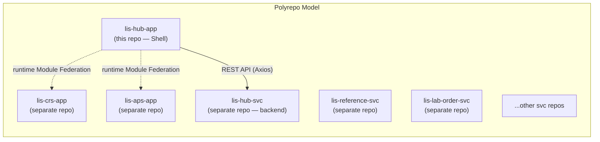
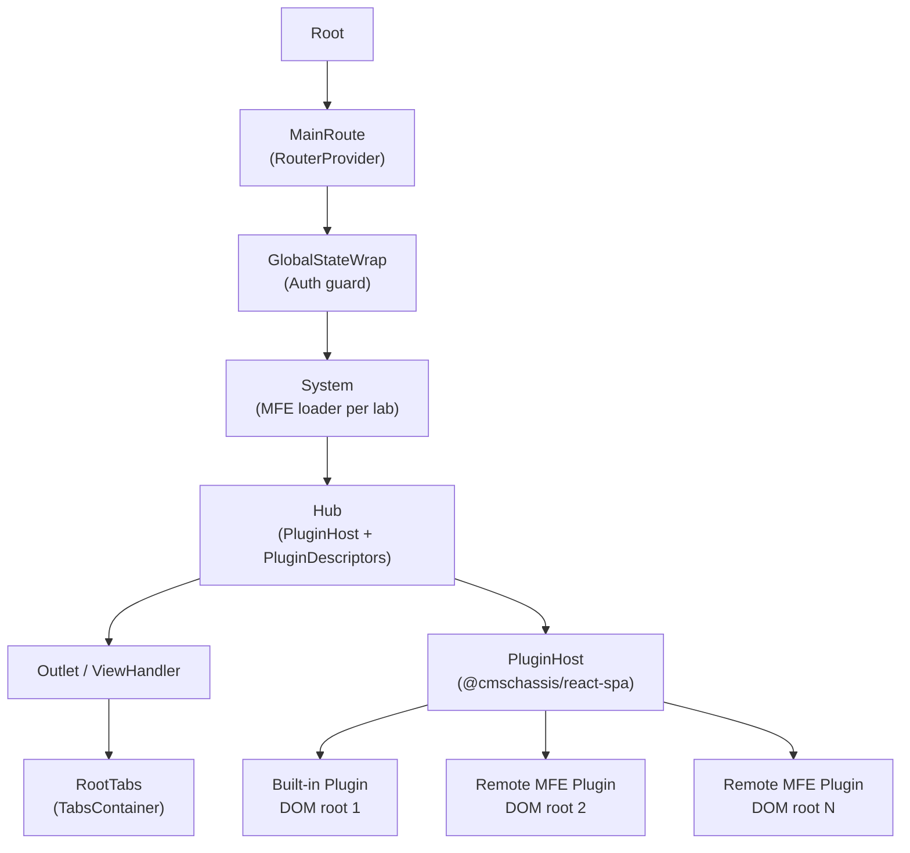
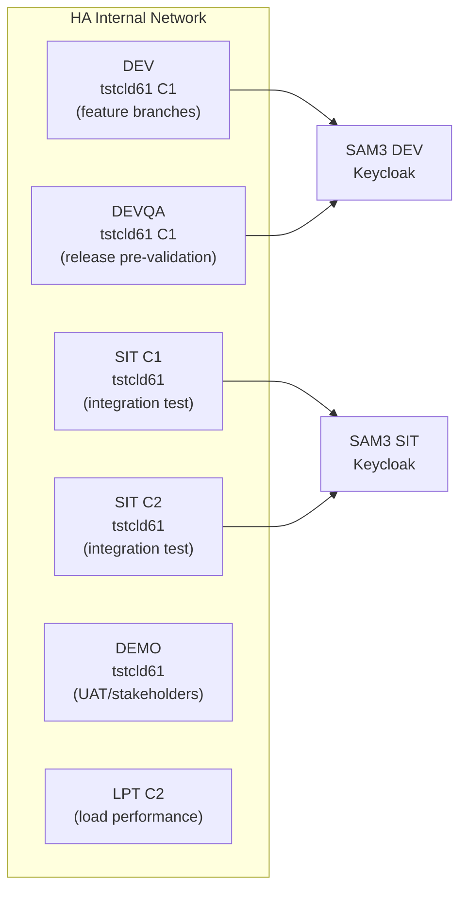

# 01 — System Architecture

## 1.1 Repository Structure

`lis-hub-app` is a **single polyrepo** — not a Monorepo (no Nx, Lerna, Turborepo, or Yarn workspaces). It contains **only the Shell / Host application**. Each lab sub-application (CRS, APS, etc.) lives in a **separate repository** and is referenced at runtime via Module Federation remote entry URLs.



---

## 1.2 Repository Layout

```
lis-hub-app/
├── src/
│   └── modules/
│       ├── api/
│       │   ├── generated/           # Auto-generated Axios API (restful-react)
│       │   │   ├── lis-common-svc.tsx   # 2000+ line contract with lis-hub-svc
│       │   │   └── lis-common-svc-enum.ts
│       │   ├── request/             # Typed service classes (menu, user, dict…)
│       │   └── utils/               # Axios instance + interceptors + error handling
│       ├── components/              # React component tree (Shell UI)
│       │   ├── Hub/                 # Plugin orchestration host
│       │   ├── System/              # Per-lab MFE loader + init sequencer
│       │   ├── Router/              # React Router v6 config
│       │   ├── ViewHandler/         # URL-driven view lifecycle
│       │   ├── RootTabs/            # Tab management for open views
│       │   ├── Auth/                # Keycloak init
│       │   └── ...
│       ├── states/                  # Zustand stores (global, auth, session, …)
│       ├── lis-hub-buildin-plugin/  # Built-in plugin (patient, audit, worksheet)
│       └── lis-js/                  # LisApiContext type definition
├── Dockerfile                       # Production: pre-built artifact → nginx
├── .devops/config/Dockerfile        # CI: two-stage build-then-package
├── nginx-spa.conf                   # nginx SPA + reverse-proxy config
├── craco.config.js                  # Webpack 5 + Module Federation config
├── restful-react.config.js          # API code generation from Swagger
├── localproxy.js                    # Dev-server reverse proxy rules
├── values-DEV.yaml                  # Helm values for DEV environment
├── values-DEVQA.yaml                # Helm values for DEVQA environment
├── values-SIT.yaml                  # Helm values for SIT environment
├── values-DEMO.yaml                 # Helm values for DEMO environment
└── .github/workflows/               # GitHub Actions CI/CD pipelines
```

---

## 1.3 Technology Stack

| Layer | Technology | Version |
|---|---|---|
| Frontend framework | React | 18.2.0 |
| State management | Zustand | 4.5.1 |
| Routing | React Router | 6.18.0 |
| UI components | MUI (Material UI) | 5.14.18 |
| MFE orchestration | Webpack 5 Module Federation | via CRACO 7.1.0 |
| API client | Axios | 1.11.0 |
| Form handling | React Hook Form | 7.48.2 |
| Authentication | keycloak-js | 22.0.5 |
| Internationalisation | i18next / react-i18next | 23.2.3 / 15.4.0 |
| Client-side cache | localforage (IndexedDB) | 1.10.0 |
| CMS Chassis | @cmschassis/react-spa, cms-js, react-ui | internal |
| LIS shared lib | @lis/lis-hub-lib | 0.1.73 |
| HTTP server | Bitnami nginx | 1.16.1 |
| Container orchestration | Red Hat OpenShift (ECP) | — |
| Package registry | JFrog Artifactory | internal |

---

## 1.4 Component Hierarchy



Each plugin view gets its own **independently-rooted React tree** (`createRoot` on a new `<div>`) managed by `useViewStore`. Views are shown/hidden via CSS without unmounting, preserving component state across tab switches.

---

## 1.5 Environment Topology


