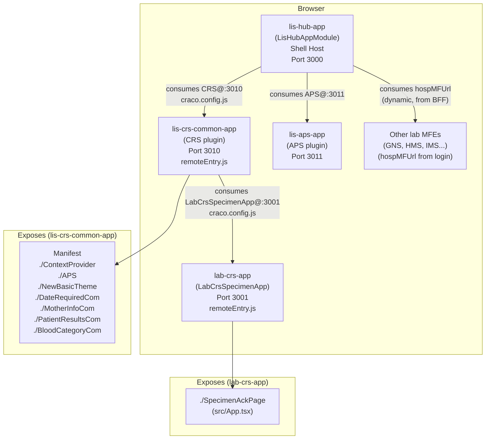
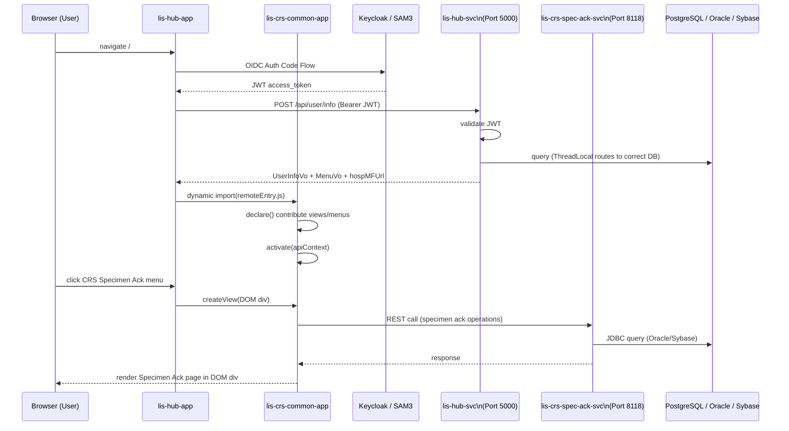
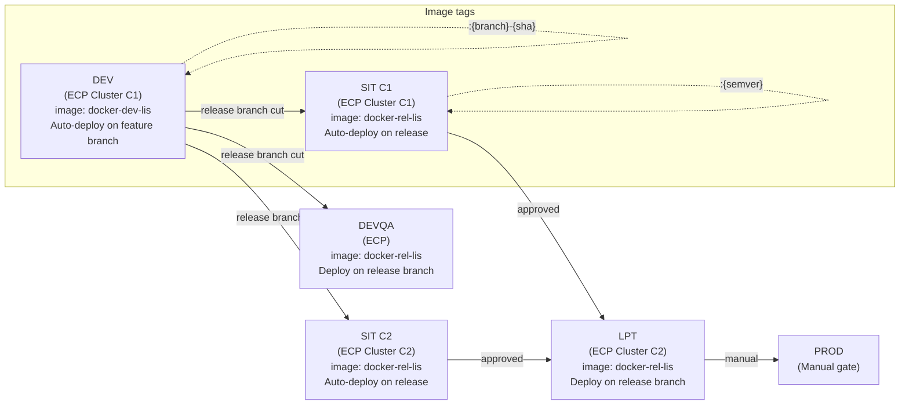

---
tags:
  - architecture
  - LIS
  - ECP
  - CRS
  - system-design
  - polyrepo
created: '2026-03-09'
updated: '2026-03-09'
status: final
---
# 01 — System Architecture

> **Workspace:** `D:\ECPath5_revamp\crs-revamp\` — 5 independent git repositories (polyrepo)

---

## 1.1 Polyrepo Structure

```
crs-revamp/
├── lis-hub-app/              # Shell Host MFE — React SPA portal
│   ├── src/
│   │   ├── index.tsx         # → import('./bootstrap') async MF boundary
│   │   ├── bootstrap.tsx     # Keycloak init → render <App />
│   │   └── modules/
│   │       ├── components/
│   │       │   ├── System/plugins.ts        # local dev URL overrides
│   │       │   ├── Hub/index.tsx            # <PluginHost plugins={...}>
│   │       │   ├── Router/routes-config.tsx # /land/:labCode/:hosCode/:viewId
│   │       │   └── ViewHandler/index.tsx    # resolves viewId → DOM node mount
│   │       └── states/
│   │           ├── manifest-store.ts        # menu / view / command registries
│   │           ├── view/index.ts            # createView() → DOM <div>
│   │           └── command-store.ts         # command bus register/execute
│   ├── .env                  # REACT_APP_PLUGIN_CRS_URL, REACT_APP_PLUGIN_APS_URL
│   ├── .env.local            # REACT_APP_LIS_COMMON_URL → http://lis-chongkw-01:5000
│   ├── localproxy.js         # /api → REACT_APP_LIS_COMMON_URL (dev proxy)
│   └── craco.config.js       # MF: name=LisHubAppModule, consumes CRS@:3010
│
├── lis-crs-common-app/       # CRS Remote Plugin MFE
│   ├── src/
│   │   └── cms-plugin/
│   │       ├── cms-manifest.js              # pluginId="CRS", views, menus
│   │       ├── plugin-manifest.module.ts    # declare() + activate() lifecycle
│   │       ├── view-handler.tsx             # renderReactComponent (scoped Emotion)
│   │       └── cms-api-provider.ts          # singleton CmsInstance(ApiContext)
│   └── craco.config.js       # exposes: Manifest, APS, NewBasicTheme, ...
│                              # consumes: LabCrsSpecimenApp@:3001
│
├── lab-crs-app/              # Specimen Ack Remote MFE (sub-remote)
│   ├── src/
│   │   ├── App.tsx           # exposed as ./SpecimenAckPage
│   │   ├── stores/           # local Zustand/Redux state
│   │   └── generated/        # restful-react generated API client
│   └── craco.config.js       # exposes: ./SpecimenAckPage
│                              # consumes: CRS@http://lis-chongkw-01:3010
│
├── lis-hub-svc/              # Hub BFF — Spring Boot 3.3.13 / Java 17
│   └── src/main/java/hk/org/ha/lis/
│       ├── LisApplication.java
│       ├── config/
│       │   ├── DataSourceContextHolder.java  # ThreadLocal DB routing
│       │   ├── DataSourceAspect.java         # @Around AOP for repo override
│       │   ├── CustomOAuthClientService.java # OAuth2 client credentials
│       │   ├── LisClientResolver.java        # X-HA-ProfileCode header
│       │   ├── RedisConfig.java              # RedisTemplate Jackson serialiser
│       │   └── UamProperties.java            # @ConfigurationProperties uam-config
│       └── service/impl/
│           ├── SecurityServiceImpl.java      # 812-line ACL: isGranted, hasRight
│           └── PasApiServiceImpl.java        # outbound PAS REST proxy
│
└── lis-crs-spec-ack-svc/     # CRS Domain Service — Spring Boot / Java 17
    └── src/main/java/hk/org/ha/lis/crs/
        ├── LisCrsSpecAckSvcApplication.java
        └── controller/
            ├── CrsSpecAckController.java     # 891 lines — main spec-ack
            ├── CrsRegController.java         # 289 lines — registration
            ├── CrsSearchController.java
            ├── CrsSearchAuditController.java
            ├── CrsAmendRequestController.java
            ├── CrsDftRegController.java
            └── CrsMaintController.java
```

---

## 1.2 Module Federation Loading Chain


```mermaid
graph TB
    subgraph Browser
        Hub["lis-hub-app\n(LisHubAppModule)\nShell Host\nPort 3000"]
        CRS["lis-crs-common-app\n(CRS plugin)\nPort 3010\nremoteEntry.js"]
        LAB["lab-crs-app\n(LabCrsSpecimenApp)\nPort 3001\nremoteEntry.js"]
        APS["lis-aps-app\n(APS plugin)\nPort 3011"]
        OTHERS["Other lab MFEs\n(GNS, HMS, IMS...)\n(hospMFUrl from login)"]
    end

    Hub -->|"consumes CRS@:3010\ncraco.config.js"| CRS
    Hub -->|"consumes APS@:3011"| APS
    Hub -->|"consumes hospMFUrl\n(dynamic, from BFF)"| OTHERS
    CRS -->|"consumes LabCrsSpecimenApp@:3001\ncraco.config.js"| LAB

    subgraph "Exposes (lis-crs-common-app)"
        E1["Manifest\n./ContextProvider\n./APS\n./NewBasicTheme\n./DateRequiredCom\n./MotherInfoCom\n./PatientResultsCom\n./BloodCategoryCom"]
    end

    subgraph "Exposes (lab-crs-app)"
        E2["./SpecimenAckPage\n(src/App.tsx)"]
    end

    CRS --> E1
    LAB --> E2
```

---

## 1.3 Request Flow


```mermaid
sequenceDiagram
    participant U as Browser (User)
    participant Hub as lis-hub-app
    participant CRS as lis-crs-common-app
    participant KC as Keycloak / SAM3
    participant HubSvc as lis-hub-svc\n(Port 5000)
    participant SpecAck as lis-crs-spec-ack-svc\n(Port 8118)
    participant DB as PostgreSQL / Oracle / Sybase

    U->>Hub: navigate /
    Hub->>KC: OIDC Auth Code Flow
    KC-->>Hub: JWT access_token
    Hub->>HubSvc: POST /api/user/info (Bearer JWT)
    HubSvc->>HubSvc: validate JWT
    HubSvc->>DB: query (ThreadLocal routes to correct DB)
    HubSvc-->>Hub: UserInfoVo + MenuVo + hospMFUrl

    Hub->>CRS: dynamic import(remoteEntry.js)
    CRS->>CRS: declare() contribute views/menus
    CRS->>CRS: activate(apiContext)
    U->>Hub: click CRS Specimen Ack menu
    Hub->>CRS: createView(DOM div)
    CRS->>SpecAck: REST call (specimen ack operations)
    SpecAck->>DB: JDBC query (Oracle/Sybase)
    SpecAck-->>CRS: response
    CRS-->>U: render Specimen Ack page in DOM div
```

---

## 1.4 Technology Stack by Layer

| Layer | Technology | Key Version | Repo |
|---|---|---|---|
| Frontend language | TypeScript | ~5.x | All frontend |
| UI framework | React | 18.2.0 | All frontend |
| MFE build | CRACO + Webpack 5 | craco 7.1.0 | All frontend |
| MFE runtime | Webpack ModuleFederationPlugin | Webpack 5 | All frontend |
| Plugin chassis | `@cmschassis/react-spa` + `@cmschassis/cms-js` | Internal | hub + crs-common |
| UI components | `@cmschassis/react-ui` + MUI v5 | Internal / v5 | All frontend |
| State | Zustand | 4.5.1 | All frontend |
| HTTP client (FE) | Axios | 1.11.0 | All frontend |
| Routing | React Router v6 | v6 | lis-hub-app |
| Auth client | `keycloak-js` | — | lis-hub-app |
| Styling | Emotion CSS-in-JS (scoped) | — | All frontend |
| Shared lib | `@lis/lis-hub-lib` | Internal | crs-common, lab-crs |
| API gen | `restful-react` | — | lab-crs-app |
| Backend language | Java | 17 | Both backends |
| Backend framework | Spring Boot | 3.3.13 | lis-hub-svc |
| Security | `ha-spring-boot-starter-security` | HA internal | lis-hub-svc ONLY |
| HTTP client (BE) | RestTemplate (synchronous) | Spring 6 | lis-hub-svc |
| ORM | Spring Data JPA + MyBatis | Mixed | Both backends |
| Cache | Redis (`spring-data-redis`) | — | lis-hub-svc |
| Tracing | Micrometer Tracing | — | Both backends |
| DB (primary) | PostgreSQL | — | lis-hub-svc |
| DB (legacy) | Oracle | — | Both backends |
| DB (legacy) | Sybase (`jtds 1.2.2`) | — | Both backends |
| Container | Docker (multi-stage) | — | All repos |
| Orchestration | OpenShift (HA ECP) + Helm `ha-app` | — | All repos |
| CI/CD | GitHub Actions + CDRA reusable templates | v1.6.1 | All repos |
| Registry | JFrog Artifactory | — | All repos |
| Secrets | CyberArk Conjur | conjur-13.0 | All repos |

---

## 1.5 Environment Topology


```mermaid
graph LR
    DEV["DEV\n(ECP Cluster C1)\nimage: docker-dev-lis\nAuto-deploy on feature branch"]
    DEVQA["DEVQA\n(ECP)\nimage: docker-rel-lis\nDeploy on release branch"]
    SIT1["SIT C1\n(ECP Cluster C1)\nimage: docker-rel-lis\nAuto-deploy on release"]
    SIT2["SIT C2\n(ECP Cluster C2)\nimage: docker-rel-lis\nAuto-deploy on release"]
    LPT["LPT\n(ECP Cluster C2)\nimage: docker-rel-lis\nDeploy on release branch"]
    PROD["PROD\n(Manual gate)"]

    DEV -->|"release branch cut"| DEVQA
    DEV -->|"release branch cut"| SIT1
    DEV -->|"release branch cut"| SIT2
    SIT1 -->|"approved"| LPT
    SIT2 -->|"approved"| LPT
    LPT -->|"manual"| PROD

    subgraph "Image tags"
        DEV -.->|":{branch}-{sha}"| DEV
        SIT1 -.->|":{semver}"| SIT1
    end
```

### Environment Configuration Files

Each repo has separate Helm values files:
- `values-DEV.yaml` — Dev environment; `docker-dev-lis` image repo; `monitoring.enable: true`
- `values-SIT.yaml` — SIT environment; `docker-rel-lis` image repo; same secrets structure

---

## 1.6 Security Asymmetry — Key Architecture Finding

```mermaid
graph LR
    Browser["Browser\n(lis-hub-app)"] -->|"Bearer JWT"| HubSvc
    CRS["CRS Plugin"] -->|"No auth header\n(relies on network)"| SpecAck

    subgraph "lis-hub-svc (SECURED)"
        SEC["ha-spring-boot-starter-security\nOAuth2 Resource Server\nJWT validation\nCustomOAuthClientService\nSecurityServiceImpl (812 lines ACL)"]
    end

    subgraph "lis-crs-spec-ack-svc (UNSECURED)"
        NOSEC["ha-spring-boot-starter-security\nCOMMENTED OUT in pom.xml\n@CrossOrigin(origins = \"*\")\nNetwork isolation only"]
    end

    HubSvc --> SEC
    SpecAck --> NOSEC
```

> **⚠️ Security Note:** `lis-crs-spec-ack-svc` has `ha-spring-boot-starter-security` **commented out** in its `pom.xml`. All endpoints are wide-open (`@CrossOrigin(origins = "*")`). Security relies entirely on Kubernetes network policies preventing external access. Only `lis-hub-svc` performs JWT validation and ACL enforcement.
