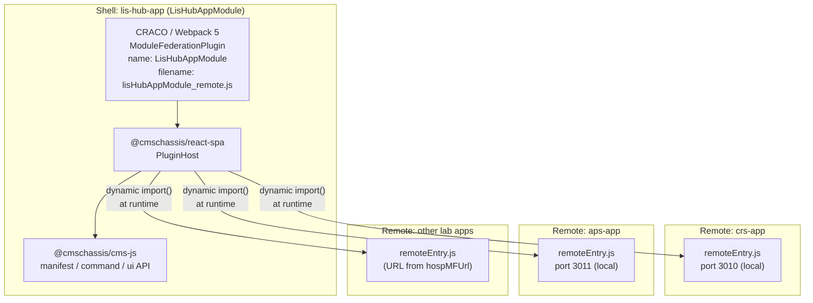
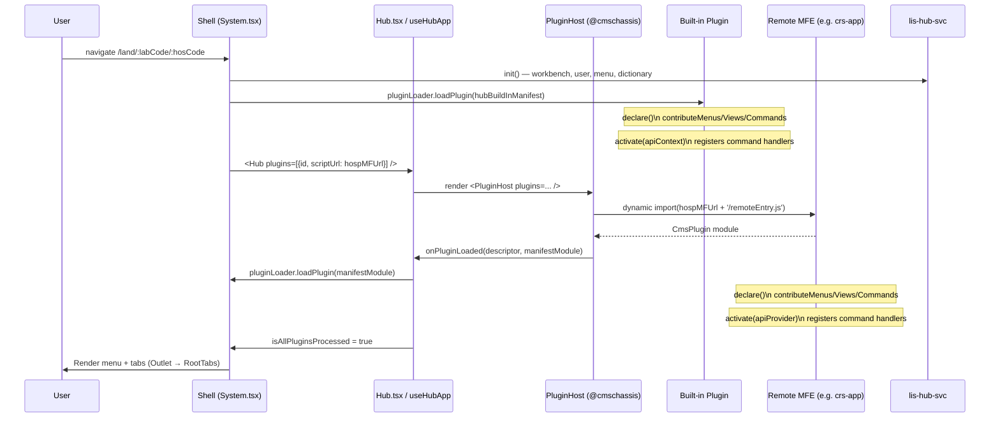
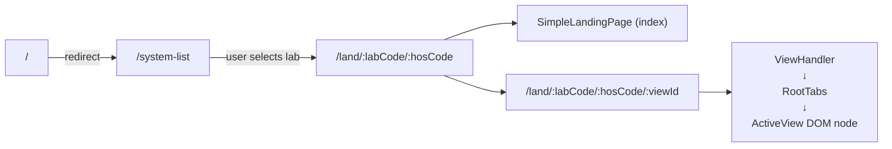
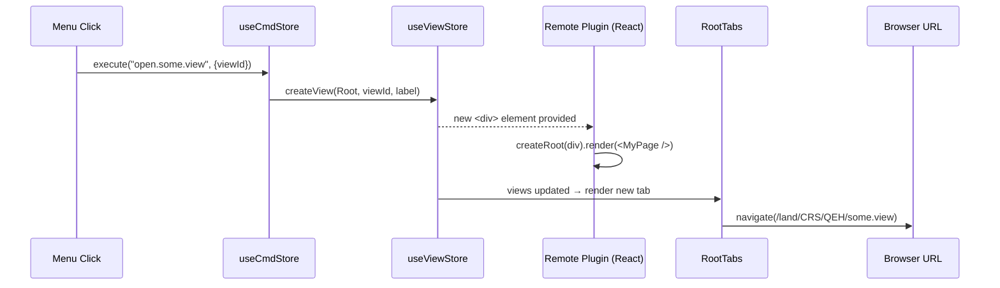
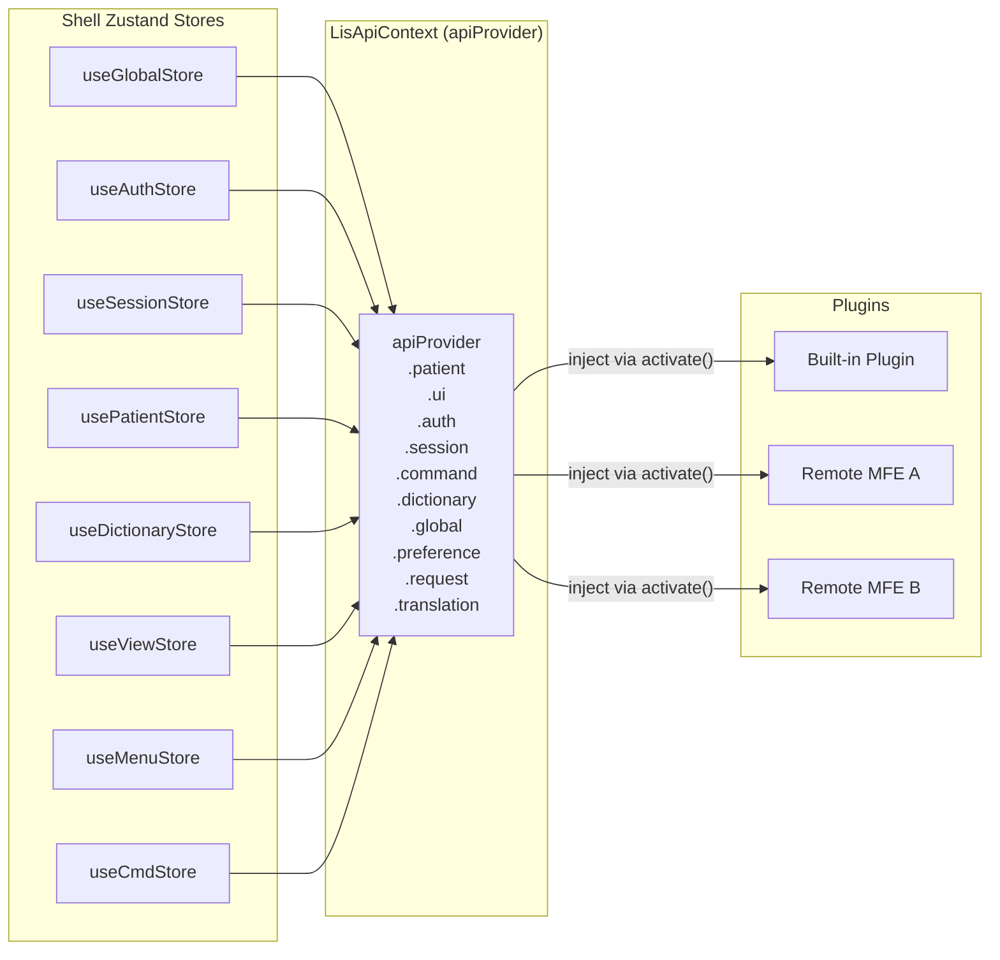
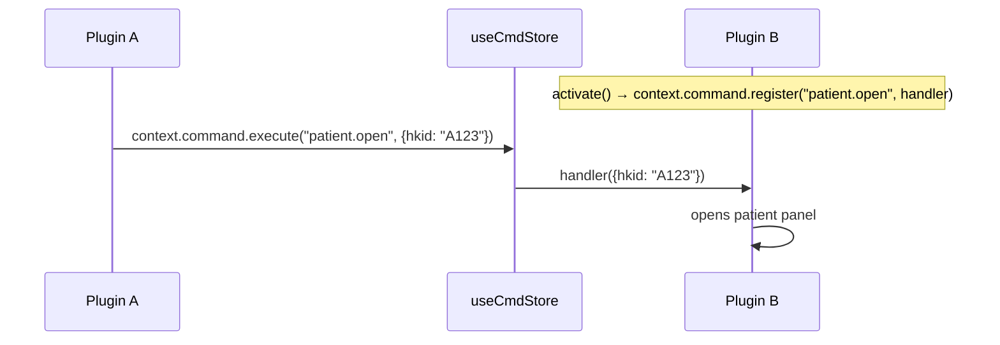
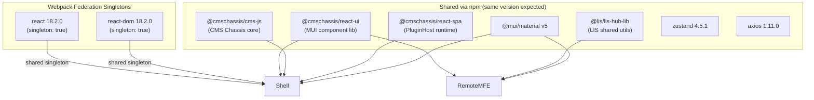

# 02 — Micro-Frontend Architecture

## 2.1 Orchestration Framework

The system uses **Webpack 5 Module Federation** configured via **CRACO** (`@craco/craco`). There is no Single-SPA, iframes, or alternative MFE framework. The `@cmschassis/react-spa` chassis library wraps the low-level federation mechanics into a plugin lifecycle (`PluginHost`, `PluginDescriptor`, `loadPlugin`).



**nginx cache-bust rule** in `nginx-spa.conf` always serves `remoteEntry.js` with `no-store, no-cache` headers — ensuring remote updates are picked up on next browser load.

---

## 2.2 Host and Remotes

| Role | Application | Federation Name | Entry |
|---|---|---|---|
| **Host / Shell** | `lis-hub-app` | `LisHubAppModule` | `lisHubAppModule_remote.js` |
| **Built-in Plugin** | `lis-hub-buildin-plugin` | (bundled) | loaded synchronously before remotes |
| **Remote: CRS** | `lis-crs-app` | set by remote | `remoteEntry.js` (port 3010 local) |
| **Remote: APS** | `lis-aps-app` | set by remote | `remoteEntry.js` (port 3011 local) |
| **Remote: Others** | CPS, GNS, HMS, IMS, SOS, TIS, TRL, VRS, BBNK, MICRO | set by remote | `hospMFUrl` from `Sam3LisApplicationVo` |

Remote URLs are **fully dynamic**: after login, `lis-hub-svc` returns `hospMFUrl` per lab-hospital pair in `Sam3LisApplicationVo`. This URL is stored in `useGlobalStore.hospMFUrl` and passed to `PluginHost` — meaning no remote URL is hardcoded in the build.

---

## 2.3 Plugin Lifecycle



---

## 2.4 Routing Strategy

The shell owns **all routing** via React Router v6. Remote MFEs do **not** have their own router.



**How URL-to-view resolution works:**

1. User clicks a menu item → `useCmdStore.execute(commandId)`
2. Command handler calls `useViewStore.createView(viewGroupId, viewId, label)` which creates a raw `<div>` DOM node
3. The remote plugin mounts its React app into that `<div>` via `createRoot`
4. `useViewStore` adds the view to `rootViewGroup.views`
5. React Router updates URL to `/land/:labCode/:hosCode/:viewId`
6. `RootTabs` renders all open views; the active one is shown, others remain mounted (hidden via CSS)



---

## 2.5 Cross-MFE State Sharing & Communication

### Three mechanisms used concurrently:

#### A. `LisApiContext` — Official Plugin API Contract

The shell constructs `apiProvider` and injects it via `plugin.activate(context)`. Remote MFEs **only** access shell state through this typed interface — direct Zustand store access is forbidden.



Key namespaces on `LisApiContext`:

| Namespace | Purpose |
|---|---|
| `context.patient` | Patient selection, switching, HKID lookup |
| `context.ui` | Open/close views, menus, MessageBox, loading spinner |
| `context.auth` | Auth state, user roles, access rights |
| `context.session` | Hospital, workstation, user login ID |
| `context.command` | `register(id, fn)` + `execute(id, arg)` — command bus |
| `context.dictionary` | LIS data dictionaries (cached in IndexedDB) |
| `context.global` | Lab API URL, service params, profile code |
| `context.preference` | Theme, language settings |
| `context.request` | Configured Axios instance |
| `context.translation` | i18n function |
| `context.globalRequest` | Pre-wired error-handling request wrapper |

#### B. `window.$lisHubApp` — Global Object Bridge

For legacy sub-systems or packages unable to consume Module Federation directly:

```typescript
window.$lisHubApp = {
  api: { checkHkid, selectAccessRight, MessageBoxApi, ... },
  getServiceParams(),
  getDictionary(), subscribeTheme(), subscribeLanguage(),
  getToken(), getProfileCode(), getCorrelation(),
  request, securityUtils, libHubComUtils, useCommonHooks,
  getViewStore()
}
```

#### C. Command Bus (`useCmdStore.execute`)

Any plugin or the shell can invoke cross-MFE actions without direct imports:



---

## 2.6 Shared Dependencies


