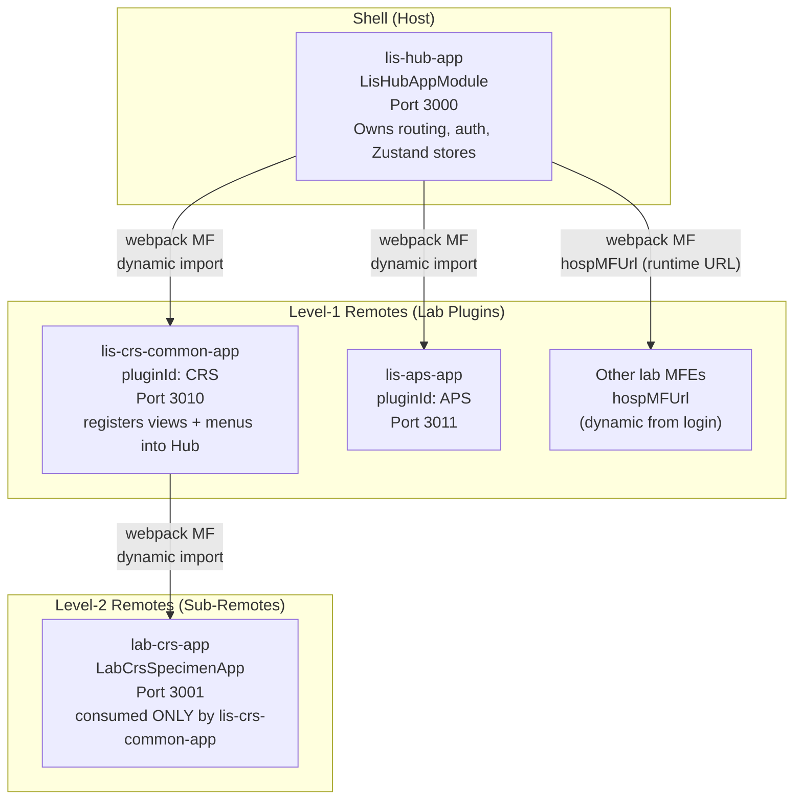
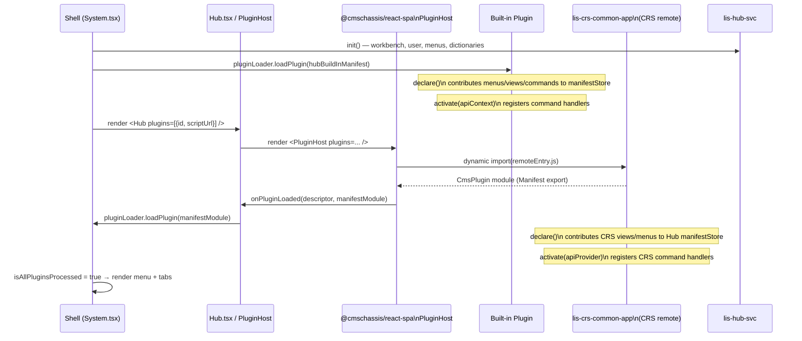
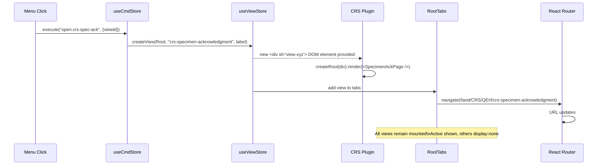
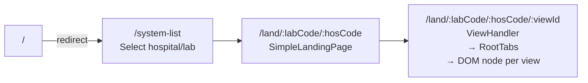
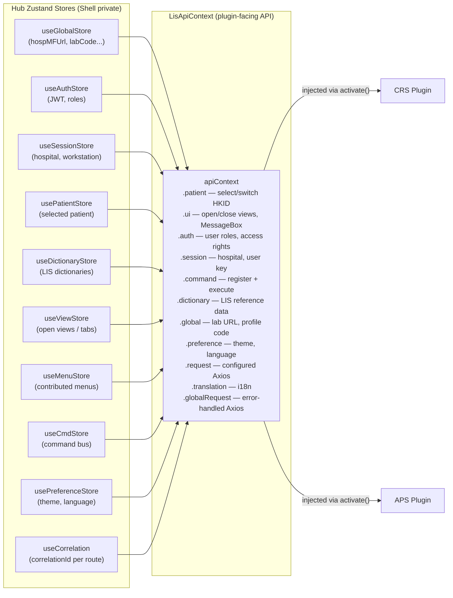
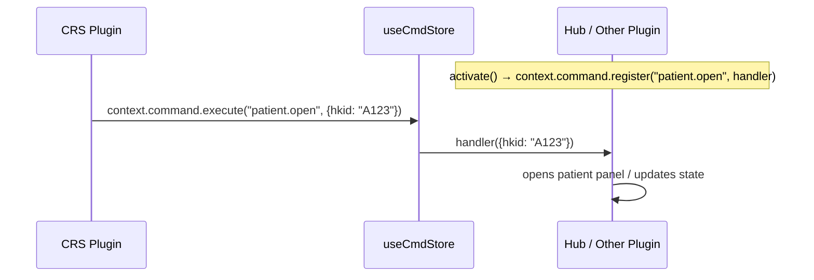
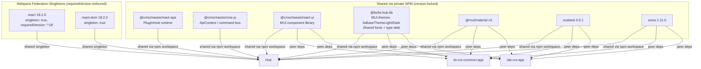
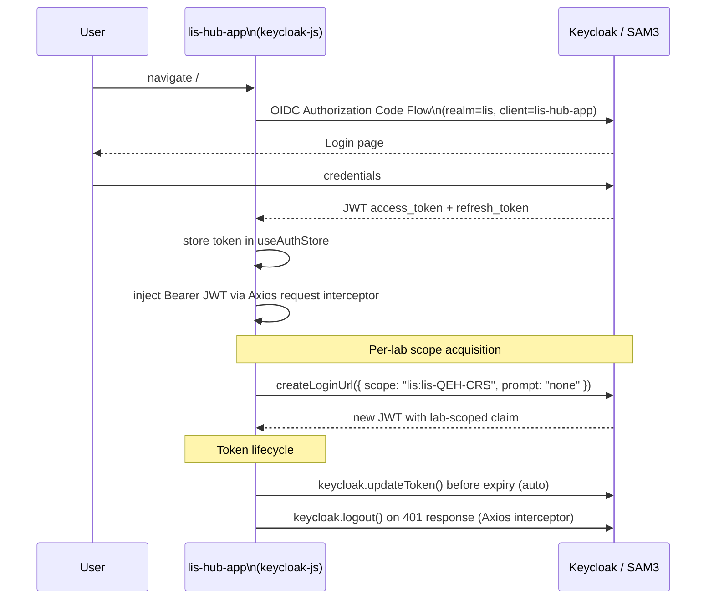

# 02 — Micro-Frontend Architecture

> **Framework:** Webpack 5 Module Federation + `@cmschassis/react-spa` plugin lifecycle. No Single-SPA, iframes, or other MFE frameworks.

---

## 2.1 Host / Remote Hierarchy


```mermaid
graph TB
    subgraph "Shell (Host)"
        Hub["lis-hub-app\nLisHubAppModule\nPort 3000\nOwns routing, auth, Zustand stores"]
    end

    subgraph "Level-1 Remotes (Lab Plugins)"
        CRS["lis-crs-common-app\npluginId: CRS\nPort 3010\nregisters views + menus into Hub"]
        APS["lis-aps-app\npluginId: APS\nPort 3011"]
        DYN["Other lab MFEs\nhospMFUrl\n(dynamic from login)"]
    end

    subgraph "Level-2 Remotes (Sub-Remotes)"
        LAB["lab-crs-app\nLabCrsSpecimenApp\nPort 3001\nconsumed ONLY by lis-crs-common-app"]
    end

    Hub -->|"webpack MF\ndynamic import"| CRS
    Hub -->|"webpack MF\ndynamic import"| APS
    Hub -->|"webpack MF\nhospMFUrl (runtime URL)"| DYN
    CRS -->|"webpack MF\ndynamic import"| LAB
```

### Federation Configuration

| App | MF Name | Exposes | Consumes |
|---|---|---|---|
| `lis-hub-app` | `LisHubAppModule` | `lisHubAppModule_remote.js` (self) | `CRS@:3010`, `APS@:3011`, `hospMFUrl` |
| `lis-crs-common-app` | _(pluginId=CRS)_ | `Manifest`, `./ContextProvider`, `./APS`, `./NewBasicTheme`, `./DateRequiredCom`, `./MotherInfoCom`, `./PatientResultsCom`, `./BloodCategoryCom` | `LabCrsSpecimenApp@:3001` |
| `lab-crs-app` | `LabCrsSpecimenApp` | `./SpecimenAckPage` (src/App.tsx) | `CRS@:3010` |

**nginx cache-bust rule:** `nginx-spa.conf` serves `remoteEntry.js` with `Cache-Control: no-store, no-cache` — ensures remote updates are picked up on next browser load without stale JS.

---

## 2.2 Plugin Lifecycle (`@cmschassis/react-spa`)


```mermaid
sequenceDiagram
    participant Shell as Shell (System.tsx)
    participant HC as Hub.tsx / PluginHost
    participant PH as @cmschassis/react-spa\nPluginHost
    participant BIP as Built-in Plugin
    participant Remote as lis-crs-common-app\n(CRS remote)
    participant API as lis-hub-svc

    Shell->>API: init() — workbench, user, menus, dictionaries
    Shell->>BIP: pluginLoader.loadPlugin(hubBuildInManifest)
    Note over BIP: declare()\n contributes menus/views/commands to manifestStore
    Note over BIP: activate(apiContext)\n registers command handlers
    Shell->>HC: render <Hub plugins=[{id, scriptUrl}] />
    HC->>PH: render <PluginHost plugins=... />
    PH->>Remote: dynamic import(remoteEntry.js)
    Remote-->>PH: CmsPlugin module (Manifest export)
    PH->>HC: onPluginLoaded(descriptor, manifestModule)
    HC->>Shell: pluginLoader.loadPlugin(manifestModule)
    Note over Remote: declare()\n contributes CRS views/menus to Hub manifestStore
    Note over Remote: activate(apiProvider)\n registers CRS command handlers
    Shell->>Shell: isAllPluginsProcessed = true → render menu + tabs
```

### `cms-manifest.js` Structure (lis-crs-common-app)

```javascript
// src/cms-plugin/cms-manifest.js
export default {
  pluginId: "CRS",
  views: [
    { id: "crs-specimen-acknowledgment", menuRoute: "SpecimenAck", ... },
    { id: "crs-registration",            menuRoute: "Registration", ... },
    // ...
  ],
  menus: [ ... ],
  commands: [ ... ]
}
```

### `plugin-manifest.module.ts` Lifecycle

```typescript
// declare() — called once at plugin load
declare(manifest, cms) {
  manifest.views.forEach(view => cms.api.manifest.contributeView(view))
  manifest.menus.forEach(menu => cms.api.manifest.contributeMenu(menu))
}

// activate() — called after all plugins declare()
activate(cms) {
  manifest.views.forEach(view => {
    cms.api.ui.onWillDisplayView(view.id, (container) => {
      const Component = await loadComponent(view.menuRoute)  // dynamic import
      renderReactComponent(container, <Component />)
    })
  })
}
```

---

## 2.3 View Display & DOM Isolation

### How `ViewHandler` + `createView` Works


```mermaid
sequenceDiagram
    participant User as Menu Click
    participant CmdStore as useCmdStore
    participant ViewStore as useViewStore
    participant Plugin as CRS Plugin
    participant RootTabs as RootTabs
    participant Router as React Router

    User->>CmdStore: execute("open.crs.spec-ack", {viewId})
    CmdStore->>ViewStore: createView(Root, "crs-specimen-acknowledgment", label)
    ViewStore-->>Plugin: new <div id="view-xyz"> DOM element provided
    Plugin->>Plugin: createRoot(div).render(<SpecimenAckPage />)
    ViewStore->>RootTabs: add view to tabs
    RootTabs->>Router: navigate(/land/CRS/QEH/crs-specimen-acknowledgment)
    Router->>Router: URL updates
    Note over RootTabs: All views remain mounted\nActive shown, others display:none
```

**Key insight:** Views are **never unmounted** — switching tabs hides via CSS rather than unmounting React trees. This preserves unsaved form state but increases DOM memory footprint.

### `renderReactComponent` — Scoped Emotion Cache

```typescript
// src/cms-plugin/view-handler.tsx
function renderReactComponent(container: HTMLElement, Component: React.FC) {
  const cache = createCache({ key: "crs" })  // pluginId.toLowerCase()
  const root = createRoot(container)
  root.render(
    <CacheProvider value={cache}>
      <ContextProvider>
        <Component />
      </ContextProvider>
    </CacheProvider>
  )
}
```

- **Scoped Emotion cache** (`key: "crs"`) prevents CSS class name collisions with Hub or other plugins
- Each plugin has its own React root — fully isolated rendering tree
- `renderReactComponentWithRoute()` variant wraps with `MemoryRouter` for plugin-internal routing

---

## 2.4 URL Routing Strategy

The **Shell owns all routing** via React Router v6. Remote MFEs do not have their own router (use MemoryRouter if needed for internal navigation).


```mermaid
graph LR
    A["/"] -->|"redirect"| B["/system-list\nSelect hospital/lab"]
    B --> C["/land/:labCode/:hosCode\nSimpleLandingPage"]
    C --> D["/land/:labCode/:hosCode/:viewId\nViewHandler\n→ RootTabs\n→ DOM node per view"]
```

**Route parameter semantics:**
| Parameter | Example | Source |
|---|---|---|
| `:labCode` | `CRS` | Selected lab application code |
| `:hosCode` | `QEH` | Selected hospital code |
| `:viewId` | `crs-specimen-acknowledgment` | View ID from `manifestStore` |

---

## 2.5 Cross-MFE State & Communication

### A. `LisApiContext` — Official Plugin API

Plugins receive `apiContext` via `activate(cms)`. Direct Zustand store imports are forbidden.


```mermaid
graph LR
    subgraph "Hub Zustand Stores (Shell private)"
        G["useGlobalStore\n(hospMFUrl, labCode...)"]
        A["useAuthStore\n(JWT, roles)"]
        S["useSessionStore\n(hospital, workstation)"]
        P["usePatientStore\n(selected patient)"]
        D["useDictionaryStore\n(LIS dictionaries)"]
        V["useViewStore\n(open views / tabs)"]
        M["useMenuStore\n(contributed menus)"]
        C["useCmdStore\n(command bus)"]
        Pref["usePreferenceStore\n(theme, language)"]
        Corr["useCorrelation\n(correlationId per route)"]
    end

    subgraph "LisApiContext (plugin-facing API)"
        API["apiContext\n.patient — select/switch HKID\n.ui — open/close views, MessageBox\n.auth — user roles, access rights\n.session — hospital, user key\n.command — register + execute\n.dictionary — LIS reference data\n.global — lab URL, profile code\n.preference — theme, language\n.request — configured Axios\n.translation — i18n\n.globalRequest — error-handled Axios"]
    end

    G & A & S & P & D & V & M & C & Pref & Corr --> API
    API -->|"injected via activate()"| Plugin1["CRS Plugin"]
    API -->|"injected via activate()"| Plugin2["APS Plugin"]
```

### B. Command Bus (`useCmdStore`)


```mermaid
sequenceDiagram
    participant PA as CRS Plugin
    participant CS as useCmdStore
    participant PB as Hub / Other Plugin

    Note over PB: activate() → context.command.register("patient.open", handler)
    PA->>CS: context.command.execute("patient.open", {hkid: "A123"})
    CS->>PB: handler({hkid: "A123"})
    PB->>PB: opens patient panel / updates state
```

### C. `window.$lisHubApp` — Global Bridge (legacy compatibility)

For packages that cannot consume Module Federation:

```typescript
window.$lisHubApp = {
  api: { checkHkid, selectAccessRight, MessageBoxApi, ... },
  getServiceParams(), getDictionary(), subscribeTheme(), subscribeLanguage(),
  getToken(), getProfileCode(), getCorrelation(),
  request, securityUtils, libHubComUtils, useCommonHooks, getViewStore()
}
```

---

## 2.6 Shared Dependencies & Singleton Management


```mermaid
graph TB
    subgraph "Webpack Federation Singletons (requiredVersion enforced)"
        R["react 18.2.0\nsingleton: true, requiredVersion: '^18'"]
        RD["react-dom 18.2.0\nsingleton: true"]
    end

    subgraph "Shared via private NPM (version-locked)"
        RSPA["@cmschassis/react-spa\nPluginHost runtime"]
        CMS["@cmschassis/cms-js\nApiContext / command bus"]
        CUI["@cmschassis/react-ui\nMUI component library"]
        LIB["@lis/lis-hub-lib\nMUI themes: lisBaseThemeLight/Dark\nShared fonts + type defs"]
        MUI["@mui/material v5"]
        ZU["zustand 4.5.1"]
        AX["axios 1.11.0"]
    end

    R & RD -->|"shared singleton"| Hub
    RSPA & CMS & CUI & LIB & MUI & ZU & AX -->|"shared via npm workspace"| Hub
    LIB & CUI & MUI & ZU & AX -->|"peer deps"| CRS["lis-crs-common-app"]
    LIB & CUI & MUI & ZU & AX -->|"peer deps"| LAB["lab-crs-app"]
```

**`@lis/lis-hub-lib`** (private npm, `@lis` scope — JFrog Artifactory) contains:
- `lisBaseThemeLight` / `lisBaseThemeDark` — MUI v5 theme objects
- Shared custom fonts
- Shared TypeScript type definitions for LIS domain objects

---

## 2.7 Zustand Store Catalog (Shell)

| Store | File | Purpose |
|---|---|---|
| `useManifestStore` | `manifest-store.ts` | Registry of contributed views, menus, commands from all plugins |
| `useViewStore` | `view/index.ts` | Open view tabs; `createView()` creates DOM `<div>`; `onWillDisplayView` callback |
| `useCommandStore` | `command-store.ts` | Command bus: `register(id, fn)` + `execute(id, arg)` |
| `useAuthStore` | `auth-store.ts` | JWT token, Keycloak instance, user roles, access rights |
| `useSessionStore` | `session-store.ts` | Hospital code, workstation, active lab, logged-in user |
| `useGlobalStore` | `global-store.ts` | `hospMFUrl`, `labCode`, service parameters, API base URLs |
| `usePatientStore` | `patient-store.ts` | Selected patient HKID, encounter, patient panel state |
| `usePreferenceStore` | `preference-store.ts` | Theme (light/dark), language setting |
| `useCorrelation` | `correlation-store.ts` | `correlationId` per route (injected in every Axios request header) |
| `useDictionaryStore` | `dictionary-store.ts` | LIS reference dictionaries cached in IndexedDB via `localforage` |

---

## 2.8 Auth Flow in Frontend


```mermaid
sequenceDiagram
    participant U as User
    participant Hub as lis-hub-app\n(keycloak-js)
    participant KC as Keycloak / SAM3

    U->>Hub: navigate /
    Hub->>KC: OIDC Authorization Code Flow\n(realm=lis, client=lis-hub-app)
    KC-->>U: Login page
    U->>KC: credentials
    KC-->>Hub: JWT access_token + refresh_token
    Hub->>Hub: store token in useAuthStore
    Hub->>Hub: inject Bearer JWT via Axios request interceptor

    Note over Hub,KC: Per-lab scope acquisition
    Hub->>KC: createLoginUrl({ scope: "lis:lis-QEH-CRS", prompt: "none" })
    KC-->>Hub: new JWT with lab-scoped claim

    Note over Hub: Token lifecycle
    Hub->>KC: keycloak.updateToken() before expiry (auto)
    Hub->>KC: keycloak.logout() on 401 response (Axios interceptor)
```

### Axios Request Interceptor Headers

| Header | Value | Purpose |
|---|---|---|
| `Authorization` | `Bearer {JWT}` | User identity |
| `X-HA-ProfileCode` | `{profileCode}` | Hospital profile routing in BFF |
| `ServiceParameterVo.*` | `serverName, serverLab, hospital, userKey, functionId` | Multi-tenant DB routing |
| `correlationId` | Per-route UUID | Distributed tracing |
| `transactionId` | Per-request UUID | Request-level tracing |
