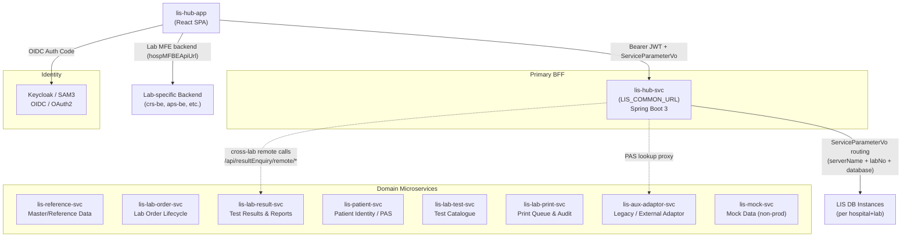
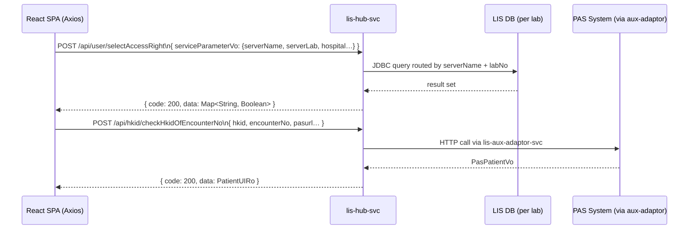
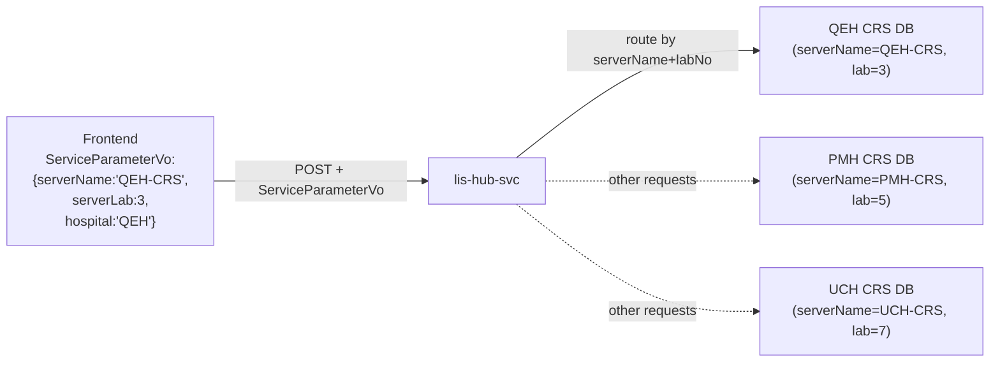
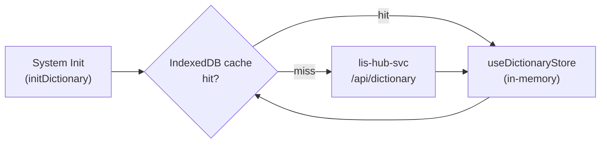
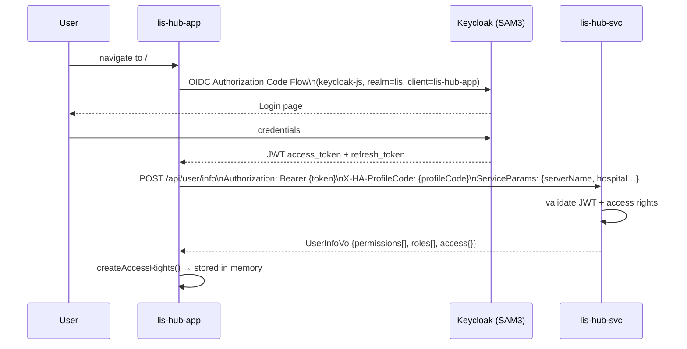
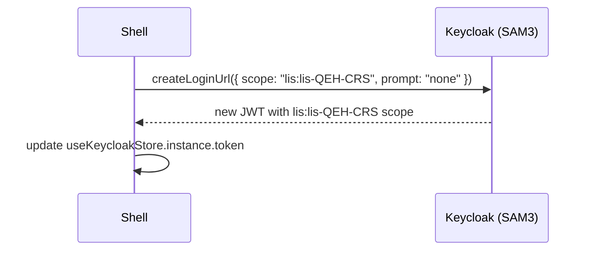
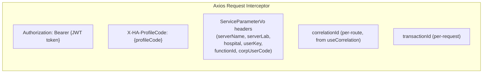

# 03 — Backend Microservices

> **Note:** `lis-hub-app` is a frontend-only repository. All backend analysis is inferred from API contracts (`lis-common-svc.tsx`), Swagger configuration, environment wiring, `Dockerfile` URL substitutions, and `values-*.yaml` ConfigMap data. Backend source code is not present in this repository.

---

## 3.1 Framework & Language

All services are **Java Spring Boot 3.x**, inferred from:

| Evidence | Location |
|---|---|
| Swagger URL: `/v3/api-docs/public-api` (SpringDoc OpenAPI 3) | `restful-react.config.js` |
| Response envelope `ResultDataResponse<T>` — standard Spring Boot wrapper | `lis-common-svc.tsx` |
| `ExceptionResponse` includes `traceId`, `spanId` — Spring Cloud Sleuth / Micrometer Tracing | `lis-common-svc.tsx` |
| Java `*Vo`, `*Dto`, `*Ro` naming throughout | Generated API types |
| K8s port 5000 — Java container default in HA stack | `values-DEV.yaml` |

---

## 3.2 Service Catalogue



### Service Responsibilities

| Service | Domain | Key Endpoints (inferred) |
|---|---|---|
| **lis-hub-svc** | Hub aggregation, identity, menu, auth, workbench, dictionary, audit, patient, request, result enquiry, generic search | `/api/menu/*`, `/api/user/*`, `/api/workbench/*`, `/api/resultEnquiry/*`, `/api/hkid/*`, `/api/genericsearch/*`, `/api/log/*` |
| **lis-reference-svc** | LIS master/reference data (test codes, locations, specialties) | accessed directly by lab MFE backends |
| **lis-lab-order-svc** | Lab order lifecycle (create, amend, cancel) | accessed by lab sub-app backends |
| **lis-lab-result-svc** | Test results, authorisation, report generation | `/api/resultEnquiry/remote/*` (cross-lab) |
| **lis-patient-svc** | Patient identity, HKID, encounter, hospital merge | integrates PAS via `lis-aux-adaptor-svc` |
| **lis-lab-test-svc** | Test catalogue, test group definitions | referenced by order and result flows |
| **lis-lab-print-svc** | Report printing queue, print channels, audit | `/api/audit/*/print*` |
| **lis-aux-adaptor-svc** | Adaptor for legacy PAS systems (`pasurl` from `CheckHkidOfEncounterNoDto`) | `/api/hkid/checkHkidOfEncounterNo` |
| **lis-mock-svc** | Mock data for dev/test environments | DEV/SIT only |

---

## 3.3 Service Communication Patterns

### Frontend → Backend: Synchronous REST only

Every API function in the generated client uses `HTTP POST` via Axios. No gRPC, WebSocket, or message queue consumption is exposed to the frontend.



### Multi-Tenant Routing via `ServiceParameterVo`

Every DTO carries a mandatory `ServiceParameterVo`. `lis-hub-svc` uses `serverName` + `labNo` + `database` to route to the correct underlying LIS database instance — serving multiple hospitals/labs from one service:



### Cross-Lab Aggregation

`lis-hub-svc` exposes `/remote/` endpoints for peer service calls, enabling cross-hospital/lab result lookups:

```
/api/resultEnquiry/remote/retrieveRequestInfo
/api/resultEnquiry/remote/refreshRequestListSelectedRecord
```

---

## 3.4 Data Management

### Database Pattern

The `LabMapVo` type exposes `database` and `serverName` fields — one named database instance **per logical lab server**, with the hub routing based on these identifiers:

```typescript
interface LabMapVo {
  cluster?: string;     // hospital cluster (C1/C2)
  hospital?: string;    // hospital code (QEH, PMH, UCH…)
  labNo?: number;       // lab number
  serverName?: string;  // server routing key
  database?: string;    // named DB schema/instance per lab
}
```

This is a **shared-infrastructure, logically-isolated** model — not fully separate physical databases per service, but separate database schemas per hospital+lab combination, all accessible via `lis-hub-svc`.

### Client-Side Cache (IndexedDB)

Dictionaries (large, slowly changing reference data) are cached in the browser via `localforage` (IndexedDB), loaded at login and invalidated per `hospitalCode + applicationName`:



---

## 3.5 Authentication & Authorization

### Auth Flow



### Per-Lab Scope Acquisition

Switching labs triggers a silent token re-acquisition with a lab-scoped OAuth2 scope:



### Token Propagation on Every Request

The Axios request interceptor injects all security and routing context on every API call:



### Authorization Model

Backend enforces **role-based access control**. The frontend retrieves permission flags at login:

| API | Returns |
|---|---|
| `selectAccessRight()` | `Map<functionId, boolean>` — per-function access flags |
| `selectAccessRightByCorpUserCode()` | corp-level cross-domain access |
| `isGranted(destination, method)` | dynamic per-operation check |
| `userInfo()` | `permissions[]`, `roles[]`, `access: {[key]: boolean}` |

The `MenuVo.security` field also controls whether menu items are rendered at all. Plugins additionally check `registeredView.permissionAllow` before creating a view.

### Token Lifecycle

| Event | Action |
|---|---|
| **401 response** | Axios interceptor → `keycloak.logout()` + redirect |
| **User idle** | `react-idle-timer` triggers session timeout warning |
| **Token expiry** | `keycloak-js` auto-refreshes before expiry |
| **Logout** | `removeDictionaryIndexDB()` + Keycloak logout redirect |
