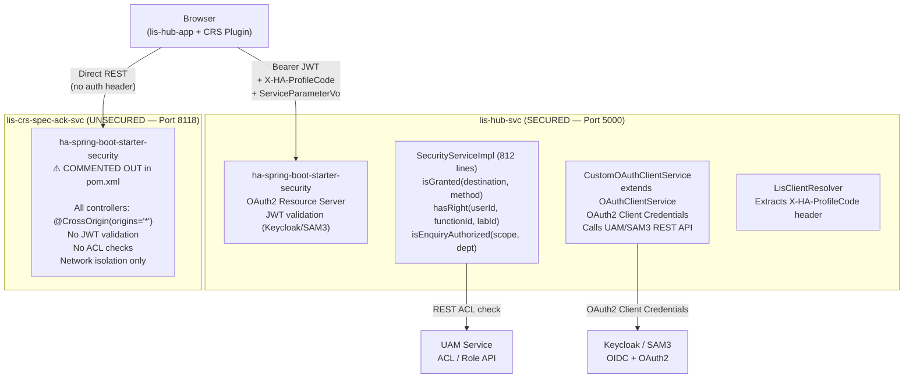
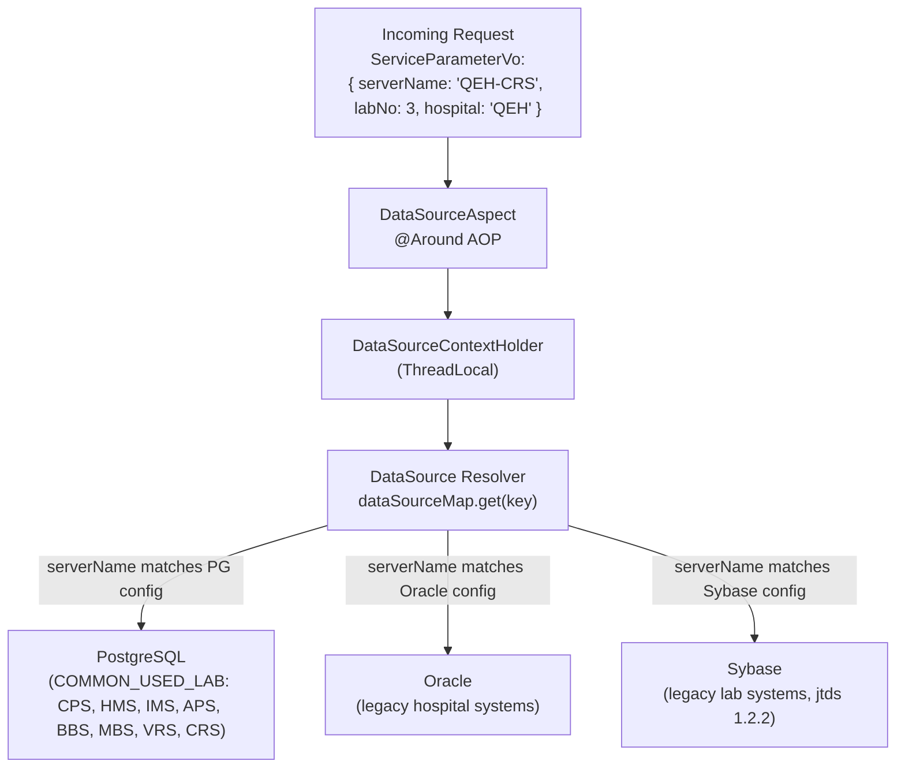
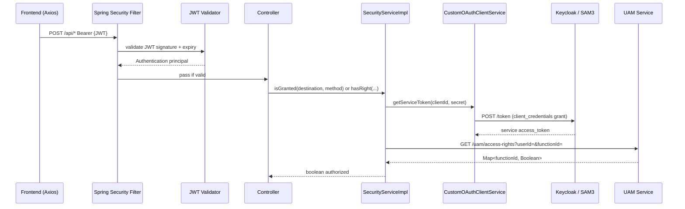
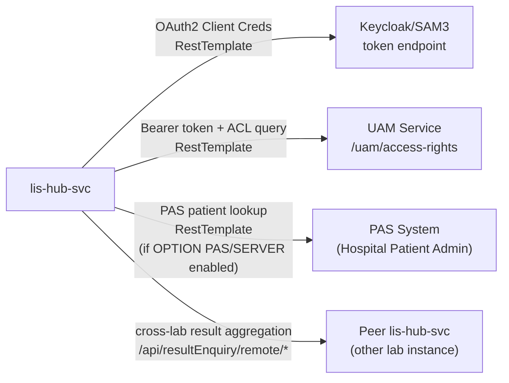
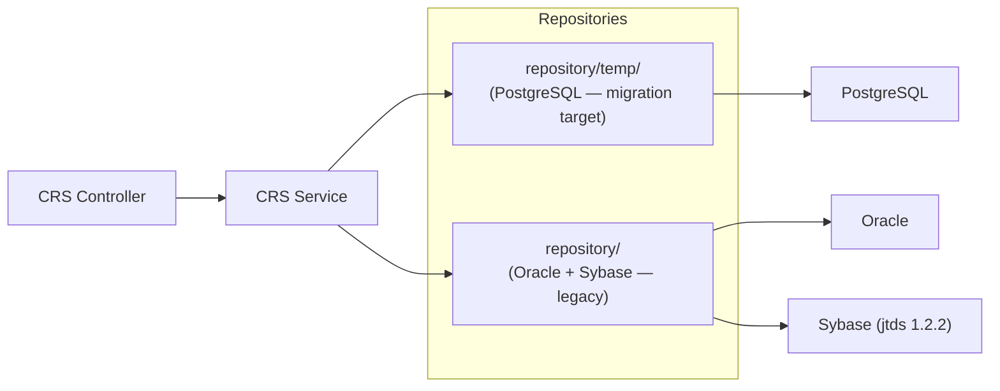

# 03 — Backend Microservices

> **Source:** Direct analysis of Java source code in `lis-hub-svc/` and `lis-crs-spec-ack-svc/`

---

## 3.1 Service Overview

| | `lis-hub-svc` | `lis-crs-spec-ack-svc` |
|---|---|---|
| **Role** | Hub BFF (Backend-for-Frontend) | CRS Domain Microservice |
| **Port** | 5000 | 8118 |
| **Java** | 17 | 17 |
| **Spring Boot** | 3.3.13 | (via `ha-spring-boot-starter 3.0.0`) |
| **Main class** | `LisApplication` | `LisCrsSpecAckSvcApplication` |
| **Component scan** | `hk.org.ha.lis` | `hk.org.ha.lis`, `hk.org.ha.lis.crs` |
| **Security** | ✅ **Fully secured** (`ha-spring-boot-starter-security`) | ❌ **Security DISABLED** (commented out in pom.xml) |
| **Databases** | PostgreSQL + Oracle + Sybase + Redis | Oracle + Sybase |
| **Cross-origin** | Controlled by security filter | `@CrossOrigin(origins = "*")` (wide open) |

---

## 3.2 Security Architecture — Asymmetric Trust Model


```mermaid
graph TB
    Browser["Browser\n(lis-hub-app + CRS Plugin)"]

    subgraph "lis-hub-svc (SECURED — Port 5000)"
        SEC1["ha-spring-boot-starter-security\nOAuth2 Resource Server\nJWT validation (Keycloak/SAM3)"]
        SEC2["SecurityServiceImpl (812 lines)\nisGranted(destination, method)\nhasRight(userId, functionId, labId)\nisEnquiryAuthorized(scope, dept)"]
        SEC3["CustomOAuthClientService\nextends OAuthClientService\nOAuth2 Client Credentials\nCalls UAM/SAM3 REST API"]
        SEC4["LisClientResolver\nExtracts X-HA-ProfileCode header"]
    end

    subgraph "lis-crs-spec-ack-svc (UNSECURED — Port 8118)"
        NOSEC["ha-spring-boot-starter-security\n⚠️ COMMENTED OUT in pom.xml\n\nAll controllers: @CrossOrigin(origins='*')\nNo JWT validation\nNo ACL checks\nNetwork isolation only"]
    end

    KC["Keycloak / SAM3\nOIDC + OAuth2"]
    UAM["UAM Service\nACL / Role API"]

    Browser -->|"Bearer JWT\n+ X-HA-ProfileCode\n+ ServiceParameterVo"| SEC1
    Browser -->|"Direct REST\n(no auth header)"| NOSEC
    SEC3 -->|"OAuth2 Client Credentials"| KC
    SEC2 -->|"REST ACL check"| UAM
```

> **⚠️ Security Finding:** `lis-crs-spec-ack-svc` has `ha-spring-boot-starter-security` commented out in `pom.xml`. All 7 controllers are annotated `@CrossOrigin(origins = "*")`. Security depends entirely on Kubernetes NetworkPolicy preventing external exposure. This is an intentional architectural choice: the BFF (`lis-hub-svc`) acts as the single validated entry point.

---

## 3.3 Dynamic Multi-Database Routing (lis-hub-svc)


```mermaid
flowchart TD
    Request["Incoming Request\nServiceParameterVo:\n{ serverName: 'QEH-CRS', labNo: 3, hospital: 'QEH' }"]
    Aspect["DataSourceAspect\n@Around AOP"]
    Holder["DataSourceContextHolder\n(ThreadLocal<ServerInfo>)"]
    Resolver["DataSource Resolver\ndataSourceMap.get(key)"]

    DB_PG["PostgreSQL\n(COMMON_USED_LAB: CPS, HMS, IMS, APS, BBS, MBS, VRS, CRS)"]
    DB_ORA["Oracle\n(legacy hospital systems)"]
    DB_SYB["Sybase\n(legacy lab systems, jtds 1.2.2)"]

    Request --> Aspect
    Aspect --> Holder
    Holder --> Resolver
    Resolver -->|"serverName matches PG config"| DB_PG
    Resolver -->|"serverName matches Oracle config"| DB_ORA
    Resolver -->|"serverName matches Sybase config"| DB_SYB
```

### Implementation Detail

```java
// DataSourceContextHolder.java
public class DataSourceContextHolder {
    private static final ThreadLocal<ServerInfo> contextHolder = new ThreadLocal<>();
    
    // COMMON_USED_LAB = ["CPS", "HMS", "IMS", "APS", "BBS", "MBS", "VRS", "CRS"]
    static final List<String> COMMON_USED_LAB = List.of("CPS","HMS","IMS","APS","BBS","MBS","VRS","CRS");
    
    public static void setServerInfo(ServerInfo info) { contextHolder.set(info); }
    public static ServerInfo getServerInfo() { return contextHolder.get(); }
    public static void clearServerInfo() { contextHolder.remove(); }
}
```

```java
// DataSourceAspect.java — @Around advice
@Around("execution(* hk.org.ha.lis.repository.QueueConfigRepository.*(..))" +
        " || execution(* hk.org.ha.lis.repository.GlobalCtrRepository.*(..))")
public Object setDataSource(ProceedingJoinPoint joinPoint) throws Throwable {
    // Override ThreadLocal for these specific repositories
    DataSourceContextHolder.setServerInfo(resolveFromArgs(joinPoint.getArgs()));
    try {
        return joinPoint.proceed();
    } finally {
        DataSourceContextHolder.clearServerInfo();
    }
}
```

**Key:** `COMMON_USED_LAB` lists all lab codes that route to PostgreSQL. Other lab codes route to Oracle or Sybase based on `application.yml` datasource configuration.

---

## 3.4 lis-hub-svc — OAuth2 & UAM Integration


```mermaid
sequenceDiagram
    participant Client as Frontend (Axios)
    participant Filter as Spring Security Filter
    participant JWT as JWT Validator
    participant Ctrl as Controller
    participant SecSvc as SecurityServiceImpl
    participant OAuth as CustomOAuthClientService
    participant KC as Keycloak / SAM3
    participant UAM as UAM Service

    Client->>Filter: POST /api/* Bearer {JWT}
    Filter->>JWT: validate JWT signature + expiry
    JWT-->>Filter: Authentication principal
    Filter->>Ctrl: pass if valid
    Ctrl->>SecSvc: isGranted(destination, method) or hasRight(...)
    SecSvc->>OAuth: getServiceToken(clientId, secret)
    OAuth->>KC: POST /token (client_credentials grant)
    KC-->>OAuth: service access_token
    SecSvc->>UAM: GET /uam/access-rights?userId=&functionId=
    UAM-->>SecSvc: Map<functionId, Boolean>
    SecSvc-->>Ctrl: boolean authorized
```

### `UamProperties` Configuration

```yaml
# application.yml binding
uam-config:
  AccessToken:
    client-id: ${UAM_CLIENT_ID}
    client-secret: ${UAM_CLIENT_SECRET}
    token-url: ${UAM_TOKEN_URL}
  AccessUrl:
    base-url: ${UAM_BASE_URL}
  Sam3Admin:
    admin-url: ${SAM3_ADMIN_URL}
    admin-secret: ${SAM3_ADMIN_SECRET}
```

---

## 3.5 lis-hub-svc — Outbound REST Calls


```mermaid
graph LR
    HubSvc["lis-hub-svc"]

    HubSvc -->|"OAuth2 Client Creds\nRestTemplate"| KC["Keycloak/SAM3\ntoken endpoint"]
    HubSvc -->|"Bearer token + ACL query\nRestTemplate"| UAM["UAM Service\n/uam/access-rights"]
    HubSvc -->|"PAS patient lookup\nRestTemplate\n(if OPTION PAS/SERVER enabled)"| PAS["PAS System\n(Hospital Patient Admin)"]
    HubSvc -->|"cross-lab result aggregation\n/api/resultEnquiry/remote/*"| OtherLab["Peer lis-hub-svc\n(other lab instance)"]
```

### `PasApiServiceImpl` — PAS Integration

```java
// Called only when serverOption "PAS/SERVER" is enabled in DB config
@Service
public class PasApiServiceImpl implements PasApiService {
    private final RestTemplate restTemplate;
    
    public PasPatientVo searchPatient(String hkid, String pasUrl) {
        return restTemplate.getForObject(pasUrl + "/api/patient/" + hkid, PasPatientVo.class);
    }
}
```

---

## 3.6 lis-hub-svc — Redis Caching

```java
// RedisConfig.java
@Bean
public RedisTemplate<String, Object> redisTemplate(RedisConnectionFactory factory) {
    RedisTemplate<String, Object> template = new RedisTemplate<>();
    template.setConnectionFactory(factory);
    
    Jackson2JsonRedisSerializer<Object> serializer = 
        new Jackson2JsonRedisSerializer<>(Object.class);
    template.setValueSerializer(serializer);
    template.setHashValueSerializer(serializer);
    template.setKeySerializer(new StringRedisSerializer());
    return template;
}
```

Redis is used for:
- Session/token caching (access tokens from OAuth2 client credentials flow)
- Dictionary/reference data caching (avoid repeated DB queries per request)
- Distributed state sharing between multiple hub-svc pod replicas

---

## 3.7 lis-crs-spec-ack-svc — Controller Catalogue

| Controller | Lines | Responsibility |
|---|---|---|
| `CrsSpecAckController` | ~891 | Core specimen acknowledgment operations (receive, verify, authorise, reject, return) |
| `CrsRegController` | ~289 | CRS specimen registration |
| `CrsSearchController` | — | Specimen / request search |
| `CrsSearchAuditController` | — | Search audit trail |
| `CrsAmendRequestController` | — | Amend/modify existing requests |
| `CrsDftRegController` | — | Default registration settings |
| `CrsMaintController` | — | CRS maintenance operations |

### Database Access Pattern


```mermaid
graph LR
    Controller["CRS Controller"]
    Service["CRS Service"]
    
    subgraph "Repositories"
        Temp["repository/temp/\n(PostgreSQL — migration target)"]
        Legacy["repository/\n(Oracle + Sybase — legacy)"]
    end

    DB_PG["PostgreSQL"]
    DB_ORA["Oracle"]
    DB_SYB["Sybase (jtds 1.2.2)"]

    Controller --> Service
    Service --> Temp
    Service --> Legacy
    Temp --> DB_PG
    Legacy --> DB_ORA
    Legacy --> DB_SYB
```

> **Active Migration:** `repository/temp/` packages contain PostgreSQL equivalents of legacy Oracle/Sybase queries, indicating an ongoing Sybase/Oracle → PostgreSQL migration.

---

## 3.8 API Contract Pattern

Both services follow the HA LIS standard response envelope:

```java
// Standard response wrapper
public class ResultDataResponse<T> {
    private int code;        // 200 = success
    private String message;
    private T data;
    private String traceId;  // Micrometer correlation
    private String spanId;
}
```

```java
// Standard exception response
public class ExceptionResponse {
    private int code;
    private String message;
    private String traceId;
    private String spanId;
    private LocalDateTime timestamp;
}
```

All endpoints use `POST` (no `GET` for data operations), following HA security convention.

---

## 3.9 Observability

| Concern | Tool | Notes |
|---|---|---|
| Distributed tracing | Micrometer Tracing | `traceId` + `spanId` in all responses |
| Metrics | Micrometer + Prometheus (via Spring Boot Actuator) | `values-DEV.yaml: monitoring.enable: true` |
| Logging | `system.log-privacy: ${LOG_PRIVACY:1}` | Privacy-aware logging (masks patient data) |
| ALS (App Logging) | `LIS_ALS_URL` injected via K8s env | Centralised log shipping |
| Kubernetes metadata | Downward API (`MY_POD_NAME`, `MY_NAMESPACE`) | Injected as env vars in `values-DEV.yaml` |
