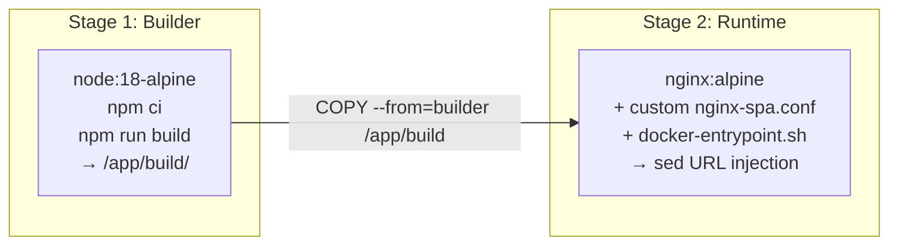
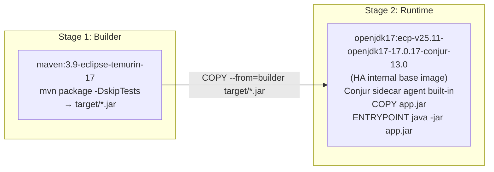
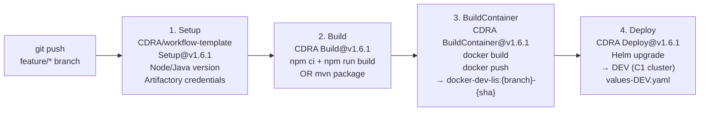
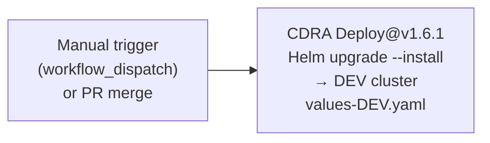
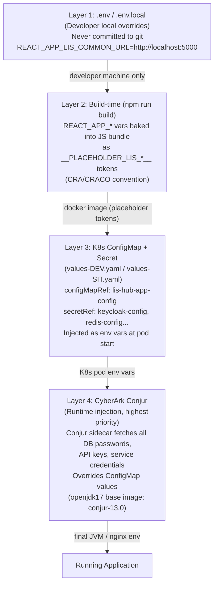
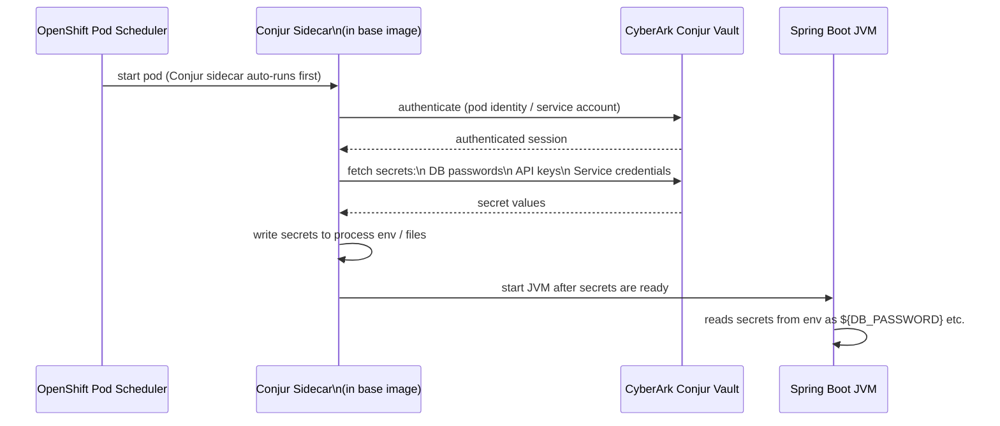
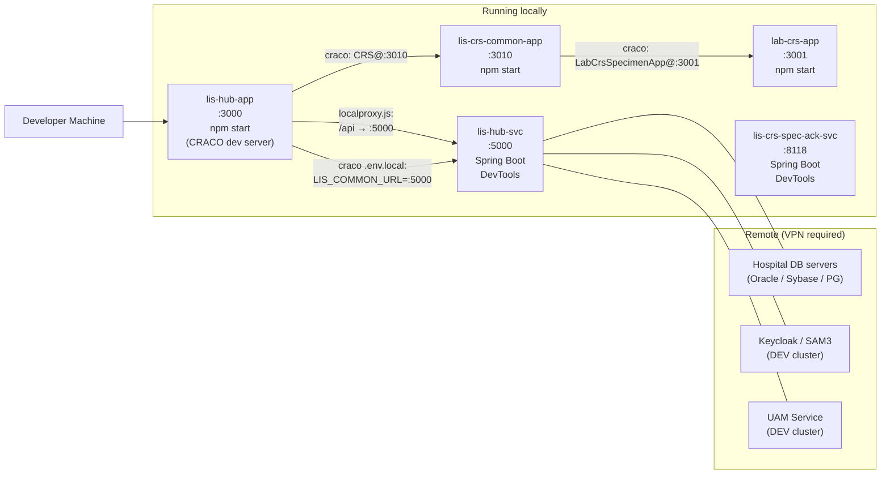

# 04 — Infrastructure and Deployment

> **Platform:** HA ECP (OpenShift Kubernetes) with Helm `ha-app` chart, GitHub Actions + CDRA reusable workflow templates, JFrog Artifactory private registry, CyberArk Conjur secrets injection.

---

## 4.1 Container Strategy

### Dockerfile Patterns

Each repo has its Dockerfile in `.devops/config/Dockerfile`.

#### Frontend Apps (lis-hub-app, lis-crs-common-app, lab-crs-app)



**Key technique — `docker-entrypoint.sh` URL injection:**
```bash
#!/bin/sh
# At container start, replace __PLACEHOLDER_*__ tokens in compiled JS/HTML
for var in $(env | grep '^LIS_'); do
  key="__PLACEHOLDER_${var%%=*}__"
  value="${var#*=}"
  find /usr/share/nginx/html -name "*.js" -o -name "*.html" | \
    xargs sed -i "s|${key}|${value}|g"
done
exec nginx -g "daemon off;"
```

This means:
- **Build-time** (`npm run build`): `process.env.REACT_APP_*` values are baked in as `__PLACEHOLDER_LIS_*__` literals
- **Runtime** (container start): `nginx/docker-entrypoint.sh` replaces these tokens with actual K8s ConfigMap env values
- **Result:** A single Docker image works across ALL environments (DEV, SIT, LPT, PROD)

#### Backend Apps (lis-hub-svc, lis-crs-spec-ack-svc)



**Conjur base image** `ecp-v25.11-openjdk17-17.0.17-conjur-13.0` contains:
- Standard `openjdk17`
- CyberArk Conjur sidecar agent that fetches secrets from Conjur vault before JVM startup
- Secrets are written to env vars, overriding any ConfigMap values

---

## 4.2 nginx Configuration

```nginx
# nginx-spa.conf (lis-hub-app)
server {
    listen 8080;
    root /usr/share/nginx/html;
    index index.html;

    # React Router — serve index.html for all unknown paths
    location / {
        try_files $uri $uri/ /index.html;
    }

    # CRITICAL: Never cache Module Federation entry points
    location ~* remoteEntry\.js$ {
        add_header Cache-Control "no-store, no-cache, must-revalidate, proxy-revalidate, max-age=0";
        expires off;
    }

    # Handle CORS preflight with 204
    if ($request_method = OPTIONS) {
        return 204;
    }

    # Static assets — long cache (content-hashed filenames)
    location ~* \.(js|css|png|jpg|gif|ico|woff2?)$ {
        expires 1y;
        add_header Cache-Control "public, immutable";
    }
}
```

---

## 4.3 CI/CD Pipeline Architecture

### Feature Branch Pipeline (`.github/workflows/feature-branch.yaml`)



### Release Branch Pipeline (`.github/workflows/release.yaml`)

```mermaid
flowchart LR
    PushRel["git push<br>release/* branch"] --> Setup
    Setup["1. Setup"] --> Build
    Build["2. Build"] --> Test
    Test["3. Test<br>Unit tests<br>JUnit/Jest"] --> ScanCode
    ScanCode["4. ScanCode<br>SonarQube SAST<br>Code quality gate"] --> ScanOSS
    ScanOSS["5. ScanOSS\nOSS license scan<br>Vulnerability check"] --> BuildContainer
    BuildContainer["6. BuildContainer\ndocker push<br>→ docker-rel-lis:{semver}"] --> DeploySIT
    DeploySIT["7. Deploy SIT C1<br>Helm upgrade<br>values-SIT.yaml"] --> DeploySIT2
    DeploySIT2["8. Deploy SIT C2<br>Helm upgrade<br>values-SIT.yaml"] --> DeployLPT
    DeployLPT["9. Deploy LPT<br>Helm upgrade<br>values-LPT.yaml"] --> DeployDEVQA
    DeployDEVQA["10. Deploy DEVQA<br>Helm upgrade<br>values-DEVQA.yaml"]
```



### Deploy ECP Dev Pipeline (`.github/workflows/deploy-ecp-dev.yaml`)



---

## 4.4 Environment Configuration Strategy (4-Layer Model)



---

## 4.5 Kubernetes / Helm Configuration

### `values-DEV.yaml` Structure (lis-hub-svc example)

```yaml
# lis-hub-svc/values-DEV.yaml
image:
  repository: artifactrepo.server.ha.org.hk:55743/docker-dev-lis/lis-hub-svc
  tag: latest

service:
  port: 5000

monitoring:
  enable: true

# Environment variables injected into pod
envFrom:
  - configMapRef:
      name: uam-config          # UAM API URLs
  - secretRef:
      name: uam-secret          # UAM client_id + client_secret
  - secretRef:
      name: keycloak-config     # Keycloak realm + client config
  - secretRef:
      name: redis-config        # Redis connection string
  - secretRef:
      name: postgresql-login    # PG credentials (Conjur-injected)
  - secretRef:
      name: oracle-login        # Oracle credentials (Conjur-injected)
  - secretRef:
      name: sybase-login        # Sybase credentials (Conjur-injected)
  - secretRef:
      name: pas-api-secret      # PAS integration credentials
  - configMapRef:
      name: als-config          # App Logging Service URL
  - configMapRef:
      name: correlation-config  # Correlation service config

# Direct env vars (Kubernetes Downward API)
env:
  - name: MY_POD_NAME
    valueFrom:
      fieldRef:
        fieldPath: metadata.name
  - name: MY_NAMESPACE
    valueFrom:
      fieldRef:
        fieldPath: metadata.namespace
  - name: LOG_PRIVACY
    value: "1"
```

### `values-SIT.yaml` Key Differences

```yaml
image:
  repository: artifactrepo.server.ha.org.hk:55743/docker-rel-lis/lis-hub-svc
  # Uses docker-rel-lis (release) instead of docker-dev-lis
```

### lis-crs-spec-ack-svc Secrets (values-DEV.yaml)

```yaml
envFrom:
  - secretRef:
      name: sybase-login        # Sybase DB credentials
  - secretRef:
      name: postgresql-login    # PostgreSQL credentials (migration target)
  - secretRef:
      name: oracle-login        # Oracle credentials
```

---

## 4.6 JFrog Artifactory Registry

| Registry | Path | Usage |
|---|---|---|
| **Dev registry** | `artifactrepo.server.ha.org.hk:55743/docker-dev-lis/` | Feature branch images; `:{branch}-{sha}` tags |
| **Release registry** | `artifactrepo.server.ha.org.hk:55743/docker-rel-lis/` | Release branch images; `:{semver}` tags |

- Air-gapped private registry (no internet access from ECP cluster)
- GitHub Actions authenticates via `ARTIFACTORY_USER` + `ARTIFACTORY_PASSWORD` secrets
- Maven builds also pull from Artifactory Maven repos (private HA internal jars: `ha-spring-boot-starter-*`)

---

## 4.7 CyberArk Conjur Secrets Management



**Why Conjur over K8s Secrets?**
- Secrets in K8s Secrets are base64-encoded, accessible to any cluster admin
- Conjur enforces fine-grained ACL per application identity
- Dynamic secret rotation without pod restart (re-fetched on next start)
- Full audit trail of secret access

---

## 4.8 Environment Matrix

| Environment | Cluster | Image Registry | Deploy Trigger | values file |
|---|---|---|---|---|
| **DEV** | ECP C1 | `docker-dev-lis` | Auto on feature branch push | `values-DEV.yaml` |
| **DEVQA** | ECP | `docker-rel-lis` | Auto on release branch | `values-DEVQA.yaml` |
| **SIT C1** | ECP C1 | `docker-rel-lis` | Auto on release branch | `values-SIT.yaml` |
| **SIT C2** | ECP C2 | `docker-rel-lis` | Auto on release branch | `values-SIT.yaml` |
| **LPT** | ECP C2 | `docker-rel-lis` | Auto on release branch | `values-LPT.yaml` |
| **PROD** | ECP | `docker-rel-lis` | Manual gate | `values-PROD.yaml` |

---

## 4.9 GitHub Actions Secrets Required

| Secret | Used By | Purpose |
|---|---|---|
| `ARTIFACTORY_USER` | All repos | JFrog Artifactory pull/push auth |
| `ARTIFACTORY_PASSWORD` | All repos | JFrog Artifactory pull/push auth |
| `SONAR_TOKEN` | Release pipeline | SonarQube code quality scan |
| `ECP_KUBECONFIG_DEV` | Feature branch | kubectl/Helm access to DEV cluster |
| `ECP_KUBECONFIG_SIT` | Release pipeline | kubectl/Helm access to SIT cluster |
| `NPM_AUTH_TOKEN` | Frontend repos | JFrog NPM registry (`@lis/lis-hub-lib`, `@cmschassis/*`) |

---

## 4.10 Local Development Setup



**`.env.local` overrides for hub-svc proxy:**
```bash
# lis-hub-app/.env.local
REACT_APP_LIS_COMMON_URL=http://lis-chongkw-01:5000

# lis-crs-common-app/.env (local dev)
# craco.config.js: consumes LabCrsSpecimenApp@http://lis-chongkw-01:3001
```
