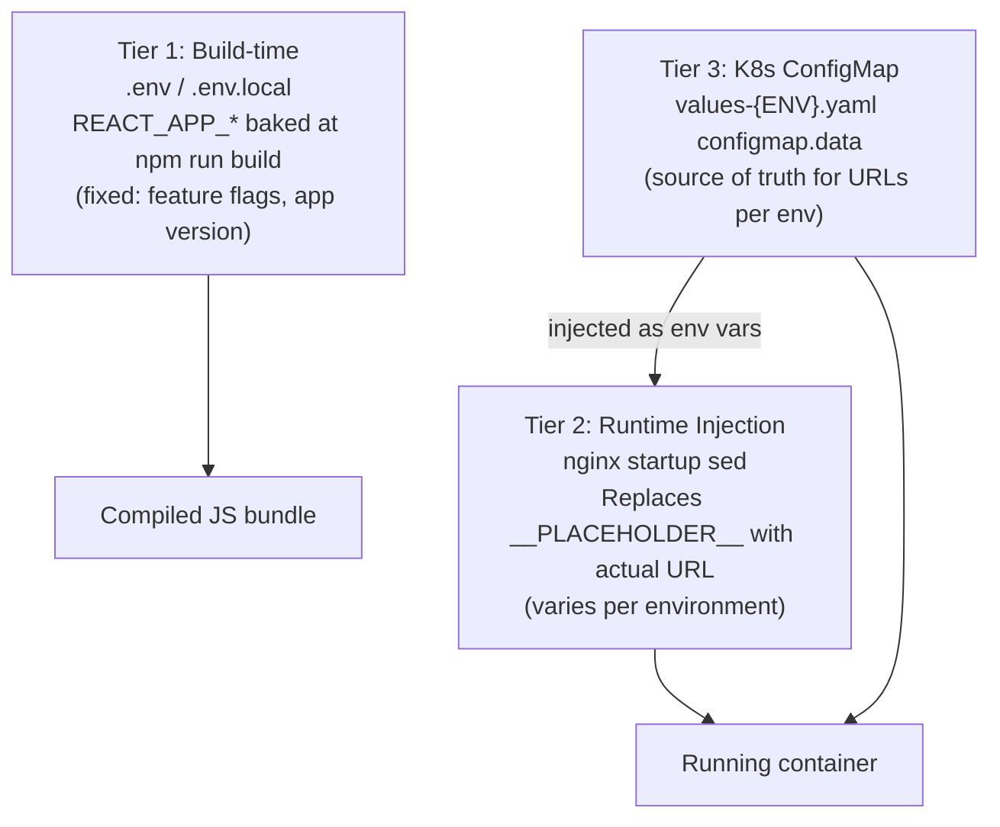
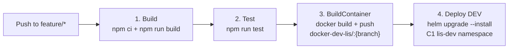
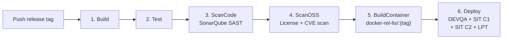
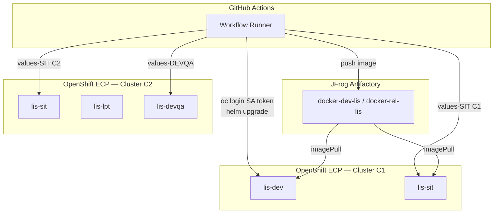
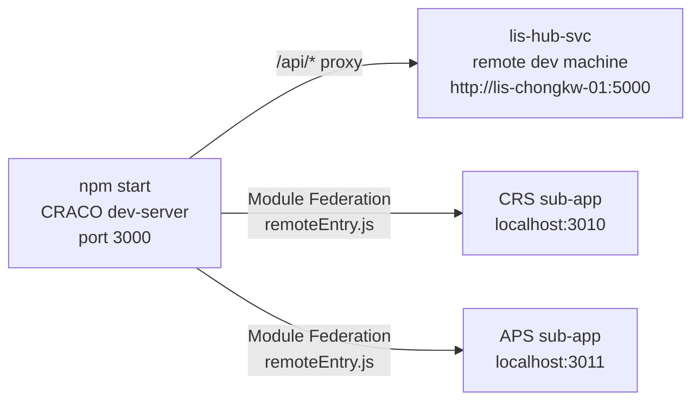

# 04 — Infrastructure & Deployment

---

## 4.1 Container Strategy

### Two-Dockerfile Design

| Dockerfile | Location | Stage | Purpose |
|---|---|---|---|
| **Release image** | `Dockerfile` (root) | Single-stage | Pre-built artifact intake; used by CI/CD pipeline |
| **Dev build image** | `.devops/config/Dockerfile` | Two-stage (build → runtime) | Full in-container build; used for initial scaffolding / reference |

Both produce the same runtime image: `bitnami/nginx` serving `build/` as an SPA with runtime URL injection.

#### Runtime URL Injection

The compiled JavaScript bundle contains placeholder strings. At container start, `sed` replaces them with values sourced from K8s ConfigMap environment variables:

```bash
sed -i "s|__REACT_APP_LIS_COMMON_URL__|${LIS_COMMON_ROOT_URL}|g"       /html/static/js/*.js
sed -i "s|__REACT_APP_KEYCLOAK_SERVER_URL__|${KEYCLOAK_SERVER_URL}|g"  /html/static/js/*.js
# ... repeated for each LIS_*_ROOT_URL
```

This allows a **single Docker image** to be promoted across DEV → DEVQA → SIT → DEMO without rebuilds.

---

## 4.2 Environment Variable Model (Three-Tier)



### `.env` Variables (Build-time)

| Variable | Example Value |
|---|---|
| `REACT_APP_VER` | `local` |
| `REACT_APP_ENV` | `local` |
| `REACT_APP_LIS_COMMON_URL` | proxied locally; sed-replaced in prod |
| `REACT_APP_KEYCLOAK_SERVER_URL` | Keycloak OIDC endpoint |
| `REACT_APP_SESSION_TIMEOUT` | `900000` ms |

### `values-{ENV}.yaml` ConfigMap Keys (Runtime)

| Key | DEV | SIT |
|---|---|---|
| `LIS_COMMON_ROOT_URL` | `http://lis-hub-svc:5000` | `http://lis-hub-svc-sit:5000` |
| `KEYCLOAK_SERVER_URL` | `https://sam3-dev.ha.org.hk/auth` | `https://sam3-sit.ha.org.hk/auth` |
| `LIS_CRS_ROOT_URL` | `http://crs-be-svc:5001` | `http://crs-be-svc-sit:5001` |
| `LIS_APS_ROOT_URL` | `http://aps-be-svc:5002` | `http://aps-be-svc-sit:5002` |

---

## 4.3 Container Registry

```
Registry: artifactrepo.server.ha.org.hk:55743   (JFrog Artifactory — air-gapped)

DEV builds  → docker-dev-lis/lis-hub-app:{branch-name}
REL builds  → docker-rel-lis/lis-hub-app:{branch-name}
```

- Separate Artifactory credentials for dev vs release builds
- npm packages served from Artifactory npm proxy repo (`HA_UI_NPM_TOKEN`)
- HA internal CA cert injected at build time via `CERT_HA_ROOT_CA` secret

---

## 4.4 CI/CD Pipeline

All pipelines use shared reusable workflows from `CDRA/workflow-template@v1.6.1`.

### Feature Branch Pipeline



### Release Pipeline



### Dev Hotfix Pipeline

Direct deploy-only; skips build using a pre-existing image tag from Artifactory.

---

## 4.5 Kubernetes / OpenShift Deployment



### Helm Deployment

```
helm upgrade --install lis-hub-app ha-app \
     -f values-{ENV}.yaml \
     --set image.tag={branch-or-tag}
```

### Environment Matrix

| Env | Cluster | Namespace | Trigger |
|---|---|---|---|
| **DEV** | C1 | `lis-dev` | feature push |
| **DEVQA** | C2 | `lis-devqa` | release tag |
| **SIT** | C1 + C2 | `lis-sit` | release tag (HA) |
| **LPT** | C2 | `lis-lpt` | release tag |
| **DEMO** | — | — | manual |

---

## 4.6 GitHub Actions Secrets

| Secret | Purpose |
|---|---|
| `ECP_SA_TOKEN_DEV` | OpenShift SA token — DEV namespace |
| `ECP_SA_TOKEN_REL` | OpenShift SA token — SIT/DEVQA/LPT namespaces |
| `ARTIFACTORY_USER_DEV` / `ARTIFACTORY_CRD_DEV` | JFrog docker-dev-lis push |
| `ARTIFACTORY_USER_REL` / `ARTIFACTORY_CRD_REL` | JFrog docker-rel-lis push |
| `HA_UI_NPM_TOKEN` | JFrog npm proxy auth |
| `CERT_HA_ROOT_CA` | Internal CA cert for docker build |
| `SONAR_TOKEN` | SonarQube SAST auth |

---

## 4.7 Local Development



- `.env.local` overrides backend URLs to dev machine
- `localproxy.js` drives `devServer.proxy`: `{ '/api': process.env.REACT_APP_LIS_COMMON_URL }`
- Each sub-app MFE runs independently on its own port
- `getHospLocalDev(labName)` in `plugins.ts` maps lab name to localhost port

---

## 4.8 Quality Gates

| Tool | Stage | Config |
|---|---|---|
| **SonarQube** | Release `ScanCode` | `sonar-project.properties`; excludes `src/modules/api/generated/**` |
| **OSSS** | Release `ScanOSS` | Dependency license + CVE scanning |
| **ESLint** | Dev + CI | CRA built-in |
| **TypeScript** | Dev + CI Build | `tsconfig.json` strict mode |
| **commitlint** | Pre-push (husky) | `commitlint.config.js` — conventional commits |

---

## 4.9 nginx Configuration Highlights

| Rule | Purpose |
|---|---|
| `try_files $uri /index.html` | SPA client-side routing fallback |
| `remoteEntry.js` → `no-store no-cache` | Module Federation remote always re-fetched on app load |
| `OPTIONS` → `204` | CORS preflight handling |
| `X-Frame-Options: SAMEORIGIN` | Clickjacking protection |
