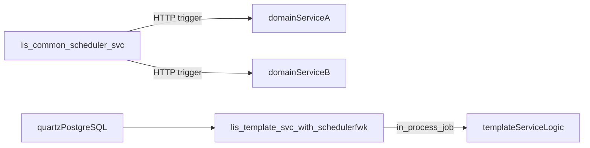

## Decision Baseline
- Proceed with a **POC in `lis-template-svc`**.
- Use **`DATABASE_DRIVEN`** strategy for first delivery.
- Keep scope to one representative static job first; dynamic runtime-job API will be evaluated and staged after baseline stability.

## Architecture Direction

## What We Learned (Used for Planning)
- `common-schedulerfwk` is library-embedded and supports microservice-local scheduling (`@CmsScheduler`) with Quartz DB clustering.
- `lis-common-scheduler-svc` currently concentrates ~200+ jobs and downstream HTTP fan-out, creating coupling and contention risk.
- `lis-template-svc` is structurally ready for integration but lacks scheduler dependency, Quartz datasource bean, scheduler config, and scheduler DB secrets/config.
- Dynamic scheduling is feasible via framework APIs (`SchedulerManageService` + `DynamicJobForm`), but should be introduced after stable baseline due to operational/security complexity.

## Implementation Plan (POC in `lis-template-svc`)
1. **Add scheduler framework dependency**
   - Update [`D:\ECP\LIS\lis-template-svc\pom.xml`](D:/ECP/LIS/lis-template-svc/pom.xml) to include `common-schedulerfwk` and required runtime driver alignment.
2. **Introduce scheduler configuration**
   - Add `cms-scheduler` + `cronExpression` entries in [`D:\ECP\LIS\lis-template-svc\src\main\resources\application.yml`](D:/ECP/LIS/lis-template-svc/src/main/resources/application.yml).
   - Set `jobSchedulingStrategy: DATABASE_DRIVEN`, unique `schedulerName`, schema/prefix, thread count, overdue settings.
3. **Create dedicated Quartz datasource wiring**
   - Add scheduler datasource config class under template config package (pattern from centralized service).
   - Ensure `@CmsSchedulerDataSource` points to scheduler PostgreSQL credentials (separate from business data-source routing).
4. **Enable scheduler runtime in application bootstrap**
   - Update [`D:\ECP\LIS\lis-template-svc\src\main\java\hk\org\ha\lis\template\LisTemplateSvcApplication.java`](D:/ECP/LIS/lis-template-svc/src/main/java/hk/org/ha/lis/template/LisTemplateSvcApplication.java) for scheduling enablement and component scanning validation.
5. **Implement one representative scheduler job**
   - Add a new job class under `...\schedule\` with `@CmsScheduler` and externalized cron.
   - Delegate execution to existing service-layer logic (no heavy business logic in job method).
6. **Wire environment and deployment config**
   - Extend env config files (`values-*.yaml` / configmap/secret JSON) in [`D:\ECP\LIS\lis-template-svc`](D:/ECP/LIS/lis-template-svc) for scheduler DB credentials and cron variables.
7. **Prepare database prerequisites**
   - Apply Quartz DDL from wiki to scheduler PostgreSQL schema/prefix.
8. **Verification and non-functional checks**
   - Validate startup registration, dashboard visibility, cron trigger firing, failure logging, and behavior on restart under `DATABASE_DRIVEN`.

## Dynamic Job Roadmap (After POC)
- Add internal admin endpoint(s) to create jobs via framework `SchedulerManageService`.
- Restrict allowed bean/method targets and validate cron inputs for safety.
- Persist job metadata/audit trail (owner, purpose, ttl, enable flag) and define governance for runtime-created jobs.
- Add operational guardrails: max dynamic jobs per service, naming convention, and cleanup/disable flow.

## Centralized-to-Decentralized Migration Sequencing
- Phase 1: keep central scheduler unchanged; prove one local scheduler in `lis-template-svc`.
- Phase 2: migrate job bundles service-by-service (owner service executes its own jobs).
- Phase 3: reduce `lis-common-scheduler-svc` to remaining cross-service orchestration or retire selectively.

## Key Files to Reuse as Reference
- Framework docs: [`D:\ECP\CMS\cms-common-schedulerfwk.wiki\Module-Core.md`](D:/ECP/CMS/cms-common-schedulerfwk.wiki/Module-Core.md), [`D:\ECP\CMS\cms-common-schedulerfwk.wiki\FAQ.md`](D:/ECP/CMS/cms-common-schedulerfwk.wiki/FAQ.md), [`D:\ECP\CMS\cms-common-schedulerfwk.wiki\Support-DB-DDL.md`](D:/ECP/CMS/cms-common-schedulerfwk.wiki/Support-DB-DDL.md)
- Current centralized reference: [`D:\ECP\LIS\lis-common-scheduler-svc\src\main\resources\application.yml`](D:/ECP/LIS/lis-common-scheduler-svc/src/main/resources/application.yml), [`D:\ECP\LIS\lis-common-scheduler-svc\src\main\java\hk\org\ha\lis\config\PostgreSqlDataSourceConfigCorp.java`](D:/ECP/LIS/lis-common-scheduler-svc/src/main/java/hk/org/ha/lis/config/PostgreSqlDataSourceConfigCorp.java), [`D:\ECP\LIS\lis-common-scheduler-svc\src\main\java\hk\org\ha\lis\schedule\SchedulingJob.java`](D:/ECP/LIS/lis-common-scheduler-svc/src/main/java/hk/org/ha/lis/schedule/SchedulingJob.java)
- Target implementation repo: [`D:\ECP\LIS\lis-template-svc\pom.xml`](D:/ECP/LIS/lis-template-svc/pom.xml), [`D:\ECP\LIS\lis-template-svc\src\main\resources\application.yml`](D:/ECP/LIS/lis-template-svc/src/main/resources/application.yml), [`D:\ECP\LIS\lis-template-svc\src\main\java\hk\org\ha\lis\template\LisTemplateSvcApplication.java`](D:/ECP/LIS/lis-template-svc/src/main/java/hk/org/ha/lis/template/LisTemplateSvcApplication.java)