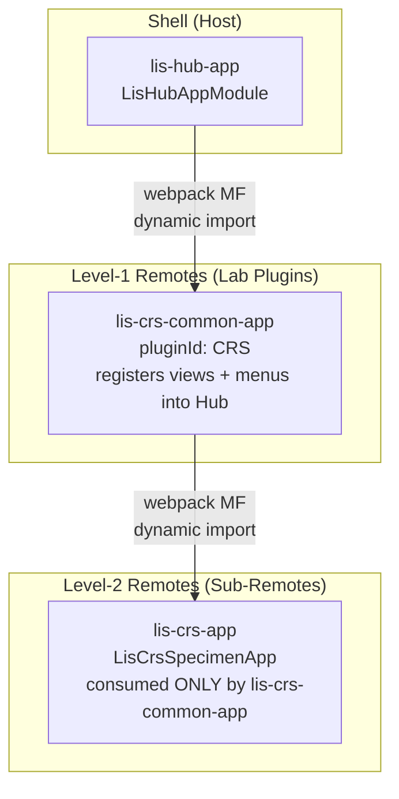

```mermaid
graph TB
    subgraph "Shell (Host)"
        Hub["lis-hub-app<br>LisHubAppModule"]
    end

    subgraph "Level-1 Remotes (Lab Plugins)"
        CRS["lis-crs-common-app<br>pluginId: CRS<br>registers views + menus into Hub"]
    end

    subgraph "Level-2 Remotes (Sub-Remotes)"
        LAB["lis-crs-app<br>LisCrsSpecimenApp<br>consumed ONLY by lis-crs-common-app"]
    end

    Hub -->|"webpack MF<br>dynamic import"| CRS
    CRS -->|"webpack MF<br>dynamic import"| LAB
```
