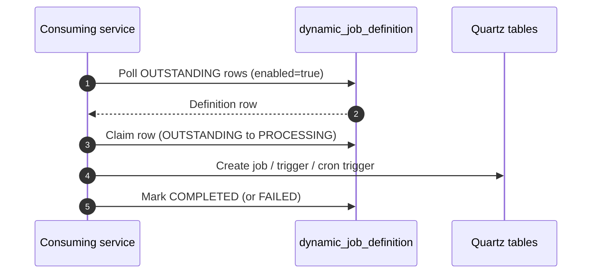

# Create `dynamic_job_definition` Table and OpenShift Configuration for `lis-scheduler` Mandatory Setup

## Request Type

**Type:** Service Request  
**Priority:** Medium

## Request Summary

Create `dynamic_job_definition` Table and OpenShift Configuration for `lis-scheduler` Mandatory Setup

## Background

LIS microservices are adopting the embedded `lis-scheduler` library (`hk.org.ha.lis:lis-scheduler`) primarily to support **canary deployment** of services that use a scheduler. Embedding Quartz in-process (instead of the centralized `lis-common-scheduler-svc`) allows each service version to use an isolated Quartz `sched_name`, so v1 and v2 pods can run independently without sharing the same job set.

Jobs can be registered at compile time (`@CmsScheduler`) or at runtime through table-driven definitions in PostgreSQL. Table-driven jobs require the `dynamic_job_definition` table in the shared scheduler schema. `DynamicJobCreatorJob` polls `OUTSTANDING` rows and creates corresponding Quartz jobs. This table does not yet exist and must be created as mandatory setup before services can use table-driven scheduling.

Additional keys for schema/prefix and the dynamic job monitor cron must be added so consuming services can bind `cms-scheduler.db_schema`, `cms-scheduler.db_prefix`, and `CRON_EXPRESSION_DYNAMIC_JOB_CREATOR`.

## Change Description

1. **Create PostgreSQL table `dynamic_job_definition`:**
   - Create `scheduler.dynamic_job_definition` table in the scheduler PostgreSQL database.
	   - Columns include: `application_name`, `job_name`, `bean_name`, `method_name`, `cron_expression`, concurrency/retry flags, `parameters`, `enabled`, `status` / `status_message`, and audit timestamps.
   - Create unique index `uq_dynamic_job_definition_application_job` on `(application_name, job_name)`.
   - Create pickup index `idx_dynamic_job_definition_pickup` on `(application_name, status, enabled, updated_at)`.

2. **Add keys to shared OpenShift ConfigMap `scheduler-svc-config` (per environment):**
   - `SCHEDULER_DB_SCHEMA` — `scheduler` (PostgreSQL schema for Quartz / dynamic job tables)
   - `SCHEDULER_DB_PREFIX` — `lis` (Quartz table prefix `lis_sfwk_*`)
   - `CRON_EXPRESSION_DYNAMIC_JOB_CREATOR` — `0 0/1 * * * ?` (cron for `DynamicJobCreatorJob`, every 1 minute)

## Justification

This mandatory shared setup unblocks adoption of `lis-scheduler`, which enables canary deployment of scheduler-backed LIS services through versioned Quartz namespaces and phased job cutover. Creating `dynamic_job_definition` and completing `scheduler-svc-config` with schema, prefix, and monitor cron ensures all consuming services share a consistent scheduler PostgreSQL layout and can poll new job definitions without redeploying for each schedule change.

## Target Completion Date

17th Jul 2026

## Design

**Review type:** incremental
**JIRA key:** (pending)
**Service:** lis-scheduler
**Review forum:** CP3
**Review date:** 16th Jul, 2026
**Prior review:** none

### Agenda
Background
Design Review
Promotion
Fallback
Q&A

### Slide: Background
LIS microservices adopt embedded lis-scheduler for canary-friendly scheduling
Each service version uses an isolated Quartz sched_name
Jobs can be defined in source code or at runtime via PostgreSQL
Table-driven jobs need a shared definition table that does not yet exist
Shared OpenShift ConfigMap also lacks schema, prefix, and creator cron keys

### Slide: Background - Why Table-Driven Jobs
Allow new or changed schedules without redeploying the consuming service
application_name matches spring.application.name (version-agnostic)
A scheduled creator job polls OUTSTANDING rows and registers Quartz jobs
Supports phased cutover alongside versioned sched_name for canary

### Slide: Proposed Change - Overview
Create scheduler.dynamic_job_definition in scheduler PostgreSQL
Add unique index on (application_name, job_name)
Add pickup index on (application_name, status, enabled, updated_at)
Add three keys to shared ConfigMap scheduler-svc-config (per environment)

### Slide: Proposed Change - Schema
| Column | Type | Description |
| --- | --- | --- |
| application_name | VARCHAR(120) | Consuming service name |
| job_name | VARCHAR(200) | Quartz job name (unique per application) |
| bean_name / method_name | VARCHAR(100) | Target bean and method |
| cron_expression | VARCHAR(120) | Quartz cron |
| concurrent / skip_on_overdue / max_retry | flags | Execution behaviour |
| parameters | TEXT | Method arguments |
| enabled | BOOLEAN | Row active flag |
| status / status_message | VARCHAR / TEXT | OUTSTANDING → PROCESSING → COMPLETED / FAILED |

### Slide: Proposed Change - ConfigMap Keys
| Key | Example | Purpose |
| --- | --- | --- |
| SCHEDULER_DB_SCHEMA | scheduler | PostgreSQL schema for Quartz / definition tables |
| SCHEDULER_DB_PREFIX | lis | Quartz table prefix (lis_sfwk_*) |
| CRON_EXPRESSION_DYNAMIC_JOB_CREATOR | 0 0/1 * * * ? | Creator job cron (every 1 minute) |

### Diagram: dynamic-job-creator-flow

### Slide: Status Lifecycle
| Status | Meaning |
| --- | --- |
| OUTSTANDING | Inserted; awaiting creator pickup |
| PROCESSING | Claimed by creator |
| COMPLETED | Quartz job created (or already exists) |
| FAILED | Creation error recorded in status_message |

### Slide: Promotion
Run DDL on scheduler PostgreSQL (replace schema from SCHEDULER_DB_SCHEMA)
Add SCHEDULER_DB_SCHEMA, SCHEDULER_DB_PREFIX, CRON_EXPRESSION_DYNAMIC_JOB_CREATOR to scheduler-svc-config
Restart / redeploy consuming services that mount the shared ConfigMap
Verify creator job runs and an OUTSTANDING test row becomes COMPLETED

### Slide: Fallback
Remove or roll back the three ConfigMap keys if not yet consumed
Drop dynamic_job_definition only if no service depends on it
Consuming services remain usable with source-code jobs when table-driven path is unused
Disable creator only via SCHEDULER_DYNAMIC_JOB_CREATOR_ENABLED=false if needed

### Slide: Q&A
