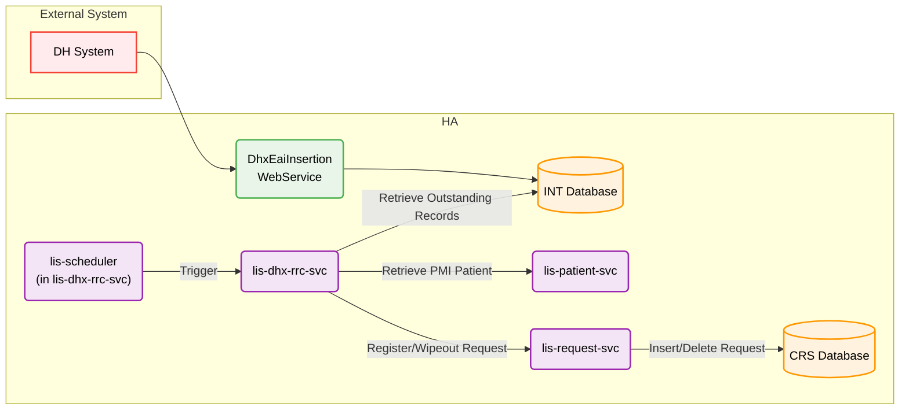
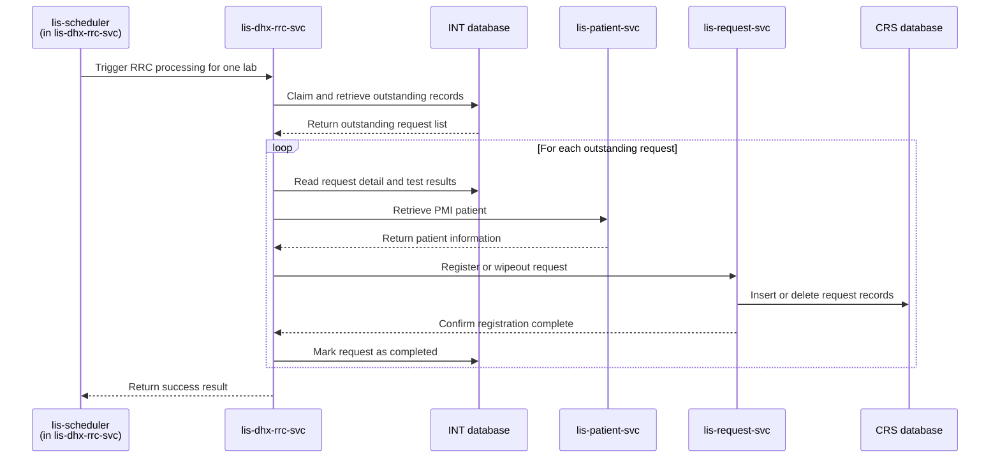

# Develop cloud application `lis-dhx-rrc-svc` to replace the legacy RRC worker and support dynamic Sybase/PostgreSQL database connectivity during DB migration

## Request Type

**Type:** Change Request  
**Priority:** Medium

## Request Summary

Develop cloud application `lis-dhx-rrc-svc` to replace the legacy RRC worker and support dynamic Sybase/PostgreSQL database connectivity during DB migration

## Background

The RRC (Request & Result Conversion) function converts inbound Department of Health (DH) laboratory test results into HA LIS CRS-native data structures, enabling structured result sharing to downstream consumers within HA. Today this runs as a legacy C Unix socket daemon (`lis_sp_lisg_rrc.c` + `rrc_work.c`) that polls an intermediate Sybase database (INT_DB) for EDI records (`EDI_REQUEST`, `EDI_DH_INFO`, `EDI_TESTRSLT`), resolves patients via PMI, registers or wipeouts CRS requests, translates test results, and dispatches DH acknowledgements.

The legacy implementation is tightly coupled to Sybase via CT-Lib and stored-procedure-style database access. With the ongoing Sybase-to-PostgreSQL migration, a technical solution is required that preserves identical business behaviour and output while allowing each hospital environment to connect to either Sybase or PostgreSQL based on central configuration.

The revamped `lis-dhx-rrc-svc` Spring Boot microservice has been designed to replace the C daemon with a REST-triggered cloud application (`POST /api/rrcProcess`), Spring Data JPA persistence, and dynamic data-source routing via `DataSourceContextHolder` (INT_DB on Sybase, LAB_DB/CRS on PostgreSQL). This change request covers building, configuring, and deploying that cloud application to production readiness.

## Change Description

1. **Replace legacy RRC worker with cloud application (`lis-dhx-rrc-svc`):**
   - Re-implement all RRC business logic from `lis_sp_lisg_rrc.c` / `rrc_work.c` in Java 17 / Spring Boot 3.3, preserving lab-number–driven prefix routing (CPS/HMS/MBS), patient resolution, re-send (wipeout) detection, specimen mapping, test-result dictionary validation, PDF order insertion, and DH acknowledgement dispatch.
   - Expose `POST /api/rrcProcess` (triggered by `lis-common-scheduler-svc`) as the replacement for the continuous Unix socket daemon polling model.
   - Integrate with `lis-patient-svc` (PMI patient resolution) and `lis-request-svc` (CRS request registration and activation). DH acknowledgement is handled internally within `lis-dhx-rrc-svc`.

2. **Support dynamic Sybase or PostgreSQL connectivity per environment:**
   - Use the `data-source` library and `DataSourceContextHolder` for thread-local routing between INT_DB (Sybase — EDI source) and LAB_DB (PostgreSQL — CRS target).
   - Bind JDBC connection parameters via OpenShift ConfigMaps/Secrets (`sybase-jdbc`, `postgresql-jdbc`) and Spring Boot YAML profiles (`dev`, `devqa`, `sit`, `lpt`, `prd`) so each hospital environment connects to the correct database without code changes.

3. **Preserve data model and processing semantics:**
   - Read/update INT_DB tables: `EDI_REQUEST`, `EDI_DH_INFO`, `EDI_TESTRSLT` (status lifecycle: `0` → `98` → `99`/`10`/`11`).
   - Write LAB_DB tables via registration and DHX-local steps: `CRS_REQUEST`, `CRS_REQUEST_DETAIL`, `TRANS_TESTRSLT_WKT` (via `lis-request-svc` register), `SENDOUT_REQNO_MAP`, `PDF_ORDER`, `LISG_TASKLIST`, and related CRS entities.
   - Maintain per-request `@Transactional` boundaries and atomic request claiming to prevent double-processing across concurrent pod instances.

### System Architecture

## Justification

This change ensures uninterrupted DH lab result conversion services during and after the Sybase-to-PostgreSQL transition. It decouples RRC processing from Sybase-specific stored procedures and CT-Lib, aligns with DHP cloud migration goals, and provides a maintainable, observable Spring Boot service with structured ALS logging, OpenShift deployment, and environment-driven database routing.

## Target Completion Date

30th Jul, 2026

## Reference Logs

- LIS-10325

## Design

**Review type:** full
**JIRA key:** LIS-10325
**Service:** lis-dhx-rrc-svc
**Review forum:** CP3
**Review date:** 30th Jul, 2026
**Prior review:** none

### Agenda
Background
Design Review
Promotion
Fallback
Q&A

### Slide: Background
RRC (Request and Result Conversion) converts inbound DH laboratory test results into HA LIS CRS-native data
Legacy worker runs as a C Unix socket daemon polling Sybase INT_DB for EDI records
Tightly coupled to CT-Lib and Sybase stored-procedure-style database access
Sybase-to-PostgreSQL migration requires a cloud-native replacement with identical business output
Downstream consumers rely on structured CRS data for report sharing within HA

### Slide: Background - Supported Labs
| labNo | Lab  | Prefix 1 | Prefix 2 | Source System |
| ----- | ---- | -------- | -------- | ------------- |
| 1     | CPS  | A        | _(none)_ | C             |
| 3     | HMS  | N        | _(none)_ | N             |
| 7     | MBS  | M        | V        | M             |
Each scheduler trigger passes labNo to route prefix and source-system filters

### Slide: Existing Design - Legacy Processing Flow
DH submits test results via DhxEaiInsertion WebService into INT_DB EDI tables
Legacy RRC daemon polls INT_DB for outstanding EDI_REQUEST rows (status = 0)
For each request: resolve patient, register or wipeout CRS request, translate test results
Write CRS-native records to LAB_DB; queue DH acknowledgement via TRANS_TESTRSLT_WKT on sendout hospital
Update EDI_REQUEST status to completed (99), dictionary error (11), or failure (10)

### Slide: Existing Design - EDI Request Status Lifecycle
| Status | Meaning |
| --- | --- |
| 0 | Outstanding - awaiting processing |
| 98 | Claimed - stamped with processing datetime |
| 99 | Completed successfully |
| 11 | Registered with dictionary error |
| 10 | Processing failure (transaction rolled back) |
Atomic claim prevents concurrent daemon instances from double-processing the same row

### Slide: Proposed Change - Overview
1. Build cloud application lis-dhx-rrc-svc to replace legacy C RRC worker
2. Triggered by lis-scheduler per lab
3. Re-implement all business logic with identical output to legacy worker
4. Support dynamic Sybase or PostgreSQL connectivity per environment via central config
5. Integrate with lis-patient-svc and lis-request-svc for PMI and request operations

### Diagram: system-architecture

### Slide: Proposed Change - Processing Stages
1. Request claiming - stamp outstanding EDI rows as in-progress (status 98)
2. Patient demographics - resolve PatientVo via PMI or local/EDI fallback; PATIENT insert deferred to lis-request-svc registration
3. Re-send detection - wipeout previous CRS data when DH resends same request
4. Request number assignment - generate new or reuse wiped-out CRS request number
5. Specimen mapping - MBS only, maps DH specimen type to CRS keyword
6. Test result construction - EDI to CRS mapping in memory; TRANS_TESTRSLT_WKT insert deferred to lis-request-svc registration
7. CRS record insertion - request/detail via lis-request-svc; DHX-local PDF order, report enquiry cache, sendout map
8. DH acknowledgement - insert TRANS_TESTRSLT_WKT on sendout hospital LAB_DB and mark EDI complete
9. CRS / RCS worker - Trigger CRS worker for registration

### Diagram: happy-path-sequence

### Slide: Proposed Change - Request Claiming
Before fetching, atomically stamp all matching EDI_REQUEST and EDI_TESTRSLT rows from status 0 to 98
Filter by lab prefix, source system, and create_datetime before processing start time
Retrieve up to 100 claimed rows ordered by create_datetime
Prevents concurrent pod instances from double-processing the same EDI request
If claim or retrieval fails, entire cycle returns error without partial processing

### Slide: Proposed Change - Patient Resolution
If EDI_DH_INFO validity flag is Y, resolve patient via PMI using hospital and encounter (lis-patient-svc)
If patient already exists locally, refresh from PMI; otherwise build PatientVo from PMI for registration
If PMI not found or validity flag is N, fall back to local PATIENT lookup by HKID, or build PatientVo from EDI (percent encounter / anonymous)
lis-dhx-rrc-svc does not insert PATIENT - PatientVo is passed in the registration payload
PATIENT create or update for new patients is performed by lis-request-svc during register
Age and unit calculated on PatientVo before registration; PMI or patient API failure raises rejection type 13

### Slide: Proposed Change - Re-send Wipeout Detection
Check SENDOUT_REQNO_MAP for existing DH request number mapping
If mapping exists and TRANS_TESTRSLT_WKT is empty, wipeout previous CRS data and reuse request number
If TRANS_TESTRSLT_WKT has records, skip request (downstream still processing prior result)
Wipeout clears 16 related CRS tables and records audit entry before delete
New requests increment DICT_COUNTER and format request number as YYLNNNNNNN

### Slide: Proposed Change - Test Result Conversion
Read EDI_TESTRSLT rows from INT_DB for each claimed DH request
Map DH test codes to CRS alpha codes via KEYWORD_LIST dictionary
Validate result types against TEST_DICT master
Only TRANS_TESTRSLT_WKT is written, deferred to lis-request-svc during register
Dictionary errors flag request as status 11 without full rollback

### Slide: Proposed Change - INT_DB Source Tables
| Table        | Purpose                                                     |
| ------------ | ----------------------------------------------------------- |
| EDI_REQUEST  | One row per inbound DH request; status drives processing    |
| EDI_DH_INFO  | DH metadata: encounter, hospital, lab number, validity flag |
| EDI_TESTRSLT | Individual test result rows from DH                         |
Service reads and updates status on EDI_REQUEST and EDI_TESTRSLT during processing

### Slide: Proposed Change - LAB_DB Target Tables
| Table              | Purpose                                                                   |
| ------------------ | ------------------------------------------------------------------------- |
| CRS_REQUEST        | Master CRS request record (req_station = RRC fingerprint)                 |
| CRS_REQUEST_DETAIL | One row per test ordered                                                  |
| TRANS_TESTRSLT_WKT | Worksheet transaction results; written by lis-request-svc during register |
| SENDOUT_REQNO_MAP  | DH to CRS request number mapping for re-send detection                    |
| PDF_ORDER          | Associates DH PDF file path with registered request                       |
| LISG_TASKLIST      | Queues downstream CRS tasks (printing, signout)                           |
Per-request database transaction ensures all LAB_DB writes commit or roll back together

### Slide: Proposed Change - External Service Integration
| Service | Purpose |
| --- | --- |
| lis-patient-svc | PMI patient lookup and update of existing local PATIENT records |
| lis-request-svc | CRS request registration and activation; PATIENT insert and TRANS_TESTRSLT_WKT insert for converted results |

### Slide: Proposed Change - DH Acknowledgement
ACK handled within lis-dhx-rrc-svc - no external service call
Skipped for CPS and HMS labs, and when DH lab number is invalid or no ACK hospitals configured
For MBS: when sendout hospital is in configured ACK list, switch to sendout hospital server
Insert or update TRANS_TESTRSLT_WKT with action type 14 on sendout hospital LAB_DB
VRS requests (prefix V) route acknowledgement to VRS lab server
ACK write failure sets EDI_REQUEST status 10; CRS registration is retained (no compensation rollback)
ACK write success sets EDI_REQUEST status 99
Endpoint URLs configured per environment via OpenShift ConfigMaps

### Slide: Proposed Change - Error Handling and Monitoring
Deadlock on per-request processing retried up to maximum retry count before marking failed
Failed requests set EDI_REQUEST status to 10 and continue processing remaining batch
Structured ALS logging with DH request number and server/lab context on every request
Support team verifies processing via EDI_REQUEST status queries and CRS_REQUEST req_station = RRC
Post-live SQL queries documented for outstanding, claimed, completed, and failed requests

### Slide: Proposed Change - OpenShift Configuration
| ConfigMap | Purpose |
| --- | --- |
| spring-profiles-active | Selects environment profile (dev, sit, lpt, prd) |
| sybase-jdbc | INT_DB Sybase JDBC connection URL |
| postgresql-jdbc | LAB_DB PostgreSQL JDBC connection URL |
| patient-api-config | lis-patient-svc base URL and API paths |
| request-api-config | lis-request-svc base URL and API paths |
Credentials stored in OpenShift Secrets, not in application code

### Slide: Promotion
1. Deploy lis-dhx-rrc-svc to DEV and DEVQA with Sybase INT_DB and PostgreSQL LAB_DB config
2. Execute test plan covering all three labs (CPS, HMS, MBS) and negative scenarios
3. Promote to SIT and LPT; verify EDI status lifecycle and CRS output match legacy worker
4. Configure lis-common-scheduler-svc to trigger cloud service per lab on schedule
5. Parallel-run or cutover per hospital: disable legacy C daemon, enable scheduler trigger
6. Monitor EDI_REQUEST status distribution and CRS_REQUEST registrations post go-live

### Slide: Fallback
1. Re-enable legacy C RRC daemon on affected hospital server
2. Disable lis-common-scheduler-svc trigger for lis-dhx-rrc-svc
3. Revert OpenShift deployment to previous lis-dhx-rrc-svc version if needed
4. EDI_REQUEST rows in status 98 may require manual reset to status 0 for re-processing
5. CRS data written during cloud service run remains valid; no automatic rollback of LAB_DB inserts

### Slide: Q&A
