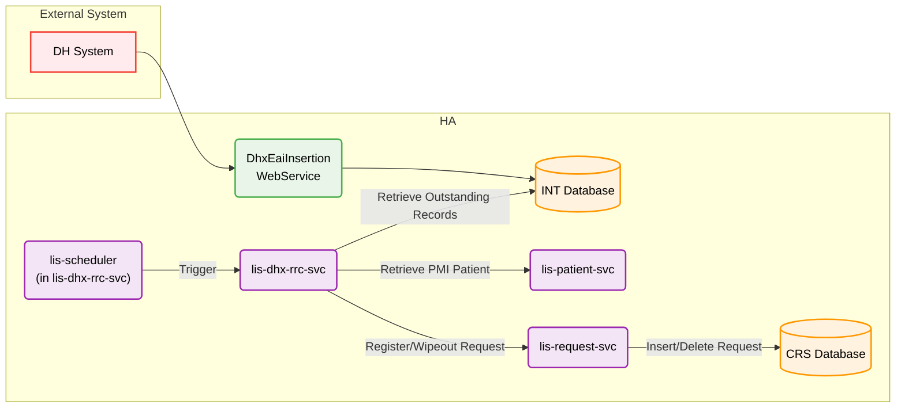
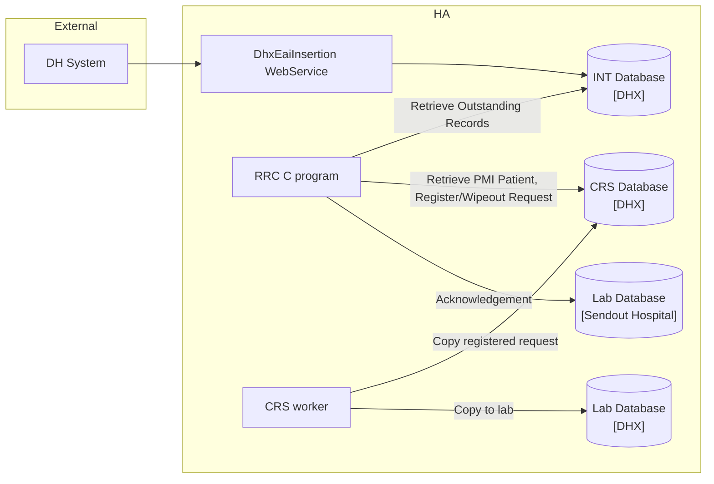
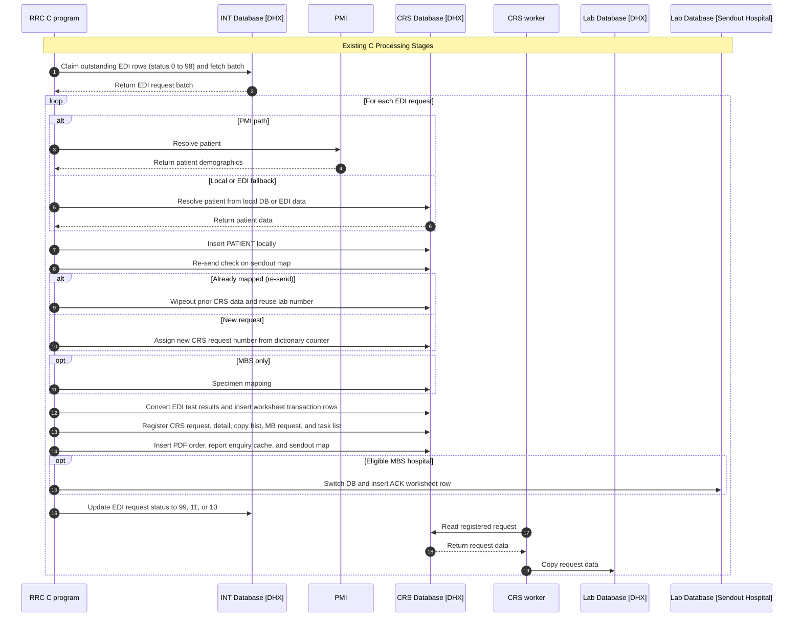
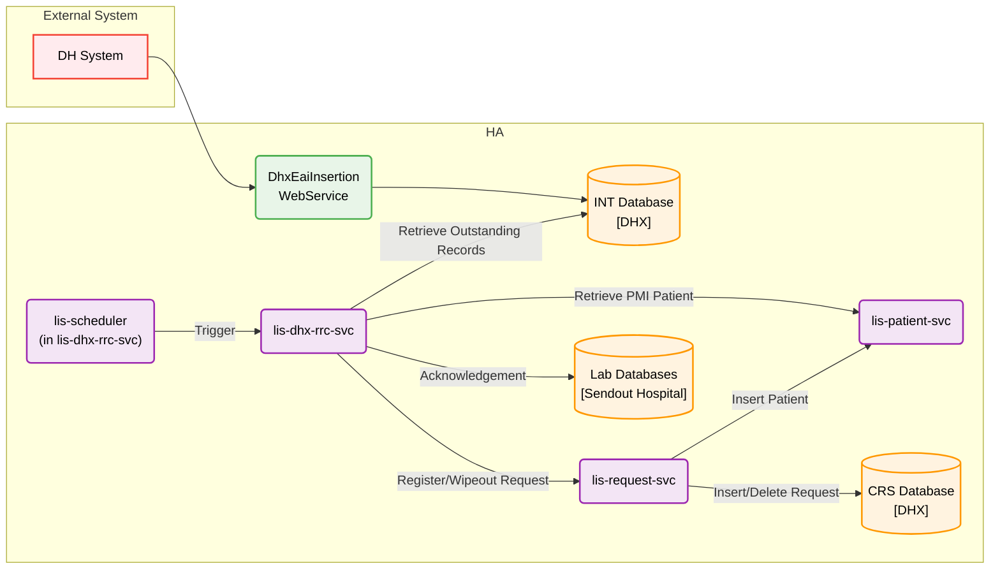

# Develop cloud application `lis-dhx-rrc-svc` to replace the legacy RRC worker and support dynamic Sybase/PostgreSQL database connectivity during DB migration

## Request Type

**Type:** Change Request  
**Priority:** Medium

## Request Summary

Develop cloud application `lis-dhx-rrc-svc` to replace the legacy RRC worker and support dynamic Sybase/PostgreSQL database connectivity during DB migration

## Background

The RRC (Request & Result Conversion) function converts inbound Department of Health (DH) laboratory test results into HA LIS CRS-native data structures, enabling structured result sharing to downstream consumers within HA. Today this runs as a legacy C Unix socket daemon (`lis_sp_lisg_rrc.c` + `rrc_work.c`) that polls an intermediate Sybase database (INT_DB) for EDI records (`EDI_REQUEST`, `EDI_DH_INFO`, `EDI_TESTRSLT`), resolves patients via PMI, registers or wipeouts CRS requests, translates test results, and dispatches DH acknowledgements.

The legacy implementation is tightly coupled to Sybase via CT-Lib and stored-procedure-style database access. With the ongoing Sybase-to-PostgreSQL migration, a technical solution is required that preserves identical business behaviour and output while allowing each hospital environment to connect to either Sybase or PostgreSQL based on central configuration.

The revamped `lis-dhx-rrc-svc` Spring Boot microservice has been designed to replace the C daemon with a REST-triggered cloud application (`POST /api/rrcProcess`), Spring Data JPA persistence, and dynamic data-source routing via `DataSourceContextHolder` (INT_DB on Sybase, LAB_DB/CRS on PostgreSQL). This change request covers building, configuring, and deploying that cloud application to production readiness.

## Change Description

1. **Replace legacy RRC worker with cloud application (`lis-dhx-rrc-svc`):**
   - Re-implement all RRC business logic from `lis_sp_lisg_rrc.c` / `rrc_work.c` in Java 17 / Spring Boot 3.3, preserving lab-number–driven prefix routing (CPS/HMS/MBS), patient resolution, re-send (wipeout) detection, specimen mapping, test-result dictionary validation, PDF order insertion, and DH acknowledgement dispatch.
   - Expose `POST /api/rrcProcess` (triggered by `lis-common-scheduler-svc`) as the replacement for the continuous Unix socket daemon polling model.
   - Integrate with `lis-patient-svc` (PMI patient resolution) and `lis-request-svc` (CRS request registration and activation). DH acknowledgement is handled internally within `lis-dhx-rrc-svc`.

2. **Support dynamic Sybase or PostgreSQL connectivity per environment:**
   - Use the `data-source` library and `DataSourceContextHolder` for thread-local routing between INT_DB (Sybase — EDI source) and LAB_DB (PostgreSQL — CRS target).
   - Bind JDBC connection parameters via OpenShift ConfigMaps/Secrets (`sybase-jdbc`, `postgresql-jdbc`) and Spring Boot YAML profiles (`dev`, `devqa`, `sit`, `lpt`, `prd`) so each hospital environment connects to the correct database without code changes.

3. **Preserve data model and processing semantics:**
   - Read/update INT_DB tables: `EDI_REQUEST`, `EDI_DH_INFO`, `EDI_TESTRSLT` (status lifecycle: `0` → `98` → `99`/`10`/`11`).
   - Write LAB_DB tables via registration and DHX-local steps: `CRS_REQUEST`, `CRS_REQUEST_DETAIL`, `TRANS_TESTRSLT_WKT` (via `lis-request-svc` register), `SENDOUT_REQNO_MAP`, `PDF_ORDER`, `LISG_TASKLIST`, and related CRS entities.
   - Maintain per-request `@Transactional` boundaries and atomic request claiming to prevent double-processing across concurrent pod instances.

### System Architecture

## Justification

This change ensures uninterrupted DH lab result conversion services during and after the Sybase-to-PostgreSQL transition. It decouples RRC processing from Sybase-specific stored procedures and CT-Lib, aligns with DHP cloud migration goals, and provides a maintainable, observable Spring Boot service with structured ALS logging, OpenShift deployment, and environment-driven database routing.

## Target Completion Date

30th Jul, 2026

## Reference Logs

- LIS-10325

## Design

**Review type:** full
**JIRA key:** LIS-10325
**Service:** lis-dhx-rrc-svc
**Review forum:** CP3
**Review date:** 30th Jul, 2026
**Prior review:** none

### Agenda
Background
Existing Design (C Program)
New Design and Key Changes
Stage Differences (C vs Revamp)
Promotion
Fallback
Q&A

### Slide: Background
RRC converts inbound DH laboratory test results into HA LIS CRS-native data for downstream sharing
Today this runs as a legacy C Unix socket daemon tightly coupled to Sybase via CT-Lib
Sybase-to-PostgreSQL migration requires a cloud replacement with identical business output
This review focuses on what changes from the C program versus what stays the same

### Slide: Background - Supported Labs
| labNo | Lab | Prefix 1 | Prefix 2 | Source System |
| --- | --- | --- | --- | --- |
| 1 | CPS | A | _(none)_ | C |
| 3 | HMS | N | _(none)_ | N |
| 7 | MBS | M | V | M |
Lab number drives EDI prefix and source-system filters in both C and revamp

### Slide: Existing Design - C Architecture
DH submits results via DhxEaiInsertion WebService into Sybase INT_DB EDI tables
C RRC daemon runs continuously on an on-premises Unix host and polls INT_DB
PMI, CRS tables, and acknowledgements are read or written directly from the daemon

### Slide: Existing Design - C Architecture Diagram

RRC writes to CRS Database [DHX]; CRS worker then copies registered data to Lab Database [DHX]

### Slide: Existing Design - C Processing Stages
1. Claim outstanding EDI rows (status 0 to 98) and fetch batch
2. Resolve patient via PMI path or local/EDI fallback; insert PATIENT locally
3. Re-send check on sendout map; wipeout prior CRS data and reuse lab number if needed
4. Assign new CRS request number from dictionary counter when not reusing
5. Specimen mapping for MBS only
6. Convert EDI test results and insert worksheet transaction rows locally
7. Register CRS request, detail, copy hist, MB request, and task list locally
8. Insert PDF order, report enquiry cache, and sendout map locally
9. DH acknowledgement - switch to sendout hospital DB and insert ACK worksheet row
10. Update EDI request status to 99, 11, or 10
11. CRS worker copies registered request from CRS Database [DHX] to Lab Database [DHX]

### Slide: Existing Design - C Processing Sequence Diagram

RRC stages 1–10 run in the C daemon; CRS worker then copies CRS Database [DHX] to Lab Database [DHX]

### Slide: Existing Design - EDI Status Lifecycle
| Status | Meaning                                    |
| ------ | ------------------------------------------ |
| 0      | Outstanding - awaiting processing          |
| 98     | Claimed - stamped with processing datetime |
| 99     | Completed successfully                     |
| 11     | Registered with dictionary error           |
| 10     | Processing failure                         |
Status semantics are preserved in the revamp; atomic claim still prevents double-processing

### Slide: New Design - Architecture Overview
Cloud application lis-dhx-rrc-svc replaces the C program
Triggered by lis-scheduler in lis-dhx-rrc-svc per lab
Dynamic Sybase/PG routing
Patient PMI lookup and refresh of existing PATIENT go through lis-patient-svc
CRS core registration, PATIENT insert for new patients, and worksheet result insert go through lis-request-svc
Wipeout, DHX-local PDF/map/cache, and DH acknowledgement remain inside lis-dhx-rrc-svc

### Slide: New Design - Architecture Diagram

Highlighted changes: PMI and CRS registration delegated to external services; ACK stays in lis-dhx-rrc-svc

### Slide: Stage Diff - Request Claiming
C: daemon claims matching EDI_REQUEST and EDI_TESTRSLT from status 0 to 98, then fetches up to 100 rows
Revamp: same claim and fetch semantics against INT_DB
Difference: continuous daemon poll replaced by scheduled REST trigger per lab
Owner: lis-dhx-rrc-svc (unchanged business ownership)

### Slide: Stage Diff - Patient Resolution
C: PMI or local/EDI fallback, then insert or update PATIENT inside the RRC transaction
Revamp: resolve patient data via lis-patient-svc; build registration payload only
Difference: lis-dhx-rrc-svc does not insert PATIENT for new patients
New PATIENT create and payload-driven persistence happen in lis-request-svc during register
Existing local PATIENT may still be refreshed via lis-patient-svc before registration

### Slide: Stage Diff - Re-send Wipeout
C: if DH request already mapped, wipe prior CRS tables and reuse previous lab number
Revamp: same wipeout and reuse ownership inside lis-dhx-rrc-svc
Difference: if worksheet rows still exist for the prior request, processing is deferred for later retry
Owner: lis-dhx-rrc-svc (not moved to lis-request-svc)

### Slide: Stage Diff - Request Number Assignment
C: new requests allocate lab number from dictionary counter; re-sends reuse wiped-out number
Revamp: same counter and reuse behaviour inside lis-dhx-rrc-svc
Difference: none material to business outcome
Owner: lis-dhx-rrc-svc

### Slide: Stage Diff - Specimen Mapping
C: MBS only maps DH specimen type to CRS keyword; CPS and HMS skip
Revamp: same MBS-only mapping inside lis-dhx-rrc-svc
Difference: none material to business outcome
Owner: lis-dhx-rrc-svc

### Slide: Stage Diff - Test Result Construction
C: convert EDI results and insert worksheet transaction rows during construct
Revamp: convert and validate in memory only inside lis-dhx-rrc-svc
Difference: no local TRANS_TESTRSLT or TRANS_TESTRSLT_GP insert from RRC
Only TRANS_TESTRSLT_WKT is written, deferred to lis-request-svc during register
Dictionary errors still flag EDI status 11 without full rollback of registration path

### Slide: Stage Diff - CRS Registration
C: prepare and insert CRS request, detail, copy hist, MB request, and task list inside RRC
Revamp: build registration payload in lis-dhx-rrc-svc; call lis-request-svc register then activate
Difference: CRS core writes and new PATIENT insert move to lis-request-svc
On post-register failure, revamp compensates register and rethrows (mirrors C rollback gate)
Owner: lis-request-svc for core CRS; lis-dhx-rrc-svc orchestrates the call

### Slide: Stage Diff - DHX-local Post-Register
C: PDF order, report enquiry cache, and sendout map written in the same local transaction as CRS
Revamp: after successful register, lis-dhx-rrc-svc still writes PDF, cache, and sendout map
Task list is queued via lis-request-svc activate rather than a direct local insert from RRC
Difference: split between DHX-local tables (RRC) and task list activation (lis-request-svc)

### Slide: Stage Diff - DH Acknowledgement
C: for eligible MBS hospitals, switch to sendout hospital server and insert ACK worksheet row
Revamp: same ownership inside lis-dhx-rrc-svc - not an lis-request-svc API
CPS and HMS skip ACK; invalid DH lab number or empty hospital list also skip
ACK write failure sets EDI status 10; CRS registration is retained without compensation rollback
Difference: platform and config only; business ACK model matches C

### Slide: Stage Diff - EDI Status Update
C: final EDI_REQUEST status 99 success, 11 dictionary error, or 10 failure
Revamp: same final status values and meanings
Difference: failure handling spans INT_DB status update plus optional register compensation
Owner: lis-dhx-rrc-svc updates EDI status after orchestration completes

### Slide: Promotion
1. Deploy lis-dhx-rrc-svc to DEV and DEVQA with Sybase INT_DB and PostgreSQL LAB_DB config
2. Execute test plan covering all three labs and negative scenarios against C-equivalent outcomes
3. Promote to SIT and LPT; verify EDI status lifecycle and CRS output match legacy C worker
4. Enable scheduled HTTP trigger per lab for the cloud service
5. Cutover per hospital: disable legacy C daemon, enable cloud trigger
6. Monitor EDI_REQUEST status distribution and CRS registrations post go-live

### Slide: Fallback
1. Re-enable legacy C RRC daemon on the affected hospital server
2. Disable scheduled HTTP trigger for lis-dhx-rrc-svc
3. Revert OpenShift deployment to previous lis-dhx-rrc-svc version if needed
4. EDI_REQUEST rows left in status 98 may need manual reset to status 0 for re-processing
5. CRS data already written by the cloud service remains; no automatic LAB_DB rollback

### Slide: Q&A
