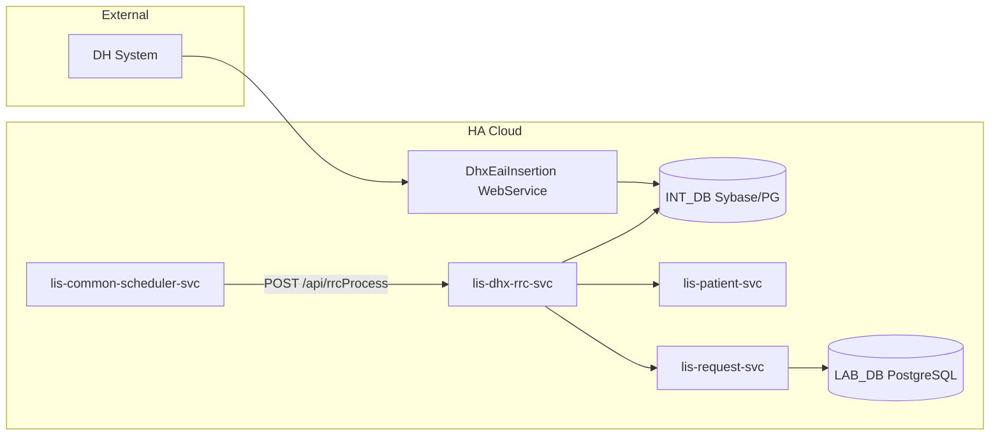

# Develop cloud application `lis-dhx-rrc-svc` to replace the legacy RRC worker and support dynamic Sybase/PostgreSQL database connectivity during DB migration

## Request Type

**Type:** Change Request  
**Priority:** Medium

## Request Summary

Develop cloud application `lis-dhx-rrc-svc` to replace the legacy RRC worker and support dynamic Sybase/PostgreSQL database connectivity during DB migration.

## Background

The RRC (Request & Result Conversion) function converts inbound District Health (DH) laboratory test results into HA LIS CRS-native data structures, enabling structured result sharing to downstream consumers within HA. Today this runs as a legacy C Unix socket daemon (`lis_sp_lisg_rrc.c` + `rrc_work.c`) that polls an intermediate Sybase database (INT_DB) for EDI records (`EDI_REQUEST`, `EDI_DH_INFO`, `EDI_TESTRSLT`), resolves patients via PMI, registers or wipeouts CRS requests, translates test results, and dispatches DH acknowledgements.

The legacy implementation is tightly coupled to Sybase via CT-Lib and stored-procedure-style database access. With the ongoing Sybase-to-PostgreSQL migration, a technical solution is required that preserves identical business behaviour and output while allowing each hospital environment to connect to either Sybase or PostgreSQL based on central configuration.

The revamped `lis-dhx-rrc-svc` Spring Boot microservice has been designed to replace the C daemon with a REST-triggered cloud application (`POST /api/rrcProcess`), Spring Data JPA persistence, and dynamic data-source routing via `DataSourceContextHolder` (INT_DB on Sybase, LAB_DB/CRS on PostgreSQL). This change request covers building, configuring, and deploying that cloud application to production readiness.

## Change Description

1. **Replace legacy RRC worker with cloud application (`lis-dhx-rrc-svc`):**
   - Re-implement all RRC business logic from `lis_sp_lisg_rrc.c` / `rrc_work.c` in Java 17 / Spring Boot 3.3, preserving lab-number–driven prefix routing (CPS/HMS/MBS), patient resolution, re-send (wipeout) detection, specimen mapping, test-result dictionary validation, PDF order insertion, and DH acknowledgement dispatch.
   - Expose `POST /api/rrcProcess` (triggered by `lis-common-scheduler-svc`) as the replacement for the continuous Unix socket daemon polling model.
   - Integrate with `lis-patient-svc` (PMI patient resolution) and `lis-request-svc` (request registration/wipeout and DH ACK dispatch).

2. **Support dynamic Sybase or PostgreSQL connectivity per environment:**
   - Use the `data-source` library and `DataSourceContextHolder` for thread-local routing between INT_DB (Sybase — EDI source) and LAB_DB (PostgreSQL — CRS target).
   - Bind JDBC connection parameters via OpenShift ConfigMaps/Secrets (`sybase-jdbc`, `postgresql-jdbc`) and Spring Boot YAML profiles (`dev`, `devqa`, `sit`, `lpt`, `prd`) so each hospital environment connects to the correct database without code changes.

3. **Preserve data model and processing semantics:**
   - Read/update INT_DB tables: `EDI_REQUEST`, `EDI_DH_INFO`, `EDI_TESTRSLT` (status lifecycle: `0` → `98` → `99`/`10`/`11`).
   - Write LAB_DB tables: `CRS_REQUEST`, `CRS_REQUEST_DETAIL`, `TRANS_TESTRSLT`, `SENDOUT_REQNO_MAP`, `PDF_ORDER`, `LISG_TASKLIST`, and related CRS entities.
   - Maintain per-request `@Transactional` boundaries and atomic request claiming to prevent double-processing across concurrent pod instances.

### System Architecture

## Justification

This change ensures uninterrupted DH lab result conversion services during and after the Sybase-to-PostgreSQL transition. It decouples RRC processing from Sybase-specific stored procedures and CT-Lib, aligns with DHP cloud migration goals, and provides a maintainable, observable Spring Boot service with structured ALS logging, OpenShift deployment, and environment-driven database routing.

## Target Completion Date

30th Jul, 2026

## Reference Logs

- LIS-10325
