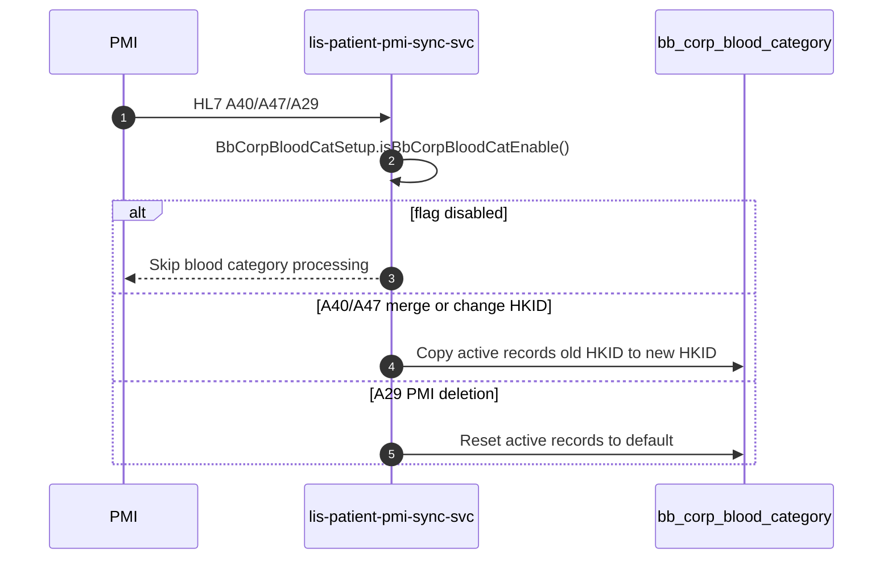

# Enhance `lis-patient-pmi-sync-svc` to support Handling of Patient Merge and Deletion on Corporate Special Blood Category

## Request Type

**Type:** Change Request  
**Priority:** Medium

## Request Summary

Enhance `lis-patient-pmi-sync-svc` to support Handling of Patient Merge and Deletion on Corporate Special Blood Category

## Background

The current handling of patient merge and patient deletion on corporate special blood category is managed through a table trigger (`transaction_log_tr`) on `transaction_log`. This trigger supports CPI transaction types **020** (Merge HKID), **031** (Change HKID), and **250** (PMI Deletion). When an insert occurs on `transaction_log`, the trigger iterates active records in `bb_corp_blood_category` and either copies corporate special blood requirements from the old HKID to the new HKID (merge/change HKID), or resets requirements to default values on patient deletion.

As part of the system enhancement, the logic is to be revamped into the ECP service `lis-patient-pmi-sync-svc` to modernize the process and align with the updated architecture. The service currently subscribes to **A40** (020 CPI transaction) and **A47** (031 CPI transaction). Handling of patient merge on corporate special blood category will be added for these events. The service will additionally support **A29** (250 CPI transaction) to handle patient deletion on corporate special blood category.

## Change Description

1. **Revamp the table trigger logic into `lis-patient-pmi-sync-svc`:**
   - Migrate existing logic from `transaction_log_tr` (see `docs/LIS-10583/transaction_log_tr.sql`) into the ECP service.
   - Implement equivalent behaviour in `BbCorpBloodCategoryService`:
     - `processBbCorpBloodCatForMergeOrChangeHKID` — copy active `bb_corp_blood_category` records from old HKID to new HKID when `blood_value = 1` and not already active on new HKID; set `patient_log_type` to `020` (A40) or `031` (A47); build merge/change remark.
     - `processBbCorpBloodCatForPMIDeletion` — insert reset records with default `blood_value` (`0`, or `2` for `blood_key = 537`); set `patient_log_type` to `250`.
   - Gate processing via `BbCorpBloodCatSetup.isBbCorpBloodCatEnable()` (feature flag).

2. **Enhance subscription handling in `lis-patient-pmi-sync-svc`:**
   - **A40 / A47 (patient merge or change HKID):** invoke blood category handling from `PatientAppServiceImpl.mergePid()` after successful PID merge — uses `BbCorpBloodCategoryService.getActiveBloodCategories(oldHkid)` and `processBbCorpBloodCatForMergeOrChangeHKID`.
   - **A29 (PMI deletion):** route in `PatientSyncServiceImpl` to `PatientAppServiceImpl.deletePMI()`; process active blood categories for the patient HKID and reset via `processBbCorpBloodCatForPMIDeletion`.
   - Persist access through `BbCorpBloodCategoryRepository` / entity `BbCorpBloodCategory` (PostgreSQL and Sybase implementations).

3. **Maintain data integrity and logging:**
   - Preserve trigger semantics: copy requirements old → new HKID on merge/change; reset to default on deletion; set `corp_alert_status = 21` on new records.
   - Roll back patient merge on blood category failure (`RollbackException` in `mergePid`).
   - Implement audit logging via ALS (`info` / `warn` in `BbCorpBloodCategoryService`, `PatientAppServiceImpl.deletePMI`) for processing details and errors.

## Justification

Revamping the handling of patient merge and deletion on corporate special blood category into the `lis-patient-pmi-sync-svc` ECP service is essential for modernizing the system architecture. This change ensures alignment with the updated PMI subscription model and accurate management of special blood requirements during patient merges and deletions, replacing legacy trigger-based processing with a maintainable, observable service implementation.

## Target Completion Date

17th Apr, 2026

## Reference Logs

- LIS-7291
- LIS-8200

## Design

**Review type:** incremental
**JIRA key:** LIS-10583
**Service:** lis-patient-pmi-sync-svc
**Review forum:** CP3
**Review date:** TBC — 9th Jul 2026 lapsed
**Target completion:** TBC — frontmatter says 30 Jul 2026, body says 17 Apr 2026; both lapsed
**Prior review:** none

### Agenda
Background
Design Review
Promotion
Fallback
Q&A

### Slide: How we got here
**Archetype:** evolution
Corporate special blood requirements have always been maintained by a database trigger
The PMI sync service later took over patient merge and change-HKID handling, but not blood category
Both mechanisms now touch the same records — the trigger is the last piece left behind

### Slide: Which events matter
**Archetype:** matrix
| CPI type | ADT event | Action on bb_corp_blood_category | Today | After |
| --- | --- | --- | --- | --- |
| 020 | A40 Merge HKID | Copy active requirements old to new HKID | Trigger | Service |
| 031 | A47 Change HKID | Copy active requirements old to new HKID | Trigger | Service |
| 250 | A29 PMI Deletion | Reset requirements to default values | Trigger | Service - new subscription |
The service already subscribes to A40 and A47; A29 is the one new subscription

### Slide: What the trigger does today
**Archetype:** code-findings
The trigger fires on every insert to the transaction log and walks the patient's active blood categories
Reference: docs/LIS-10583/transaction_log_tr.sql
```sql
-- transaction_log_tr : AFTER INSERT ON transaction_log
FOR each latest active bb_corp_blood_category per blood_key
  IF cpi_type IN ('020','031')          -- merge / change HKID
     AND blood_value = 1
     AND no active record on new HKID
    INSERT copy -> new HKID
  IF cpi_type = '250'                   -- PMI deletion
    INSERT reset (blood_value 0, or 2 when blood_key = 537)
  SET corp_alert_status = 21
```
Findings: database-tier logic is invisible to service logging; no per-hospital switch; deletion never reached the service

### Slide: Proposed routing
**Archetype:** decision-flow
Every inbound merge, change-HKID or deletion message passes one gate before any blood category work
A per-hospital feature flag decides whether the service handles it at all
Merge and change-HKID copy the requirements forward; deletion resets them
```
BbCorpBloodCatSetup.isBbCorpBloodCatEnable()
```
Read from lab_option per hospital server, so sites can be switched on one at a time

### Slide: The two handlers
**Archetype:** compare
Merge and change-HKID copy active requirements from the old HKID to the new one, stamping the
originating CPI type. Deletion writes reset records instead of removing anything, so the history
survives.
| Handler | Trigger events | Writes | patient_log_type |
| --- | --- | --- | --- |
| Merge or change HKID | A40, A47 | Copy of each active requirement on the new HKID | 020 or 031 |
| PMI deletion | A29 | Reset record, blood_value 0 (2 when blood_key = 537) | 250 |
Both set corp_alert_status = 21; a blood category failure rolls the patient merge back

### Slide: Feature flag
**Archetype:** matrix
| Setting | Value |
| --- | --- |
| lab | 9 (CRS) |
| group | LIS_PATIENT_PMI_SYNC_SVC |
| code | BB_CORP_BLOOD_CAT_ENABLED |
| Enabled | option_value = 1 |
| Scope | Per hospital server |
When disabled, the merge still completes and blood category work is skipped with an audit entry

### Slide: Scope of change
**Archetype:** steps-sidebar
Move the trigger's behaviour into the service's blood category component
Call it after a successful merge for A40 and A47, and on the deletion path for A29
Subscribe to A29, which the service does not receive today
Audit every decision and failure through ALS, including the skip when the flag is off

### Diagram: corp-blood-category-flow


### Slide: Promotion
**Archetype:** cards
Deploy the service with the blood category component and the A29 subscription
Leave the feature flag off, then enable it one hospital at a time
Verify merge, change-HKID and deletion in SIT with the flag both on and off
Retire the trigger only after a parallel run confirms both paths agree

### Slide: Fallback
**Archetype:** cards
Set BB_CORP_BLOOD_CAT_ENABLED = 0 — the fastest reversal, per hospital, no deployment
Revert the service deployment if the problem is not confined to blood category handling
Re-enable the trigger if it was already retired

### Slide: Q&A
