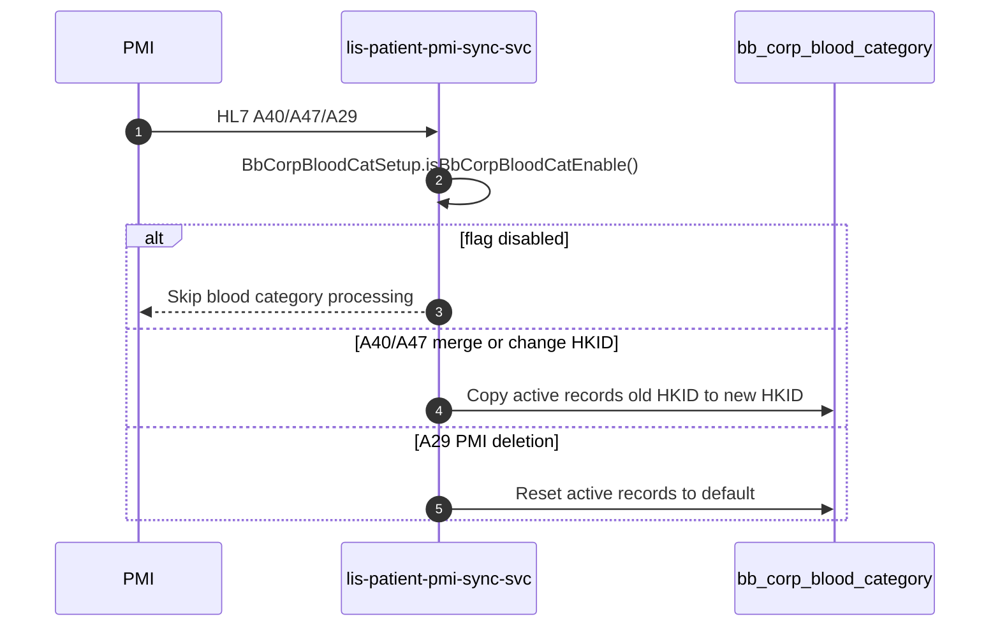

# Enhance `lis-patient-pmi-sync-svc` to support Handling of Patient Merge and Deletion on Corporate Special Blood Category

## Request Type

**Type:** Change Request  
**Priority:** Medium

## Request Summary

Enhance `lis-patient-pmi-sync-svc` to support Handling of Patient Merge and Deletion on Corporate Special Blood Category

## Background

The current handling of patient merge and patient deletion on corporate special blood category is managed through a table trigger (`transaction_log_tr`) on `transaction_log`. This trigger supports CPI transaction types **020** (Merge HKID), **031** (Change HKID), and **250** (PMI Deletion). When an insert occurs on `transaction_log`, the trigger iterates active records in `bb_corp_blood_category` and either copies corporate special blood requirements from the old HKID to the new HKID (merge/change HKID), or resets requirements to default values on patient deletion.

As part of the system enhancement, the logic is to be revamped into the ECP service `lis-patient-pmi-sync-svc` to modernize the process and align with the updated architecture. The service currently subscribes to **A40** (020 CPI transaction) and **A47** (031 CPI transaction). Handling of patient merge on corporate special blood category will be added for these events. The service will additionally support **A29** (250 CPI transaction) to handle patient deletion on corporate special blood category.

## Change Description

1. **Revamp the table trigger logic into `lis-patient-pmi-sync-svc`:**
   - Migrate existing logic from `transaction_log_tr` (see `docs/LIS-10583/transaction_log_tr.sql`) into the ECP service.
   - Implement equivalent behaviour in `BbCorpBloodCategoryService`:
     - `processBbCorpBloodCatForMergeOrChangeHKID` — copy active `bb_corp_blood_category` records from old HKID to new HKID when `blood_value = 1` and not already active on new HKID; set `patient_log_type` to `020` (A40) or `031` (A47); build merge/change remark.
     - `processBbCorpBloodCatForPMIDeletion` — insert reset records with default `blood_value` (`0`, or `2` for `blood_key = 537`); set `patient_log_type` to `250`.
   - Gate processing via `BbCorpBloodCatSetup.isBbCorpBloodCatEnable()` (feature flag).

2. **Enhance subscription handling in `lis-patient-pmi-sync-svc`:**
   - **A40 / A47 (patient merge or change HKID):** invoke blood category handling from `PatientAppServiceImpl.mergePid()` after successful PID merge — uses `BbCorpBloodCategoryService.getActiveBloodCategories(oldHkid)` and `processBbCorpBloodCatForMergeOrChangeHKID`.
   - **A29 (PMI deletion):** route in `PatientSyncServiceImpl` to `PatientAppServiceImpl.deletePMI()`; process active blood categories for the patient HKID and reset via `processBbCorpBloodCatForPMIDeletion`.
   - Persist access through `BbCorpBloodCategoryRepository` / entity `BbCorpBloodCategory` (PostgreSQL and Sybase implementations).

3. **Maintain data integrity and logging:**
   - Preserve trigger semantics: copy requirements old → new HKID on merge/change; reset to default on deletion; set `corp_alert_status = 21` on new records.
   - Roll back patient merge on blood category failure (`RollbackException` in `mergePid`).
   - Implement audit logging via ALS (`info` / `warn` in `BbCorpBloodCategoryService`, `PatientAppServiceImpl.deletePMI`) for processing details and errors.

## Justification

Revamping the handling of patient merge and deletion on corporate special blood category into the `lis-patient-pmi-sync-svc` ECP service is essential for modernizing the system architecture. This change ensures alignment with the updated PMI subscription model and accurate management of special blood requirements during patient merges and deletions, replacing legacy trigger-based processing with a maintainable, observable service implementation.

## Target Completion Date

17th Apr, 2026

## Reference Logs

- LIS-7291
- LIS-8200

## Design

**Review type:** incremental
**JIRA key:** LIS-10583
**Service:** lis-patient-pmi-sync-svc
**Review forum:** CP3
**Review date:** 9th Jul, 2026
**Prior review:** none

### Agenda
Background
Design Review
Promotion
Fallback
Q&A

### Slide: Background
Corporate special blood category for patient merge/deletion is handled by legacy trigger transaction_log_tr
Trigger fires on INSERT to transaction_log
Supports CPI types 020 (Merge HKID), 031 (Change HKID), 250 (PMI Deletion)
Logic revamp into lis-patient-pmi-sync-svc to align with PMI subscription architecture

### Slide: Background
| CPI type | HL7 / ADT | Trigger action on bb_corp_blood_category |
| --- | --- | --- |
| 020 | A40 Merge HKID | Copy active requirements from old HKID to new HKID |
| 031 | A47 Change HKID | Copy active requirements from old HKID to new HKID |
| 250 | A29 PMI Deletion | Reset requirements to default values |

### Slide: Existing Design - Legacy Trigger Logic
Iterate latest active bb_corp_blood_category per blood_key for old HKID (merge) or patient HKID (deletion)
Merge/change: copy record when blood_value = 1 and not already active on new HKID
Deletion: insert reset record (blood_value 0, or 2 when blood_key = 537)
Set corp_alert_status = 21 on new records
Reference: docs/LIS-10583/transaction_log_tr.sql

### Slide: Existing Design - PMI Sync Flow
PMI publishes HL7 messages to lis-patient-pmi-sync-svc
PatientSyncServiceImpl routes by transaction type (A40, A47, A29, ...)
A40/A47: PatientAppServiceImpl.mergePid() then patientUpdate()
A29: PatientAppServiceImpl.deletePMI()

### Slide: Proposed Change - Overview
Migrate transaction_log_tr logic to BbCorpBloodCategoryService
Handle A40/A47 merge and change HKID blood category copy in mergePid()
Handle A29 PMI deletion blood category reset in deletePMI()
Gate all processing via BbCorpBloodCatSetup per-hospital lab_option flag

### Slide: Proposed Change - BbCorpBloodCatSetup
Hospital-level feature flag via lab_option (BbCorpBloodCatSetup.java)
| Key | Value |
| --- | --- |
| lab | 9 (CRS) |
| group | LIS_PATIENT_PMI_SYNC_SVC |
| code | BB_CORP_BLOOD_CAT_ENABLED |
| Enabled | option_value = 1 |
| Scope | Per hospital server (DataSourceContextHolder) |
When disabled: mergePid skips blood category copy; deletePMI returns success with skip message
PatientSyncController logs ALS info when flag is false at message entry

### Slide: Proposed Change - Merge and Change HKID (A40/A47)
After successful mergePid, call processBloodCategoryForPidChange when flag enabled
BbCorpBloodCategoryService.getActiveBloodCategories(oldHkid)
BbCorpBloodCategoryService.processBbCorpBloodCatForMergeOrChangeHKID
Sets patient_log_type 020 (A40) or 031 (A47)
Rollback merge on blood category failure (RollbackException)

### Slide: Proposed Change - PMI Deletion (A29)
PatientSyncServiceImpl routes A29 to deletePMI()
Skip when BB_CORP_BLOOD_CAT_ENABLED is false
BbCorpBloodCategoryService.processBbCorpBloodCatForPMIDeletion
Reset active records: blood_value 0 (or 2 for blood_key 537)
Sets patient_log_type 250; remark documents patient deletion reset

### Diagram: corp-blood-category-flow

### Slide: Promotion
Deploy lis-patient-pmi-sync-svc with BbCorpBloodCategoryService changes
Configure lab_option BB_CORP_BLOOD_CAT_ENABLED = 1 per hospital before go-live
Verify A40, A47, A29 processing in SIT with flag enabled and disabled
Retire or disable transaction_log_tr after parallel-run validation

### Slide: Fallback
Revert lis-patient-pmi-sync-svc deployment
Set BB_CORP_BLOOD_CAT_ENABLED = 0 to disable service-side processing per hospital
Re-enable transaction_log_tr if legacy trigger path is still required

### Slide: Q&A
