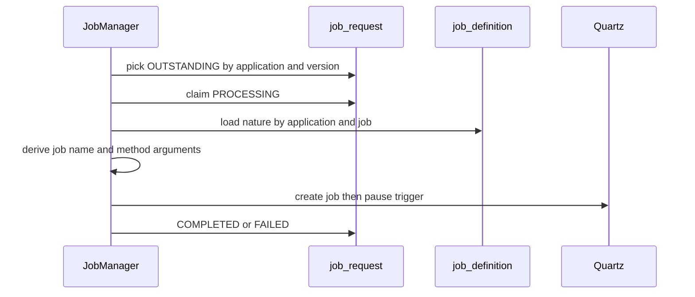

# Enhance `lis-scheduler` to Normalize Table-driven Job Definitions into `job_definition` and `job_request`

## Request Type

**Type:** Change Request  
**Priority:** Medium

## Request Summary

Enhance `lis-scheduler` to Normalize Table-driven Job Definitions into `job_definition` and `job_request`

## Background

Table-driven scheduling in `lis-scheduler` currently stores all job creation details in one table `dynamic_job_definition`. Fields common to the same job nature (`bean_name`, `method_name`, `concurrent`, `skip_on_overdue`) are repeated on every row for different hospital and lab. The table has to be normalized so that job nature is defined once and job creation is queued separately.

## Change Description

1. **Normalize `dynamic_job_definition` into two tables:**
   - `job_definition` — catalog of job nature (PK `application` + `job`):
     - `application`, `job`, `bean_name`, `method`, `concurrent`, `skip_on_overdue`
   - `job_request` — work queue for job creation (and future update/delete):
     - `id`, `application`, `job` (FK), `version`, `action` (CREATE / UPDATE / DELETE), `schedule`, `cron_expression`, `hosp`, `lab`, `parameters`, `status`, `status_message`, `created_at`, `updated_at`
   - Remove `max_retry` and `enabled`

2. **Derive Quartz job names by `JobManager`:**
   - Derive job name based on `application`, `job`, `hosp`, `lab`, `parameters`, `schedule` columns
	   - Format: `{PascalCase(application)}_{job}_{hosp}_{lab}_{paramSegments}_Sch{schedule}` 
	   - omit blank segments. 
	   - Method parmaters = `hosp` + `lab` + split(`parameters`).
   - Example:
	   - `LisTemplateSvc_AHN_CPS`
	   - `LisTemplateSvc_Echo_AHN_CPS_PARAM1_PARAM2`
	   - `LisTemplateSvc_AHN_CPS_Sch1`)

3. **Release `lis-scheduler` 1.1.0**
 
## Justification

Normalization allow defining a job nature once and insert hospital/lab/schedule-specific `job_request` rows without repeating bean/method settings. Derived names keep Quartz keys consistent.

## Target Completion Date

27th Aug, 2026

## Design

**Review type:** incremental
**JIRA key:** TBD
**Service:** lis-scheduler 1.1.0
**Review forum:** CP3
**Review date:** TBD
**Prior review:** [[Release lis-scheduler - LIS Common Scheduler Framework with Dynamic Job Creation and Versioning]] (LIS-10748)

### Agenda
Background
Design Review
Promotion
Fallback
Q&A

### Slide: Background
Table-driven jobs today live in one table: dynamic_job_definition
Bean, method, concurrency and skip-on-overdue are copied onto every hospital and lab row
Operators must also invent the Quartz job name by hand
This release splits nature from creation so each nature is defined once

### Slide: Existing Design - Table-driven create
A poller claims OUTSTANDING rows for this application (and version, when canary is on)
Each row already holds the Quartz name, cron, bean, method and parameters
The poller creates the Quartz job and leaves the trigger paused
Status then becomes COMPLETED or FAILED

### Slide: Proposed Change - Overview
Replace the single table with two:
- job_definition: catalog of job nature
- job_request: work queue for create (update/delete later)
Rename the poller to JobManager
Derive the Quartz name from application, job, hosp, lab, parameters and schedule
Release as lis-scheduler 1.1.0 (breaking DDL and config keys)

### Slide: Proposed Change - job_definition
**Archetype:** matrix
Catalog of job nature. Primary key is application plus job (empty job means the default nature).

| Column | Description |
| --- | --- |
| application | Must match spring.application.name |
| job | Nature key; use empty string for the default |
| bean_name | Spring bean to invoke |
| method | Method on that bean |
| concurrent | Allow overlapping runs |
| skip_on_overdue | Skip a late fire when non-concurrent |

max_retry and enabled are removed. Table-driven create always uses retry count 0.

### Slide: Proposed Change - job_request
**Archetype:** matrix
One row is one operation. Foreign key to job_definition. version sits after job for canary pickup.

| Column | Description |
| --- | --- |
| id | Surrogate key |
| application, job | FK to job_definition |
| version | APP_VERSION when include-version is on; otherwise NULL |
| action | CREATE, UPDATE or DELETE (default CREATE) |
| schedule | Optional discriminator; name suffix Sch{n} |
| cron_expression | Required for CREATE |
| hosp, lab | Naming segments and method arguments |
| parameters | Extra method arguments, comma-separated |
| status | OUTSTANDING, PROCESSING, COMPLETED, FAILED |

This release implements CREATE only. UPDATE and DELETE are recorded as FAILED (not implemented yet).

### Slide: Proposed Change - Job name
Quartz name is built at create time, not stored.
Only non-blank segments are joined with underscore.

Format: `{PascalCase(application)}_{job}_{hosp}_{lab}_{params}_Sch{schedule}`

| Example | How it is built |
| --- | --- |
| LisTemplateSvc_AHN_CPS | application + hosp + lab |
| LisTemplateSvc_Echo_AHN_CPS_PARAM1_PARAM2 | plus job and parameters |
| LisTemplateSvc_AHN_CPS_Sch1 | plus schedule 1 |

Method arguments passed to the bean: hosp, then lab, then split parameters.

### Diagram: job-manager-create

### Slide: Promotion
**Archetype:** matrix
Apply DDL (drop dynamic_job_definition, create the two new tables).
Publish lis-scheduler 1.1.0. Consumers rename JobManager config keys.

| Step | New | Version Upgrade | Service Extend |
| --- | :---: | :---: | :---: |
| Configuration | Yes | - | - |
| Deployment | Yes | Yes | - |
| Pause old version jobs | - | Yes | - |
| Insert job_definition / job_request | Yes | Yes | Yes |
| Trigger JobManager | Yes | Yes | Yes |
| Resume new jobs | Yes | Yes | Yes |

Created jobs stay paused until resume. Keep a job waiting on only one sched_name at a time.

### Slide: Fallback
Revert the consuming service to lis-scheduler 1.0.1
Restore dynamic_job_definition if rollback SQL is required (new tables can remain unused)
Pause any JobManager trigger created under 1.1.0
Restore prior ConfigMap keys (dynamic job creator cron / enablement)

### Slide: Q&A

## Reference Logs

- LIS-10748
