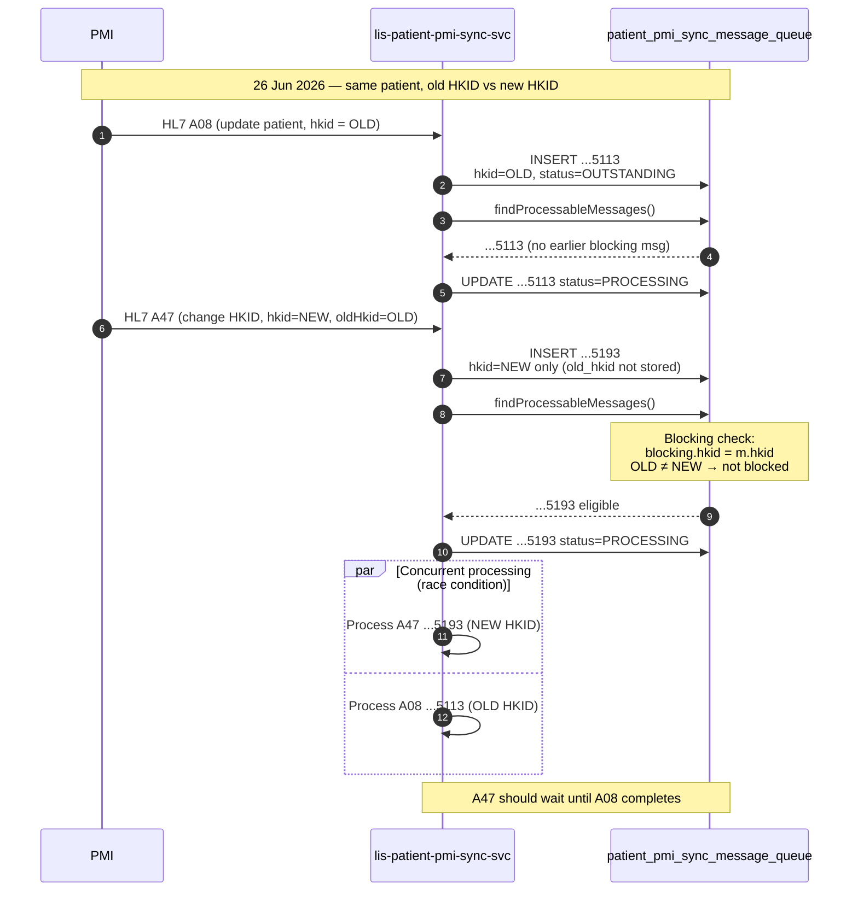
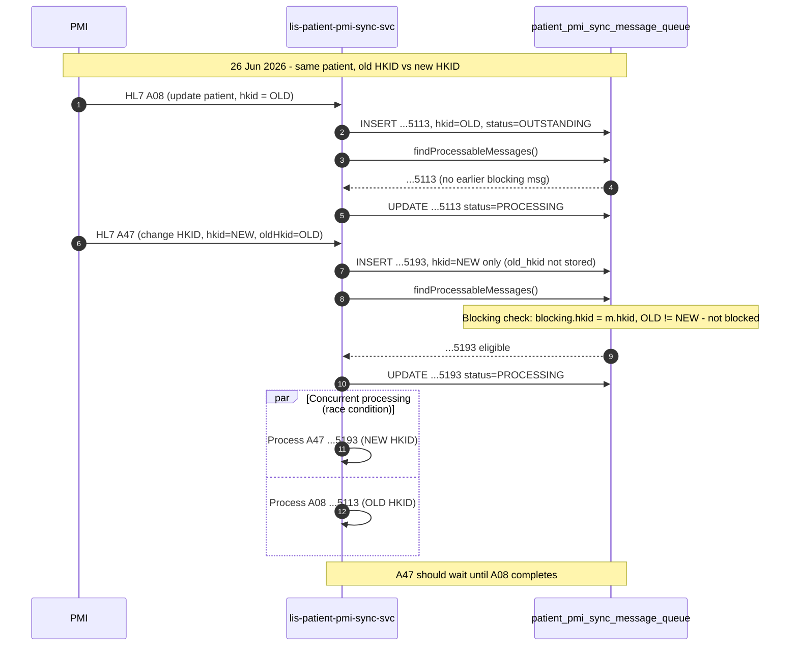

# Fix message queue blocking logic in `lis-patient-pmi-sync-svc` to check old HKID for A40/A45/A47 transactions

## Request Type

**Type:** Change Request  
**Priority:** Medium

## Request Summary

Fix message queue blocking logic in `lis-patient-pmi-sync-svc` to check old HKID for A40/A45/A47 transactions by adding an `old_hkid` column and updating retrieval queries.

## Background

`lis-patient-pmi-sync-svc` queues PMI patient sync messages in `patient_pmi_sync_message_queue` and processes them sequentially per HKID. Before a message is picked up, the scheduler checks for earlier blocking messages (status `FAILED`, `RETRY`, or `PROCESSING`) with the same HKID.

For A40 (Merge HKID), A45 (Move Episode), and A47 (Change HKID), each message carries both a **new HKID** and an **old HKID**. On insert, only the new HKID is stored in the `hkid` column (`MessageQueueService.queueMessage`). The old HKID exists only inside `parsed_message` (`PatientTransactionVo.oldHkid`) and is not persisted as a dedicated column.

A production incident on 26 Jun 2026 showed message `P5120260626094915113` (A08) in `PROCESSING` for the patient's old HKID, while message `P5120260626094915193` (A47) was picked up concurrently because the blocking check only compared `blocking.hkid = m.hkid` (new HKID). The A47 message was not blocked by the in-flight A08 message tied to the old HKID.

### Incident sequence (current behaviour)

## Change Description

1. **Database schema — add `old_hkid` column:**
   - Add `old_hkid VARCHAR(12) NULL` to `patient_pmi_sync_message_queue` on all hospital PostgreSQL/Sybase databases.
   - Provide DDL script under `sql/` for deployment.

2. **Entity update — `MessageQueue.java`:**
   - Add `oldHkid` field mapped to `old_hkid` column.

3. **Message enqueue — `MessageQueueService.java`:**
   - Populate `message.setOldHkid(patientTransactionVo.getOldHkid())` when queuing A40/A45/A47 (and any transaction where `oldHkid` is present).

4. **Blocking query updates — `MessageQueueRepository.java`:**
   - **`findProcessableMessages`**: extend the `NOT EXISTS` subquery so a message is blocked when an earlier message shares either HKID:
     - `blocking.hkid = m.hkid`
     - `blocking.hkid = m.oldHkid` (when `old_hkid` is not null)
     - `blocking.old_hkid = m.hkid` (when blocking row has `old_hkid`)
     - `blocking.old_hkid = m.oldHkid` (when both have `old_hkid`)
   - **`countPreviousBlockingMessages`**: add `oldHkid` parameter and apply the same matching logic for `determinePendingMessage`.

5. **Processor update — `MessageQueueProcessor.java`:**
   - Update `determinePendingMessage` (lines 380–401) to pass `message.getOldHkid()` into the amended blocking count query.

## Justification

Without old-HKID blocking, concurrent processing of related PMI transactions can cause data inconsistency — for example, an A47 (change HKID) running while an A08 (update patient info) for the same patient is still in `PROCESSING`. This undermines the sequential-per-patient guarantee the message queue was designed to enforce.

Persisting `old_hkid` and including it in blocking checks ensures A40/A45/A47 messages wait for all in-flight or failed messages associated with either the old or new HKID, preserving patient data integrity across LIS databases.

## Target Completion Date

16th Jul, 2026

## Design

**Review type:** incremental
**JIRA key:** LIS-10723
**Service:** lis-patient-pmi-sync-svc
**Review forum:** CP3
**Review date:** 3rd Jul, 2026
**Prior review:** none
**Slide source:** docs/Fix Message Queue Old HKID Blocking (LIS-10723).pptx.md

### Agenda
Background
Design Review
Promotion
Fallback
Q&A

### Slide: Background
Production issue reported by ITO on 26 Jun 2026
Message A08 (Patient Update) and A47 (Change HKID) was received in sequence
Message P5120260626094915113 (A08) set to PROCESSING for patient's old HKID
Message P5120260626094915193 (A47) picked up concurrently ~2 seconds later
A47 was not blocked until A08 completed
Message P5120260626094915193 (A47) was marked FAILED as a result

### Diagram: incident-sequence

### Slide: Background

Root cause: blocking check only compares blocking.hkid = m.hkid (new HKID)
For A40/A45/A47, old HKID is not stored in message queue table
Old HKID exists only inside parsed_message JSON

### Slide: Background
On enqueue, only new HKID is persisted to patient_pmi_sync_message_queue.hkid
Blocking messages for the old HKID are invisible to the retrieval query
| Type | Description | HKID in message |
| --- | --- | --- |
| A40 | Merge HKID | new HKID + old HKID |
| A45 | Move Episode | new HKID + old HKID |
| A47 | Change HKID | new HKID + old HKID |
| Other (e.g. A08) | Update patient info | HKID only |

### Slide: Existing Design - Message Queue Flow
Scheduler runs every 10 seconds per hospital server
Retrieve messages to be processed
OUTSTANDING, RETRY, PENDING
Selected messages set to PROCESSING before business logic runs
Check if message should be blocked
Status: FAILED, RETRY, PROCESSING
HKID = hkid column in patient_pmi_sync_message_queue

### Slide: Proposed Change - Overview
Add old_hkid column to patient_pmi_sync_message_queue
Populate old_hkid on enqueue
Enhance blocking mechanism to match on both hkid and old_hkid
No change to message processing business logic

### Slide: Proposed Change - Schema
New old_hkid column in patient_pmi_sync_message_queue
| Column | Type | Description |
| --- | --- | --- |
| old_hkid | VARCHAR(12) NULL | Previous HKID for A40/A45/A47; NULL for other types |

### Slide: Proposed Change - Amended Blocking Logic
A message is blocked when an earlier message blocking matches ANY of:
blocking.hkid = m.hkid
blocking.hkid = m.oldHkid (when old_hkid is not null)
blocking.old_hkid = m.hkid (when blocking has old_hkid)
blocking.old_hkid = m.oldHkid (when both have old_hkid)

### Slide: Proposed Change - Incident Timeline (Fixed)
With old_hkid persisted and checked, A47 waits for in-flight A08 on the same patient identity
| Time | Message | Type | Event |
| --- | --- | --- | --- |
| 09:49:18.300 | ...5113 | A08 | Queued (old HKID) |
| 09:49:18.392 | ...5113 | A08 | Set PROCESSING |
| 09:49:18.560 | ...5193 | A47 | Queued (new HKID) |
| After fix | ...5193 | A47 | Blocked until ...5113 completes |

### Slide: Promotion
Deploy DDL - add old_hkid column on all hospital DBs (PG + Sybase)
Deploy lis-patient-pmi-sync-svc

### Slide: Fallback
Revert lis-patient-pmi-sync-svc deployment to previous version
old_hkid column can remain (nullable, unused by old code)

### Slide: Q&A
