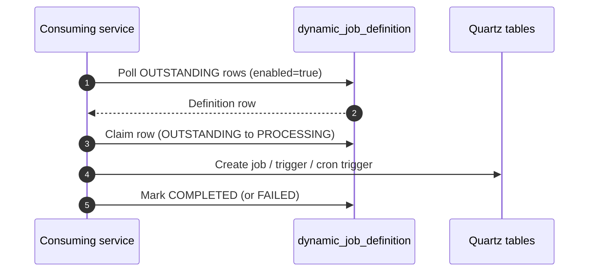

# Release `lis-scheduler` — LIS Common Scheduler Framework with Dynamic Job Creation and Versioning

## Request Type

**Type:** Change Request  
**Priority:** Medium

## Request Summary

Release `lis-scheduler` — LIS Common Scheduler Framework with Dynamic Job Creation and Versioning

## Background

LIS microservices that need scheduled jobs previously relied on the centralized `lis-common-scheduler-svc`, which defined jobs in one shared service and triggered target microservices over HTTP. That model did not scale well for hospital-specific jobs, made canary cutover difficult, and could not use `skipOnOverdue` reliably because of gateway timeouts.

The CMS Chassis team provides [cms-common-schedulerfwk](https://hagithub.home/CMSCHASSIS/cms-common-schedulerfwk) as the underlying Quartz scheduler framework. LIS is releasing **`lis-scheduler`** (`hk.org.ha.lis:lis-scheduler`) as the **LIS Common Scheduler Framework** — a reusable Spring Boot library that embeds cms-common-schedulerfwk into consuming microservices, and enhances it with:

- **Dynamic job creation** — table-driven definitions in `dynamic_job_definition`, polled by `DynamicJobCreatorJob`
- **Versioning** — versioned Quartz `sched_name` (`SCHEDULER_INCLUDE_VERSION`) so each deployment version has an isolated job set, enabling **canary deployment** of scheduler-backed services without double-firing

Jobs run in-process inside each consuming service. They can be registered at compile time (`@CmsScheduler`) or at runtime via the dynamic job table / REST APIs. Job replication between `sched_name` values supports phased canary cutover.

Mandatory shared setup for the release includes creating `dynamic_job_definition` in the scheduler PostgreSQL schema and adding schema / prefix / creator-cron keys to OpenShift ConfigMap `scheduler-svc-config`.

## Change Description

1. **Release LIS Common Scheduler Framework (`lis-scheduler` v1.0.0):**
   - Ship reusable Spring Boot library `hk.org.ha.lis:lis-scheduler` that packages cms-common-schedulerfwk behind auto-configuration gated by `cms-scheduler.enabled` / `SCHEDULER_ENABLED`.
   - Provide scheduler PostgreSQL datasource and JPA wiring (`SchedulerDataSourceConfig`, `SchedulerJpaConfig`).
   - Expose REST APIs via `LisSchedulerController`: `POST /api/scheduler/create-job`, `POST /api/scheduler/replicate-jobs`, `GET /api/scheduler/jobs`.
   - Do not require consumers to depend on `common-schedulerfwk` directly — it is pulled in transitively.

2. **Enhance with dynamic job creation:**
   - Introduce table-driven definitions via `dynamic_job_definition` (entity `DynamicJobDefinition`, service `DynamicJobDefinitionService`).
   - Run `DynamicJobCreatorJob` (`@CmsScheduler`) to claim `OUTSTANDING` rows and create Quartz jobs (status lifecycle: `OUTSTANDING` → `PROCESSING` → `COMPLETED` / `FAILED`).
   - Create PostgreSQL table `scheduler.dynamic_job_definition` (DDL from `db_dynamic_job_definition_postgresql.sql`), including unique index on `(application_name, job_name)` and pickup index on `(application_name, status, enabled, updated_at)`.

3. **Enhance with versioning for canary deployment:**
   - Support versioned `sched_name` via `SCHEDULER_INCLUDE_VERSION` and `APP_VERSION` so concurrent service versions (e.g. `lis-template-svc-v1-0-0-scheduler` vs `lis-template-svc-v2-0-0-scheduler`) do not share the same job set.
   - Provide job replication (`SchedulerJobReplicationService` / `POST /api/scheduler/replicate-jobs`) to copy jobs between old and new `sched_name` with target triggers set to `PAUSED` for phased cutover.

4. **Add keys to shared OpenShift ConfigMap `scheduler-svc-config` (per environment):**
   - `SCHEDULER_DB_SCHEMA` — `scheduler` (PostgreSQL schema for Quartz / dynamic job tables)
   - `SCHEDULER_DB_PREFIX` — `lis` (Quartz table prefix `lis_sfwk_*`)
   - `CRON_EXPRESSION_DYNAMIC_JOB_CREATOR` — `0 0/1 * * * ?` (cron for `DynamicJobCreatorJob`, every 1 minute)

## Justification

Releasing `lis-scheduler` as the LIS Common Scheduler Framework standardizes how LIS microservices embed cms-common-schedulerfwk, avoiding duplicated Quartz / datasource / job-management wiring in each consumer. Dynamic job creation allows runtime schedule changes without redeploy. Versioning and job replication enable safe canary deployment of scheduler-backed services so v1 and v2 pods can coexist without sharing a job set or double-firing schedules.

## Target Completion Date

17th Jul 2026

## Design

**Review type:** incremental
**JIRA key:** (pending)
**Service:** lis-scheduler
**Review forum:** CP3
**Review date:** 16th Jul, 2026
**Prior review:** none

### Agenda
Background
Design Review
Promotion
Fallback
Q&A

### Slide: Background
LIS previously used centralized lis-common-scheduler-svc (HTTP trigger model)
Canary cutover and hospital-specific jobs were difficult under the shared scheduler
cms-common-schedulerfwk is the underlying Quartz framework from CMS Chassis
LIS releases lis-scheduler as the LIS Common Scheduler Framework on top of it

### Slide: Background - Framework Enhancements
Dynamic job creation via dynamic_job_definition and DynamicJobCreatorJob
Versioning via SCHEDULER_INCLUDE_VERSION for isolated sched_name per deployment
Supports canary deployment of scheduler-backed services without double-fire
Jobs run in-process; compile-time (@CmsScheduler) or runtime (table / REST)

### Slide: Proposed Change - Overview
Release lis-scheduler v1.0.0 (auto-config library wrapping cms-common-schedulerfwk)
Add dynamic job creation (table + creator job + REST create-job)
Add versioning and job replication for canary cutover
Create scheduler.dynamic_job_definition and ConfigMap keys for shared setup

### Slide: Proposed Change - Library Capabilities
| Capability | Description |
| --- | --- |
| Auto-config | LisSchedulerAutoConfiguration when cms-scheduler.enabled=true |
| Create job | POST /api/scheduler/create-job |
| Replicate jobs | POST /api/scheduler/replicate-jobs (target triggers PAUSED) |
| List jobs | GET /api/scheduler/jobs |
| Table-driven | dynamic_job_definition OUTSTANDING → PROCESSING → COMPLETED / FAILED |
| Versioning | sched_name includes APP_VERSION when SCHEDULER_INCLUDE_VERSION=true |

### Slide: Proposed Change - Schema
| Column | Type | Description |
| --- | --- | --- |
| application_name | VARCHAR(120) | Consuming service name |
| job_name | VARCHAR(200) | Quartz job name (unique per application) |
| bean_name / method_name | VARCHAR(100) | Target bean and method |
| cron_expression | VARCHAR(120) | Quartz cron |
| concurrent / skip_on_overdue / max_retry | flags | Execution behaviour |
| parameters | TEXT | Method arguments |
| enabled | BOOLEAN | Row active flag |
| status / status_message | VARCHAR / TEXT | OUTSTANDING → PROCESSING → COMPLETED / FAILED |

### Slide: Proposed Change - ConfigMap Keys
| Key | Example | Purpose |
| --- | --- | --- |
| SCHEDULER_DB_SCHEMA | scheduler | PostgreSQL schema for Quartz / definition tables |
| SCHEDULER_DB_PREFIX | lis | Quartz table prefix (lis_sfwk_*) |
| CRON_EXPRESSION_DYNAMIC_JOB_CREATOR | 0 0/1 * * * ? | Creator job cron (every 1 minute) |

### Diagram: dynamic-job-creator-flow

### Slide: Status Lifecycle
| Status | Meaning |
| --- | --- |
| OUTSTANDING | Inserted; awaiting creator pickup |
| PROCESSING | Claimed by creator |
| COMPLETED | Quartz job created (or already exists) |
| FAILED | Creation error recorded in status_message |

### Slide: Promotion
Publish lis-scheduler v1.0.0 to Artifactory
Run DDL on scheduler PostgreSQL (replace schema from SCHEDULER_DB_SCHEMA)
Add SCHEDULER_DB_SCHEMA, SCHEDULER_DB_PREFIX, CRON_EXPRESSION_DYNAMIC_JOB_CREATOR to scheduler-svc-config
Consumers add hk.org.ha.lis:lis-scheduler dependency and enable SCHEDULER_ENABLED
For canary: set SCHEDULER_INCLUDE_VERSION=true and bind APP_VERSION from image tag

### Slide: Fallback
Consumers can set SCHEDULER_ENABLED=false to unload scheduler beans
Remove or roll back the three ConfigMap keys if not yet consumed
Drop dynamic_job_definition only if no service depends on it
Version rollback: redeploy prior APP_VERSION — prior sched_name still holds its jobs

### Slide: Q&A
